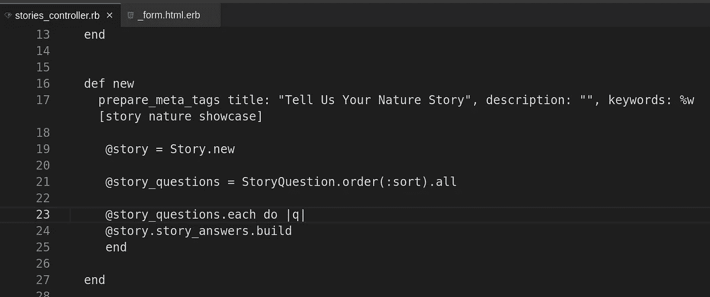
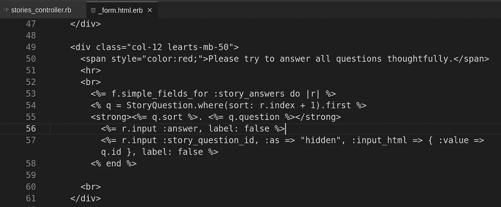
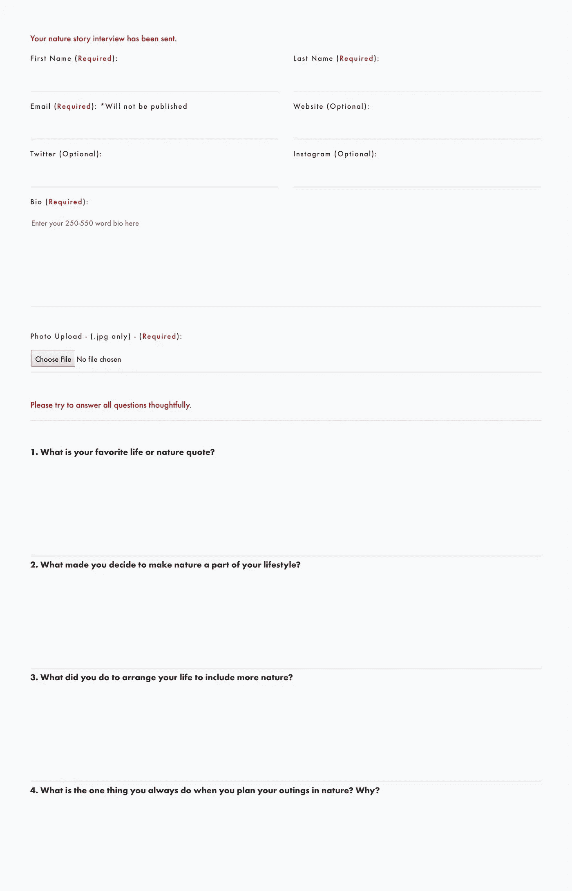

# 使用一个模型的多个实例(重载)用 Ruby On Rails 构建一个表单

> 原文：<https://medium.com/geekculture/building-a-form-with-ruby-on-rails-using-multiple-instances-of-a-model-reloaded-1c3a2f1be26b?source=collection_archive---------11----------------------->

在 2018 年，我发表了这篇文章，[使用一个模型的多个实例用 Ruby on Rails 构建一个测验](https://tressa-sanders.medium.com/building-a-quiz-with-ruby-on-rails-using-multiple-instances-of-a-model-88e506832af9)，展示了我如何使用一个模型的多个实例用 Ruby on Rails 创建一个 120 个问题的测验。它在那个用例中工作得很好，但是当我试图使用代码的修改版本来创建一个包含多个文本字段的面试表单时，我无法让它工作！

在本文中，我将向您展示如何创建一个包含面试问题的表单，作为这个特定用例的文本字段。试图让它工作的 4 天考验给了我更好地理解 Ruby 和 Ruby on Rails 的机会。

**用例:**在我当前的项目中，他们需要一种方法来发布对目标受众的采访，并且需要一种表格来收集个人信息和每个问题的答案。该表单需要能够将个人信息提交到自己的表中，并将每个问题的答案提交到另一个表中。每个答案都需要与个人信息记录和一个问题相关联。

**所需结构:**

1.  故事-个人信息
2.  故事问题—面试问题
3.  故事答案—每个问题的答案

**数据库结构(故事、故事 _ 问题、故事 _ 答案):**

这将根据你的工作内容而有所不同，但是我已经把它包括进来了，这样你就可以对新特性需要做什么有一个全面的了解。

```
create_table "stories", options: "ENGINE=InnoDB DEFAULT CHARSET=utf8mb4", force: :cascade do |t|
    t.boolean "published"
    t.boolean "agree"
    t.string "first_name"
    t.string "last_name"
    t.string "slug"
    t.string "email"
    t.string "website"
    t.string "twitter"
    t.string "instagram"
    t.text "bio"
    t.string "photo"
    t.datetime "created_at", precision: 6, null: false
    t.datetime "updated_at", precision: 6, null: false
  endcreate_table "story_questions", options: "ENGINE=InnoDB DEFAULT CHARSET=utf8mb4", force: :cascade do |t|
    t.integer "sort"
    t.boolean "active"
    t.string "question"
    t.datetime "created_at", precision: 6, null: false
    t.datetime "updated_at", precision: 6, null: false
 endcreate_table "story_answers", options: "ENGINE=InnoDB DEFAULT CHARSET=utf8mb4", force: :cascade do |t|
    t.text "answer"
    t.integer "story_question_id"
    t.integer "story_id"
    t.datetime "created_at", precision: 6, null: false
    t.datetime "updated_at", precision: 6, null: false
    t.index ["story_id"], name: "index_story_answers_on_story_id"
    t.index ["story_question_id"], name: "index_story_answers_on_story_question_id"
end
```

**模特(story.rb，story_question.rb，story_answer.rb):**

这些模型包括特征的每个部分所需的关联。如果这个问题被删除了，我不是 100%确定这个问题会删除答案，但是现在，还可以。

```
class Story < ApplicationRecord has_many :story_answers, dependent: :destroy, :inverse_of => :story
  accepts_nested_attributes_for :story_answers, :allow_destroy => trueendclass StoryQuestion < ApplicationRecord has_many :story_answers, dependent: :destroy, :inverse_of => :story_question
  accepts_nested_attributes_for :story_answers, :allow_destroy => true

  include RailsSortable::Model
  set_sortable :sort, without_updating_timestamps: trueendclass StoryAnswer < ApplicationRecord belongs_to :story, :inverse_of => :story_answers
 accepts_nested_attributes_for :story belongs_to :story_question, :inverse_of => :story_answers
 accepts_nested_attributes_for :story_questionend
```

**所需路线:**

```
resources :stories, only: [:index, :show, :new, :create] do
 resources :story_answers, only: [:new, :create]
 end
 get ‘nature-story’ => ‘stories#new’
 post ‘nature-story’ => ‘stories#create’
```

**The stories _ controller . Rb:**

这个控制器和表单就是神奇发生的地方。我不得不无奈地承认，我花了很长时间才弄明白如何让这个功能工作起来。为同一个模型创建多个文本字段并不难理解。显示每个空答案的每个问题并能够将问题 id 传递给答案需要一点时间。一旦我想通了，这是令人尴尬的容易。

在“新建”操作下，我们正在使用 Story.new 创建新故事。“新建”页面还在“信息”部分列出了所有问题，以便受访者可以在提交表单之前查看它们，因此我们为此目的向视图提供@story_questions，并在控制器中其下方的构建器块中使用。当我们使用 rails builder 为每个问题构建 story_answer 字段时，真正的奇迹出现了。我们用*@ story _ questions . each do | q | @ story . story _ answers . build end*。

最后，我们需要将 story_answers_attributes 参数添加到控制器末尾的允许参数中。

```
class StoriesController < ApplicationController
  before_action :set_story, only: %i[ show ]def index
    ...
enddef show
    ...
enddef new
   @story = Story.new
   [@story_questions](http://twitter.com/story_questions) = StoryQuestion.order(:sort).all
   [@story_questions](http://twitter.com/story_questions).each do |q|
     [@story](http://twitter.com/story).story_answers.build
   end
enddef create
    [@story](http://twitter.com/story) = Story.new(story_params)
    [@story](http://twitter.com/story).published = 0
    [@story](http://twitter.com/story).saverespond_to do |format|
      if [@story](http://twitter.com/story).save
        StoryMailer.new_story([@story](http://twitter.com/story)).deliver_later
        format.html { redirect_to new_story_path(anchor: 'interview'), notice: "Your nature story interview has been sent." }
        format.json { render :show, status: :created, location: [@story](http://twitter.com/story) }
      else
        format.html { render :new, status: :unprocessable_entity }
        format.json { render json: [@story](http://twitter.com/story).errors, status: :unprocessable_entity }
      end
    end
  endprivatedef set_story
      [@story](http://twitter.com/story) = Story.find_by_slug!(params[:id])
    enddef story_params
      params.require(:story).permit(:published, :agree, :first_name, :last_name, :slug, :email, :website, :twitter, :instagram, :bio, :photo, story_answers_attributes: [:id, :answer, :story_question_id, :story_id])
    endend
```



Stories Controller

**新故事 _ form.html.rb for】**

这个特性的下一个关键部分是获得正确的表单。您可能从我的上一篇文章中注意到，我使用了 form_tag 和 fields_for。对于这个用例来说，这是不合适或者不需要的。我只需要 simple_fields_for 标记(我使用的是 simple_form gem)。

我在 simple_fields_for 代码中使用:story_answers，而不是@story_answers，因为我在这些字段中使用构建器。为了显示问题，我为一个故事问题设置了一个局部变量“q ”,其中问题的:sort 字段等于 story_answer 的索引。我做了+ 1，所以索引从 1 开始，而不是 0。在这种情况下，我并不完全熟悉使用索引，也不知道 FormBuilder 对象会自动让您访问索引，这样您就可以做一些类似于的事情，索引号就会被列出来。

一旦我访问了问题，我就可以使用 q 列出答案文本字段的排序号和问题，然后将问题 id 作为 q.id 传递给隐藏字段，这样答案在保存时就会与正确的问题相关联。

```
<%= simple_form_for [@story](http://twitter.com/story), :url => nature_story_path do |f| %>...

    <div class="col-12 learts-mb-50">
      <span style="color:red;">Please try to answer all questions thoughtfully.</span>
      <hr>
      <br>
        <%= f.simple_fields_for :story_answers do |r| %>
        <% q = StoryQuestion.where(sort: r.index + 1).first %>
        <strong><%= q.sort %>. <%= q.question %></strong>
          <%= r.input :answer, label: false %>
          <%= r.input :story_question_id, :as => "hidden", :input_html => { :value => q.id }, label: false %>
        <% end %><br>
    </div>

  ...<div class="col-12 text-center learts-mb-50">
      <button type="submit" class="btn btn-dark btn-outline-hover-dark">Submit Interview</button>
    </div>
  </div></div><% end %>
```



Story Form

**面试表格页面:**

这是最后一页的样子。问题上方的字段用于创建“*故事*”的“*个人信息*，问题也将提交到它们自己的表格中。

> 总共有 14 个问题，所以图片中的表格被缩短了，只是为了让您了解发生了什么。



The Form Page

就是这样！这比我的另一个解决方案稍微简单一点，并且很适合这种用例。另一个解决方案适用于具有多项选择题和单选字段的更复杂的表单。

Rails 版本:6.0.3