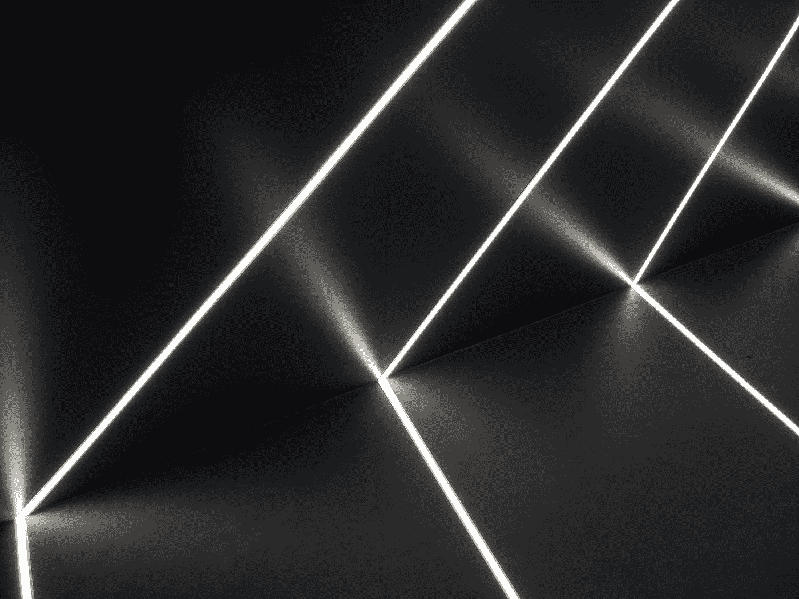

# 构建一个时髦的 Pi 案例

> 原文：<https://medium.com/geekculture/building-a-funky-pi-case-60d6a34be4b2?source=collection_archive---------16----------------------->

Photo by [Weiye Tan](https://unsplash.com/@superbfnds?utm_source=medium&utm_medium=referral) on [Unsplash](https://unsplash.com?utm_source=medium&utm_medium=referral)

树莓派不需要盒子，这已经不是秘密了。如果您正在开发大量使用 GPIO 引脚的原型，它甚至会妨碍您。

不过，如果在没有太多身体接触的情况下使用，箱子可以提供防尘和防重力保护，并使其看起来更具美感。不要误会，我和其他人一样喜欢闪亮的绿色印刷电路板，但是把它赤裸裸地放在电视机旁边…