# 从头开始在 AWS 上构建 Kubernetes 集群

> 原文：<https://medium.com/geekculture/building-a-kubernetes-cluster-on-aws-from-scratch-7e1e8b0342c4?source=collection_archive---------1----------------------->


Photo by [Venti Views](https://unsplash.com/@ventiviews?utm_source=medium&utm_medium=referral) on [Unsplash](https://unsplash.com?utm_source=medium&utm_medium=referral)

如今，在任何云提供商上部署 Kubernetes 集群都非常简单和容易，但并不总是经济高效的。作为开发运维工程师，我们被配置的便利性宠坏了，看不到“幕后”，尤其是在主控制平面上。但是总有一个令人困扰的问题，那就是它是如何工作的。让我们揭开帷幕，开始在 AWS 上构建我们自己 HA(高可用性)Kubernetes 集群的旅程。

本演练对于在生产环境中支持 Kubernetes 集群并希望了解它们是如何组合在一起的人来说是必不可少的；以及这一切是如何在 AWS 上运行的。这项工作是基于凯尔西·海托华的《Kubernetes The Hard Way Guide》,该指南被部署到 GCP(谷歌云平台)。

在我们进入之前，请花些时间看看这本神奇的书，书名为 [**机器学习，来自 Packt 出版社**](https://packt.link/xSfMI) 。立即获取一份副本，看看如何在 Kubernetes 上构建令人惊叹的机器学习应用程序。

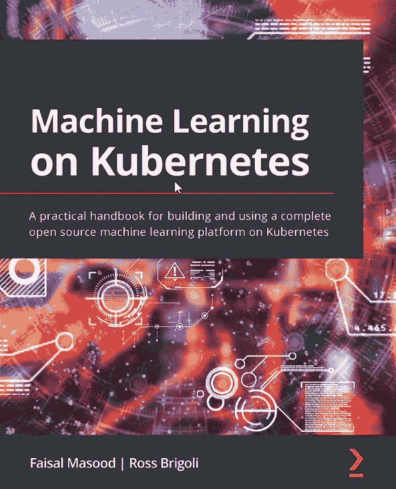

也请不要忘记关注我([克雷格·牛顿](https://medium.com/u/1a31d3880a4a?source=post_page-----7e1e8b0342c4--------------------------------))，非常感谢你的支持。

好了，现在回到节目上来。下面是我们想要实现的基础架构的简单表示:

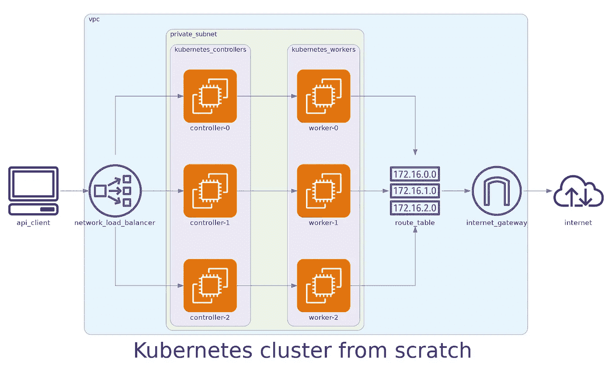

我们需要在 AWS 中调配以下计算资源:

*   网络— VPC、子网、互联网网关、路由表、安全组、网络负载平衡器
*   计算实例—控制器和工作人员的 EC2 节点，SSH 密钥对

在我们开始之前，我们首先需要确保我们有一些先决条件:

*   有一个 AWS 帐户设置(希望有一些免费的信用，但这个集群不会花费我们太多，因为我们会在事后拆除它)。
*   安装 AWS CLI，以便与您的 AWS 帐户交互来设置资源；或者你可以使用 [**AWS 云外壳**](https://aws.amazon.com/cloudshell/) ，这是一个基于浏览器的替代方案，可以在你的机器上设置所有这些。
*   选择一个您想要部署的 AWS 区域，最好是离您最近的区域；对我来说，我选择 **eu-central-1** ，因为那是我最近的 AWS 地区。

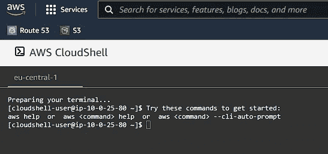

AWS Cloud Shell — browser based terminal at your fingertips

*   您还可以安装并使用[**tmux**](https://github.com/tmux/tmux/wiki)**来简化在多个实例上运行相同的命令。**
*   **我们将生成相当多的 [**PKI 基础设施**](https://en.wikipedia.org/wiki/Public_key_infrastructure) 密钥，并生成 TLS 证书，因为我们希望一切都是安全的。确保您已经安装了 [**cfssl**](https://github.com/cloudflare/cfssl) 和 [**cfssljon**](https://github.com/cloudflare/cfssl) 命令行实用程序。**
*   **因为我们将使用 Kubernetes，所以我们还需要确保我们安装了可信任的 [**kubectl**](https://kubernetes.io/docs/tasks/tools/) 客户端，这样我们就可以在我们的 Kubernetes 集群上执行操作。**

## **设置默认计算区域和分区**

**在您的终端窗口或 AWS CloudShell 窗口中运行:**

```
AWS_REGION=eu-central-1
aws configure set default.region $AWS_REGION
```

**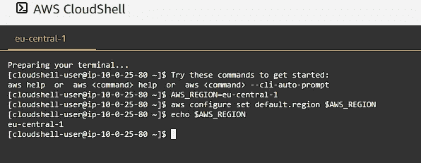**

## **安装一些我们需要的客户端工具**

**我将在这里使用 linux 的例子，但如果你使用其他操作系统，如 Mac OS X，那么[参考本页](https://github.com/kelseyhightower/kubernetes-the-hard-way/blob/master/docs/02-client-tools.md)。**

```
wget -q --timestamping \
  [https://storage.googleapis.com/kubernetes-the-hard-way/cfssl/1.4.1/linux/cfssl](https://storage.googleapis.com/kubernetes-the-hard-way/cfssl/1.4.1/linux/cfssl) \
  [https://storage.googleapis.com/kubernetes-the-hard-way/cfssl/1.4.1/linux/cfssljson](https://storage.googleapis.com/kubernetes-the-hard-way/cfssl/1.4.1/linux/cfssljson)chmod +x cfssl cfssljson
sudo mv cfssl cfssljson /usr/local/bin/cfssl version
cfssljson --versionwget [https://storage.googleapis.com/kubernetes-release/release/v1.21.0/bin/linux/amd64/kubectl](https://storage.googleapis.com/kubernetes-release/release/v1.21.0/bin/linux/amd64/kubectl)chmod +x kubectl
sudo mv kubectl /usr/local/bin/kubectl version --client
```

**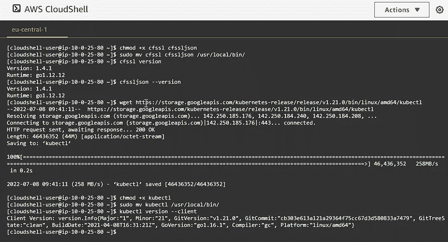**

## **调配计算基础架构**

**AWS 的最佳实践要求我们将我们的“项目”/“产品”包装到它自己的 VPC(虚拟私有云)中，其中包含子网、路由表、负载平衡器和一个互联网网关(其中每个 VPC 只允许一个互联网网关)。这不仅是一种分组机制，也是一层安全保障。**

****VPC****

**让我们设置一个名为**kubernetes-从头开始**的 VPC，它启用了 DNS 支持和 DNS 主机名支持。在终端会话中执行以下命令:**

```
VPC_ID=$(aws ec2 create-vpc --cidr-block 10.0.0.0/16 --output text --query 'Vpc.VpcId')aws ec2 create-tags --resources ${VPC_ID} --tags Key=Name,Value=kubernetes-from-scratchaws ec2 modify-vpc-attribute --vpc-id ${VPC_ID} --enable-dns-support '{"Value": true}'aws ec2 modify-vpc-attribute --vpc-id ${VPC_ID} --enable-dns-hostnames '{"Value": true}'
```

**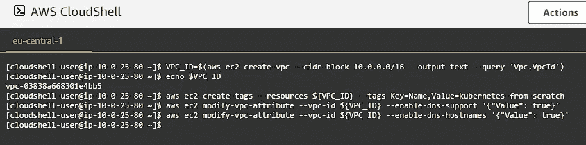****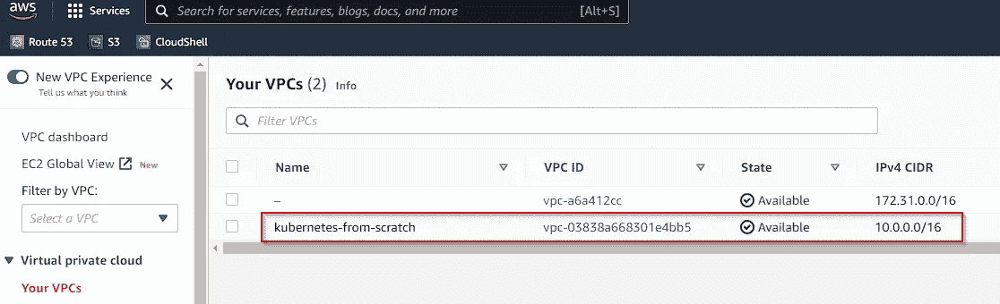****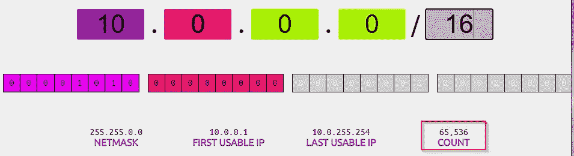**

**[https://cidr.xyz](https://cidr.xyz) — allows you to easily visualize out CIDR ranges**

****私有子网****

**我们需要能够为控制平面控制器和工作实例的计算实例分配私有 IP 地址。VPC 中的子网允许我们创建一系列 IP 地址，我们可以将这些地址分配给不允许外部访问的实例(除非通过代理或负载平衡器):**

```
SUBNET_ID=$(aws ec2 create-subnet \
  --vpc-id ${VPC_ID} \
  --cidr-block 10.0.1.0/24 \
  --output text --query 'Subnet.SubnetId')aws ec2 create-tags --resources ${SUBNET_ID} --tags Key=Name,Value=kubernetes-pvt
```

**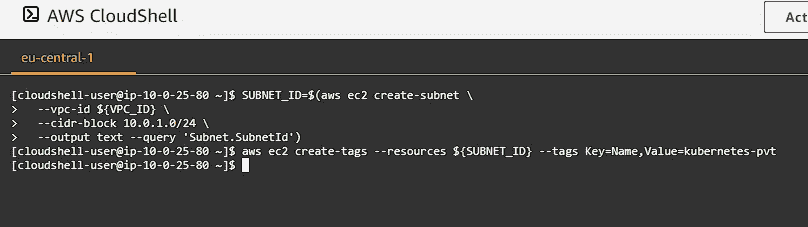****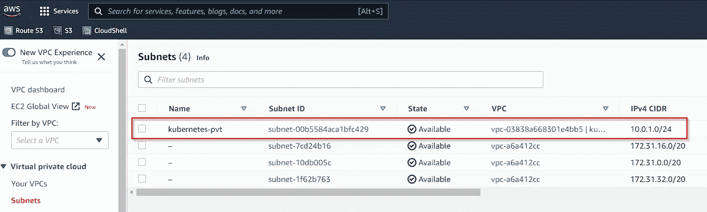****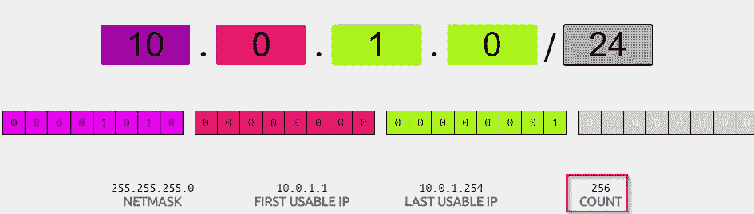**

**[https://cidr.xyz](https://cidr.xyz) — allows you to easily visualize out CIDR ranges**

**通过使用这个 CIDR 范围 10.0.1.0/24，我们有多达 256 台主机(实际上更少，因为 AWS 保留了一些 IP，前 4 个和后 1 个，[在此阅读更多信息](https://docs.aws.amazon.com/vpc/latest/userguide/configure-subnets.html))。**

****互联网网关****

**我们的实例需要某种方式与互联网连接和通信，因为我们在一个私有网络上。这意味着我们需要提供一个网关来代理我们的流量。让我们通过运行以下命令来设置一个:**

```
INTERNET_GATEWAY_ID=$(aws ec2 create-internet-gateway --output text --query 'InternetGateway.InternetGatewayId')aws ec2 create-tags --resources ${INTERNET_GATEWAY_ID} --tags Key=Name,Value=kubernetes-igwaws ec2 attach-internet-gateway --internet-gateway-id ${INTERNET_GATEWAY_ID} --vpc-id ${VPC_ID}
```

******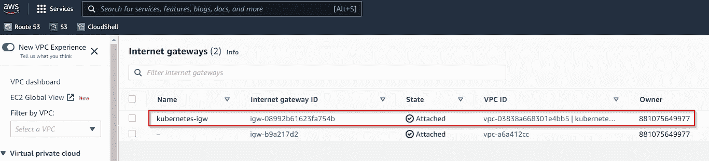**

****路由表****

**我们现在需要定义如何通过我们的互联网网关从我们网络中的实例路由我们的流量。为此，我们为流量定义了一个路由表:**

```
ROUTE_TABLE_ID=$(aws ec2 create-route-table --vpc-id ${VPC_ID} --output text --query 'RouteTable.RouteTableId')aws ec2 create-tags --resources ${ROUTE_TABLE_ID} --tags Key=Name,Value=kubernetes-rtaws ec2 associate-route-table --route-table-id ${ROUTE_TABLE_ID} --subnet-id ${SUBNET_ID}aws ec2 create-route --route-table-id ${ROUTE_TABLE_ID} --destination-cidr-block 0.0.0.0/0 --gateway-id ${INTERNET_GATEWAY_ID}
```

**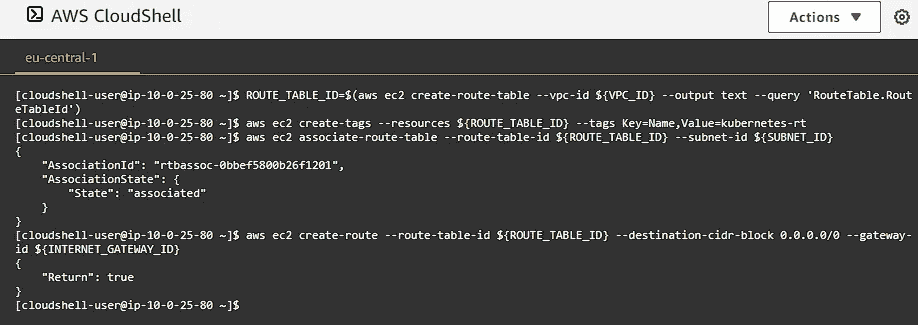****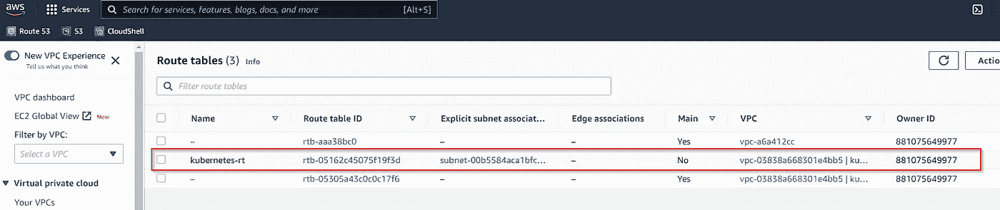****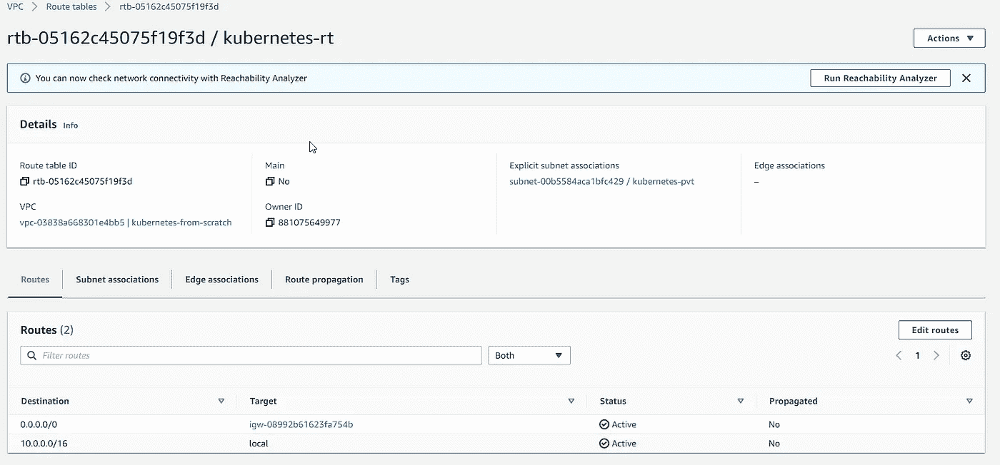****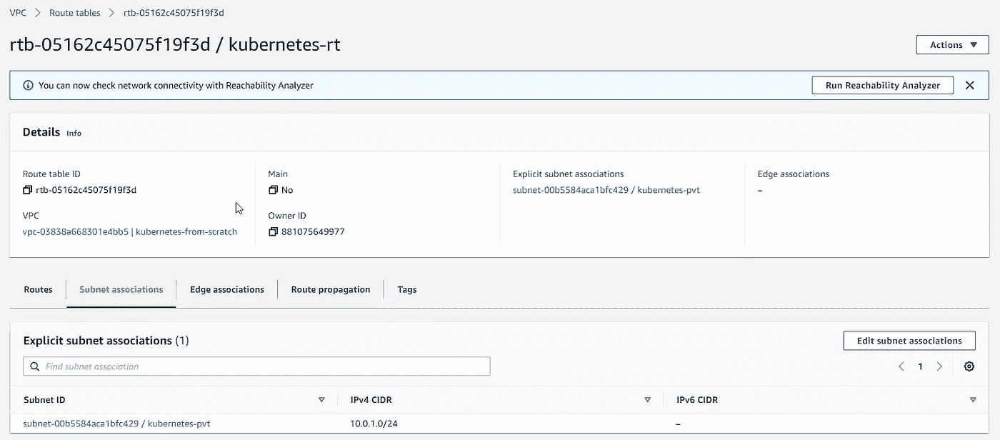**

**我们的专用子网现在已经与路由表相关联，并且我们的路由已经为我们的互联网网关设置好了。**

****安全组****

**我们需要一个安全组，这样我们就可以允许实例之间的流量，以及从我们的客户端软件进行访问。我们定义我们的控制者和我们的工人之间的交流规则；SSH、Kubernetes API 服务器、HTTPS 和 ICMP(用于 pings):**

```
SECURITY_GROUP_ID=$(aws ec2 create-security-group \
  --group-name kubernetes-from-scratch \
  --description "Kubernetes from scratch - security group" \
  --vpc-id ${VPC_ID} \
  --output text --query 'GroupId')aws ec2 create-tags --resources ${SECURITY_GROUP_ID} --tags Key=Name,Value=kubernetes-sgaws ec2 authorize-security-group-ingress --group-id ${SECURITY_GROUP_ID} --protocol all --cidr 10.0.0.0/16
aws ec2 authorize-security-group-ingress --group-id ${SECURITY_GROUP_ID} --protocol all --cidr 10.200.0.0/16aws ec2 authorize-security-group-ingress --group-id ${SECURITY_GROUP_ID} --protocol tcp --port 22 --cidr 0.0.0.0/0
aws ec2 authorize-security-group-ingress --group-id ${SECURITY_GROUP_ID} --protocol tcp --port 6443 --cidr 0.0.0.0/0
aws ec2 authorize-security-group-ingress --group-id ${SECURITY_GROUP_ID} --protocol tcp --port 443 --cidr 0.0.0.0/0
aws ec2 authorize-security-group-ingress --group-id ${SECURITY_GROUP_ID} --protocol icmp --port -1 --cidr 0.0.0.0/0
```

**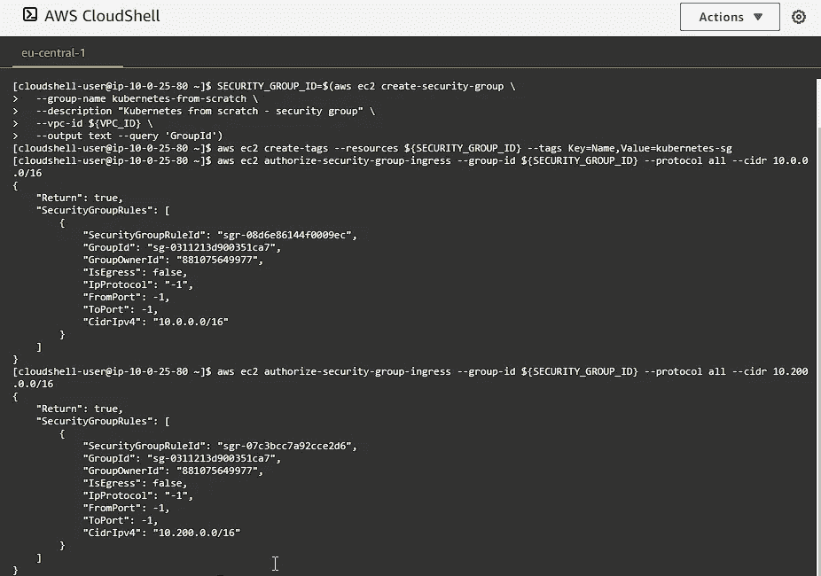****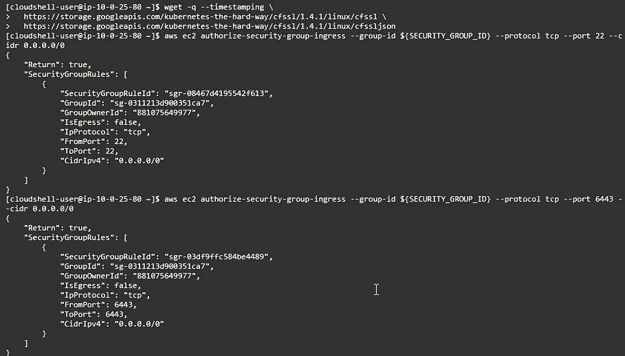****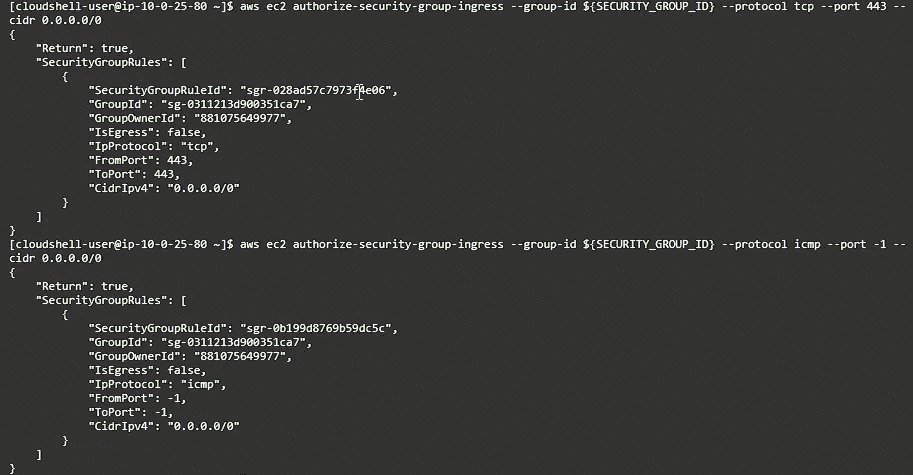********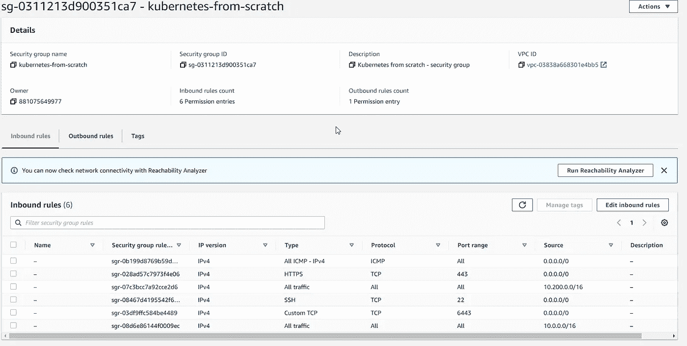**

****网络负载均衡器****

**我们需要某种方式从外界访问我们的 Kubernetes API。我们创建一个**面向互联网的网络负载平衡器**并注册我们的控制平面控制器。这样我们就可以拥有一个 HA(高可用性)控制平面。要创建我们的负载平衡器，请执行以下操作:**

```
LOAD_BALANCER_ARN=$(aws elbv2 create-load-balancer \
    --name kubernetes-nlb \
    --subnets ${SUBNET_ID} \
    --scheme internet-facing \
    --type network \
    --output text --query 'LoadBalancers[].LoadBalancerArn')TARGET_GROUP_ARN=$(aws elbv2 create-target-group \
    --name kubernetes-tg \
    --protocol TCP \
    --port 6443 \
    --vpc-id ${VPC_ID} \
    --target-type ip \
    --output text --query 'TargetGroups[].TargetGroupArn')aws elbv2 register-targets --target-group-arn ${TARGET_GROUP_ARN} --targets Id=10.0.1.1{0,1,2}aws elbv2 create-listener \
    --load-balancer-arn ${LOAD_BALANCER_ARN} \
    --protocol TCP \
    --port 443 \
    --default-actions Type=forward,TargetGroupArn=${TARGET_GROUP_ARN} \
    --output text --query 'Listeners[].ListenerArn'
```

**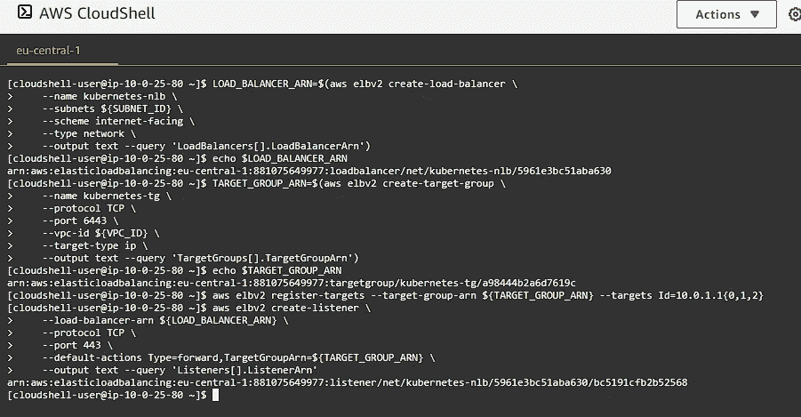**

**我们可以获得我们的负载平衡器的公共 DNS 地址，供以后使用:**

```
KUBERNETES_PUBLIC_ADDRESS=$(aws elbv2 describe-load-balancers \
  --load-balancer-arns ${LOAD_BALANCER_ARN} \
  --output text --query 'LoadBalancers[].DNSName')
```

**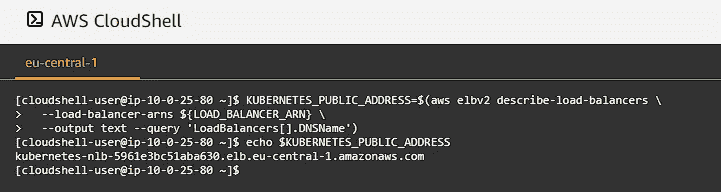**

****计算实例****

**既然我们已经建立了所有的路由和支持基础设施，现在是时候定义我们的工作马(控制器和工人)了。我们将在计算实例中使用 Ubuntu 20.04，因此我们需要首先选择它:**

```
IMAGE_ID=$(aws ec2 describe-images --owners 099720109477 \
  --output json \
  --filters \
  'Name=root-device-type,Values=ebs' \
  'Name=architecture,Values=x86_64' \
  'Name=name,Values=ubuntu/images/hvm-ssd/ubuntu-focal-20.04-amd64-server-*' \
  | jq -r '.Images|sort_by(.Name)[-1]|.ImageId')
```

**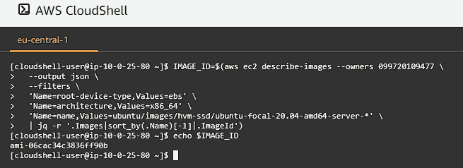**

**这将为我们将在节点上运行的 Ubuntu 20.04 操作系统获取我们区域中的 IMAGE_ID。**

**我们需要连接到我们的节点，以便我们可以安装软件和管理系统，因此我们需要创建一个密钥对，以便我们可以使用它安全地连接到我们的实例。让我们创建新的密钥对:**

```
aws ec2 create-key-pair --key-name kubernetes --output text --query 'KeyMaterial' > kubernetes.id_rsachmod 600 kubernetes.id_rsa
```

**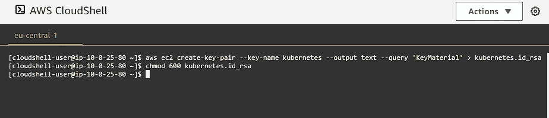**

**记得把这个文件保存在一个安全的地方，比如钥匙链或者类似 Bitwarden 的东西。**

**接下来，让我们调配我们的 Kubernetes 控制器。我们将需要 3 个 HA(高可用性)，在这一步中我们将使用 **t3.micro** 实例(请随意尝试不同的实例类型，但要记住它们确实会让您花钱):**

```
for i in 0 1 2; do
  instance_id=$(aws ec2 run-instances \
    --associate-public-ip-address \
    --image-id ${IMAGE_ID} \
    --count 1 \
    --key-name kubernetes \
    --security-group-ids ${SECURITY_GROUP_ID} \
    --instance-type t3.micro \
    --private-ip-address 10.0.1.1${i} \
    --user-data "name=controller-${i}" \
    --subnet-id ${SUBNET_ID} \
    --block-device-mappings='{"DeviceName": "/dev/sda1", "Ebs": { "VolumeSize": 50 }, "NoDevice": "" }' \
    --output text --query 'Instances[].InstanceId')
  aws ec2 modify-instance-attribute --instance-id ${instance_id} --no-source-dest-check
  aws ec2 create-tags --resources ${instance_id} --tags "Key=Name,Value=controller-${i}"
  echo "controller-${i} created "
done
```

**如果您对**键名**的命名与我们在之前步骤中的不同，请特别注意。我们还将公共 ip 地址与实例相关联。**

**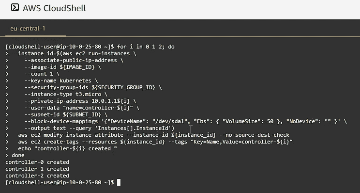****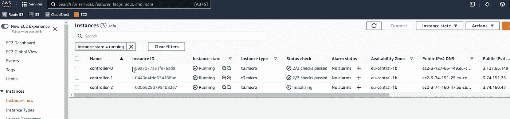**

**现在是创建工作节点的时候了:**

```
for i in 0 1 2; do
  instance_id=$(aws ec2 run-instances \
    --associate-public-ip-address \
    --image-id ${IMAGE_ID} \
    --count 1 \
    --key-name kubernetes \
    --security-group-ids ${SECURITY_GROUP_ID} \
    --instance-type t3.micro \
    --private-ip-address 10.0.1.2${i} \
    --user-data "name=worker-${i}|pod-cidr=10.200.${i}.0/24" \
    --subnet-id ${SUBNET_ID} \
    --block-device-mappings='{"DeviceName": "/dev/sda1", "Ebs": { "VolumeSize": 50 }, "NoDevice": "" }' \
    --output text --query 'Instances[].InstanceId')
  aws ec2 modify-instance-attribute --instance-id ${instance_id} --no-source-dest-check
  aws ec2 create-tags --resources ${instance_id} --tags "Key=Name,Value=worker-${i}"
  echo "worker-${i} created"
done
```

**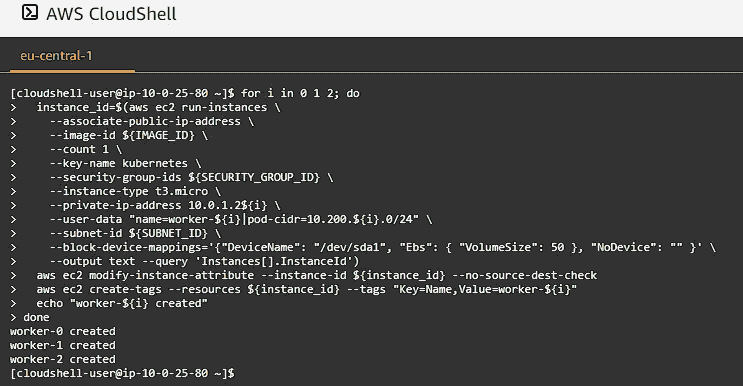****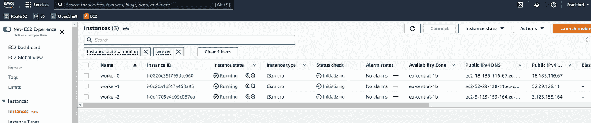**

**就像我们已经有了基础架构一样，我们现在需要继续在每个节点上安装必要的软件和配置。**

## **设置 CA 并生成 TLS 证书**

**安全性非常重要，通过使用 TLS 证书，我们可以确保系统中节点之间的通信是安全的。**

**让我们继续创建一个名为 certs 的文件夹，然后进入该文件夹:**

```
mkdir -p certs
cd certs/
```

****认证机构****

```
cat > ca-config.json <<EOF
{
  "signing": {
    "default": {
      "expiry": "8760h"
    },
    "profiles": {
      "kubernetes": {
        "usages": ["signing", "key encipherment", "server auth", "client auth"],
        "expiry": "8760h"
      }
    }
  }
}
EOFcat > ca-csr.json <<EOF
{
  "CN": "Kubernetes",
  "key": {
    "algo": "rsa",
    "size": 2048
  },
  "names": [
    {
      "C": "NL",
      "L": "Netherlands",
      "O": "Kubernetes",
      "OU": "AMS",
      "ST": "Amsterdam"
    }
  ]
}
EOFcfssl gencert -initca ca-csr.json | cfssljson -bare ca
```

**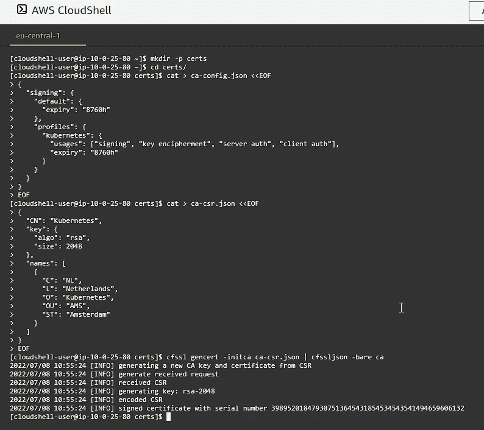**

## **客户端和服务器证书**

**我们需要为每个 Kubernetes 组件生成客户机和服务器证书，并为 Kubernetes **admin** 用户生成客户机证书。**

****管理员客户端证书****

**生成**管理员**客户端证书和私钥:**

```
cat > admin-csr.json <<EOF
{
  "CN": "admin",
  "key": {
    "algo": "rsa",
    "size": 2048
  },
  "names": [
    {
      "C": "NL",
      "L": "Netherlands",
      "O": "system:masters",
      "OU": "Kubernetes from scratch",
      "ST": "Amsterdam"
    }
  ]
}
EOFcfssl gencert \
  -ca=ca.pem \
  -ca-key=ca-key.pem \
  -config=ca-config.json \
  -profile=kubernetes \
  admin-csr.json | cfssljson -bare admin
```

**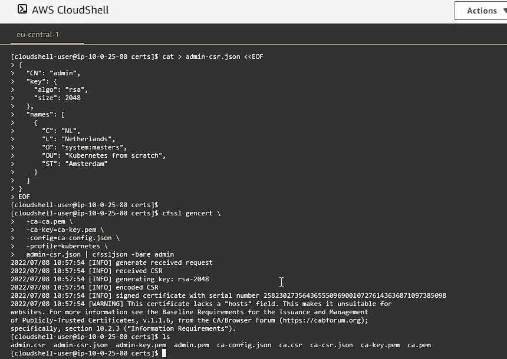**

****kube let 客户证书****

**Kubernetes 使用一种叫做节点授权器的[专用授权模式](https://kubernetes.io/docs/admin/authorization/node/)，专门授权由 [Kubelets](https://kubernetes.io/docs/concepts/overview/components/#kubelet) 发出的 API 请求。为了得到节点授权者的授权，Kubelets 必须使用一个证书来标识他们在**系统:节点**组中，用户名为**系统:节点:<节点名>** 。在本节中，您将为每个满足节点授权者要求的 Kubernetes worker 节点创建一个证书。**

**为每个 Kubernetes 工作节点生成一个证书和私钥:**

```
for i in 0 1 2; do
  instance="worker-${i}"
  instance_hostname="ip-10-0-1-2${i}"
  cat > ${instance}-csr.json <<EOF
{
  "CN": "system:node:${instance_hostname}",
  "key": {
    "algo": "rsa",
    "size": 2048
  },
  "names": [
    {
      "C": "NL",
      "L": "Netherlands",
      "O": "system:nodes",
      "OU": "Kubernetes from scratch",
      "ST": "Amsterdam"
    }
  ]
}
EOFexternal_ip=$(aws ec2 describe-instances --filters \
    "Name=tag:Name,Values=${instance}" \
    "Name=instance-state-name,Values=running" \
    --output text --query 'Reservations[].Instances[].PublicIpAddress')internal_ip=$(aws ec2 describe-instances --filters \
    "Name=tag:Name,Values=${instance}" \
    "Name=instance-state-name,Values=running" \
    --output text --query 'Reservations[].Instances[].PrivateIpAddress')cfssl gencert \
    -ca=ca.pem \
    -ca-key=ca-key.pem \
    -config=ca-config.json \
    -hostname=${instance_hostname},${external_ip},${internal_ip} \
    -profile=kubernetes \
    worker-${i}-csr.json | cfssljson -bare worker-${i}
done
```

**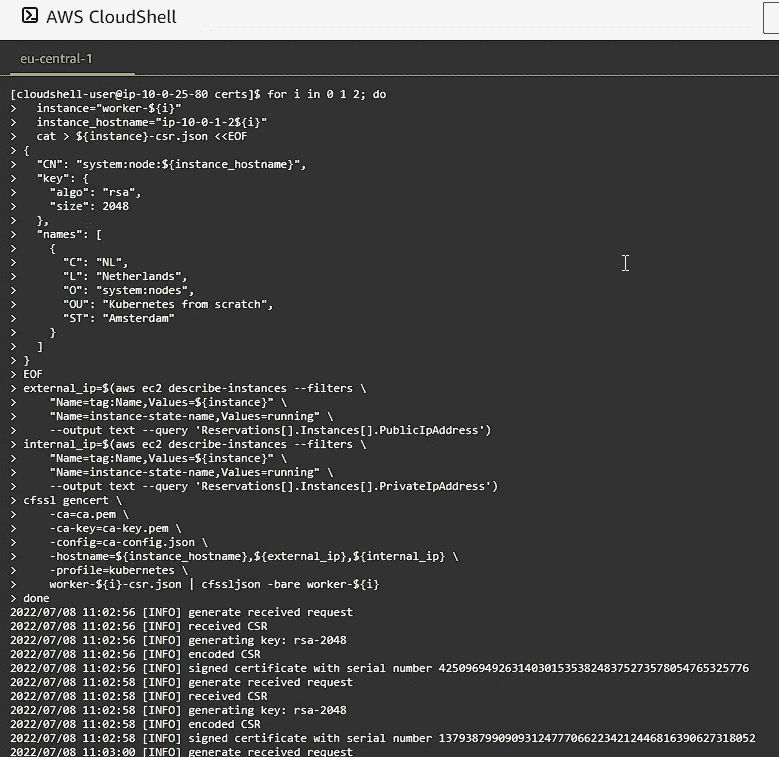****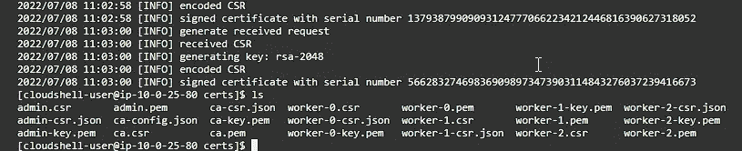**

****控制器管理器客户端证书****

**生成**kube-controller-manager**客户端证书和私钥:**

```
cat > kube-controller-manager-csr.json <<EOF
{
  "CN": "system:kube-controller-manager",
  "key": {
    "algo": "rsa",
    "size": 2048
  },
  "names": [
    {
      "C": "NL",
      "L": "Netherlands",
      "O": "system:kube-controller-manager",
      "OU": "Kubernetes from scratch",
      "ST": "Amsterdam"
    }
  ]
}
EOFcfssl gencert \
  -ca=ca.pem \
  -ca-key=ca-key.pem \
  -config=ca-config.json \
  -profile=kubernetes \
  kube-controller-manager-csr.json | cfssljson -bare kube-controller-manager
```

**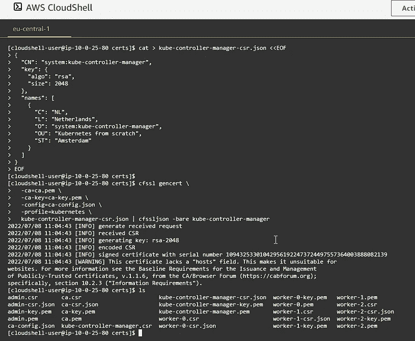**

****Kube 代理客户证书****

**生成 **kube-proxy** 客户端证书和私钥:**

```
cat > kube-proxy-csr.json <<EOF
{
  "CN": "system:kube-proxy",
  "key": {
    "algo": "rsa",
    "size": 2048
  },
  "names": [
    {
      "C": "NL",
      "L": "Netherlands",
      "O": "system:node-proxier",
      "OU": "Kubernetes from scratch",
      "ST": "Amsterdam"
    }
  ]
}
EOFcfssl gencert \
  -ca=ca.pem \
  -ca-key=ca-key.pem \
  -config=ca-config.json \
  -profile=kubernetes \
  kube-proxy-csr.json | cfssljson -bare kube-proxy
```

**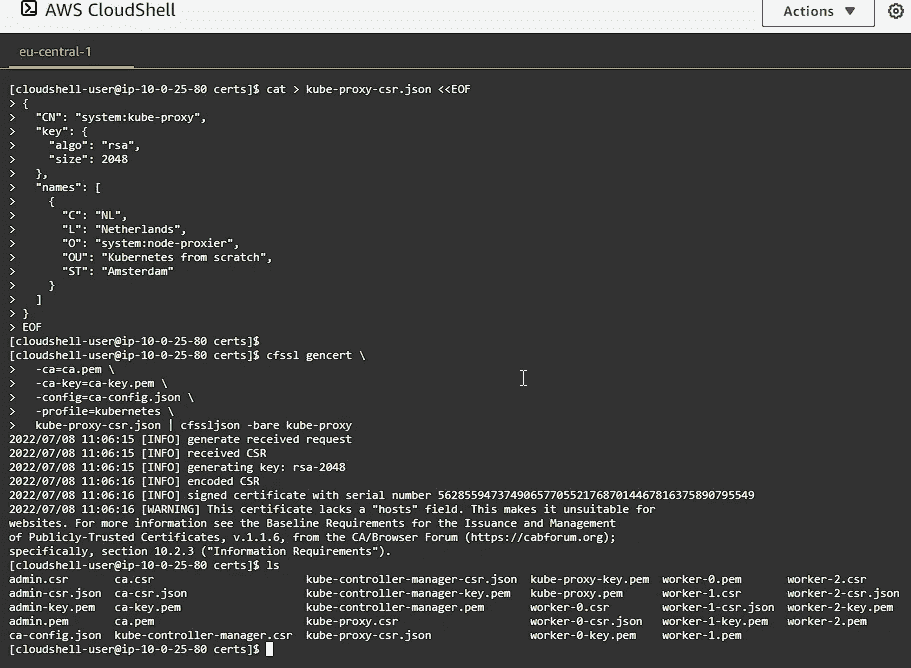**

****调度程序客户端证书****

**生成 **kube-scheduler** 客户端证书和私钥:**

```
cat > kube-scheduler-csr.json <<EOF
{
  "CN": "system:kube-scheduler",
  "key": {
    "algo": "rsa",
    "size": 2048
  },
  "names": [
    {
      "C": "NL",
      "L": "Netherlands",
      "O": "system:kube-scheduler",
      "OU": "Kubernetes from scratch",
      "ST": "Amsterdam"
    }
  ]
}
EOFcfssl gencert \
  -ca=ca.pem \
  -ca-key=ca-key.pem \
  -config=ca-config.json \
  -profile=kubernetes \
  kube-scheduler-csr.json | cfssljson -bare kube-scheduler
```

**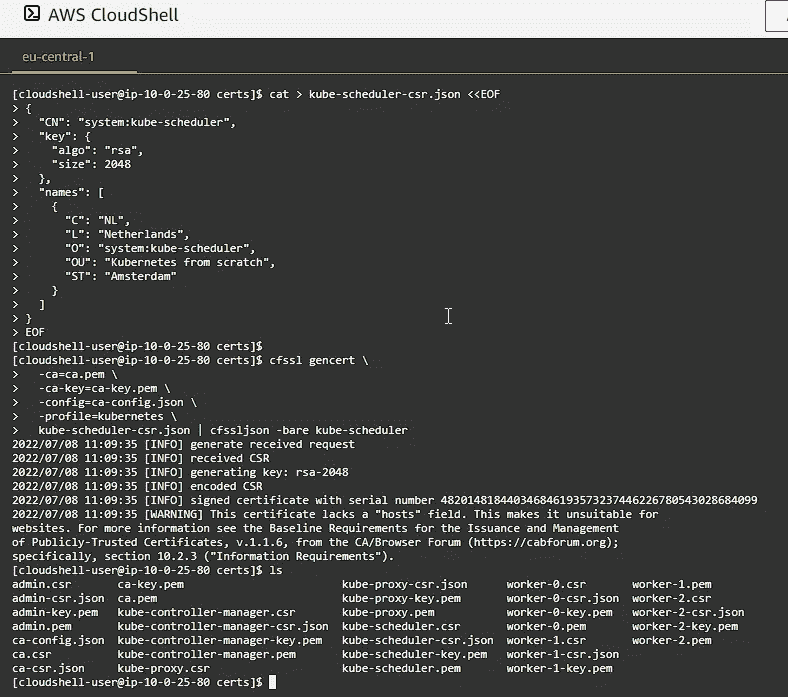**

****Kubernetes API 服务器证书****

**Kubernetes 公共地址将包含在 Kubernetes API 服务器证书的主题替换名称列表中。这将确保证书可以被远程客户端验证。**

**生成 Kubernetes API 服务器证书和私钥:**

```
KUBERNETES_HOSTNAMES=kubernetes,kubernetes.default,kubernetes.default.svc,kubernetes.default.svc.cluster,kubernetes.svc.cluster.localcat > kubernetes-csr.json <<EOF
{
  "CN": "kubernetes",
  "key": {
    "algo": "rsa",
    "size": 2048
  },
  "names": [
    {
      "C": "NL",
      "L": "Netherlands",
      "O": "Kubernetes",
      "OU": "Kubernetes from scratch",
      "ST": "Amsterdam"
    }
  ]
}
EOFcfssl gencert \
  -ca=ca.pem \
  -ca-key=ca-key.pem \
  -config=ca-config.json \
  -hostname=10.32.0.1,10.0.1.10,10.0.1.11,10.0.1.12,${KUBERNETES_PUBLIC_ADDRESS},127.0.0.1,${KUBERNETES_HOSTNAMES} \
  -profile=kubernetes \
  kubernetes-csr.json | cfssljson -bare kubernetes
```

**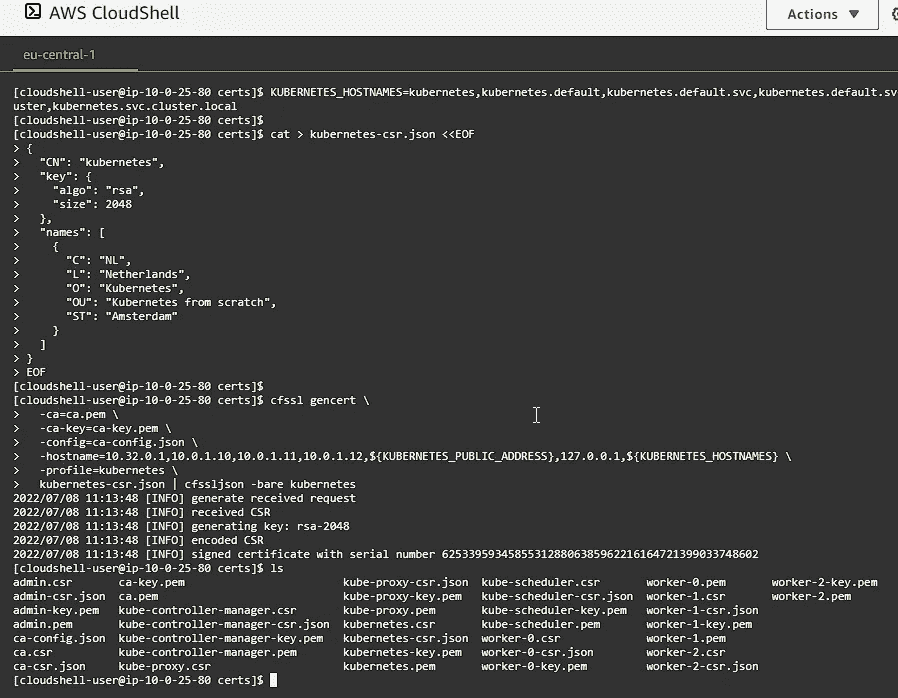**

****服务账户密钥对****

**Kubernetes 控制器管理器利用一个密钥对来生成和签署服务帐户令牌，如[管理服务帐户](https://kubernetes.io/docs/admin/service-accounts-admin/)文档中所述。**

**生成**服务账户**证书和私钥:**

```
cat > service-account-csr.json <<EOF
{
  "CN": "service-accounts",
  "key": {
    "algo": "rsa",
    "size": 2048
  },
  "names": [
    {
      "C": "NL",
      "L": "Netherlands",
      "O": "Kubernetes",
      "OU": "Kubernetes from scratch",
      "ST": "Amsterdam"
    }
  ]
}
EOFcfssl gencert \
  -ca=ca.pem \
  -ca-key=ca-key.pem \
  -config=ca-config.json \
  -profile=kubernetes \
  service-account-csr.json | cfssljson -bare service-account
```

**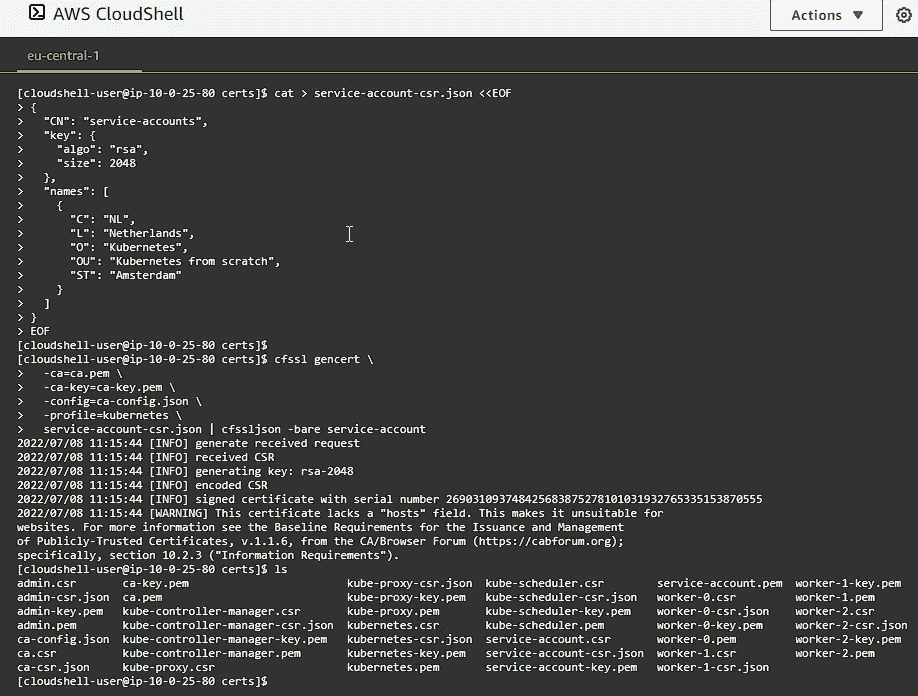**

****分发客户端和服务器证书****

**现在我们有了这个充满证书的目录，是时候将它们发送到节点了。**

**首先，我们将证书和私钥复制到每个 worker 实例:**

```
for instance in worker-0 worker-1 worker-2; do
  external_ip=$(aws ec2 describe-instances --filters \
    "Name=tag:Name,Values=${instance}" \
    "Name=instance-state-name,Values=running" \
    --output text --query 'Reservations[].Instances[].PublicIpAddress')scp -i ../kubernetes.id_rsa ca.pem ${instance}-key.pem ${instance}.pem ubuntu@${external_ip}:~/
done
```

**注意，我们在**证书/** 文件夹中，所以给我加了**../kubernetes.id_rsa** —这是我们之前所在目录的上一级目录，以防您遇到权限被拒绝的错误。**

**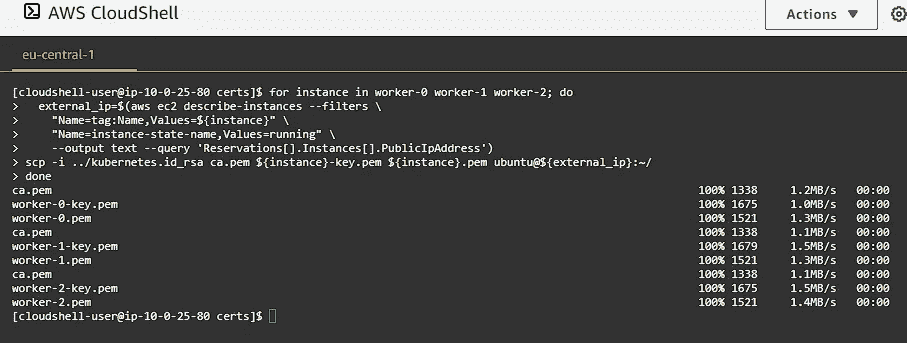**

**接下来，我们将证书和私钥复制到每个控制器实例:**

```
for instance in controller-0 controller-1 controller-2; do
  external_ip=$(aws ec2 describe-instances --filters \
    "Name=tag:Name,Values=${instance}" \
    "Name=instance-state-name,Values=running" \
    --output text --query 'Reservations[].Instances[].PublicIpAddress')scp -i ../kubernetes.id_rsa \
    ca.pem ca-key.pem kubernetes-key.pem kubernetes.pem \
    service-account-key.pem service-account.pem ubuntu@${external_ip}:~/
done
```

**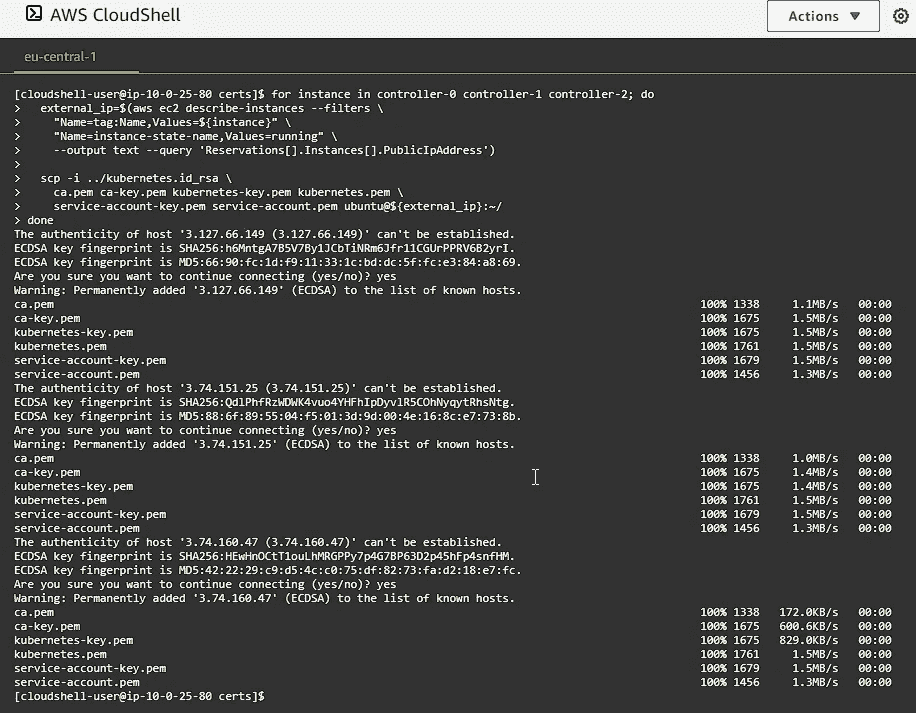**

## **为身份验证生成 Kubernetes 配置文件**

**我们需要生成一些[**kube configs**](https://kubernetes.io/docs/concepts/configuration/organize-cluster-access-kubeconfig/)——Kubernetes 配置文件——使 Kubernetes 客户端能够定位并认证到 Kubernetes API 服务器。**

**为此，我们将返回主文件夹，创建一个名为 configs 的文件夹，然后切换到该文件夹:**

```
cd ~/
mkdir -p configs
cd configs/
```

**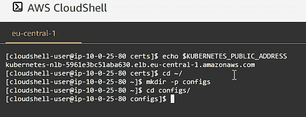**

****kube let 配置文件****

**为每个工作节点生成一个 kubeconfig:**

```
for instance in worker-0 worker-1 worker-2; do
  kubectl config set-cluster kubernetes-from-scratch \
    --certificate-authority=../certs/ca.pem \
    --embed-certs=true \
    --server=[https://${KUBERNETES_PUBLIC_ADDRESS}:443](https://${KUBERNETES_PUBLIC_ADDRESS}:443) \
    --kubeconfig=${instance}.kubeconfigkubectl config set-credentials system:node:${instance} \
    --client-certificate=../certs/${instance}.pem \
    --client-key=../certs/${instance}-key.pem \
    --embed-certs=true \
    --kubeconfig=${instance}.kubeconfigkubectl config set-context default \
    --cluster=kubernetes-from-scratch \
    --user=system:node:${instance} \
    --kubeconfig=${instance}.kubeconfigkubectl config use-context default --kubeconfig=${instance}.kubeconfig
done
```

**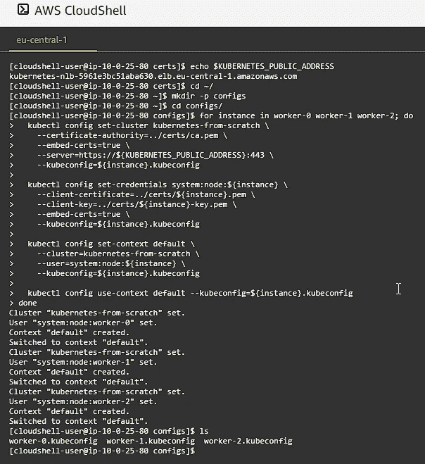**

****kube-proxy Kubernets 配置文件****

**为 **kube-proxy** 服务生成 kubeconfig 文件:**

```
kubectl config set-cluster kubernetes-from-scratch \
  --certificate-authority=../certs/ca.pem \
  --embed-certs=true \
  --server=[https://${KUBERNETES_PUBLIC_ADDRESS}:443](https://${KUBERNETES_PUBLIC_ADDRESS}:443) \
  --kubeconfig=kube-proxy.kubeconfigkubectl config set-credentials system:kube-proxy \
  --client-certificate=../certs/kube-proxy.pem \
  --client-key=../certs/kube-proxy-key.pem \
  --embed-certs=true \
  --kubeconfig=kube-proxy.kubeconfigkubectl config set-context default \
  --cluster=kubernetes-from-scratch \
  --user=system:kube-proxy \
  --kubeconfig=kube-proxy.kubeconfigkubectl config use-context default --kubeconfig=kube-proxy.kubeconfig
```

**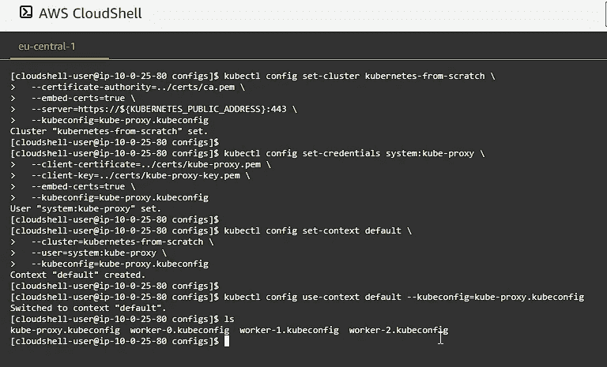**

****kube-控制器-管理器 Kubernetes 配置文件****

**为**kube-controller-manager**服务生成 kubeconfig 文件:**

```
kubectl config set-cluster kubernetes-from-scratch \
  --certificate-authority=../certs/ca.pem \
  --embed-certs=true \
  --server=[https://127.0.0.1:6443](https://127.0.0.1:6443) \
  --kubeconfig=kube-controller-manager.kubeconfigkubectl config set-credentials system:kube-controller-manager \
  --client-certificate=../certs/kube-controller-manager.pem \
  --client-key=../certs/kube-controller-manager-key.pem \
  --embed-certs=true \
  --kubeconfig=kube-controller-manager.kubeconfigkubectl config set-context default \
  --cluster=kubernetes-from-scratch \
  --user=system:kube-controller-manager \
  --kubeconfig=kube-controller-manager.kubeconfigkubectl config use-context default --kubeconfig=kube-controller-manager.kubeconfig
```

**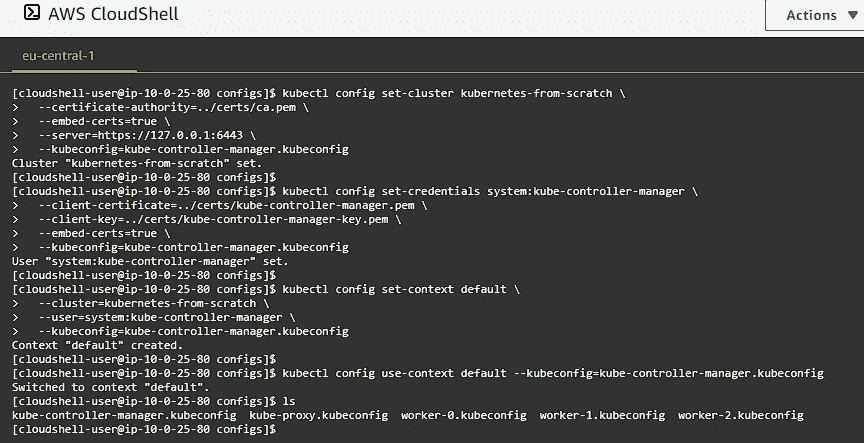**

****kube-scheduler Kubernetes 配置文件****

**为 **kube-scheduler** 服务生成一个 kubeconfig 文件:**

```
kubectl config set-cluster kubernetes-from-scratch \
  --certificate-authority=../certs/ca.pem \
  --embed-certs=true \
  --server=[https://127.0.0.1:6443](https://127.0.0.1:6443) \
  --kubeconfig=kube-scheduler.kubeconfigkubectl config set-credentials system:kube-scheduler \
  --client-certificate=../certs/kube-scheduler.pem \
  --client-key=../certs/kube-scheduler-key.pem \
  --embed-certs=true \
  --kubeconfig=kube-scheduler.kubeconfigkubectl config set-context default \
  --cluster=kubernetes-from-scratch \
  --user=system:kube-scheduler \
  --kubeconfig=kube-scheduler.kubeconfigkubectl config use-context default --kubeconfig=kube-scheduler.kubeconfig
```

**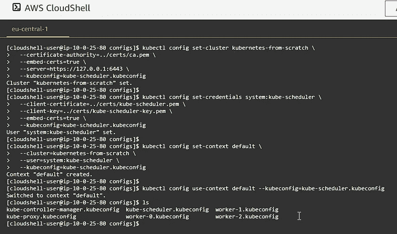**

****管理员 Kubernetes 配置文件****

**为**管理员**用户生成一个 kubeconfig 文件:**

```
kubectl config set-cluster kubernetes-from-scratch \
  --certificate-authority=../certs/ca.pem \
  --embed-certs=true \
  --server=[https://127.0.0.1:6443](https://127.0.0.1:6443) \
  --kubeconfig=admin.kubeconfigkubectl config set-credentials admin \
  --client-certificate=../certs/admin.pem \
  --client-key=../certs/admin-key.pem \
  --embed-certs=true \
  --kubeconfig=admin.kubeconfigkubectl config set-context default \
  --cluster=kubernetes-from-scratch \
  --user=admin \
  --kubeconfig=admin.kubeconfigkubectl config use-context default --kubeconfig=admin.kubeconfig
```

**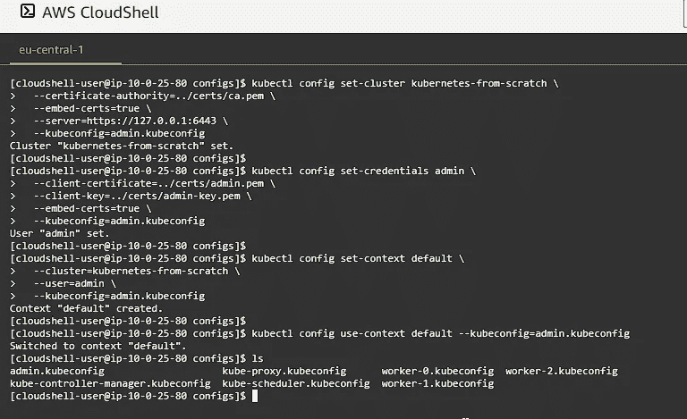**

****分发 Kubernetes 配置文件****

**将 **kubelet** 和 **kube-proxy** kubeconfig 文件复制到每个 worker 实例中:**

```
for instance in worker-0 worker-1 worker-2; do
  external_ip=$(aws ec2 describe-instances --filters \
    "Name=tag:Name,Values=${instance}" \
    "Name=instance-state-name,Values=running" \
    --output text --query 'Reservations[].Instances[].PublicIpAddress')scp -i ../kubernetes.id_rsa \
    ${instance}.kubeconfig kube-proxy.kubeconfig ubuntu@${external_ip}:~/
done
```

**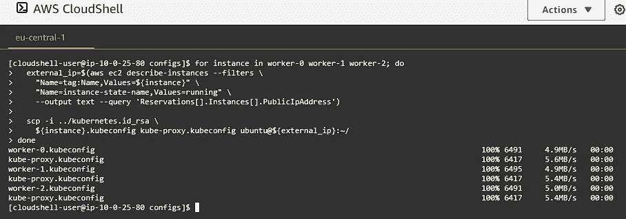**

**请注意，我们在 **configs/** 文件夹中，所以我添加了**../kubernetes.id_rsa** —这是我们之前所在目录的上一级目录，以防您遇到权限被拒绝的错误。**

**将**kube-controller-manager**和**kube-scheduler**kube config 文件复制到每个控制器实例:**

```
for instance in controller-0 controller-1 controller-2; do
  external_ip=$(aws ec2 describe-instances --filters \
    "Name=tag:Name,Values=${instance}" \
    "Name=instance-state-name,Values=running" \
    --output text --query 'Reservations[].Instances[].PublicIpAddress')

  scp -i ../kubernetes.id_rsa \
    admin.kubeconfig kube-controller-manager.kubeconfig kube-scheduler.kubeconfig ubuntu@${external_ip}:~/
done
```

**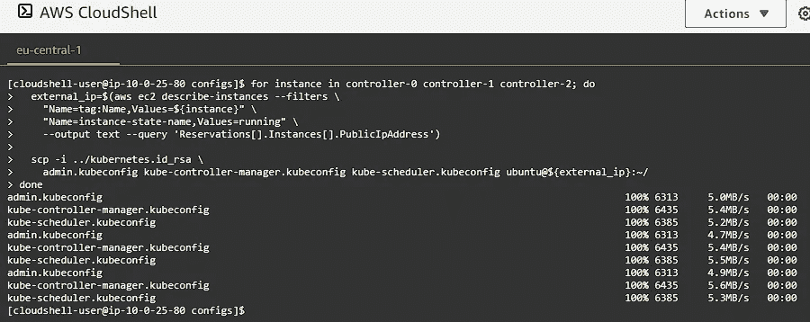**

**请注意，我们在 **configs/** 文件夹中，所以我添加了**../kubernetes.id_rsa** —这是我们之前所在目录的上一级目录，以防您遇到权限被拒绝的错误。**

## **生成数据加密配置和密钥**

**Kubernetes 存储各种数据，包括集群状态、应用程序配置和秘密。Kubernetes 支持[加密](https://kubernetes.io/docs/tasks/administer-cluster/encrypt-data)静态集群数据的能力。**

**为此，我们需要生成一个加密密钥和一个适合加密 Kubernetes 秘密的[加密配置](https://kubernetes.io/docs/tasks/administer-cluster/encrypt-data/#understanding-the-encryption-at-rest-configuration)。**

**为此，我们将返回我们的主文件夹，创建一个名为 **encryption** 的文件夹，然后切换到该文件夹:**

```
cd ~/
mkdir -p encryption
cd encryption/
```

**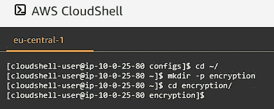**

****加密密钥****

**生成加密密钥:**

```
ENCRYPTION_KEY=$(head -c 32 /dev/urandom | base64)
```

****加密配置****

**创建 **encryption-config.yaml** 加密配置文件:**

```
cat > encryption-config.yaml <<EOF
kind: EncryptionConfig
apiVersion: v1
resources:
  - resources:
      - secrets
    providers:
      - aescbc:
          keys:
            - name: key1
              secret: ${ENCRYPTION_KEY}
      - identity: {}
EOF
```

**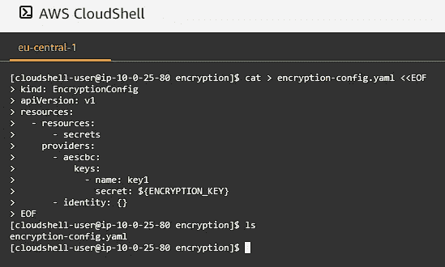**

**将 **encryption-config.yaml** 加密配置文件复制到每个控制器实例中；**

```
for instance in controller-0 controller-1 controller-2; do
  external_ip=$(aws ec2 describe-instances --filters \
    "Name=tag:Name,Values=${instance}" \
    "Name=instance-state-name,Values=running" \
    --output text --query 'Reservations[].Instances[].PublicIpAddress')

  scp -i ../kubernetes.id_rsa encryption-config.yaml ubuntu@${external_ip}:~/
done
```

**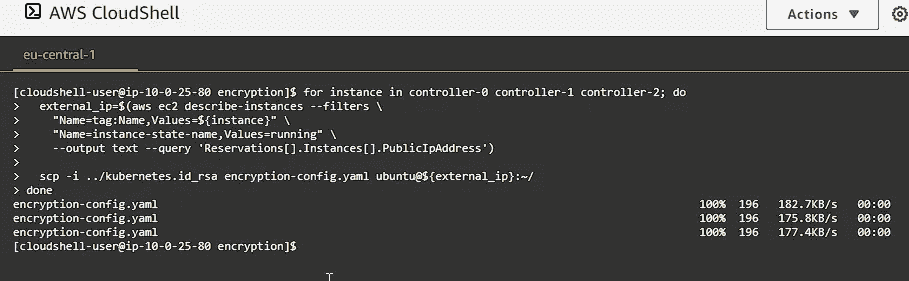**

****引导 etcd 集群****

**让我们首先回到我们的主目录:**

```
cd ~/
```

**Kubernetes 组件是无状态的，将集群状态存储在 [**etcd**](https://github.com/etcd-io/etcd) 中。我们将配置一个三节点 etcd 集群，并针对 HA(高可用性)和安全远程访问进行配置。**

**下一个命令将生成我们的 SSH 命令行参数，以便能够连接到我们的控制器实例:**

```
for instance in controller-0 controller-1 controller-2; do
  external_ip=$(aws ec2 describe-instances --filters \
    "Name=tag:Name,Values=${instance}" \
    "Name=instance-state-name,Values=running" \
    --output text --query 'Reservations[].Instances[].PublicIpAddress')echo ssh -i kubernetes.id_rsa ubuntu@$external_ip
done
```

**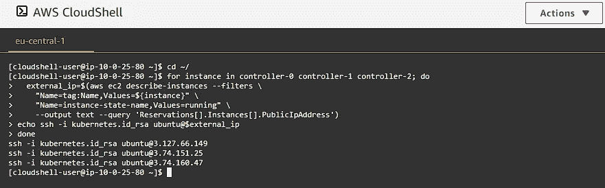**

**现在可以使用 tmux 创建多个窗格并连接到每个实例。我使用 AWS CloudShell，所以我将创建单独的行:**

**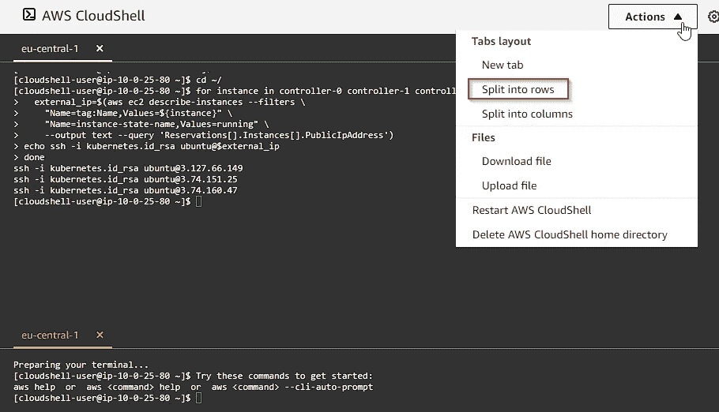****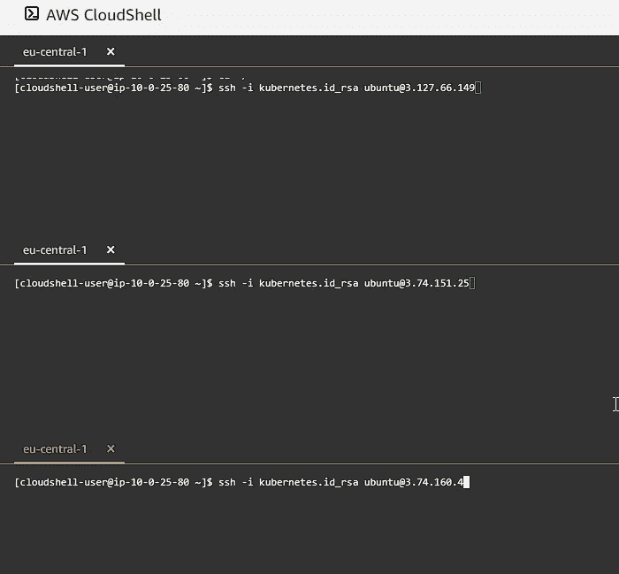****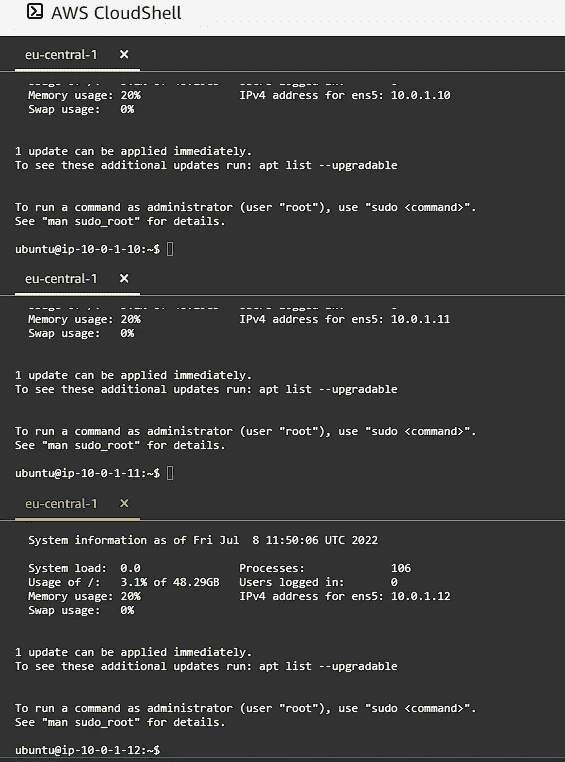**

****引导和 etcd 集群成员****

**登录到每个控制器节点后，我们现在需要从[**etcd GitHub**](https://github.com/etcd-io/etcd)proe jct 下载正式的 etcd 发布二进制文件(在每个节点上运行这个程序):**

```
wget -q --timestamping \
  "[https://github.com/etcd-io/etcd/releases/download/v3.4.15/etcd-v3.4.15-linux-amd64.tar.gz](https://github.com/etcd-io/etcd/releases/download/v3.4.15/etcd-v3.4.15-linux-amd64.tar.gz)"tar -xvf etcd-v3.4.15-linux-amd64.tar.gzsudo mv etcd-v3.4.15-linux-amd64/etcd* /usr/local/bin/
```

**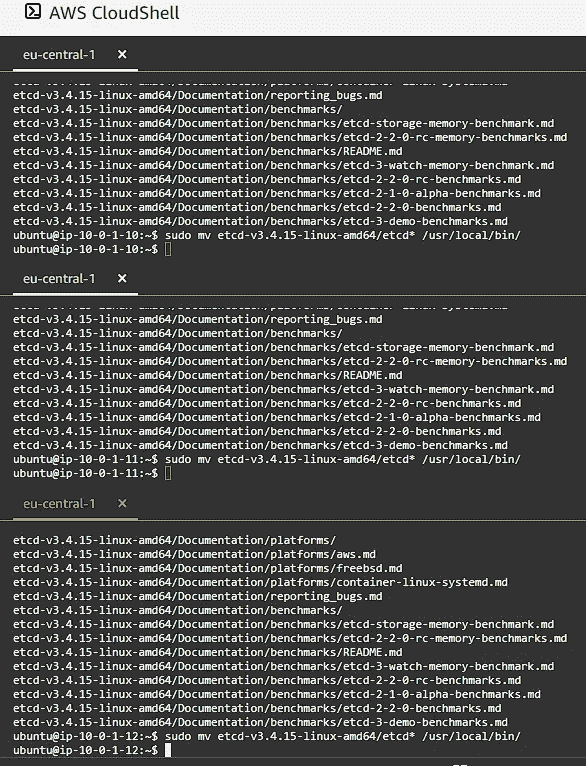**

****配置 etcd 服务器****

**接下来，我们创建必要的配置文件夹，并复制证书和密钥。我们还获得了节点的内部 IP 地址，以便在配置文件中使用。我们还需要在 etcd 集群中设置一个唯一的名称。记住在每个控制器实例中运行一次:**

```
sudo mkdir -p /etc/etcd /var/lib/etcd
sudo chmod 700 /var/lib/etcd
sudo cp ca.pem kubernetes-key.pem kubernetes.pem /etc/etcd/INTERNAL_IP=$(curl -s [http://169.254.169.254/latest/meta-data/local-ipv4](http://169.254.169.254/latest/meta-data/local-ipv4))ETCD_NAME=$(curl -s [http://169.254.169.254/latest/user-data/](http://169.254.169.254/latest/user-data/) \
  | tr "|" "\n" | grep "^name" | cut -d"=" -f2)
echo "${ETCD_NAME}"
```

**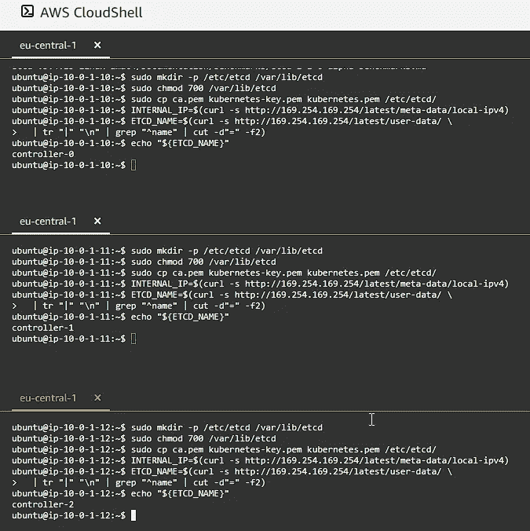**

**我们希望确保 etcd 在引导时在每个控制器上启动，因此我们需要创建一个 **etcd.service** systemd 单元文件，并启用和启动 etcd 服务(记住在每个控制器节点上运行该文件):**

```
cat <<EOF | sudo tee /etc/systemd/system/etcd.service
[Unit]
Description=etcd
Documentation=[https://github.com/coreos](https://github.com/coreos)[Service]
Type=notify
ExecStart=/usr/local/bin/etcd \\
  --name ${ETCD_NAME} \\
  --cert-file=/etc/etcd/kubernetes.pem \\
  --key-file=/etc/etcd/kubernetes-key.pem \\
  --peer-cert-file=/etc/etcd/kubernetes.pem \\
  --peer-key-file=/etc/etcd/kubernetes-key.pem \\
  --trusted-ca-file=/etc/etcd/ca.pem \\
  --peer-trusted-ca-file=/etc/etcd/ca.pem \\
  --peer-client-cert-auth \\
  --client-cert-auth \\
  --initial-advertise-peer-urls [https://${INTERNAL_IP}:2380](https://${INTERNAL_IP}:2380) \\
  --listen-peer-urls [https://${INTERNAL_IP}:2380](https://${INTERNAL_IP}:2380) \\
  --listen-client-urls [https://${INTERNAL_IP}:2379,https://127.0.0.1:2379](https://${INTERNAL_IP}:2379,https://127.0.0.1:2379) \\
  --advertise-client-urls [https://${INTERNAL_IP}:2379](https://${INTERNAL_IP}:2379) \\
  --initial-cluster-token etcd-cluster-0 \\
  --initial-cluster controller-0=[https://10.0.1.10:2380,controller-1=https://10.0.1.11:2380,controller-2=https://10.0.1.12:2380](https://10.0.1.10:2380,controller-1=https://10.0.1.11:2380,controller-2=https://10.0.1.12:2380) \\
  --initial-cluster-state new \\
  --data-dir=/var/lib/etcd
Restart=on-failure
RestartSec=5[Install]
WantedBy=multi-user.target
EOFsudo systemctl daemon-reload
sudo systemctl enable etcd
sudo systemctl start etcd
```

**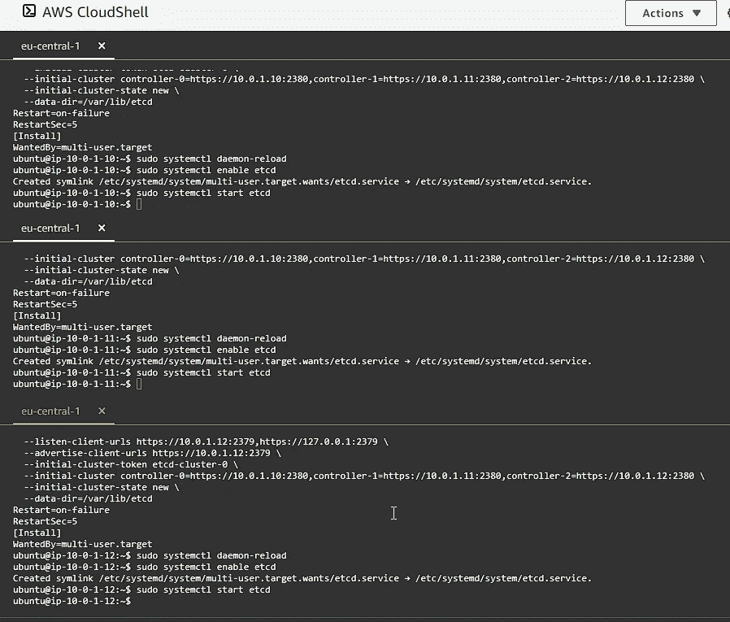**

**您可以通过运行以下命令来检查 **etcd** 服务的状态:**

```
sudo service etcd status
```

**我们还可以通过运行以下命令来验证 etcd 集群成员:**

```
sudo ETCDCTL_API=3 etcdctl member list \
  --endpoints=[https://127.0.0.1:2379](https://127.0.0.1:2379) \
  --cacert=/etc/etcd/ca.pem \
  --cert=/etc/etcd/kubernetes.pem \
  --key=/etc/etcd/kubernetes-key.pem
```

**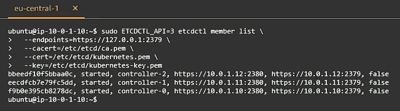**

## **引导 Kubernetes 控制平面**

**我们将在每个控制器节点上安装以下组件: [**Kubernetes API 服务器**](https://kubernetes.io/docs/reference/command-line-tools-reference/kube-apiserver/) 、 [**调度器**](https://kubernetes.io/docs/reference/command-line-tools-reference/kube-scheduler/) 和 [**控制器管理器**](https://kubernetes.io/docs/reference/command-line-tools-reference/kube-controller-manager/) 。**

**确保您已经通过 SSH 登录到每个控制器节点，您可以通过运行以下命令获得 SSH 命令列表:**

```
for instance in controller-0 controller-1 controller-2; do
  external_ip=$(aws ec2 describe-instances --filters \
    "Name=tag:Name,Values=${instance}" \
    "Name=instance-state-name,Values=running" \
    --output text --query 'Reservations[].Instances[].PublicIpAddress')echo ssh -i kubernetes.id_rsa ubuntu@$external_ip
done
```

****提供 Kubernetes 控制平面****

**我们将创建我们的目录结构，下载并安装二进制文件，复制我们需要的证书和密钥。我们还确定节点的内部 IP 地址，以便在我们的配置中使用它。**

**请记住在我们的每个控制器节点上运行此命令:**

```
sudo mkdir -p /etc/kubernetes/config
sudo mkdir -p /var/lib/kubernetes/sudo mv ca.pem ca-key.pem kubernetes-key.pem kubernetes.pem \
  service-account-key.pem service-account.pem \
  encryption-config.yaml /var/lib/kubernetes/wget -q --show-progress --https-only --timestamping \
  "[https://storage.googleapis.com/kubernetes-release/release/v1.21.0/bin/linux/amd64/kube-apiserver](https://storage.googleapis.com/kubernetes-release/release/v1.21.0/bin/linux/amd64/kube-apiserver)" \
  "[https://storage.googleapis.com/kubernetes-release/release/v1.21.0/bin/linux/amd64/kube-controller-manager](https://storage.googleapis.com/kubernetes-release/release/v1.21.0/bin/linux/amd64/kube-controller-manager)" \
  "[https://storage.googleapis.com/kubernetes-release/release/v1.21.0/bin/linux/amd64/kube-scheduler](https://storage.googleapis.com/kubernetes-release/release/v1.21.0/bin/linux/amd64/kube-scheduler)" \
  "[https://storage.googleapis.com/kubernetes-release/release/v1.21.0/bin/linux/amd64/kubectl](https://storage.googleapis.com/kubernetes-release/release/v1.21.0/bin/linux/amd64/kubectl)"chmod +x kube-apiserver kube-controller-manager kube-scheduler kubectl
sudo mv kube-apiserver kube-controller-manager kube-scheduler kubectl /usr/local/bin/INTERNAL_IP=$(curl -s [http://169.254.169.254/latest/meta-data/local-ipv4](http://169.254.169.254/latest/meta-data/local-ipv4))
```

**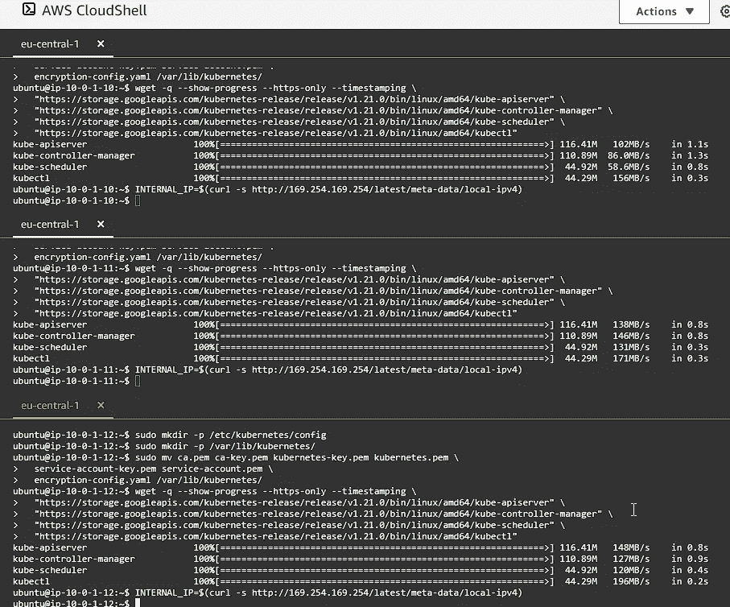**

**我们希望确保在引导时在每个控制器上启动了 **kube-apiserver** 服务，因此我们需要创建一个**kube-API server . service**systemd 单元文件(记得在每个控制器节点上运行这个文件):**

```
cat <<EOF | sudo tee /etc/systemd/system/kube-apiserver.service
[Unit]
Description=Kubernetes API Server
Documentation=[https://github.com/kubernetes/kubernetes](https://github.com/kubernetes/kubernetes)[Service]
ExecStart=/usr/local/bin/kube-apiserver \\
  --advertise-address=${INTERNAL_IP} \\
  --allow-privileged=true \\
  --apiserver-count=3 \\
  --audit-log-maxage=30 \\
  --audit-log-maxbackup=3 \\
  --audit-log-maxsize=100 \\
  --audit-log-path=/var/log/audit.log \\
  --authorization-mode=Node,RBAC \\
  --bind-address=0.0.0.0 \\
  --client-ca-file=/var/lib/kubernetes/ca.pem \\
  --enable-admission-plugins=NamespaceLifecycle,NodeRestriction,LimitRanger,ServiceAccount,DefaultStorageClass,ResourceQuota \\
  --etcd-cafile=/var/lib/kubernetes/ca.pem \\
  --etcd-certfile=/var/lib/kubernetes/kubernetes.pem \\
  --etcd-keyfile=/var/lib/kubernetes/kubernetes-key.pem \\
  --etcd-servers=[https://10.0.1.10:2379,https://10.0.1.11:2379,https://10.0.1.12:2379](https://10.0.1.10:2379,https://10.0.1.11:2379,https://10.0.1.12:2379) \\
  --event-ttl=1h \\
  --encryption-provider-config=/var/lib/kubernetes/encryption-config.yaml \\
  --kubelet-certificate-authority=/var/lib/kubernetes/ca.pem \\
  --kubelet-client-certificate=/var/lib/kubernetes/kubernetes.pem \\
  --kubelet-client-key=/var/lib/kubernetes/kubernetes-key.pem \\
  --runtime-config='api/all=true' \\
  --service-account-key-file=/var/lib/kubernetes/service-account.pem \\
  --service-account-signing-key-file=/var/lib/kubernetes/service-account-key.pem \\
  --service-account-issuer=[https://${KUBERNETES_PUBLIC_ADDRESS}:443](https://${KUBERNETES_PUBLIC_ADDRESS}:443) \\
  --service-cluster-ip-range=10.32.0.0/24 \\
  --service-node-port-range=30000-32767 \\
  --tls-cert-file=/var/lib/kubernetes/kubernetes.pem \\
  --tls-private-key-file=/var/lib/kubernetes/kubernetes-key.pem \\
  --v=2
Restart=on-failure
RestartSec=5[Install]
WantedBy=multi-user.target
EOF
```

****配置 Kubernetes 控制器管理器****

**将**kube-controller-manager**kube config 移动到位(记住在每个控制器节点上运行此操作):**

```
sudo mv kube-controller-manager.kubeconfig /var/lib/kubernetes/
```

**创建**kube-controller-manager . service**systemd 单元文件(记得在每个控制器节点上运行这个文件):**

```
cat <<EOF | sudo tee /etc/systemd/system/kube-controller-manager.service
[Unit]
Description=Kubernetes Controller Manager
Documentation=[https://github.com/kubernetes/kubernetes](https://github.com/kubernetes/kubernetes)[Service]
ExecStart=/usr/local/bin/kube-controller-manager \\
  --bind-address=0.0.0.0 \\
  --cluster-cidr=10.200.0.0/16 \\
  --cluster-name=kubernetes \\
  --cluster-signing-cert-file=/var/lib/kubernetes/ca.pem \\
  --cluster-signing-key-file=/var/lib/kubernetes/ca-key.pem \\
  --kubeconfig=/var/lib/kubernetes/kube-controller-manager.kubeconfig \\
  --leader-elect=true \\
  --root-ca-file=/var/lib/kubernetes/ca.pem \\
  --service-account-private-key-file=/var/lib/kubernetes/service-account-key.pem \\
  --service-cluster-ip-range=10.32.0.0/24 \\
  --use-service-account-credentials=true \\
  --v=2
Restart=on-failure
RestartSec=5[Install]
WantedBy=multi-user.target
EOF
```

****配置 Kubernetes 调度程序****

**将**kube-scheduler**kube config 移动到位(记住在每个控制器节点上运行该程序):**

```
sudo mv kube-scheduler.kubeconfig /var/lib/kubernetes/
```

**创建 **kube-scheuduler.yaml** 配置文件:**

```
cat <<EOF | sudo tee /etc/kubernetes/config/kube-scheduler.yaml
apiVersion: kubescheduler.config.k8s.io/v1beta1
kind: KubeSchedulerConfiguration
clientConnection:
  kubeconfig: "/var/lib/kubernetes/kube-scheduler.kubeconfig"
leaderElection:
  leaderElect: true
EOF
```

**创建**kube-scheduler . service**systemd 单元文件:**

```
cat <<EOF | sudo tee /etc/systemd/system/kube-scheduler.service
[Unit]
Description=Kubernetes Scheduler
Documentation=[https://github.com/kubernetes/kubernetes](https://github.com/kubernetes/kubernetes)[Service]
ExecStart=/usr/local/bin/kube-scheduler \\
  --config=/etc/kubernetes/config/kube-scheduler.yaml \\
  --v=2
Restart=on-failure
RestartSec=5[Install]
WantedBy=multi-user.target
EOF
```

****启用开机启动并启动控制器服务****

**请记住在每个控制器节点上运行此命令:**

```
sudo systemctl daemon-reload
sudo systemctl enable kube-apiserver kube-controller-manager kube-scheduler
sudo systemctl start kube-apiserver kube-controller-manager kube-scheduler
```

****添加主机文件条目****

**为了让 **kubectl exec** 命令工作，每个控制器节点都必须能够解析工作主机名称。这在 AWS 中不是默认设置的。解决方法是在每个控制器节点上添加手动主机条目:**

```
cat <<EOF | sudo tee -a /etc/hosts
10.0.1.20 ip-10-0-1-20
10.0.1.21 ip-10-0-1-21
10.0.1.22 ip-10-0-1-22
EOF
```

**如果错过此步骤，DNS 群集加载项测试将失败，并显示如下错误:**

```
Error from server: error dialing backend: dial tcp: lookup ip-10-0-1-22 on 127.0.0.53:53: server misbehaving
```

****验证您可以在控制平面节点上访问 Kubernetes 集群****

```
kubectl cluster-info --kubeconfig admin.kubeconfig
```

**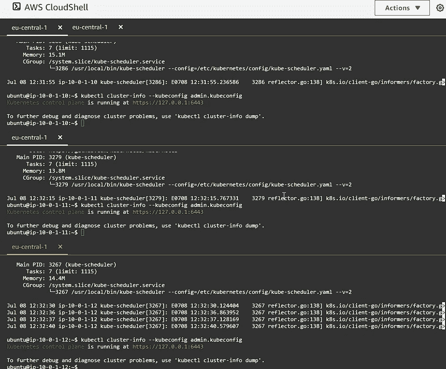**

****RBAC 对库伯莱的授权****

**我们需要为 Kubernetes API 服务器设置角色和权限，以访问每个 worker 节点上的 Kubelet API。在 pods 中检索指标、日志和执行命令需要访问 Kubelet API。**

**本节中的命令将影响整个集群，并且只需要从其中一个控制器节点运行一次，下面的命令将打印出您应该用来连接到实例的 SSH 命令:**

```
external_ip=$(aws ec2 describe-instances --filters \
    "Name=tag:Name,Values=controller-0" \
    "Name=instance-state-name,Values=running" \
    --output text --query 'Reservations[].Instances[].PublicIpAddress')ssh -i kubernetes.id_rsa ubuntu@${external_ip}
```

**创建**system:kube-API server-to-ku delet**cluster role，该角色有权访问 Kubelet API 并执行一些与管理 pod 相关的常见任务:**

```
cat <<EOF | kubectl apply --kubeconfig admin.kubeconfig -f -
apiVersion: rbac.authorization.k8s.io/v1
kind: ClusterRole
metadata:
  annotations:
    rbac.authorization.kubernetes.io/autoupdate: "true"
  labels:
    kubernetes.io/bootstrapping: rbac-defaults
  name: system:kube-apiserver-to-kubelet
rules:
  - apiGroups:
      - ""
    resources:
      - nodes/proxy
      - nodes/stats
      - nodes/log
      - nodes/spec
      - nodes/metrics
    verbs:
      - "*"
EOF
```

**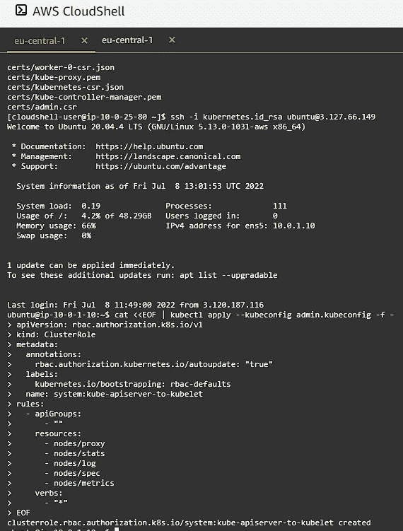**

**将**系统:kube-API server-to-kube let**cluster role 绑定到 **kubernetes** 用户:**

```
cat <<EOF | kubectl apply --kubeconfig admin.kubeconfig -f -
apiVersion: rbac.authorization.k8s.io/v1
kind: ClusterRoleBinding
metadata:
  name: system:kube-apiserver
  namespace: ""
roleRef:
  apiGroup: rbac.authorization.k8s.io
  kind: ClusterRole
  name: system:kube-apiserver-to-kubelet
subjects:
  - apiGroup: rbac.authorization.k8s.io
    kind: User
    name: kubernetes
EOF
```

**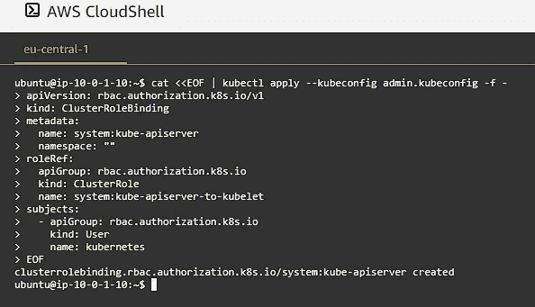**

****验证集群公共端点****

**注销 SSH 连接并返回到主终端窗口，因为您需要执行 AWS 命令来远程验证公共端点:**

```
KUBERNETES_PUBLIC_ADDRESS=$(aws elbv2 describe-load-balancers \
  --load-balancer-arns ${LOAD_BALANCER_ARN} \
  --output text --query 'LoadBalancers[].DNSName')curl --cacert certs/ca.pem https://${KUBERNETES_PUBLIC_ADDRESS}/version
```

**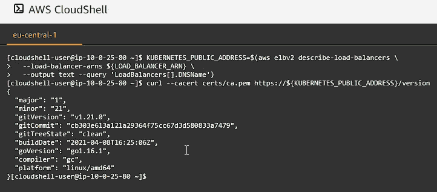**

## **引导 Kubernetes 工作节点**

**每个节点上将安装以下组件: [**runc**](https://github.com/opencontainers/runc) ， [**容器联网插件**](https://github.com/containernetworking/cni) ， [**containerd**](https://github.com/containerd/containerd) ， [**kubelet**](https://kubernetes.io/docs/admin/kubelet) ，以及 [**kube-proxy**](https://kubernetes.io/docs/concepts/cluster-administration/proxies) 。**

**这些命令需要在每个 worker 实例上运行。让我们生成 SSH 命令列表:**

```
for instance in worker-0 worker-1 worker-2; do
  external_ip=$(aws ec2 describe-instances --filters \
    "Name=tag:Name,Values=${instance}" \
    "Name=instance-state-name,Values=running" \
    --output text --query 'Reservations[].Instances[].PublicIpAddress')echo ssh -i kubernetes.id_rsa ubuntu@$external_ip
done
```

**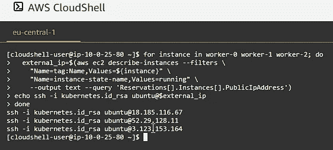**

**SSH 到一个单独的窗格中的每个实例。**

**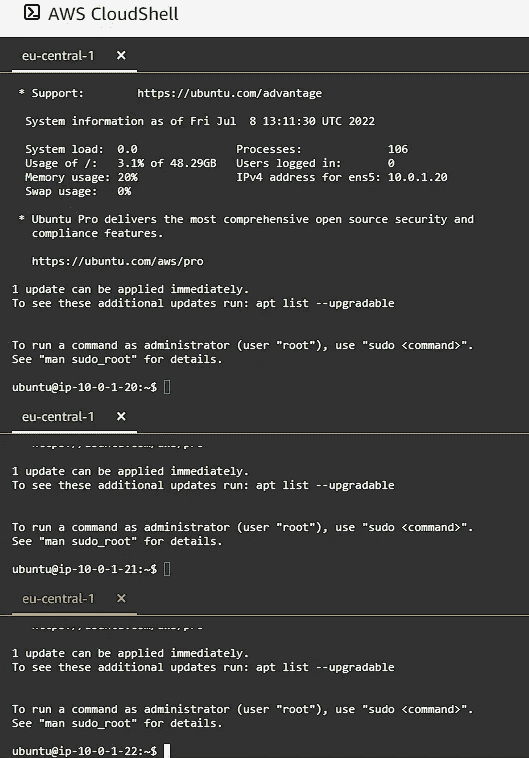**

****提供一个 Kubernetes 工人节点****

**安装操作系统依赖项，禁用交换，下载并安装工作二进制文件:**

```
sudo apt-get update
sudo apt-get -y install socat conntrack ipsetsudo swapon --show
sudo swapoff -awget -q --show-progress --https-only --timestamping \
  [https://github.com/kubernetes-sigs/cri-tools/releases/download/v1.21.0/crictl-v1.21.0-linux-amd64.tar.gz](https://github.com/kubernetes-sigs/cri-tools/releases/download/v1.21.0/crictl-v1.21.0-linux-amd64.tar.gz) \
  [https://github.com/opencontainers/runc/releases/download/v1.0.0-rc93/runc.amd64](https://github.com/opencontainers/runc/releases/download/v1.0.0-rc93/runc.amd64) \
  [https://github.com/containernetworking/plugins/releases/download/v0.9.1/cni-plugins-linux-amd64-v0.9.1.tgz](https://github.com/containernetworking/plugins/releases/download/v0.9.1/cni-plugins-linux-amd64-v0.9.1.tgz) \
  [https://github.com/containerd/containerd/releases/download/v1.4.4/containerd-1.4.4-linux-amd64.tar.gz](https://github.com/containerd/containerd/releases/download/v1.4.4/containerd-1.4.4-linux-amd64.tar.gz) \
  [https://storage.googleapis.com/kubernetes-release/release/v1.21.0/bin/linux/amd64/kubectl](https://storage.googleapis.com/kubernetes-release/release/v1.21.0/bin/linux/amd64/kubectl) \
  [https://storage.googleapis.com/kubernetes-release/release/v1.21.0/bin/linux/amd64/kube-proxy](https://storage.googleapis.com/kubernetes-release/release/v1.21.0/bin/linux/amd64/kube-proxy) \
  [https://storage.googleapis.com/kubernetes-release/release/v1.21.0/bin/linux/amd64/kubelet](https://storage.googleapis.com/kubernetes-release/release/v1.21.0/bin/linux/amd64/kubelet)sudo mkdir -p \
  /etc/cni/net.d \
  /opt/cni/bin \
  /var/lib/kubelet \
  /var/lib/kube-proxy \
  /var/lib/kubernetes \
  /var/run/kubernetesmkdir containerd
tar -xvf crictl-v1.21.0-linux-amd64.tar.gz
tar -xvf containerd-1.4.4-linux-amd64.tar.gz -C containerd
sudo tar -xvf cni-plugins-linux-amd64-v0.9.1.tgz -C /opt/cni/bin/
sudo mv runc.amd64 runc
chmod +x crictl kubectl kube-proxy kubelet runc 
sudo mv crictl kubectl kube-proxy kubelet runc /usr/local/bin/
sudo mv containerd/bin/* /bin/
```

****配置 CNI 网络****

**检索当前计算实例的 Pod CIDR 范围。创建网桥和环回配置(记得在每个工作节点上运行):**

```
POD_CIDR=$(curl -s [http://169.254.169.254/latest/user-data/](http://169.254.169.254/latest/user-data/) \
  | tr "|" "\n" | grep "^pod-cidr" | cut -d"=" -f2)
echo "${POD_CIDR}"cat <<EOF | sudo tee /etc/cni/net.d/10-bridge.conf
{
    "cniVersion": "0.4.0",
    "name": "bridge",
    "type": "bridge",
    "bridge": "cnio0",
    "isGateway": true,
    "ipMasq": true,
    "ipam": {
        "type": "host-local",
        "ranges": [
          [{"subnet": "${POD_CIDR}"}]
        ],
        "routes": [{"dst": "0.0.0.0/0"}]
    }
}
EOFcat <<EOF | sudo tee /etc/cni/net.d/99-loopback.conf
{
    "cniVersion": "0.4.0",
    "name": "lo",
    "type": "loopback"
}
EOF
```

****配置容器 id****

**创建一个 **containerd** 配置文件，并创建**container d . service**systemd 单元文件(记住要在每个 worker 节点上运行):**

```
sudo mkdir -p /etc/containerd/cat << EOF | sudo tee /etc/containerd/config.toml
[plugins]
  [plugins.cri.containerd]
    snapshotter = "overlayfs"
    [plugins.cri.containerd.default_runtime]
      runtime_type = "io.containerd.runtime.v1.linux"
      runtime_engine = "/usr/local/bin/runc"
      runtime_root = ""
EOFcat <<EOF | sudo tee /etc/systemd/system/containerd.service
[Unit]
Description=containerd container runtime
Documentation=[https://containerd.io](https://containerd.io)
After=network.target[Service]
ExecStartPre=/sbin/modprobe overlay
ExecStart=/bin/containerd
Restart=always
RestartSec=5
Delegate=yes
KillMode=process
OOMScoreAdjust=-999
LimitNOFILE=1048576
LimitNPROC=infinity
LimitCORE=infinity[Install]
WantedBy=multi-user.target
EOF
```

****配置 Kubelet****

**移动并存储证书和密钥，并创建必要的文件夹和配置(记住在每个工作节点上运行):**

```
WORKER_NAME=$(curl -s [http://169.254.169.254/latest/user-data/](http://169.254.169.254/latest/user-data/) \
| tr "|" "\n" | grep "^name" | cut -d"=" -f2)
echo "${WORKER_NAME}"sudo mv ${WORKER_NAME}-key.pem ${WORKER_NAME}.pem /var/lib/kubelet/
sudo mv ${WORKER_NAME}.kubeconfig /var/lib/kubelet/kubeconfig
sudo mv ca.pem /var/lib/kubernetes/cat <<EOF | sudo tee /var/lib/kubelet/kubelet-config.yaml
kind: KubeletConfiguration
apiVersion: kubelet.config.k8s.io/v1beta1
authentication:
  anonymous:
    enabled: false
  webhook:
    enabled: true
  x509:
    clientCAFile: "/var/lib/kubernetes/ca.pem"
authorization:
  mode: Webhook
clusterDomain: "cluster.local"
clusterDNS:
  - "10.32.0.10"
podCIDR: "${POD_CIDR}"
resolvConf: "/run/systemd/resolve/resolv.conf"
runtimeRequestTimeout: "15m"
tlsCertFile: "/var/lib/kubelet/${WORKER_NAME}.pem"
tlsPrivateKeyFile: "/var/lib/kubelet/${WORKER_NAME}-key.pem"
EOF
```

****resolveConf** 配置用于在运行 **systemd-resolved** 的系统上使用 CoreDNS 进行服务发现时避免循环。**

**创建**kube let . service**systemd 单元文件(记得在每个 worker 节点上运行):**

```
cat <<EOF | sudo tee /etc/systemd/system/kubelet.service
[Unit]
Description=Kubernetes Kubelet
Documentation=[https://github.com/kubernetes/kubernetes](https://github.com/kubernetes/kubernetes)
After=containerd.service
Requires=containerd.service[Service]
ExecStart=/usr/local/bin/kubelet \\
  --config=/var/lib/kubelet/kubelet-config.yaml \\
  --container-runtime=remote \\
  --container-runtime-endpoint=unix:///var/run/containerd/containerd.sock \\
  --image-pull-progress-deadline=2m \\
  --kubeconfig=/var/lib/kubelet/kubeconfig \\
  --network-plugin=cni \\
  --register-node=true \\
  --v=2
Restart=on-failure
RestartSec=5[Install]
WantedBy=multi-user.target
EOF
```

****配置 Kubernetes 代理****

**将 **kube-proxy** kubeconfig 移动到位，创建 kube-proxy-config，最后创建**kube-proxy . service**systemd 单元文件(记住在每个 worker 节点上运行):**

```
sudo mv kube-proxy.kubeconfig /var/lib/kube-proxy/kubeconfigcat <<EOF | sudo tee /var/lib/kube-proxy/kube-proxy-config.yaml
kind: KubeProxyConfiguration
apiVersion: kubeproxy.config.k8s.io/v1alpha1
clientConnection:
  kubeconfig: "/var/lib/kube-proxy/kubeconfig"
mode: "iptables"
clusterCIDR: "10.200.0.0/16"
EOFcat <<EOF | sudo tee /etc/systemd/system/kube-proxy.service
[Unit]
Description=Kubernetes Kube Proxy
Documentation=[https://github.com/kubernetes/kubernetes](https://github.com/kubernetes/kubernetes)[Service]
ExecStart=/usr/local/bin/kube-proxy \\
  --config=/var/lib/kube-proxy/kube-proxy-config.yaml
Restart=on-failure
RestartSec=5[Install]
WantedBy=multi-user.target
EOF
```

****启用启动时启动并启动工人服务****

**记住在每个工作节点上运行:**

```
sudo systemctl daemon-reload
sudo systemctl enable containerd kubelet kube-proxy
sudo systemctl start containerd kubelet kube-proxy
```

****验证一切正常****

**切换回拥有 AWS 权限的终端(不是登录的 worker 节点)并运行:**

```
external_ip=$(aws ec2 describe-instances --filters \
    "Name=tag:Name,Values=controller-0" \
    "Name=instance-state-name,Values=running" \
    --output text --query 'Reservations[].Instances[].PublicIpAddress')ssh -i kubernetes.id_rsa ubuntu@${external_ip} kubectl get nodes --kubeconfig admin.kubeconfig
```

**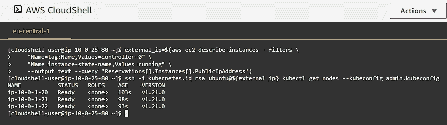**

**我们可以看到 3 个工作节点启动并运行，并且**就绪**。**

## **为远程访问配置 kubectl**

**我们将根据**管理员**用户凭证为 **kubectl** 命令行实用程序生成一个 kubeconfig 文件。**

**每个 kubeconfig 都需要一个 Kubernetes API 服务器来连接。为了支持 HA(高可用性)，将使用面向 Kubernetes API 服务器的外部负载平衡器的 DNS 名称。**

**生成一个适合作为**管理员**用户验证的 kubeconfig 文件:**

```
cd ~KUBERNETES_PUBLIC_ADDRESS=$(aws elbv2 describe-load-balancers \
--load-balancer-arns ${LOAD_BALANCER_ARN} \
--output text --query 'LoadBalancers[].DNSName')kubectl config set-cluster kubernetes-from-scratch \
  --certificate-authority=certs/ca.pem \
  --embed-certs=true \
  --server=[https://${KUBERNETES_PUBLIC_ADDRESS}:443](https://${KUBERNETES_PUBLIC_ADDRESS}:443)kubectl config set-credentials admin \
  --client-certificate=certs/admin.pem \
  --client-key=certs/admin-key.pemkubectl config set-context kubernetes-from-scratch \
  --cluster=kubernetes-from-scratch \
  --user=adminkubectl config use-context kubernetes-from-scratch
```

****验证一切正常****

**检查远程 Kubernetes 集群的版本:**

```
kubectl version
kubectl get nodes
kubectl config view
```

**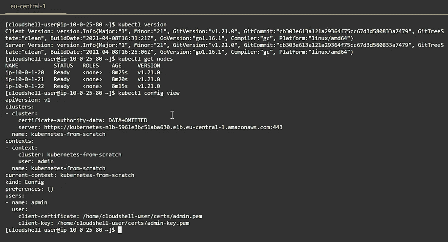**

## **供应 Pod 网络路由**

**调度到一个节点的 Pod 从该节点的 Pod CIDR 范围接收 IP 地址。此时，由于缺少网络 [**路由**](https://docs.aws.amazon.com/vpc/latest/userguide/VPC_Route_Tables.html) ，吊舱无法与运行在不同节点上的其他吊舱通信。**

**我们将为每个工作节点创建一个路由，将节点的 Pod CIDR 范围映射到节点的内部 IP 地址。**

**然而，在生产工作负载中，该功能将由 CNI 插件提供，如法兰绒、calico、amazon-vpc-cni-k8s。手动这样做可以更容易理解那些插件在幕后做什么。**

**打印每个工作实例的内部 IP 地址和 Pod CIDR 范围，并创建路由表条目:**

```
for instance in worker-0 worker-1 worker-2; do
  instance_id_ip="$(aws ec2 describe-instances \
    --filters "Name=tag:Name,Values=${instance}" \
    --output text --query 'Reservations[].Instances[].[InstanceId,PrivateIpAddress]')"
  instance_id="$(echo "${instance_id_ip}" | cut -f1)"
  instance_ip="$(echo "${instance_id_ip}" | cut -f2)"
  pod_cidr="$(aws ec2 describe-instance-attribute \
    --instance-id "${instance_id}" \
    --attribute userData \
    --output text --query 'UserData.Value' \
    | base64 --decode | tr "|" "\n" | grep "^pod-cidr" | cut -d'=' -f2)"
  echo "${instance_ip} ${pod_cidr}"aws ec2 create-route \
    --route-table-id "${ROUTE_TABLE_ID}" \
    --destination-cidr-block "${pod_cidr}" \
    --instance-id "${instance_id}"
done
```

**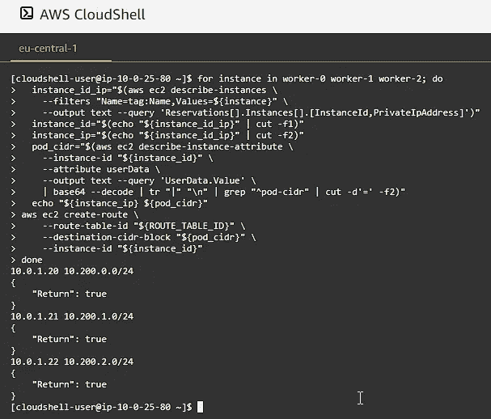**

****验证路线****

**验证每个工作实例的网络路由:**

```
aws ec2 describe-route-tables \
  --route-table-ids "${ROUTE_TABLE_ID}" \
  --query 'RouteTables[].Routes'
```

**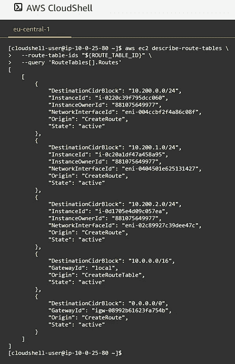**

****部署 DNS 群集插件****

**我们现在将部署 DNS 插件，该插件为 Kubernetes 集群中运行的应用程序提供基于 DNS 的服务发现，并由 CoreDNS 提供支持。**

**部署 **coredns** 集群附加组件:**

```
kubectl apply -f [https://storage.googleapis.com/kubernetes-the-hard-way/coredns-1.8.yaml](https://storage.googleapis.com/kubernetes-the-hard-way/coredns-1.8.yaml)
```

**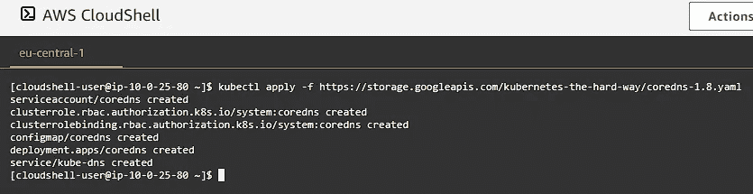**

**由**核心 dns** 部署创建的列表窗格:**

```
kubectl get pods -l k8s-app=kube-dns -n kube-system
```

**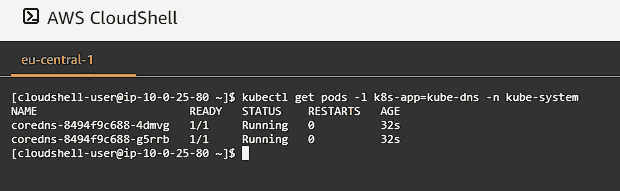**

****确认一切正常****

**创建一个 **busybox** 部署，然后列出 pod:**

```
kubectl run busybox --image=busybox:1.28 --command -- sleep 3600kubectl get pods -l run=busybox
```

**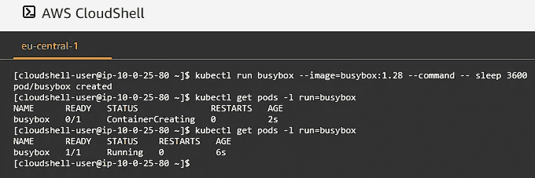**

**检索 **busybox** pod 的全名，并在 **busybox** pod 中执行 **kubernetes** 服务的 DNS 查找:**

```
POD_NAME=$(kubectl get pods -l run=busybox -o jsonpath="{.items[0].metadata.name}")kubectl exec -ti $POD_NAME -- nslookup kubernetes
```

**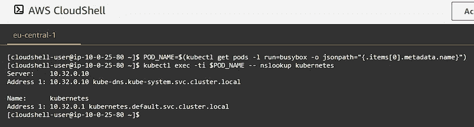**

## **烟气试验**

****数据加密****

**通过创建一个通用**秘密**，然后使用 **hexdump** 检查 **etcd** 中存储的条目，验证加密静态秘密数据的能力:**

```
kubectl create secret generic kubernetes-from-scratch \
  --from-literal="mykey=mydata"external_ip=$(aws ec2 describe-instances --filters \
  "Name=tag:Name,Values=controller-0" \
  "Name=instance-state-name,Values=running" \
  --output text --query 'Reservations[].Instances[].PublicIpAddress')ssh -i kubernetes.id_rsa ubuntu@${external_ip} \
 "sudo ETCDCTL_API=3 etcdctl get \
  --endpoints=[https://127.0.0.1:2379](https://127.0.0.1:2379) \
  --cacert=/etc/etcd/ca.pem \
  --cert=/etc/etcd/kubernetes.pem \
  --key=/etc/etcd/kubernetes-key.pem\
  /registry/secrets/default/kubernetes-from-scratch | hexdump -C"
```

**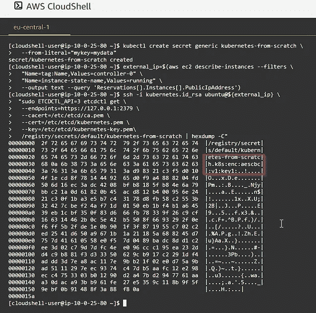**

**etcd 密钥应该以 **k8s:enc:aescbc:v1:key1** 为前缀，这表明 **aesbc** 提供程序被用于使用 **key1** 加密密钥加密数据。**

****创建部署****

**部署一个 **nginx** web 服务器并列出 pod:**

```
kubectl create deployment nginx --image=nginxkubectl get pods -l app=nginx
```

**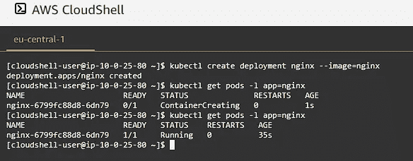**

****端口转发****

```
POD_NAME=$(kubectl get pods -l app=nginx -o jsonpath="{.items[0].metadata.name}")kubectl port-forward $POD_NAME 8080:80
```

**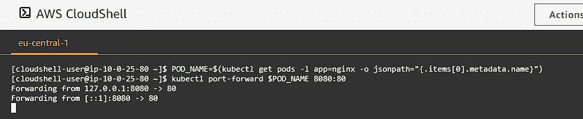**

**在新的终端窗口中，向端口转发端点执行 HTTP 请求:**

```
curl --head [http://127.0.0.1:8080](http://127.0.0.1:8080)
```

**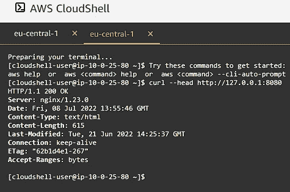**

****日志****

**打印 **nginx** pod 日志:**

```
kubectl logs $POD_NAME
```

**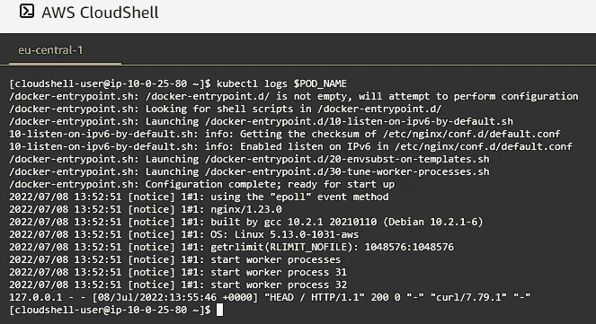**

****Exec****

**验证我们能够在容器中[执行命令:](https://kubernetes.io/docs/tasks/debug-application-cluster/get-shell-running-container/#running-individual-commands-in-a-container)**

```
kubectl exec -ti $POD_NAME -- nginx -v
```

**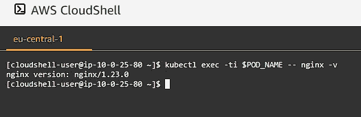**

****服务****

**使用 [**节点端口**](https://kubernetes.io/docs/concepts/services-networking/service/#type-nodeport) [**服务**](https://kubernetes.io/docs/concepts/services-networking/service/) **:** 公开 **nginx** 部署**

```
kubectl expose deployment nginx --port 80 --type NodePortNODE_PORT=$(kubectl get svc nginx \
  --output=jsonpath='{range .spec.ports[0]}{.nodePort}')
```

**创建允许远程访问 **nginx** 节点端口的防火墙规则:**

```
aws ec2 authorize-security-group-ingress \
  --group-id ${SECURITY_GROUP_ID} \
  --protocol tcp \
  --port ${NODE_PORT} \
  --cidr 0.0.0.0/0
```

**获取运行 **nginx** pod 的 worker 节点名称，并检索 worker 实例的外部 IP 地址，最后向外部 IP 地址和 **nginx** 节点端口发出 HTTP 请求:**

```
INSTANCE_NAME=$(kubectl get pod $POD_NAME --output=jsonpath='{.spec.nodeName}')EXTERNAL_IP=$(aws ec2 describe-instances --filters \
    "Name=instance-state-name,Values=running" \
    "Name=network-interface.private-dns-name,Values=${INSTANCE_NAME}.*.internal*" \
    --output text --query 'Reservations[].Instances[].PublicIpAddress')curl -I [http://${EXTERNAL_IP}:${NODE_PORT](http://${EXTERNAL_IP}:${NODE_PORT)}
```

**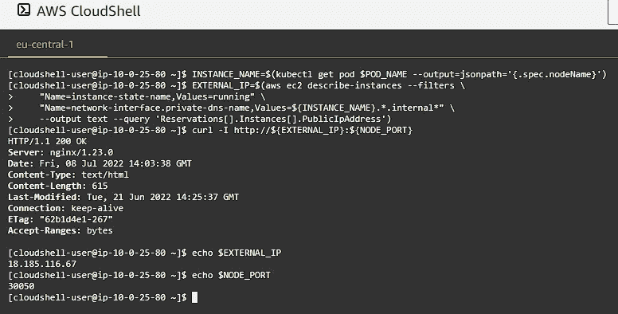**

****奖励:使用 kube-hunter 扫描漏洞****

**[**kube-hunter**](https://github.com/aquasecurity/kube-hunter) 搜寻 Kubernetes 集群中的安全弱点。开发该工具是为了提高 Kubernetes 环境中安全问题的意识和可见性。**

**将作业直接部署到集群中以扫描漏洞:**

```
cat <<EOF | kubectl apply --kubeconfig admin.kubeconfig -f -
apiVersion: batch/v1
kind: Job
metadata:
  name: kube-hunter
spec:
  template:
    metadata:
      labels:
        app: kube-hunter
    spec:
      containers:
        - name: kube-hunter
          image: aquasec/kube-hunter:0.6.8
          command: ["kube-hunter"]
          args: ["--pod"]
      restartPolicy: Never
EOF
```

**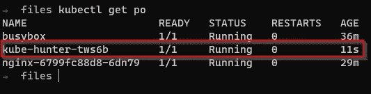**

```
kubectl logs --kubeconfig admin.kubeconfig kube-hunter-tws6b > logs.txtcat logs.txt2022-07-08 14:22:13,466 INFO kube_hunter.modules.report.collector Started hunting2022-07-08 14:22:13,471 INFO kube_hunter.modules.report.collector Discovering Open Kubernetes Services2022-07-08 14:22:13,478 INFO kube_hunter.modules.report.collector Found vulnerability "CAP_NET_RAW Enabled" in Local to Pod (kube-hunter-tws6b)2022-07-08 14:22:13,478 INFO kube_hunter.modules.report.collector Found vulnerability "Read access to pod's service account token" in Local to Pod (kube-hunter-tws6b)2022-07-08 14:22:13,479 INFO kube_hunter.modules.report.collector Found vulnerability "Access to pod's secrets" in Local to Pod (kube-hunter-tws6b)2022-07-08 14:22:13,515 INFO kube_hunter.modules.report.collector Found vulnerability "AWS Metadata Exposure" in Local to Pod (kube-hunter-tws6b)2022-07-08 14:22:13,678 INFO kube_hunter.modules.report.collector Found open service "Kubelet API" at 10.0.1.20:102502022-07-08 14:22:13,691 INFO kube_hunter.modules.report.collector Found open service "Kubelet API" at 10.0.1.21:102502022-07-08 14:22:13,694 INFO kube_hunter.modules.report.collector Found open service "Etcd" at 10.0.1.10:23792022-07-08 14:22:13,695 INFO kube_hunter.modules.report.collector Found open service "Kubelet API" at 10.0.1.22:102502022-07-08 14:22:13,750 INFO kube_hunter.modules.report.collector Found open service "Etcd" at 10.0.1.12:23792022-07-08 14:22:13,754 INFO kube_hunter.modules.report.collector Found open service "Etcd" at 10.0.1.11:23792022-07-08 14:22:13,817 INFO kube_hunter.modules.report.collector Found open service "Kubelet API" at 10.200.2.1:102502022-07-08 14:22:13,821 INFO kube_hunter.modules.report.collector Found open service "Metrics Server" at 10.0.1.10:64432022-07-08 14:22:13,825 INFO kube_hunter.modules.report.collector Found open service "Metrics Server" at 10.0.1.12:64432022-07-08 14:22:13,857 INFO kube_hunter.modules.report.collector Found open service "Metrics Server" at 10.0.1.11:64432022-07-08 14:22:21,218 INFO kube_hunter.modules.report.collector Found open service "Metrics Server" at 10.0.1.72:4432022-07-08 14:22:21,406 INFO kube_hunter.modules.report.collector Found open service "API Server" at 10.32.0.1:4432022-07-08 14:22:21,418 INFO kube_hunter.modules.report.collector Found vulnerability "K8s Version Disclosure" in 10.32.0.1:4432022-07-08 14:22:21,424 INFO kube_hunter.modules.report.collector Found vulnerability "Access to API using service account token" in 10.32.0.1:443Nodes+-------------+------------+| TYPE        | LOCATION   |+-------------+------------+| Node/Master | 10.200.2.1 |+-------------+------------+| Node/Master | 10.32.0.1  |+-------------+------------+| Node/Master | 10.0.1.72  |+-------------+------------+| Node/Master | 10.0.1.22  |+-------------+------------+| Node/Master | 10.0.1.21  |+-------------+------------+| Node/Master | 10.0.1.20  |+-------------+------------+| Node/Master | 10.0.1.12  |+-------------+------------+| Node/Master | 10.0.1.11  |+-------------+------------+| Node/Master | 10.0.1.10  |+-------------+------------+Detected Services+----------------+------------------+----------------------+| SERVICE        | LOCATION         | DESCRIPTION          |+----------------+------------------+----------------------+| Metrics Server | 10.0.1.72:443    | The Metrics server   ||                |                  | is in charge of      ||                |                  | providing resource   ||                |                  | usage metrics for    ||                |                  | pods and nodes to    ||                |                  | the API server       |+----------------+------------------+----------------------+| Metrics Server | 10.0.1.12:6443   | The Metrics server   ||                |                  | is in charge of      ||                |                  | providing resource   ||                |                  | usage metrics for    ||                |                  | pods and nodes to    ||                |                  | the API server       |+----------------+------------------+----------------------+| Metrics Server | 10.0.1.11:6443   | The Metrics server   ||                |                  | is in charge of      ||                |                  | providing resource   ||                |                  | usage metrics for    ||                |                  | pods and nodes to    ||                |                  | the API server       |+----------------+------------------+----------------------+| Metrics Server | 10.0.1.10:6443   | The Metrics server   ||                |                  | is in charge of      ||                |                  | providing resource   ||                |                  | usage metrics for    ||                |                  | pods and nodes to    ||                |                  | the API server       |+----------------+------------------+----------------------+| Kubelet API    | 10.200.2.1:10250 | The Kubelet is the   ||                |                  | main component in    ||                |                  | every Node, all pod  ||                |                  | operations goes      ||                |                  | through the kubelet  |+----------------+------------------+----------------------+| Kubelet API    | 10.0.1.22:10250  | The Kubelet is the   ||                |                  | main component in    ||                |                  | every Node, all pod  ||                |                  | operations goes      ||                |                  | through the kubelet  |+----------------+------------------+----------------------+| Kubelet API    | 10.0.1.21:10250  | The Kubelet is the   ||                |                  | main component in    ||                |                  | every Node, all pod  ||                |                  | operations goes      ||                |                  | through the kubelet  |+----------------+------------------+----------------------+| Kubelet API    | 10.0.1.20:10250  | The Kubelet is the   ||                |                  | main component in    ||                |                  | every Node, all pod  ||                |                  | operations goes      ||                |                  | through the kubelet  |+----------------+------------------+----------------------+| Etcd           | 10.0.1.12:2379   | Etcd is a DB that    ||                |                  | stores cluster's     ||                |                  | data, it contains    ||                |                  | configuration and    ||                |                  | current              ||                |                  |     state            ||                |                  | information, and     ||                |                  | might contain        ||                |                  | secrets              |+----------------+------------------+----------------------+| Etcd           | 10.0.1.11:2379   | Etcd is a DB that    ||                |                  | stores cluster's     ||                |                  | data, it contains    ||                |                  | configuration and    ||                |                  | current              ||                |                  |     state            ||                |                  | information, and     ||                |                  | might contain        ||                |                  | secrets              |+----------------+------------------+----------------------+| Etcd           | 10.0.1.10:2379   | Etcd is a DB that    ||                |                  | stores cluster's     ||                |                  | data, it contains    ||                |                  | configuration and    ||                |                  | current              ||                |                  |     state            ||                |                  | information, and     ||                |                  | might contain        ||                |                  | secrets              |+----------------+------------------+----------------------+| API Server     | 10.32.0.1:443    | The API server is in ||                |                  | charge of all        ||                |                  | operations on the    ||                |                  | cluster.             |+----------------+------------------+----------------------+VulnerabilitiesFor further information about a vulnerability, search its ID in:https://avd.aquasec.com/+--------+----------------------+----------------------+----------------------+----------------------+----------------------+| ID     | LOCATION             | MITRE CATEGORY       | VULNERABILITY        | DESCRIPTION          | EVIDENCE             |+--------+----------------------+----------------------+----------------------+----------------------+----------------------+| None   | Local to Pod (kube-  | Lateral Movement //  | CAP_NET_RAW Enabled  | CAP_NET_RAW is       |                      ||        | hunter-tws6b)        | ARP poisoning and IP |                      | enabled by default   |                      ||        |                      | spoofing             |                      | for pods.            |                      ||        |                      |                      |                      |     If an attacker   |                      ||        |                      |                      |                      | manages to           |                      ||        |                      |                      |                      | compromise a pod,    |                      ||        |                      |                      |                      |     they could       |                      ||        |                      |                      |                      | potentially take     |                      ||        |                      |                      |                      | advantage of this    |                      ||        |                      |                      |                      | capability to        |                      ||        |                      |                      |                      | perform network      |                      ||        |                      |                      |                      |     attacks on other |                      ||        |                      |                      |                      | pods running on the  |                      ||        |                      |                      |                      | same node            |                      |+--------+----------------------+----------------------+----------------------+----------------------+----------------------+| KHV002 | 10.32.0.1:443        | Initial Access //    | K8s Version          | The kubernetes       | v1.21.0              ||        |                      | Exposed sensitive    | Disclosure           | version could be     |                      ||        |                      | interfaces           |                      | obtained from the    |                      ||        |                      |                      |                      | /version endpoint    |                      |+--------+----------------------+----------------------+----------------------+----------------------+----------------------+| KHV053 | Local to Pod (kube-  | Discovery //         | AWS Metadata         | Access to the AWS    | cidr: 10.0.1.0/24    ||        | hunter-tws6b)        | Instance Metadata    | Exposure             | Metadata API exposes |                      ||        |                      | API                  |                      | information about    |                      ||        |                      |                      |                      | the machines         |                      ||        |                      |                      |                      | associated with the  |                      ||        |                      |                      |                      | cluster              |                      |+--------+----------------------+----------------------+----------------------+----------------------+----------------------+| KHV005 | 10.32.0.1:443        | Discovery // Access  | Access to API using  | The API Server port  | b'{"kind":"APIVersio ||        |                      | the K8S API Server   | service account      | is accessible.       | ns","versions":["v1" ||        |                      |                      | token                |     Depending on     | ],"serverAddressByCl ||        |                      |                      |                      | your RBAC settings   | ientCIDRs":[{"client ||        |                      |                      |                      | this could expose    | CIDR":"0.0.0.0/0","s ||        |                      |                      |                      | access to or control | ...                  ||        |                      |                      |                      | of your cluster.     |                      |+--------+----------------------+----------------------+----------------------+----------------------+----------------------+| None   | Local to Pod (kube-  | Credential Access // | Access to pod's      | Accessing the pod's  | ['/var/run/secrets/k ||        | hunter-tws6b)        | Access container     | secrets              | secrets within a     | ubernetes.io/service ||        |                      | service account      |                      | compromised pod      | account/namespace',  ||        |                      |                      |                      | might disclose       | '/var/run/secrets/ku ||        |                      |                      |                      | valuable data to a   | bernetes.io/servicea ||        |                      |                      |                      | potential attacker   | ...                  |+--------+----------------------+----------------------+----------------------+----------------------+----------------------+| KHV050 | Local to Pod (kube-  | Credential Access // | Read access to pod's | Accessing the pod    | eyJhbGciOiJSUzI1NiIs ||        | hunter-tws6b)        | Access container     | service account      | service account      | ImtpZCI6IjItYnpCa1pK ||        |                      | service account      | token                | token gives an       | aE1pTVpXZE1qSkhnRDA5 ||        |                      |                      |                      | attacker the option  | YmdMZ3BLdmNxejV4VVYw ||        |                      |                      |                      | to use the server    | OW12LVEifQ.eyJhdWQiO ||        |                      |                      |                      | API                  | ...                  |+--------+----------------------+----------------------+----------------------+----------------------+----------------------+
```

**从上面的日志输出中，您可以看到关于漏洞的大量信息，以及一些潜在的解决步骤。您可以使用这个输出开始修补您的 Kubernetes 集群，以确保获得您所需要的最高安全性。**

## **清理**

**确保你删除了我们创建的所有资源，否则它会产生运行成本。**

**删除所有**工作者**实例，然后删除**控制器**实例，同时删除我们的**密钥对**:**

```
echo "Issuing shutdown to worker nodes.. " && \
aws ec2 terminate-instances \
  --instance-ids \
    $(aws ec2 describe-instances --filters \
      "Name=tag:Name,Values=worker-0,worker-1,worker-2" \
      "Name=instance-state-name,Values=running" \
      --output text --query 'Reservations[].Instances[].InstanceId')echo "Waiting for worker nodes to finish terminating.. " && \
aws ec2 wait instance-terminated \
  --instance-ids \
    $(aws ec2 describe-instances \
      --filter "Name=tag:Name,Values=worker-0,worker-1,worker-2" \
      --output text --query 'Reservations[].Instances[].InstanceId')echo "Issuing shutdown to master nodes.. " && \
aws ec2 terminate-instances \
  --instance-ids \
    $(aws ec2 describe-instances --filter \
      "Name=tag:Name,Values=controller-0,controller-1,controller-2" \
      "Name=instance-state-name,Values=running" \
      --output text --query 'Reservations[].Instances[].InstanceId')echo "Waiting for master nodes to finish terminating.. " && \
aws ec2 wait instance-terminated \
  --instance-ids \
    $(aws ec2 describe-instances \
      --filter "Name=tag:Name,Values=controller-0,controller-1,controller-2" \
      --output text --query 'Reservations[].Instances[].InstanceId')aws ec2 delete-key-pair --key-name kubernetes
```

**删除外部负载平衡器和网络资源(如果您丢失了任何环境变量的值，则可以使用 AWS 命令来查找它们，或者可以通过查看 AWS 控制台中的资源来手动设置它们):**

```
aws elbv2 delete-load-balancer --load-balancer-arn "${LOAD_BALANCER_ARN}"aws elbv2 delete-target-group --target-group-arn "${TARGET_GROUP_ARN}"aws ec2 delete-security-group --group-id "${SECURITY_GROUP_ID}"ROUTE_TABLE_ASSOCIATION_ID="$(aws ec2 describe-route-tables \
  --route-table-ids "${ROUTE_TABLE_ID}" \
  --output text --query 'RouteTables[].Associations[].RouteTableAssociationId')"aws ec2 disassociate-route-table --association-id "${ROUTE_TABLE_ASSOCIATION_ID}"aws ec2 delete-route-table --route-table-id "${ROUTE_TABLE_ID}"
echo "Waiting a minute for all public address(es) to be unmapped.. " && sleep 60aws ec2 detach-internet-gateway \
  --internet-gateway-id "${INTERNET_GATEWAY_ID}" \
  --vpc-id "${VPC_ID}"aws ec2 delete-internet-gateway --internet-gateway-id "${INTERNET_GATEWAY_ID}"aws ec2 delete-subnet --subnet-id "${SUBNET_ID}"aws ec2 delete-vpc --vpc-id "${VPC_ID}"
```

****我必须强调这一点，仔细查看您的 AWS 控制台资源，确保您已经删除了我们在本指南中提供的所有内容。你不想一年后回来时还在想为什么你的信用卡余额会受损！！！****