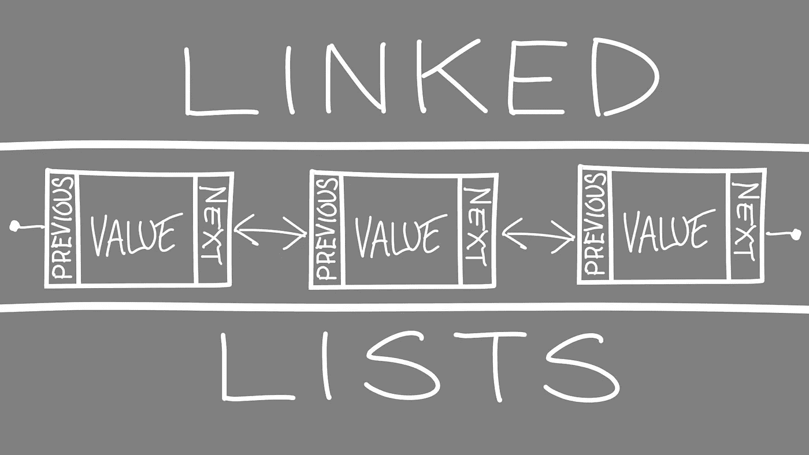
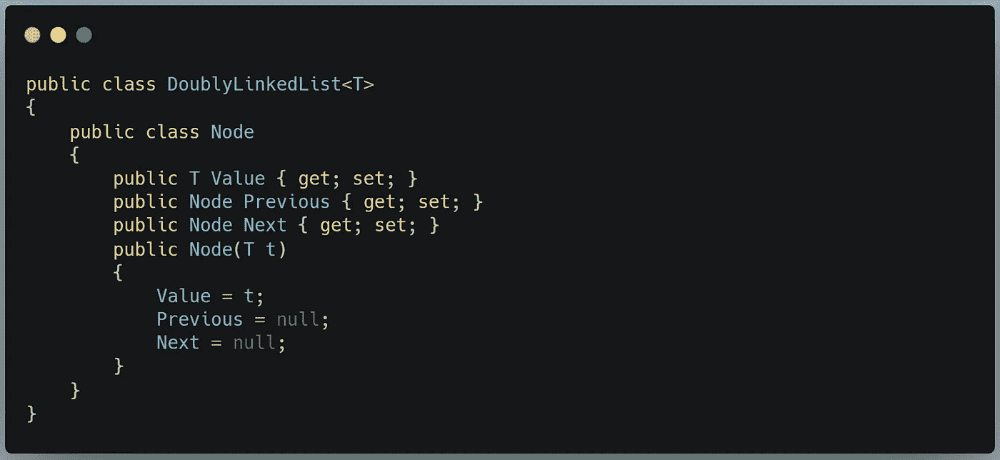
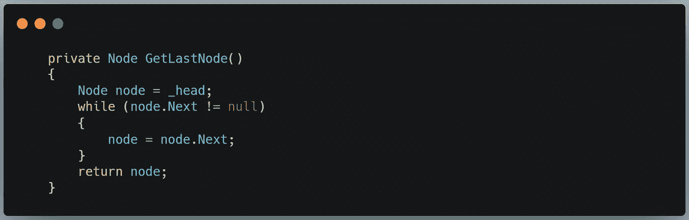
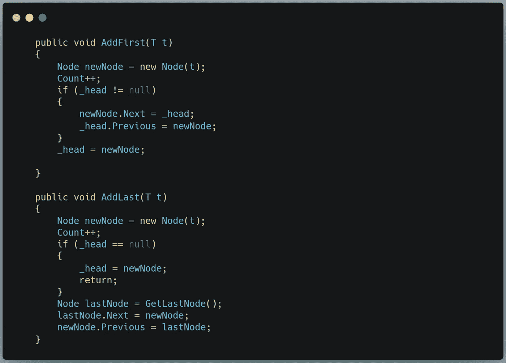
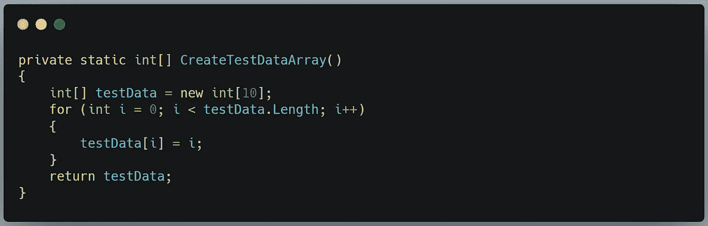
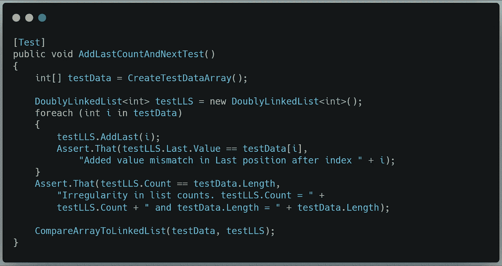
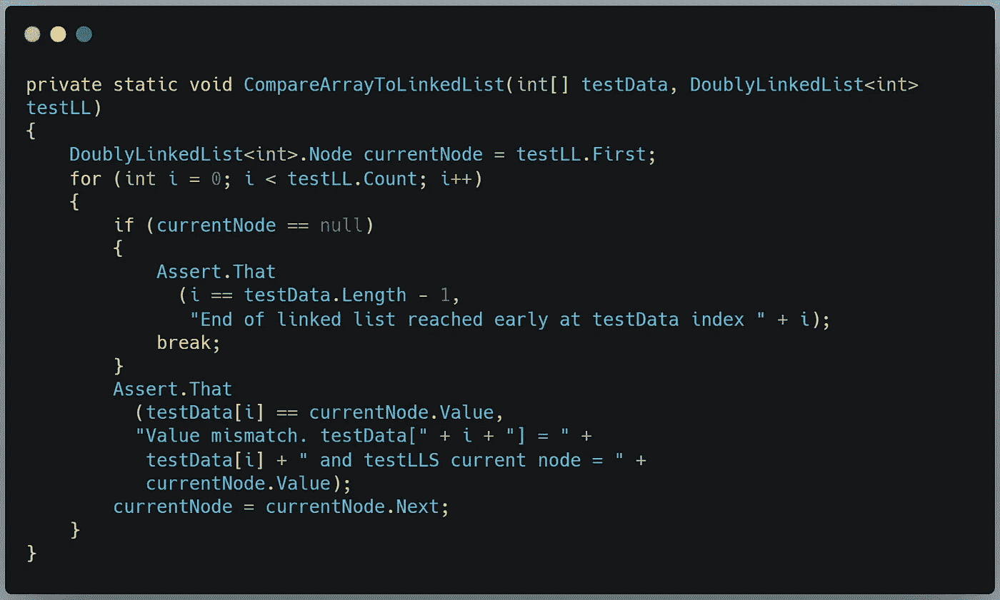
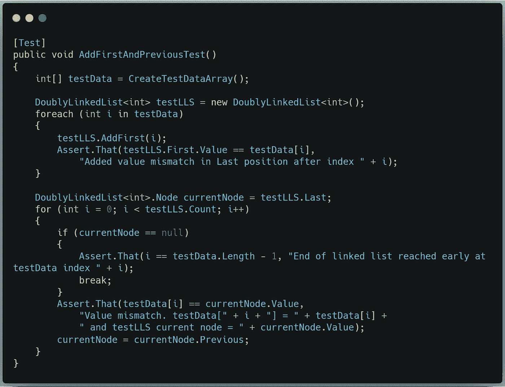
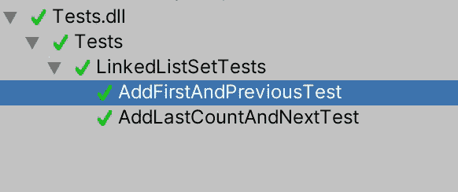

# 在 C#中从头开始构建一个链表系统，第 1 部分

> 原文：<https://medium.com/geekculture/building-a-linked-list-system-from-scratch-in-c-part-1-51aa6c68ea19?source=collection_archive---------5----------------------->

## 练习变戏法变量引用的有趣练习

我过去曾经写过关于链表的[用处。今天，我想通过创建我自己的链表功能实现来深入了解链表是如何工作的。](/geekculture/roll-initiative-part-2-d7ab2d82ef27)

注意:链表[已经在 C#中实现](https://docs.microsoft.com/en-us/dotnet/api/system.collections.generic.linkedlist-1?view=net-5.0)。本练习将复制该功能，但是您完全没有必要为您的工作实现您自己的版本。我这样做是为了理解一些特性是如何工作的，是为了教育目的，而不是为了实用目的。

## 什么是链表？

标题图像给出了链表如何操作的要点。链表不是简单的值列表，而是维护对其他值的引用。这形成了价值之间的“链接”链。上图代表了一个“双向链表”，因为每个值节点都引用了它之前和之后的节点，使得双向遍历变得简单。单向链表(只指向链中的下一个节点)和循环链表(最后一个节点指向第一个节点，形成一个圈)是另外两种链表。

由于引用链，很容易在列表中间插入或删除值，而不会增加复杂性。对传统链表的类似操作需要遍历整个链表，但是使用链表，我们不需要任何迭代就可以得到相同的结果。

## 双向链表

在接下来的几篇文章中，我们将创建一个双链接列表<t>类。目标是对 C#的 *LinkedList < T > ()* 类的每个公共方法和属性进行逆向工程。即:</t>

*   *第一个*和*最后一个*属性分别指向链的两端。
*   *Count* 属性引用链中的链接数。
*   *AddFirst(T t)* 和 *AddLast(T t)* 方法，在链的两端添加新的节点。
*   *AddBefore(Node node)* 和 *AddAfter(Node node)* 方法，在链的两端之间的某处添加节点。
*   *Remove(Node node)* 、 *RemoveFirst()* 和 *RemoveLast()* 方法，这些方法使对链中特定节点的引用无效，并在必要时封闭链中的间隙。
*   *Contains(T t)* bool 返回方法，用于查找某个值是否存在于链中。
*   *Find(T t)* 和 *FindLast(T t)* 从链的任意一端进行搜索的方法。
*   *CopyTo(T[] array，int index)* 方法将每个节点的值复制到一个数组中的特定索引处。

## 节点类

我们从*节点*类开始。这个类定义了链表中元素的必要属性，并提供了创建新节点的构造函数。

这个类放在*double linked list<T>类中，以便于引用。构造函数接受一个表示节点预期值的参数。相邻节点引用属性(*上一个*和*下一个*)以 null 开始。*

## double linked list<t>类</t>

既然我们已经定义了节点，我们可以在*doublelinkedlist<T>*类本身中创建一些属性和字段。

这里我们首先定义列表的前面是一个名为 *_head 的节点变量。**第一个*属性自然需要指向这个字段。找到最后一个节点需要一些逻辑，我们将在下一节讨论(现在，我们可以容忍一些红色的曲线)。

然后，该类中的*下一个*和*上一个*属性被设置为指向头节点的*下一个*和*上一个*属性。

最后，我们定义一个 *_count* 字段，其对应的属性包含将计数限制在 0 以上的逻辑。我们只希望这个类实例设置它的计数值，所以我们将 setter 设置为私有。

## **GetLastNode()方法**

为了让*最后的*属性工作，让我们从 *GetLastNode()* 方法开始。

这里我们简单地从 _head 开始，一次向前移动一个节点，直到下一个节点为空(意味着链中不再有节点)。一旦我们有了它，我们就返回节点。轻松点。

## **add first(T T)和 AddLast(T t)方法**

现在，我们实际创建一些节点怎么样？

要添加一个节点，我们将方法的参数传递到*节点*构造函数中，并增加*计数*属性。

如果这个节点是新的头，我们首先检查当前头是否为空。如果不是，我们将新节点的*下一个*属性指向头节点，头节点的*上一个*属性指向新节点。最后，不管头部是否为空，我们都将新节点作为头部。

如果这个节点是新的尾部，我们首先检查头部是否为空——如果是，那么列表是空的，我们只需要将新节点指定为头部。否则，我们需要运行 *GetLastNode()* 方法。一旦我们有了最后一个节点，我们可以将新节点分配给最后一个节点的 *Next* 属性，然后将最后一个节点分配给新节点的 *Previous* 属性。这实际上使新节点成为最后一个节点。

## 测试到目前为止的类

我们现在有足够的基本功能来运行一些单元测试，并确保一切正常。如果你需要知道如何在 Unity 中设置单元测试，一定要看看我的文章。

因为我知道我将测试所有的双向链表方法，所以我将从创建一个助手方法来构建测试数据开始。该方法将创建一个由 10 个整数组成的数组，取值范围为 0-9。

对于第一个测试方法，我们将测试 *AddLast(T t)* 、 *Count、*和 *Next* ，因为它们在创建新列表时都会用到。我将创建一些测试数据，然后尝试 *AddLast(T t)* 直到数组中的所有数据都在链表中。

在这个过程中，我们将检查增加的价值是否与期望值相匹配。我们还将比较 Count 属性和数组的长度，以确保我们在添加节点时正确地跟踪它们。

最后，我们将再调用一个 helper 方法来比较测试数据数组和测试列表。我们将在未来的测试中使用这种方法。

当我们遍历索引时，我们将检查是否在数组结束前到达了一个意外的空节点。如果一切顺利，我们将比较当前索引和当前节点的测试数据。如果它们匹配，我们移动到下一个节点并迭代索引。否则 *Assert()* 方法会告诉我们哪里的数据不匹配。

我们还将制作一个类似的测试方法来检查 *AddFirst(T t)* 类和 *Previous* 属性是否工作。

我们再次构建测试数据，并使用它来填充一个列表。我们这样做是为了确保数据符合我们的预期。我们不需要使用前面创建的向前推进助手，而是需要向后推进这个列表来确认数据匹配。当我们遍历索引时，我们确保列表也在快速遍历。最后，我们确认节点的值匹配数组的相应索引，并且 *Previous* 属性按预期工作。

现在，让我们看看这些测试结果如何:

Hooray!

这是第一部分。在下一篇文章中，我们将处理 *AddBefore(Node node)、AddAfter(Node node)* 和我们的三个搜索方法: *Contains(T t)、Find(T t)、*和 *FindLast(T t)。*