# 在 C#中从头开始构建一个链表系统，第 2 部分

> 原文：<https://medium.com/geekculture/building-a-linked-list-system-from-scratch-in-c-part-2-a5eaf83cf9cc?source=collection_archive---------20----------------------->

## 在链中间插入值并查找特定值

=[[Value]]==[[Value]]==[[Value]]==[[Value]]==[[Value]]=

上一次我们讨论了建立一个双向链表类的基础:也就是说，创建引用前一个或后一个节点的数据节点以形成一个序列的能力。现在，我们可以用我们的 *AddFirst(T t)* 和 *AddLast(T t)* 方法添加到链的任何一端。今天，我们将基于某个参考点将数据插入到链的中间。

快速提醒两件事。首先:我正在用 Unity 开发和测试这个系统。如果您在不同的开发环境中工作，您可能需要调整错误处理和测试运行的方式。第二:这个功能在 C#中已经存在。我们对它进行逆向工程是为了教育目的，而不是实用目的。

## *AddBefore* 和 AddAfter 方法

接下来的部分可能会有点令人眼花缭乱。我们将在不同的组合中使用“下一个”和“上一个”这两个词，到最后会变得难以追踪。请记住，要在链中间添加一个节点，需要更改四个值(两个下一个和两个上一个)。在下面的图表中，我在每一步都添加了一个新的箭头来显示变量是如何被赋值的——希望这能有所帮助。

我们先从 *AddAfter(Node node，T t)* 开始。要在指定节点后添加节点，我们必须执行以下操作:

*   Null 检查指定的节点，如果为 null，则返回错误。我们不能用空引用做任何事情。

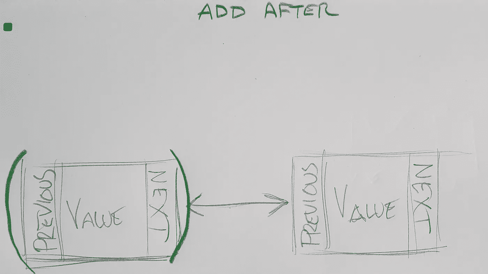

Today you get paper diagrams instead of digital diagrams because I’m away from my drawing tablet.

*   创建一个*节点(T t)* 类的新实例，并增加列表的*计数*属性。

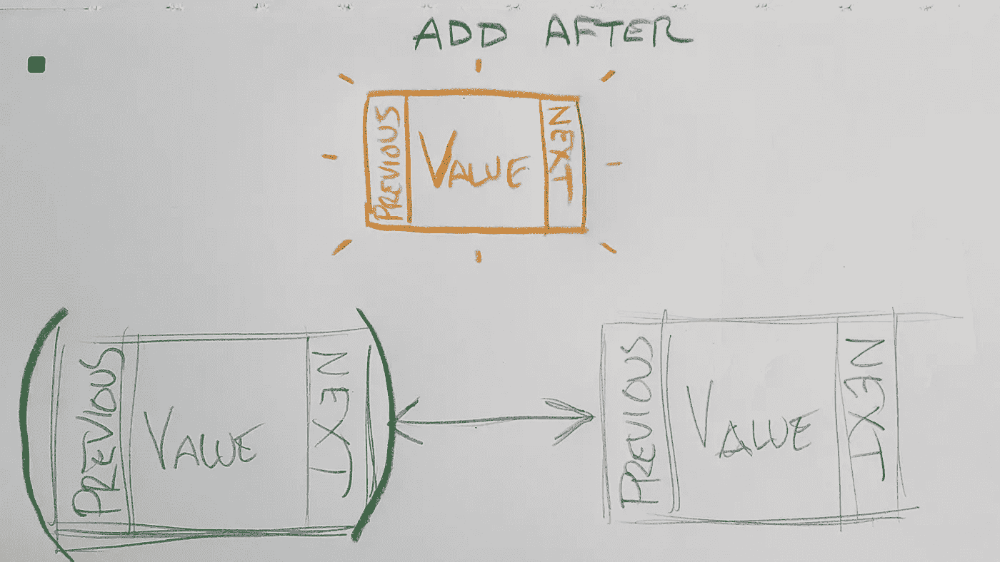

A new node appears!

*   将新节点的*下一个*属性设置为指定节点的*下一个*属性所引用的节点。

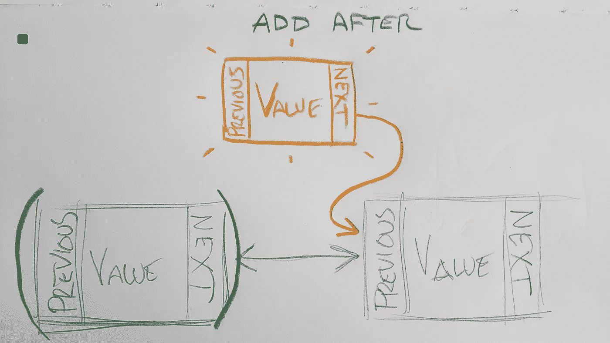

*   将指定节点的*下一个*属性设置为新节点。

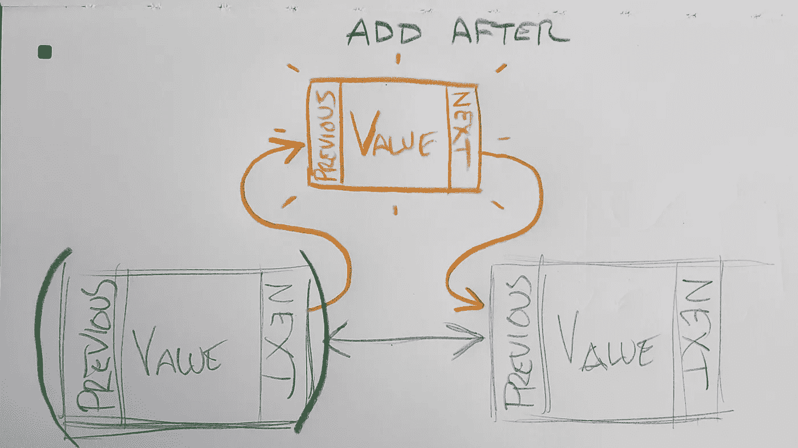

*   将新节点的 *Previous* 属性设置为指定节点。

*   如果新节点的 new *Next* 属性不为空(意味着我们不只是添加了一个尾节点)，我们将新节点的 *Next* 属性所引用的节点的 *Previous* 属性设置为新节点。

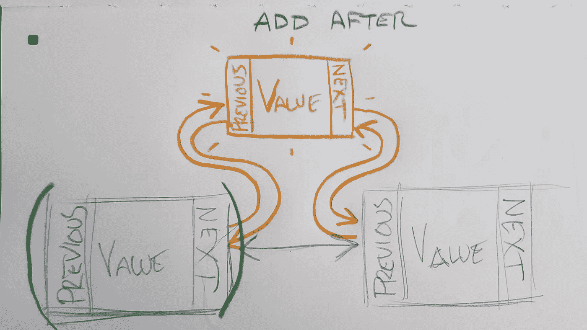

所有这些引用杂耍应该导致新节点现在正好位于链中的指定节点之后，完全连接到它的新邻居。如果我们改为尝试 *AddBefore(Node node，T t)* ，我们将在最后四个步骤中反转属性:

*   将新节点的*上一个*属性设置为指定节点的*上一个*属性所引用的节点。
*   将指定节点的*先前的*属性设置为新节点。
*   将新节点的 *Next* 属性设置为指定节点。
*   如果新节点的 new *Previous* 属性不为空(意味着我们不只是添加了一个头节点),我们将新节点的 *Previous* 属性所引用的节点的 *Next* 属性设置为新节点。否则，我们将新节点赋给变量 *_head* 。

在代码中，这些方法如下所示:

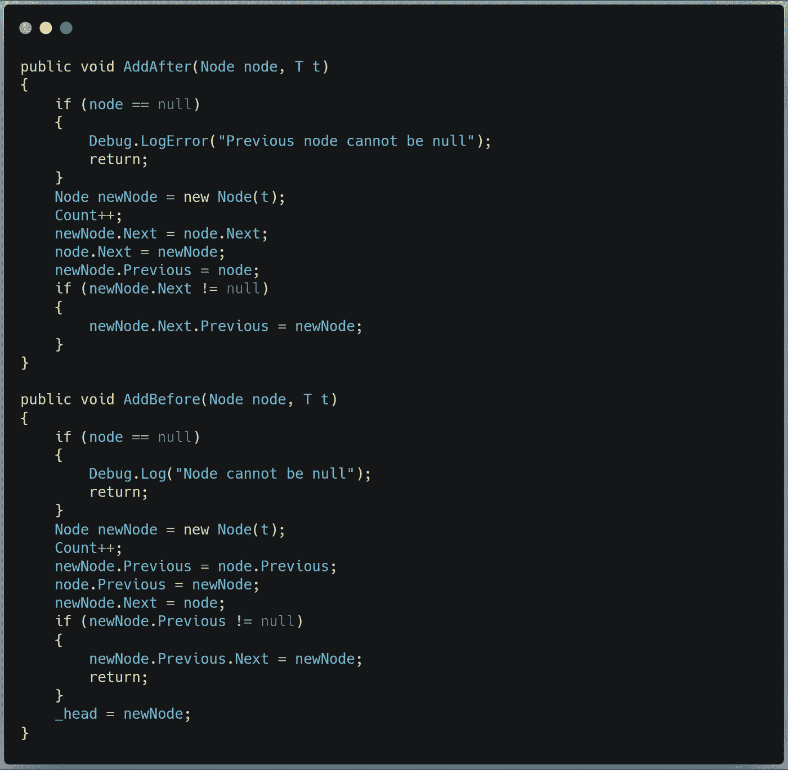

I know “newNode.Next.Previous” is cumbersome. If you have an easier way to reference this, drop a comment!

## Contains、Find 和 FindLast 方法

下一步是构建一些允许我们查询列表内容的方法。这些方法的工作原理是一样的，但是结果略有不同。

*Contains(T t)* 是一个 bool 返回方法。它从第一个节点开始，然后遍历每个节点，直到到达链的末尾。每走一步，它都会检查节点的值是否等于方法调用中提供的参数。如果是，则返回 true。否则为假。

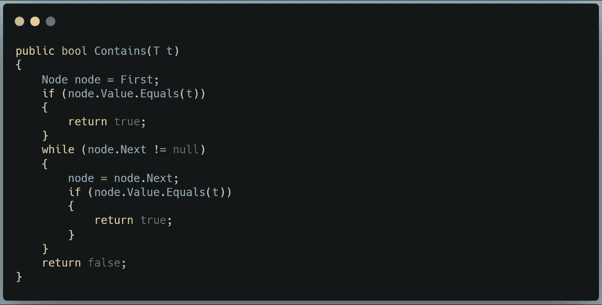

*Find(T t)* 是一个*节点*对象的返回方法。它与 Contains 具有完全相同的代码，除了当它找到匹配值时，它返回包含该值的节点。这只会找到给定值的第一个实例；连续的重复实例将被忽略。

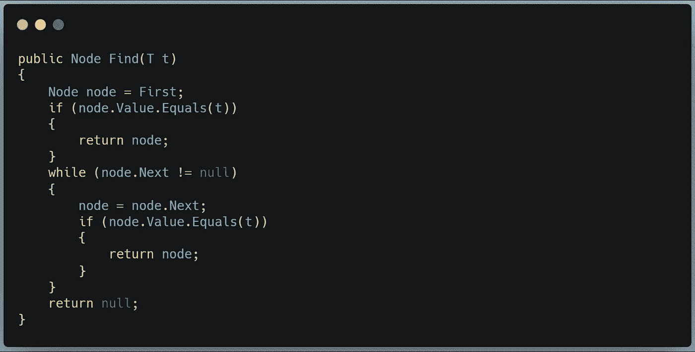

*FindLast(T t)* 是一个*节点*对象返回方法。它从最后一个节点开始搜索，然后在链中后退，直到找到一个具有匹配值的节点，并返回该值。这只会找到给定值的最后一个实例；前面的重复实例将被忽略。

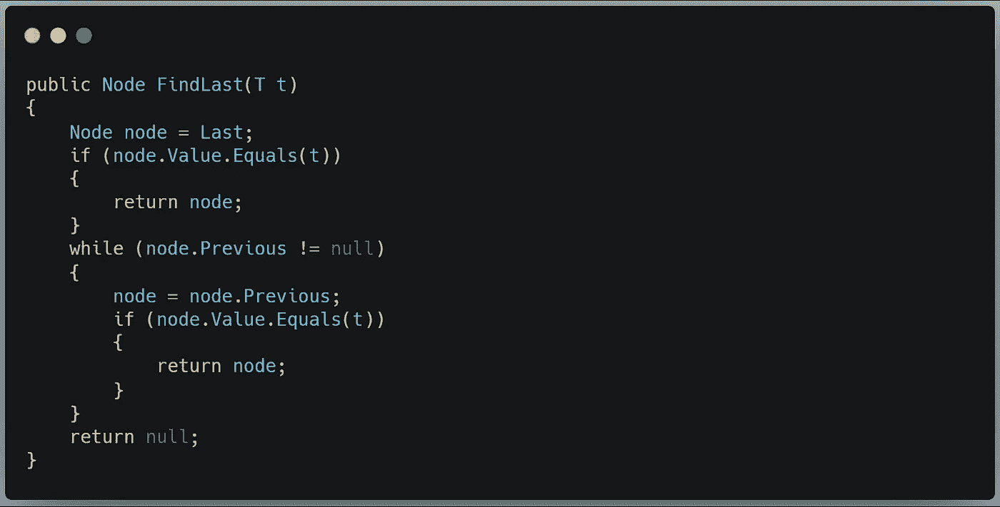

## **测试新方法**

在我们测试 *AddBefore* 和 *AddAfter* 方法之前，我们需要确保搜索方法有效。

为了测试*包含(T t)* ，我们将创建一个包含数字 0-9 的测试数据数组，并搜索三个值:第一个值、最后一个值和一个不在列表中的值(以防万一)。

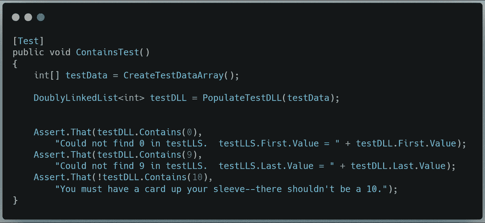

对 *Find(T t)* 的测试将需要一个唯一的测试数据数组，这样我们可以确保找到多个匹配结果的第一个实例。首先，我们将确保找到任何有效的数字。然后，为了确保我们找到了正确的值，我们将把找到的节点中的值与链中下一个节点中的值进行比较。在这种情况下，应该是 5。我们还将确保我们不能找到一个不在数组中的值(以防万一)。

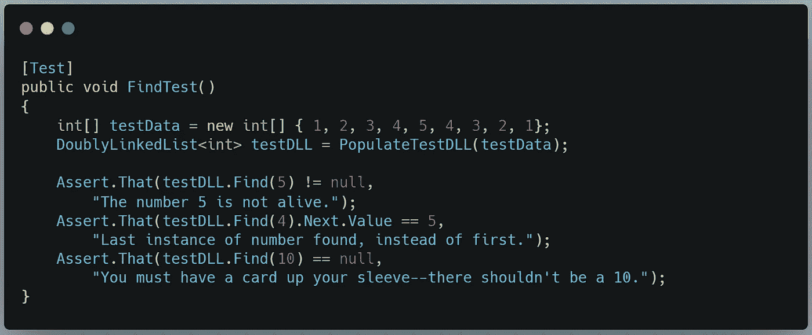

并且对于 *FindLast(T t)* 我们简单地颠倒搜索词。

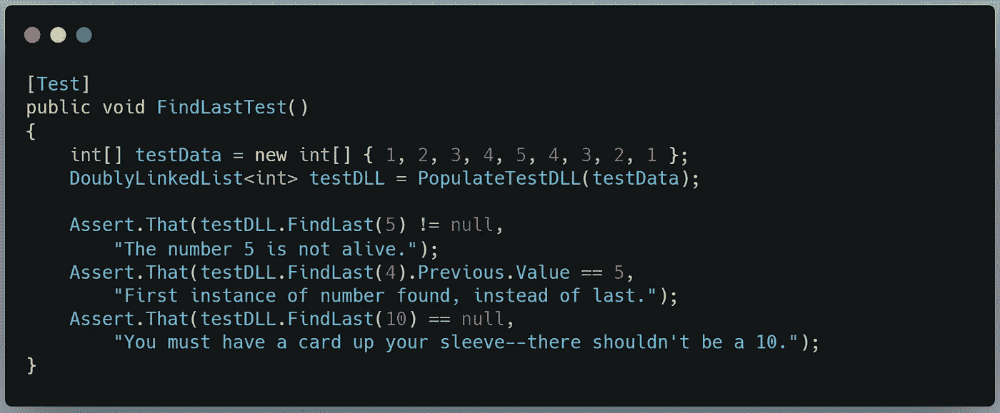

让我们确认这些操作是否符合预期:

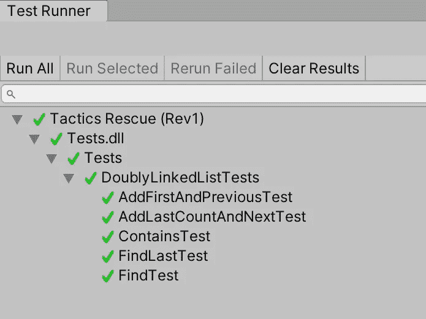

太棒了！

现在，对于 *AddBefore* 我们希望检查我们是否可以 *AddBefore* 第一个节点，它将替换 *_head* ，然后我们将检查我们是否可以在最后一个节点之前添加一个节点，我们将在中间找到一个节点，并检查我们是否也可以在那里插入。

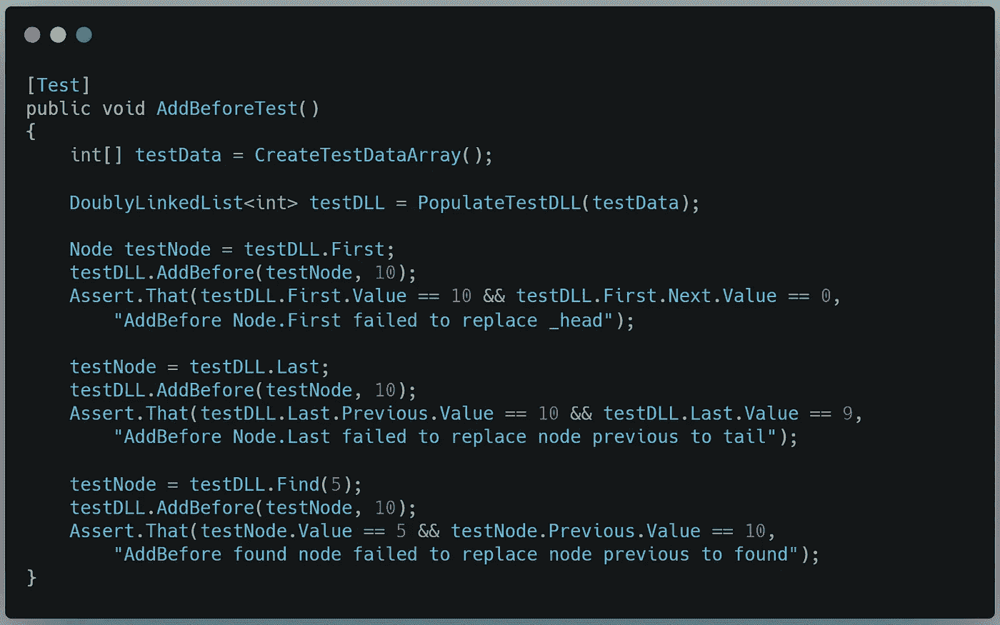

NOW there’s a 10 in there.

最后，让我们对 *AddAfter* 进行类似的确认:

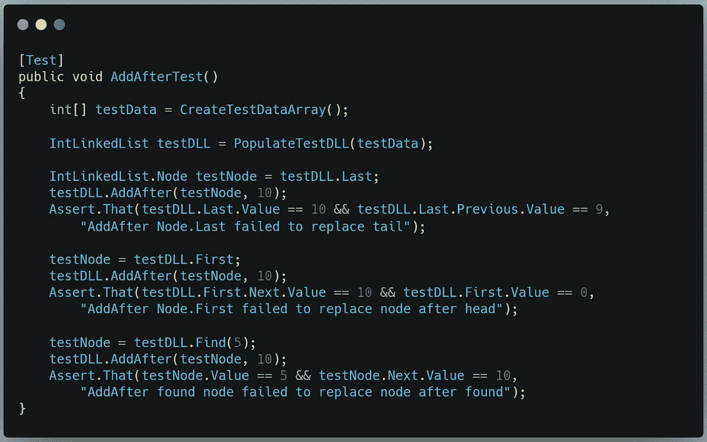

结果呢？

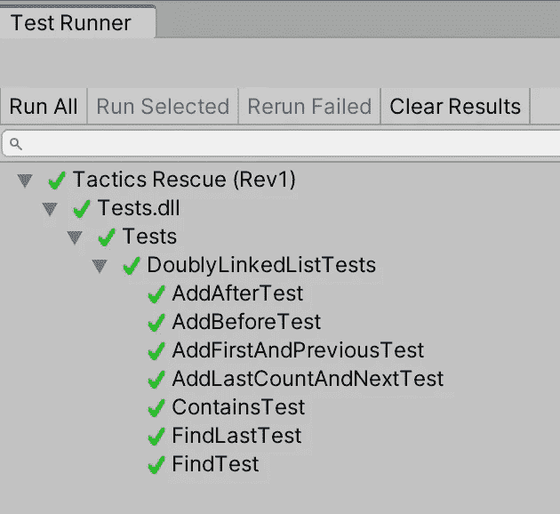

我们做到了！

这就完成了我们今天的目标。在第三部分中，我们将讨论从列表中删除值，并且我们将考虑一些微软认为不适合包含在实现中的额外特性。