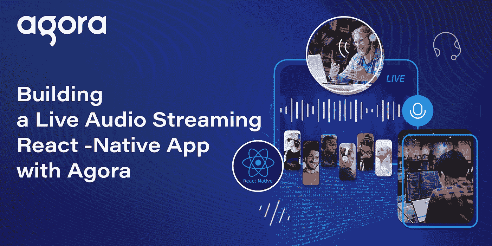
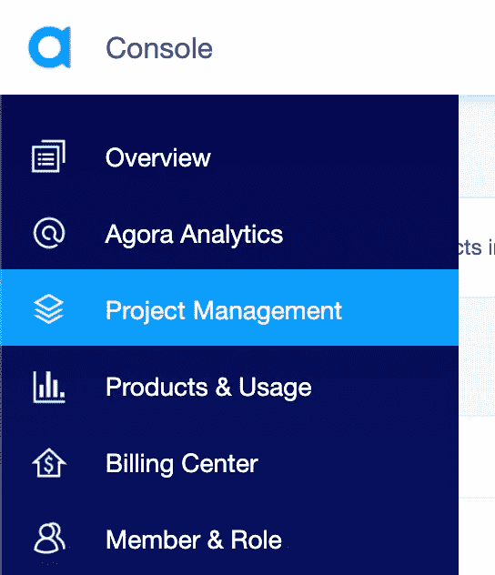

# 使用 Agora 构建实时音频流 React 本地应用程序

> 原文：<https://medium.com/geekculture/building-a-live-audio-streaming-react-native-app-with-agora-acff6e7fd68f?source=collection_archive---------7----------------------->



从直播播客和采访到现场音乐表演，直播音频流在各种用途中越来越受欢迎。一旦有几个用户与观众实时互动，可能性是无穷无尽的。

使用 Agora React Native SDK 有一种简单的方法来实现实时音频流。在本教程中，我们将通过利用 Agora Audio SDK 构建一个直播音频广播应用程序，该应用程序可以拥有多个广播公司并托管数千个用户。在深入研究代码之前，我们将检查应用程序的结构、设置和执行。这里有开源代码:[https://github.com/EkaanshArora/Agora-RN-Audio-Broadcast](https://github.com/EkaanshArora/Agora-RN-Audio-Broadcast)

我们将使用[Agora RTC SDK for React Native](https://www.npmjs.com/package/react-native-agora/)作为示例。我在写的时候用的是 v3.2.2。

# 创建 Agora 帐户

[注册](https://sso.agora.io/en/signup?utm_source=medium&utm_medium=blog&utm_campaign=building-a-live-audio-streaming-react-native-app-with-agora)账户并登录仪表板。



Selecting the Project Management tab in the Agora.io Console.

导航到“项目管理”选项卡下的“项目列表”选项卡，并通过单击蓝色的“创建”按钮创建一个项目。

创建一个项目并检索应用程序 ID。(当系统提示使用应用 ID +证书时，请仅选择应用 ID。)在您开发应用程序时，应用程序 ID 将用于授权您的请求，而不会生成令牌。

**注意**:本指南不实施令牌认证，建议在生产环境中运行的所有 RTE 应用程序都使用令牌认证。有关 Agora 平台内基于令牌的身份验证的更多信息，请参考本指南:[https://docs.agora.io/en/Video/token?平台=所有% 20 个平台](https://docs.agora.io/en/Video/token?platform=All%20Platforms)

# 我们示例的结构

这是应用程序的结构:

```
**.**
├── android
├── components
│ └── **Permission.ts** │ └── **Style.ts** ├── ios├── **App.tsx**
├── index.js **.**
```

# 运行应用程序

你需要安装最新版本的 Node.js 和 need

*   确保你已经建立了一个 Agora 帐户，建立了一个项目，并生成了一个应用程序 ID(如上所述)。
*   从主[分支](https://github.com/EkaanshArora/Agora-RN-Audio-Broadcast%5C)下载并解压 ZIP 文件。
*   运行`npm install`在解压后的目录中安装应用依赖项。
*   导航到`./App.tsx`，在状态声明中输入应用 ID``appId: **YourAppIdHere**``。
*   如果你正在为 iOS 构建，打开一个终端并执行`cd ios && pod install`。
*   连接你的设备，运行`npx react-native run-android` / `npx react-native run-ios`启动应用。给它几分钟时间来构建应用程序并将其安装到您的设备上。
*   在移动设备(或模拟器)上看到主屏幕后，单击设备上的开始通话按钮。

就是这样。两台设备之间应该有音频广播。

app 使用`channel-x`作为频道名称。

## 在深入研究代码之前，让我们先了解一些基础知识:

*   我们将使用 Agora RTC(实时通信)SDK 连接到一个频道并加入音频通话。
*   我们可以让多个用户向一个频道广播。该频道上作为观众的所有用户都可以收听广播电台。
*   观众可以动态地切换到广播员角色。
*   Agora RTC SDK 为每个用户使用唯一的 id(uid)。为了将这些 uid 与用户名相关联，我们将使用 Agora RTM(实时消息)SDK 将用户名发送给通话中的其他人。我们将在下面讨论它是如何实现的。

让我们看看代码是如何工作的:

## App.tsx

App.tsx 将成为应用的入口。我们将所有的代码都放在这个文件中。当您打开应用程序时，会有一个用户名字段，其中有三个按钮:加入呼叫，结束呼叫，以及在广播公司和观众之间切换我们的用户角色。

我们从编写使用的导入语句开始。接下来，我们为应用程序状态定义一个包含以下内容的接口:

*   `**appId**`:我们的 Agora 应用 ID
*   `**token**`:生成加入频道的令牌
*   `**isHost**`:用于在观众和广播公司之间切换的布尔值
*   `**channelName**`:频道名称
*   `**joinSucceed**`:连接成功后要存储的布尔值
*   `**rtcUid**`:本地用户加入 RTC 通道的 UID
*   `**myUsername**`:登录 RTM 的本地用户名
*   `**usernames**`:一个将远程用户的 RTC UIDs 与他们的用户名相关联的字典，我们将使用 RTM 获得这些用户名
*   `**peerIds**`:存储频道中其他用户的 uid 的数组

我们定义了一个基于类的组件:_rtcEngine 变量将存储 rtcEngine 类的实例，而 _rtmEngine 变量将存储 rtmEngine 类的实例，我们可以用它来访问 SDK 函数。

在构造函数中，我们设置状态变量并请求在 Android 上录制音频的权限。(我们使用 permission.ts 中的一个 helper 函数，如下所述。)当组件被挂载时，我们调用 initRTC 和 initRTM 函数，这些函数使用 App ID 初始化 RTC 和 RTM 引擎。当组件卸载时，我们销毁我们的引擎实例。

## RTC 初始化

我们使用 App ID 来创建引擎实例。接下来，我们根据 isHost 状态变量值将 channelProfile 设置为 Live Broadcasting 和 clientRole。

当我们加入通道时，RTC 会为在场的每个用户以及稍后加入的每个新用户触发 userJoined 事件。当用户离开频道时，将触发 userOffline 事件。我们使用事件监听器来同步 peerIds 数组。

*注意:*受众成员不会触发 userJoined/userOffline 事件。

## RTM 初始化

我们使用 RTM 将我们的用户名发送给通话中的其他用户名。这就是我们如何将用户名与 RTC UID 相关联

*   当一个用户加入一个渠道时，我们向所有渠道成员发送一条消息作为`UID:Username`。
*   在收到通道消息时，所有用户都将键-值对添加到他们的用户名字典中。
*   当一个新用户加入时，通道上的所有成员都以相同的模式`UID:Username`向该用户发送对等消息。
*   在接收对等消息时，我们做同样的事情(将键-值对添加到字典中)并更新我们的用户名。

按照我们的计划，我们在`channelMessageReceived`(向频道广播消息)、`messageReceived`(对等消息)和`channelMemberJoined`事件上添加和更新用户名。我们还使用相同的应用 ID 在引擎上创建了一个客户端。

## 我们按钮的功能

`toggleRole`函数更新状态，并根据状态使用正确的参数调用`setClientRole`函数。

`startCall`函数检查是否输入了用户名。然后，它加入 RTC 通道。它还登录到 RTM，加入通道，并发送用户名的通道消息，就像我们之前讨论的那样。

`endCall`函数离开 RTC 通道，发送用于从我们的远程用户字典中删除用户名的消息，然后离开并注销 RTM。

## 呈现我们的用户界面

我们定义了 render 函数，用于显示开始和结束呼叫以及切换角色的按钮。我们定义了一个函数`_renderUsers`来呈现所有广播公司和观众成员的列表。

## Permission.ts

我们正在导出一个助手函数，向 Android 操作系统请求麦克风权限。

## Style.ts

Style.ts 文件包含组件的样式。

## **结论**

这就是构建实时音频流应用程序的简单之处。你可以参考[Agora React Native API Reference](https://docs.agora.io/en/Video/API%20Reference/react_native/index.html)，了解可以帮助你快速添加麦克风静音、设置音频配置文件、音频混合等功能的方法。