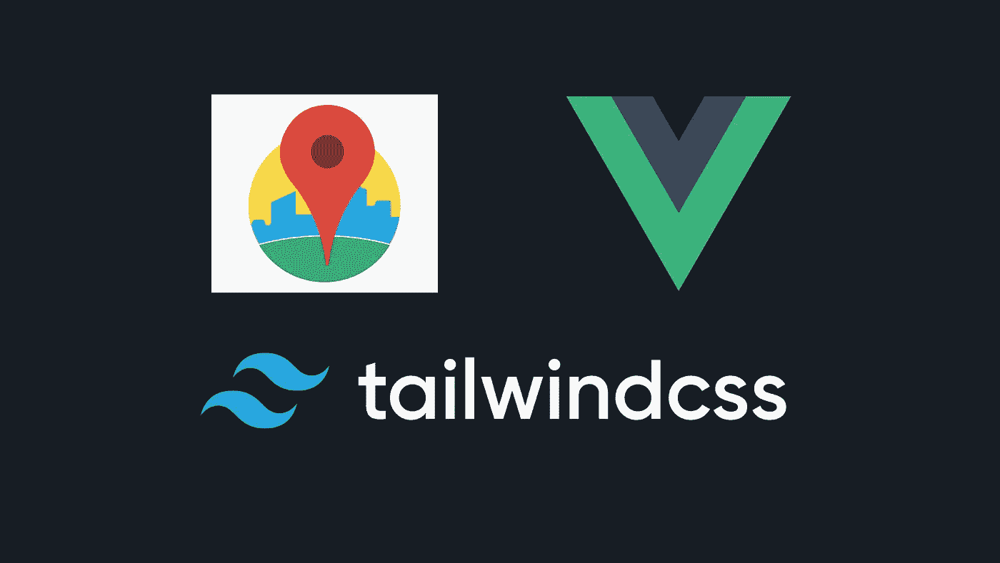
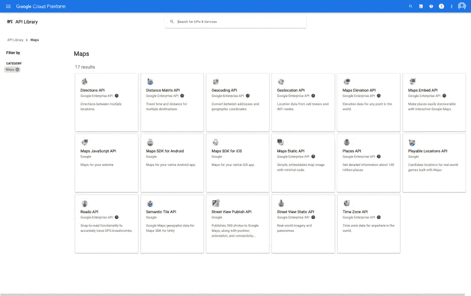
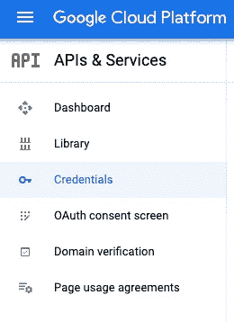
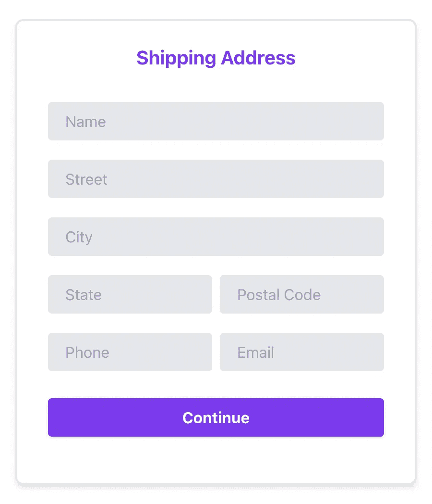
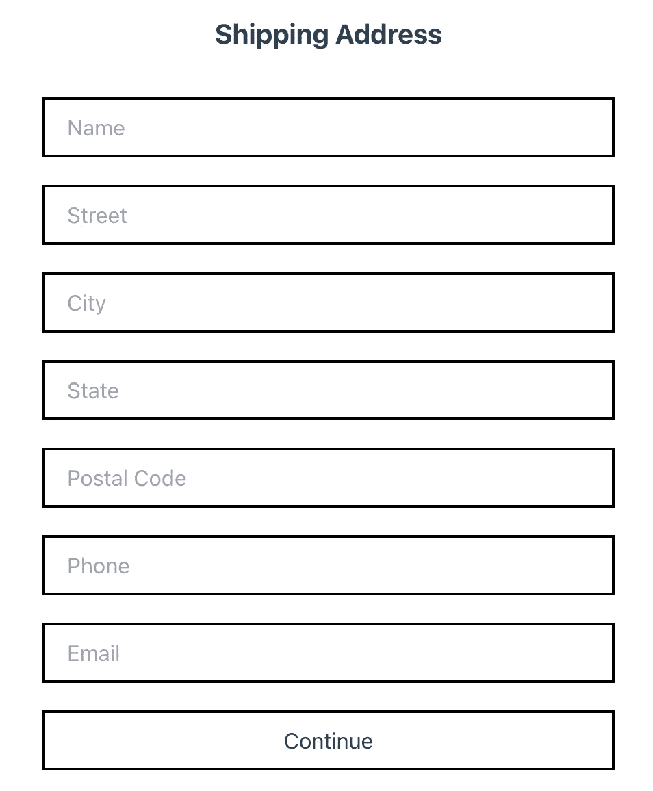
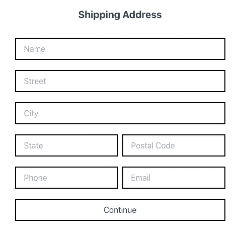
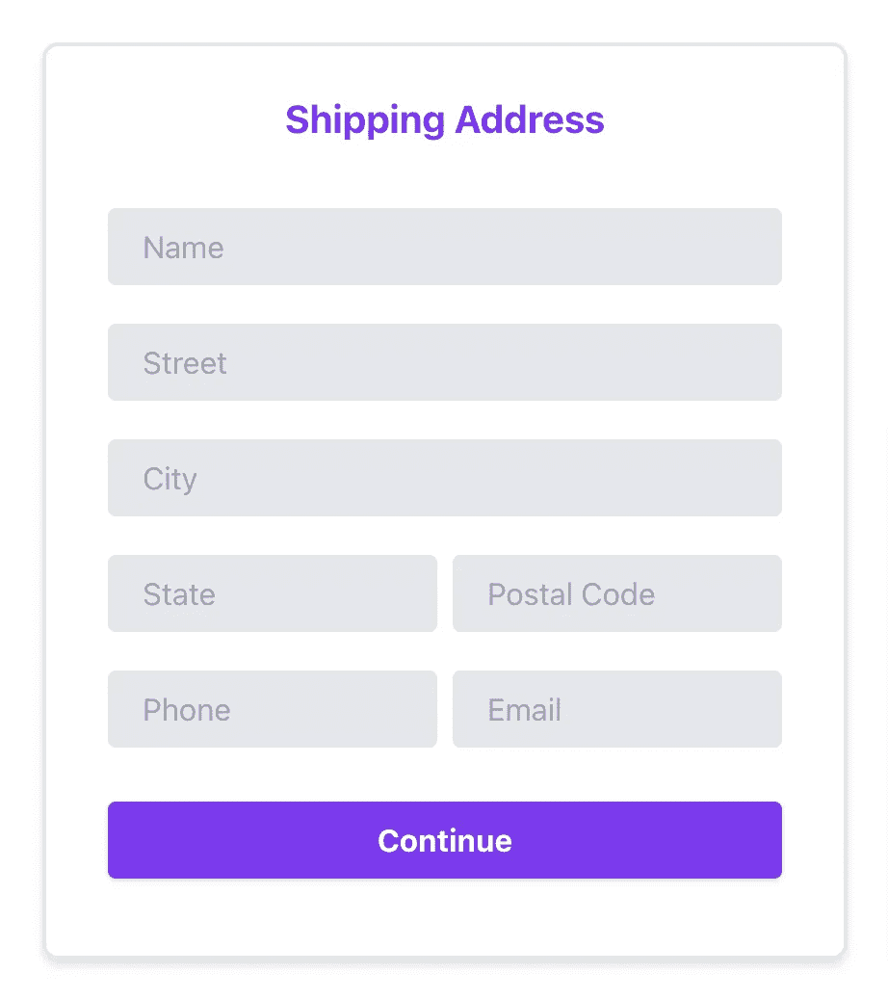
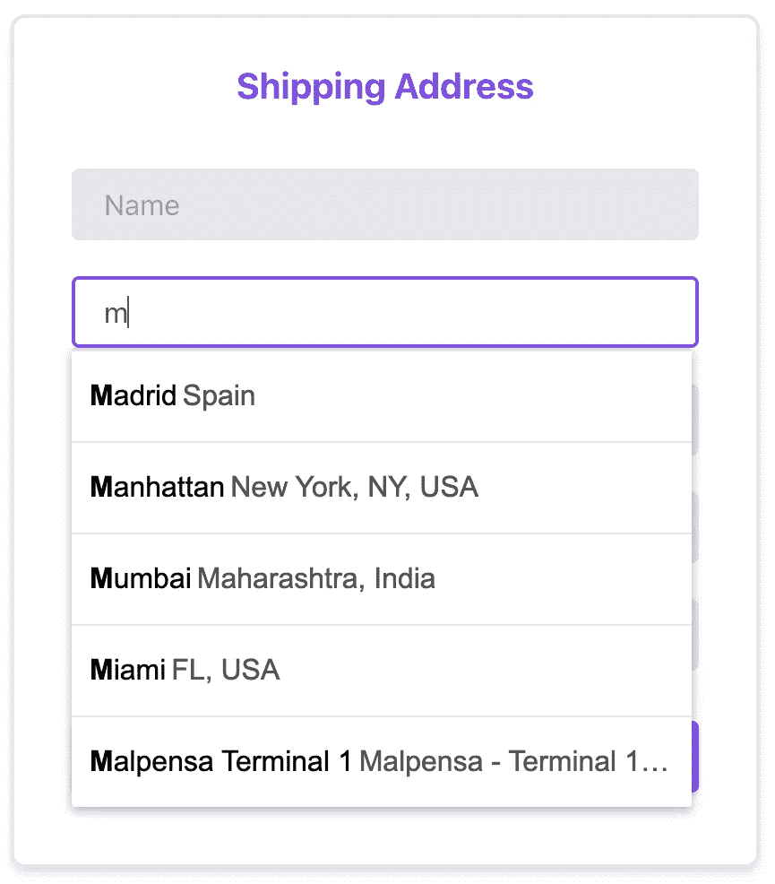
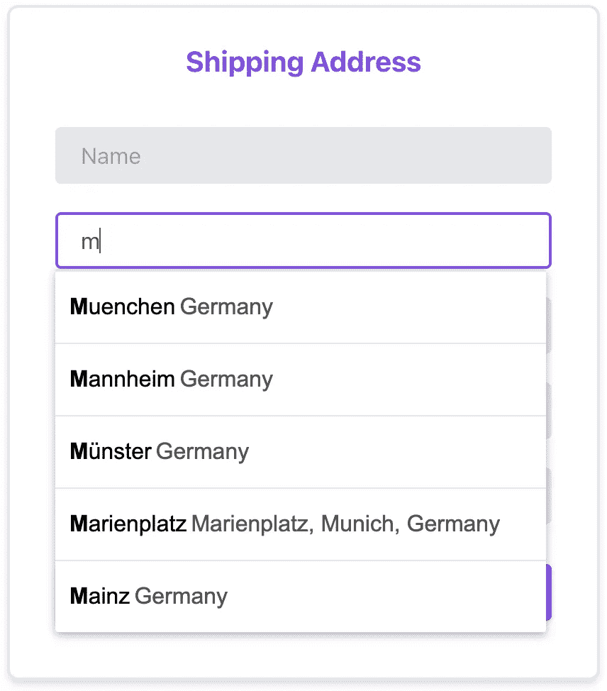

# 使用 Vue.js、Tailwind 和 Google Places API 构建本地化的地点自动完成功能

> 原文：<https://medium.com/geekculture/building-a-localised-places-autocomplete-with-vue-js-tailwind-and-google-places-api-part-1-14cb83cdc659?source=collection_archive---------1----------------------->



在结帐过程中填写地址是几乎每个数字平台中最重要的步骤之一，尤其是在电子商务中。非常重要的是，任何电子商务平台通常都会增强这一过程，以尽可能方便用户，改善用户体验，从而提高用户旅程中的转化率。

从产品团队的角度来看，位置自动完成是非常有益的。Shopify 的研究表明，Google places autocomplete 减少了 20%的结账时间，从而提高了转化率。

然而，从技术角度来看，以及这个特性是如何实现的，也是很有趣的。理解其背后的逻辑将有助于产品团队更好地与开发人员沟通，并且当我们的事情没有按计划进行时，或者当我们想要进一步增强自动完成功能以支持业务目标时，一起讨论解决方案。

**在本文中，我想分享我对如何使用 Vue、Tailwind 和 Google Places API 构建本地化地点自动完成功能(特定国家)的理解。**

要建立本地化的地点自动完成功能，有三个主要的先决条件:

1.  某视频剪辑软件
2.  顺风
3.  Google Places API

我们将一步一步地构建它，这样我们可以更好地理解本地化的地点自动完成是如何用 Vue、Tailwind 和 Google Places API 实现的。

# 构建 Vue 项目

首先，您需要构建一个 Vue 项目。要构建 Vue 项目，可以使用 Vue CLI。要在您的系统中安装它，我们可以使用以下命令:

```
npm install -g @vue/cli
```

现在，使用 Vue CLI，您可以使用 Vue Create 通过以下命令创建 Vue 项目:

```
vue create places-autocomplete
```

在创建了一个 vue 项目之后，您需要运行您的 Vue 项目，并使用以下命令在本地查看它

```
npm run serve
```

当开始运行本地服务器时，您可以打开浏览器进入`localhost:8080`。默认情况下，您应该会看到:


完美！。现在，您已经创建了一个 Vue 项目。现在是时候安装 Tailwind 并将其与 Vue.js 集成在一起了。

# 安装顺风

接下来就是安装 Tailwind，并与 Vue.js 集成，安装 Tailwind 我们可以使用 npm 或者 yarn。但是在这种情况下，我们将使用 npm。如果有兴趣了解更多，可以在这里 找到[](https://tailwindcss.com/docs/installation)

```
 npm install tailwindcss --save-dev
```

**安装 Tailwind 后，我们将能够在 package.json 文件内的 devDependencies 中看到 tailwindcss。**

```
{ "devDependencies": { "tailwindcss": "^2.2.16" }
}
```

# **创建配置文件**

**接下来，我们需要使用已经提供的 Tailwind 命令来创建一个配置文件。**

```
./node_modules/.bin/tailwind init tailwind.js
```

**使用上面的命令后，我们将在项目的根目录中看到一个名为 tailwind.js 的新文件，这是基本的 tailwind 配置。**

# **创建 PostCSS**

**现在我们需要配置 PostCSS 来确保 Tailwind 运行。postcss.config.js 文件位于根目录中。如果你找不到，你可以创建一个。**

```
module.exports = {
  plugins: {
    tailwindcss: {},
    autoprefixer: {},
  }
}
```

# **创建一个 CSS 文件**

**现在我们可以在`src/assets/css/tailwind.css`中创建一个 CSS 文件并添加**

```
@tailwind base;
@tailwind components;
@tailwind utilities;
```

**在这个文件中，如果您愿意，您可以在@layer base、@layer components、@layer utilities 中用自己的 CSS 覆盖顺风类。但是由于这篇文章的目标不仅仅是设计，我们将把它留空。**

# **在我们的 Vue 应用程序中导入 tailwind.css**

**完成上述过程后，最后一步是将其导入到我们的 main.js 中。**

```
import '@/assets/css/tailwind.css'
```

**现在，如果我们在模板中插入顺风类，我们会看到一些变化。完美！**

# **设置 Google Places API**

**设置 Google Places API 非常简单！然而，为了能够使用 Google Places API，我们需要为您的项目启用计费，因为 Google Place API 需要计费。**

# **启用 API**

**启用计费后，我们需要启用位置 API。我们需要转到所选择的项目，并单击 enable APIs 和 services。**

****

**将会有一个 API 列表。我们需要单击 maps 部分，我们将能够看到地图 API 的列表。在该部分，我们可以看到 Google 提供了 17 个地图 API。**

****

**我们需要启用两个主要的 API，即 Places API 和 Maps Javascript API。可能会有一个问题，为什么我们还需要启用地图 Javascript API。嗯，虽然我们使用 Places API 来实现自动完成，但不幸的是，除非我们启用 Maps Javascript API，否则 Places API 将无法工作，因为 Places API 是 Maps Javascript API 的一部分。因此，必须实现 Maps Javascript API。**

# **将 API 放在 Vue 中**

**我很高兴你能走到这一步。现在让我们在 Vue 项目中插入位置 API。为此，首先我们需要获得 API 密钥。**

**我们可以访问你的谷歌云平台中的 API 密钥。在选项卡中，单击 credentials 选项卡，您将能够在 key 列中找到您的 Api 密钥。**

****

**有了 API key 之后，我们需要在 Vue 项目内部的 index.html 文件中插入带有 API key 的 javascript 库。index.html 通常位于公共文件夹中。**

```
<script src="[https://maps.googleapis.com/maps/api/js?libraries=places&key=[YOUR_API_KEY](https://maps.googleapis.com/maps/api/js?libraries=places&key=[YOUR_API_KEY)]"></script>
```

**完美！这是一条漫长的道路，但现在我们有了一个带有 tailwind 和 Places API 的 Vue 项目，可以在项目内部使用。太棒了。**

# **创建送货地址表单**

**最后，让我们做装运表单的用户界面。我们将创建一个包含 7 个输入信息的表单，它们是姓名、街道、城市、州、邮政编码、电话和电子邮件。因此，它将有 7 个输入字段。**

```
<form> <h3>Shipping Address</h3> <input type="text" placeholder="Name"/> <input type="text" placeholder="Street"/> <input type="text" placeholder="City"/> <input type="text" placeholder="State"/> <input type="text" placeholder="Postal Code"/> <input type="text" placeholder="Phone"/> <input type="text" placeholder="Email"/> <button> Continue </button></form>
```

# **用顺风设计用户界面**

**没有造型，船场看起来会很灰暗，所以让我们顺风设计吧。我喜欢 Tailwind 的一点是，与其他 css 框架相比，它有更多的类选项来设计我们的 UI。**

**让我们说，设计师已经给了航运形式设计如下**

****

**看一眼就知道，UI 开发人员倾向于知道如何实现它，需要实现什么属性和值，比如 flex、parents divs(州、邮政编码、电话和电子邮件)、输入背景、占位符颜色、填充和按钮。在这篇文章中，我想分享我们如何一步一步地用 tailwind 实现这个 UI。**

**首先，让我们制作 1 个标题、7 个输入和 1 个全宽的按钮，其中输入有黑色边框，上边距各为 1.25 雷姆，填充为 1 雷姆。也使标题字体大小变成粗体。**

```
<div class="container form-section mx-auto px-4 font-sans"><form> <h3 class="text-xl mb-8 mx-auto text-center font-bold">Shipping Address</h3> <div class="mb-4"> <input type="text" placeholder="Name" class="w-full py-2 px-4  border-2 border-black" /> <input type="text" placeholder="Street" class="w-full py-2 px-4 border-2 border-black mt-5"/> <input type="text" placeholder="City" class="w-full py-2 px-4 border-2 border-black mt-5" /> <input type="text" placeholder="State" class="w-full py-2 px-4 border-2 border-black mt-5" /> <input type="text" placeholder="Postal Code" class="w-full py-2 px-4 border-2 border-black mt-5" /> <input type="text" placeholder="Phone" class="w-full py-2 px-4 border-2 border-black mt-5" /> <input type="text" placeholder="Email" class="w-full py-2 px-4 border-2 border-black mt-5" /> <button class="w-full py-2 px-4 border-2 border-black mt-5" type="button"> Continue </button> </div></form></div>
```

**上面的代码将显示如下的用户界面:**

****

**下一步将是并排显示州、邮政编码、电话和电子邮件。我们可以使用一些方法，如网格或 Flex。在本例中，我们将使用 flex。**

```
<div class="flex"> <input type="text" placeholder="State" class="w-full py-2 px-4 border-2 border-black mt-5 mr-1" /> <input type="text" placeholder="Postal Code" class="ml-1 w-full py-2 px-4 border-2 border-black mt-5 ml-1" /> </div> <div class="flex"> <input type="text" placeholder="Phone" class="w-full py-2 px-4 border-2 border-black mt-5 mr-1" /> <input type="text" placeholder="Email" class="w-full py-2 px-4 border-2 border-black mt-5 ml-1" /></div>
```

**上面的代码将显示州、邮政编码、电话和电子邮件的新用户界面。**

****

**好极了，接下来要做的是改变标题颜色，改变输入字段背景，使字段有一个半径，当字段处于焦点时改变背景和边框颜色。**

```
<form> <h3 class="text-xl mb-8 mx-auto text-center font-bold text-purple-600">Shipping Address</h3> <div class="mb-4"> <input type="text" placeholder="Name" class="bg-gray-200 border-2 border-gray-200 rounded w-full py-2 px-4 text-gray-700 leading-tight focus:outline-none focus:bg-white focus:border-purple-500" /> <input type="text" placeholder="Street" class="mt-5 bg-gray-200 border-2 border-gray-200 rounded w-full py-2 px-4 text-gray-700 leading-tight focus:outline-none focus:bg-white focus:border-purple-500"/> <input type="text" placeholder="City" class="mt-5 bg-gray-200 border-2 border-gray-200 rounded w-full py-2 px-4 text-gray-700 leading-tight focus:outline-none focus:bg-white focus:border-purple-500" /> <div class="flex"> <input type="text" placeholder="State" class="mr-1 mt-5 bg-gray-200 border-2 border-gray-200 rounded w-full py-2 px-4 text-gray-700 leading-tight focus:outline-none focus:bg-white focus:border-purple-500" /> <input type="text" placeholder="Postal Code" class="ml-1 mt-5 bg-gray-200 border-2 border-gray-200 rounded w-full py-2 px-4 text-gray-700 leading-tight focus:outline-none focus:bg-white focus:border-purple-500" /> </div> <div class="flex items-center justify-between"> <input type="text" placeholder="Phone" class="mr-1 mt-5 bg-gray-200 border-2 border-gray-200 rounded w-full py-2 px-4 text-gray-700 leading-tight focus:outline-none focus:bg-white focus:border-purple-500" /> <input type="text" placeholder="Email" class="ml-1 mt-5 bg-gray-200 border-2 border-gray-200 rounded w-full py-2 px-4 text-gray-700 leading-tight focus:outline-none focus:bg-white focus:border-purple-500" /> </div> <button class="cursor-pointer mt-7 w-full shadow bg-purple-600 hover:bg-purple-600 focus:shadow-outline focus:outline-none text-white font-bold py-2 px-4 rounded mt-4" type="button"> Continue </button></div></form>
```

**上面的代码将显示运输表单的新 UI，当用户在其中一个字段中时，边框颜色和输入字段背景将变成白色和紫色。**

****

**最后，UI 设计的最后一步。正如前面所看到的，与上面的图片相比，最终的设计有一个更精简的运输形式。shipping form 的最终设计用阴影包裹，以帮助用户容易地注意到 shipping form 元素。**

**要做到这一点，我们需要做的就是添加这个表单的类，并通过给它添加边框、阴影和填充来设置样式。**

```
<div class="container mt-12 form-section mx-auto px-4 font-sans"><form class="shadow-md rounded-lg px-8 py-6 mb-4 border-2 border-gray-200"> **<!-- New Change -->**<h3 class="text-xl mb-8 mx-auto text-center font-bold text-purple-600">Shipping Address</h3><div class="mb-4"><input type="text" placeholder="Name" class="bg-gray-200 border-2 border-gray-200 rounded w-full py-2 px-4 text-gray-700 leading-tight focus:outline-none focus:bg-white focus:border-purple-500" /><input type="text" placeholder="Street" class="mt-5 bg-gray-200 border-2 border-gray-200 rounded w-full py-2 px-4 text-gray-700 leading-tight focus:outline-none focus:bg-white focus:border-purple-500" /><input type="text" placeholder="City" class="mt-5 bg-gray-200 border-2 border-gray-200 rounded w-full py-2 px-4 text-gray-700 leading-tight focus:outline-none focus:bg-white focus:border-purple-500" /><div class="flex"><input type="text" placeholder="State" class="mr-1 mt-5 bg-gray-200 border-2 border-gray-200 rounded w-full py-2 px-4 text-gray-700 leading-tight focus:outline-none focus:bg-white focus:border-purple-500" /><input type="text" placeholder="Postal Code" class="ml-1 mt-5 bg-gray-200 border-2 border-gray-200 rounded w-full py-2 px-4 text-gray-700 leading-tight focus:outline-none focus:bg-white focus:border-purple-500" /></div><div class="flex items-center justify-between"><input type="text" placeholder="Phone" class="mr-1 mt-5 bg-gray-200 border-2 border-gray-200 rounded w-full py-2 px-4 text-gray-700 leading-tight focus:outline-none focus:bg-white focus:border-purple-500" /><input type="text" placeholder="Email" class="ml-1 mt-5 bg-gray-200 border-2 border-gray-200 rounded w-full py-2 px-4 text-gray-700 leading-tight focus:outline-none focus:bg-white focus:border-purple-500" /></div><button class="cursor-pointer mt-7 w-full shadow bg-purple-600 hover:bg-purple-600 focus:shadow-outline focus:outline-none text-white font-bold py-2 px-4 rounded mt-4" type="button">Continue</button></div></form></div>
```

**上面的更改将显示新的用户界面，如下所示。**

****

# **创建自动完成地址**

**Alriight(这个词让我想起了我的好朋友)，我们用 Tailwind 完成了 UI 实现。太有趣了，是吗？。有了 Tailwind，我们可以更快的做 UI 开发。此外，与其他 CSS 框架相比，Tailwind 提供了更大范围的类定制。**

**下一步是用 Google Places API 实现自动完成定位。我们将在“街道”输入字段中实现它。因此，我们将专注于这一领域。**

# ****功能内置挂钩****

**创建自动完成地址时，我们需要强调两点。首先，我们需要从 Google Places API 调用数据，并在用户开始输入任何地址时显示它。其次，我们将在挂接中执行它。**

****什么是挂架钩？**这是 Vue 中最常用的生命周期钩子之一。当组件被添加到 DOM 时，Vue 调用挂载的钩子。它通常用于发送请求以获取组件将呈现的数据。**

```
mounted() {}
```

**很好，现在我们需要发送一个请求来获取挂接中的数据，这样我们就可以在街道输入字段中显示自动完成。Google Places API 这里有文档[](https://developers.google.com/maps/documentation/javascript/examples/places-autocomplete)**，给出了实现它的完整概述。在上面的代码中，它显示了 autocomplete，并呈现在一个 id 元素中。****

```
**mounted() { var autocomplete = new google.maps.places.Autocomplete( document.getElementById("autocomplete"), );}**
```

****下一步是将 id (autocomplete)放入其中一个输入字段，以呈现 autocomplete。因为我们想把它放在街道输入字段，我们可以把它放在那里。****

```
**<input id="autocomplete" type="text" placeholder="Street" class="mt-5 bg-gray-200 border-2 border-gray-200 rounded w-full py-2 px-4 text-gray-700 leading-tight focus:outline-none focus:bg-white focus:border-purple-500"**
```

****太好了，现在如果我们开始在街道输入框中输入，它会显示自动完成。****

********

****完美！。现在，当我们键入 M 时，会显示一些自动完成建议。但还是有问题。我们希望它局限于特定的地方。我们如何实现它？。为此，我们可以为自动完成设置国家限制。****

```
**mounted() { var autocomplete = new google.maps.places.Autocomplete( document.getElementById("autocomplete"), ); autocomplete.setComponentRestrictions({ *// restrict the country* country: ["de"] })}**
```

****上面的代码显示了该函数如何只显示特定国家(德国)的自动完成，而不是任何地方。您可以在任何国家设置，您可以在这里 **找到国家限制[的文档。国家代码必须是两个字符，ISO 3166-1 Alpha-2 兼容的国家代码。你可以在这里](https://developers.google.com/maps/documentation/javascript/examples/places-autocomplete-multiple-countries)** **找到国家代码 [**。**](https://en.wikipedia.org/wiki/ISO_3166-1_alpha-2)******

**现在，如果我们键入 M，它将显示德国的一个城市或地区。**

****

# **我的笔记**

**用 Tailwind 设计运输表单是高效的，它帮助 UI 开发人员不用离开 html 模板就可以定制布局和设计。通过编写类，我们可以随心所欲地开发 UI 实现。同时，Google Places API 对于创建自动完成表单也非常有用。有了 Google Places API，我们可以在我们的站点中实现任何自动完成的输入框，当用户开始输入时，它会给出建议。它肯定会帮助用户轻松地填写表单。Google 提供的文档也非常简单。开发人员只需要利用它，他们已经实现了自动完成地址。**

**感谢您阅读这篇文章。我希望你能喜欢它，并成为你学习过程中的有用资源。**