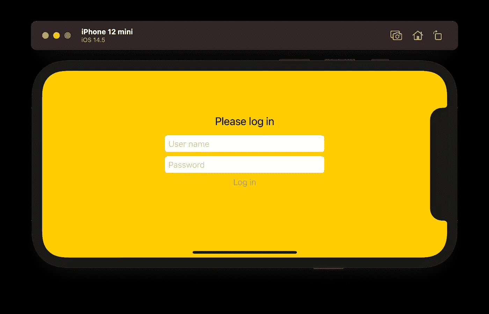

# 在 SwiftUI 中使用模态视图构建登录屏幕

> 原文：<https://medium.com/geekculture/building-a-login-screen-using-modal-views-in-swiftui-f85915bbfb09?source=collection_archive---------2----------------------->

## 使用“全屏覆盖”模式视图，可以快速轻松地创建虚拟视图，防止用户在登录之前访问您的应用程序。

*本文面向 iOS/iPadOS 14 上的 SwiftUI，示例代码使用 Xcode 12.5 编写。本文中的代号为* [*现为*](https://github.com/scottmatthewman/SwiftUI-AuthDemo) …