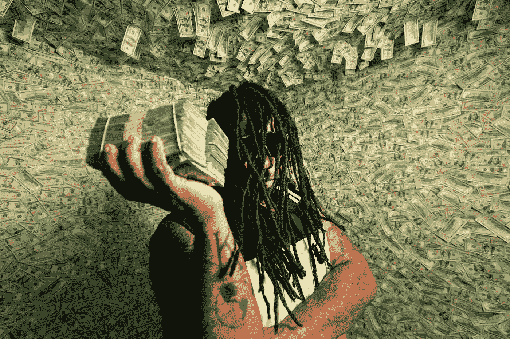
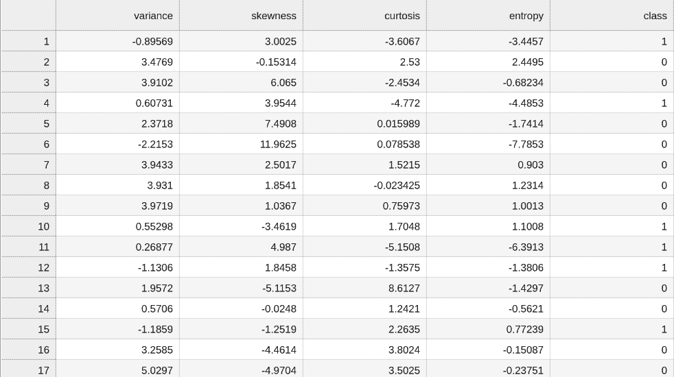
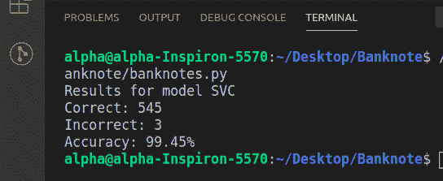
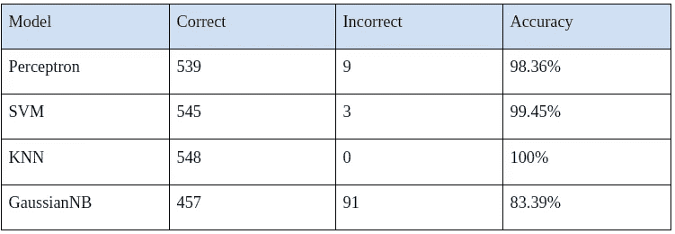

# 构建用于钞票认证的机器学习模型

> 原文：<https://medium.com/geekculture/building-a-machine-learning-model-for-banknote-authentication-f9c6855a9057?source=collection_archive---------4----------------------->



Photo by [Jakob Owens](https://unsplash.com/@jakobowens1?utm_source=unsplash&utm_medium=referral&utm_content=creditCopyText) on [Unsplash](https://unsplash.com/?utm_source=unsplash&utm_medium=referral&utm_content=creditCopyText)

*目的是在给定从照片中获取的多个测量值的情况下，预测给定钞票是否是真实的。*

*实现的算法:*

*   *支持向量机*
*   *K 最近邻*
*   *高斯朴素贝叶斯*
*   *感知器学习*

*机器学习库&模块:*

*   *Scikit 学习库*
*   *csv 模块*
*   *随机模块*

*如果你不知道 Pandas，NumPy，etc 机器学习库，这些模块会有助于你理解。因为这些模块就像基本的 python 语法。*

# 介绍

机器学习！！！🤪当今世界非常有趣的技术😉。我知道你已经听说了很多。今天我们要建立一个机器学习模型来鉴别钞票的真伪💵。

每当你去银行存一些现金时，出纳员都会把钞票放进一台机器里，这台机器能辨别钞票是真的还是假的。机器使用一些分类技术来做这件事。分类有很多机器学习算法。分类是一种有监督的机器学习。分类中有多种机器学习算法。我们理解作为初学者很难知道每个算法的理论概念。如果对你来说是真的，没什么好恐慌的。🤪

我们将实现' K 最近邻，支持向量机，感知器学习&高斯朴素贝叶斯'算法&将解释建立一个钞票认证系统的过程。读完这篇文章，你将能够理解分类系统是如何使用机器学习算法构建的。

# 背景/兴趣

本文是 Nuruzzaman Faruqui 在孟加拉国达卡城市大学进行的“人工智能”课程的实验报告的一部分。这是孟加拉国最好的 AI 课程。

在这个课程中，我们从零开始学习 AI。我们从基本的 python 开始，到自然语言处理结束。我们在“CSE 417:人工智能”课程中适当地学习了理论概念、基本数学，然后在实验室课程“CSE 418:人工智能实验室”中实施我们的知识。

为了掌握这门课程，我们已经做了很多实验，逐渐地，我们学会了人工智能的每个必要概念。现在我们可以建立我们的机器学习模型，也可以建立一个神经网络来解决一个复杂的问题。

# 问题陈述

机器学习算法从数据集学习。因此，为了鉴别一张钞票是真是假，我们需要一个真钞和伪钞的数据集以及它们的不同特征。

下载免费数据集的一些来源有 Kaggle、UCI 机器学习库等。

我们知道数据是杂乱的。数据集可能包含多个缺失值。在这种情况下，我们必须清理数据集。为了避免这种麻烦，我们将使用预先清理过的数据集。您可以下载数据集(。CSV 文件)。链接如下( [GitHub](https://github.com/Muhammad-Taufiq-Khan/BanknoteClassificationModel) )



fig1: a snapshot of the CSV Dataset by Author

该数据集包含总共 1372 条不同纸币的记录。左边的四列是我们可以用来预测钞票是真的还是假的数据，它是由人提供的外部数据，编码为 0 和 1，其中 0 代表真的，1 代表伪钞/假钞。机器学习算法需要特征和标签彼此分离的数据。标签表示输出类或输出类别。在我们的数据集中，方差、偏斜、曲率和熵是特征，而类列包含标签。

现在我们可以在这个数据集上训练我们的模型，看看我们是否可以预测新钞是否是真的。

# 构建机器学习模型的 Python 代码

*注意:不要盲目复制粘贴代码。阅读解释部分，以便更好地理解。你会在我的* [**Github**](https://github.com/Muhammad-Taufiq-Khan/BanknoteClassificationModel) *资源库中找到可执行代码和 CSV 文件。*

```
#import sklearn
# pip install scikit-learnimport csvimport random from sklearn import svmfrom sklearn.linear_model import Perceptronfrom sklearn.naive_bayes import GaussianNBfrom sklearn.neighbors import KNeighborsClassifier#Loading Algorithm in model variablemodel = svm.SVC()#model = Perceptron()# model = KNeighborsClassifier(n_neighbors=3)# model = GaussianNB()# Read data in from filewith open("banknotes.csv") as f:
    reader = csv.reader(f) next(reader) data = [] for row in reader: data.append({ "feature": [float(cell) for cell in row[:4]], "label": "Authentic" if row[4] == "0" else "Counterfeit" })# Separate data into training and testing groupsholdout = int(0.40 * len(data))random.shuffle(data)testing = data[:holdout]training = data[holdout:]# Train model on training setX_training = [row["feature"] for row in training]y_training = [row["label"] for row in training]model.fit(X_training, y_training)# Make predictions on the testing setX_testing = [row["feature"] for row in testing]y_testing = [row["label"] for row in testing]predictions = model.predict(X_testing)# Compute how well we performedcorrect = 0incorrect = 0total = 0for actual, predicted in zip(y_testing, predictions): total += 1 if actual == predicted: correct += 1
    else: incorrect += 1# Print resultsprint(f"Results for model {type(model).__name__}")print(f"Correct: {correct}")print(f"Incorrect: {incorrect}")print(f"Accuracy: {100 * correct / total:.2f}%")
```

## 输出



Fig2: Output terminal By Author

我们用“支持向量机”算法训练了这个模型。要使用另一种算法进行训练，只需用不同的算法注释掉任何模型变量，并在其他算法中进行注释。


fig3: Snapshot of all models

# 结果



Fig4: Accuracy of all of the model

# 为了更好地理解，对整个代码进行解释

## 1.导入所需模块

在将数据集导入我们的机器学习模型并执行分析之前，我们需要导入一些库。以下脚本用于导入 python 模块:

```
import csv
import random
```

## 2.从 sci-kit 学习库中加载机器学习算法

我们使用了支持向量机、K 近邻、感知器学习、高斯朴素贝叶斯算法，这是机器学习分类问题中最常用的四种算法。

1.  支持向量机

为了训练支持向量机，我们使用了“sklearn.svm”模块中的 SVC 类。

```
from sklearn import svm
model = svm.SVC()
```

2.感知机学习

为了训练感知器学习，我们从“sklearn.linear_model”模块中导入了感知器。

```
from sklearn.linear_model import Perceptron
model = Perceptron()
```

3.高斯朴素贝叶斯

为了训练高斯朴素贝叶斯，我们从“sklearn.naive_bayes”模块中导入高斯。

```
from sklearn.naive_bayes import GaussianNB
model = GaussianNB()
```

4.k 最近邻

为了训练支持向量机，我们从“sklearn.neighbors”模块中导入了 KNeighborsClassifier。我们考虑了三个最近的邻居。

```
from sklearn.neighbors import KNeighborsClassifier
model = KNeighborsClassifier(n_neighbors=3)
```

脚本:

```
from sklearn import svm
from sklearn.linear_model import Perceptron
from sklearn.naive_bayes import GaussianNB
from sklearn.neighbors import KNeighborsClassifier
# Loading Algorithm in model
model = svm.SVC()
#model = Perceptron()
#model = KNeighborsClassifier(n_neighbors=3)
#model = GaussianNB()
```

请注意，导入算法后，我们可以选择使用哪个模型。代码的其余部分将保持不变。

## 3.加载数据集

导入库后，下一步是将数据集加载到我们的应用程序中。为此，我们使用核心 python 文件功能打开文件，并使用 csv 模块的“csv.reader()”函数，该函数读取 csv 格式的数据集。

```
# Read data from the file
with open("banknotes.csv") as f:
    reader = csv.reader(f)
    next(reader)
```

## 4.将数据集分为要素和标注

在我们的数据集中，方差、偏斜、曲率和熵是特征，而类列包含标签。以下脚本和加载部分将数据分为要素和标注集。然后将特征和标签存储到列表 data = []

```
#Read data from csv file
with open("banknotes.csv") as f:
    reader = csv.reader(f) next(reader) data = [] for row in reader: data.append({ "feature": [float(cell) for cell in row[:4]], "label": "Authentic" if row[4] == "0" else "Counterfeit" })
```

for 循环我们要从数据集中过滤的索引，在“feature”:[float(cell)for cell in row[:4]]行中，我们过滤了包含我们的特征集的第 0 列到第 3 列。在“label”中:“Authentic”if row[4]= =“0”else“fake”，我们只过滤了包含标签(class)的第四列中的记录。其中，如果标签为 0，则该纸币是真实的/真的，而当标签为 0 时，该纸币是伪造的/假的。

## 5.将数据集分成训练组和测试组

训练集用于训练机器学习算法，而测试集用于评估机器学习算法的性能。

```
# Separate data into training and testing groups
holdout = int(0.40 * len(data))
random.shuffle(data)
testing = data[:holdout]
training = data[holdout:]
```

首先，我们在 holdout = int(0.40 * len(data))中计算数据列表的长度，并使用 random.shuffle(data)中 random 模块的 random.shuffle()函数对数据元素进行混排，以获得更好的性能

然后，我们在测试组中存储 40%的数据，在训练组中存储 60%的数据。

## 6.在训练集上训练模型

```
# Train model on the training set
X_training = [row["feature"] for row in training]
y_training = [row["label"] for row in training]
model.fit(X_training, y_training)
```

训练特征集存储为 x _ training，而训练标签集存储为 y_training，然后传递给“fit()”方法。

## 7.在测试集上测试模型

训练完算法后，我们对测试集进行了预测。为了进行预测，使用了“predict()”方法。要预测的记录作为参数传递给“predict()”方法，如下所示:

```
# Make predictions on the testing set
X_testing = [row["evidence"] for row in testing]
y_testing = [row["label"] for row in testing]
predictions = model.predict(X_testing)
```

## 8.评估模型性能

我们通过简单的 python 代码评估了模型的性能:

```
# Compute how well we performedcorrect = 0incorrect = 0total = 0for actual, predicted in zip(y_testing, predictions): total += 1 if actual == predicted: correct += 1 else: incorrect += 1
```

## 9.模型的打印精度

最后，打印出模型的准确性，以便更好的理解

```
# Print results
print(f"Results for model {type(model).__name__}")
print(f"Correct: {correct}")
print(f"Incorrect: {incorrect}")
print(f"Accuracy: {100 * correct / total:.2f}%")
```

# 结论

钞票鉴别是一项重要的任务。很难人工检测假钞。机器学习算法可以在这方面提供帮助。在本文中，我们解释了如何使用机器学习技术解决钞票认证问题。我们比较了四种不同算法的性能，并得出结论，KNN 和 SVM 算法是用于钞票认证的最佳算法，准确率为 100%和 99.45%。

但是，您可以自己建立一个模型来对相似的数据集进行分类(例如，癌症肿瘤细胞分类、药物分类、情感分析等)...)通过实现上面给出的相同/稍微修改的代码片段。这是由 Nuruzzaman Faruqui Sir 在孟加拉国达卡城市大学进行的“CSE 418:人工智能实验室”课程的一个简单易行的实现。孟加拉国最好的 AI 课程是哪个？

您可以从这里随意复制代码或您的项目的一些其他结论。