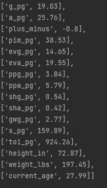
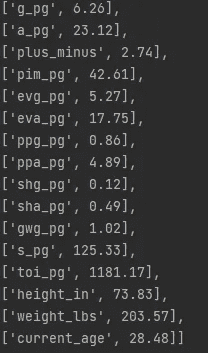

# 建立一个标准来找出最普通的 NHL 选手

> 原文：<https://medium.com/geekculture/building-a-model-to-find-the-most-average-nhl-player-5712ccaab0e0?source=collection_archive---------17----------------------->


Tanner Pearson is the most average NHL player!

谁是 NHL 最普通的球员？当然是坦纳·皮尔森了！当然可以？是啊！为了回答这个问题，我甚至设计了一个衡量这个质量的标准。我称之为*平均化*度量。

构建平均性度量的代码可以在 Gitlab 的[这里](https://gitlab.com/alexistats/most_average_nhl_player)找到。我使用了两个数据源:2021-2022 赛季的 NHL 基本选手统计数据和 2021-2022 赛季的 NHL 选手简历信息。我加入了他们，并使用 SQL 对他们进行了预处理，以便在 Python 中作为熊猫数据帧被接收。

事不宜迟，让我们跳进*平均*的神话世界。

# 第一步:目标和基本想法

平均水平指标的目标是捕捉某个玩家与 NHL 玩家的平均水平有多接近。找出一个球员的平均水平是很容易的。得分目标)，但我真的想找到整体最平均的球员。

因此，对于要包含在指标中的每个选择的属性，我决定找到它的平均值和标准偏差。这样，对于每个玩家和属性，我可以找到一个玩家离该属性有多远的绝对值，然后除以它的标准偏差——找到一个玩家离该属性平均值有多少标准偏差。

现在是时候介绍这些属性了。

# 步骤 2:特征选择和工程

在获得数据(实际上是第 0 步)并为指标设置了一个基本目标后，下一步是决定哪些球员和哪些指标要包含在平均得分中。

我过滤了参加超过 41 场比赛的玩家的数据集。我的理由是，任何参加 NHL 赛季大部分比赛的人都必须是那个特定赛季的 NHL 常客。或者至少是半正规的，我想把它们算在公制里。

从 NHL 的个人资料中，我发现一个普通的球员应该有一个平均的身高，体重和年龄。毕竟，像兹德诺·查拉和科尔·考菲尔德这样的人分别又高又小，很难归类为“一般”。

从 NHL 统计数据集，我喜欢很多功能。我将其中的大部分标准化到“每场比赛”的基础上，让每个人都处于同一水平。我还将“进球”和“助攻”与“得分”分开，这样一个伟大的组织者或伟大的进球者就不可能是一个只基于得分的普通球员。

以下是我选择的属性列表:

*   每场比赛的进球
*   场均助攻数
*   +/-
*   每场比赛的 PIM
*   甚至每场比赛的力量目标
*   场均实力助攻
*   每场比赛的强力进球
*   每场比赛的强力助攻
*   每场比赛人手不足的进球
*   场均人手不足的助攻
*   每场比赛的制胜进球
*   每场比赛投篮次数
*   ATOI
*   高度
*   重量
*   年龄

我没有用分数，因为只是简单的增加了进球和助攻。

此外，由于防守队员和前锋有着完全不同的职责和比赛风格，我对两者分别进行了计算(因此，对前锋和防守队员进行了平均)。过去我甚至进行了一项测试，结果显示前锋和后卫的身高和体重不同，这在 0.95 的水平上具有统计学意义！

但是，足够的准备…是什么让一个球员完美的平均水平？

# 第三步:谁是完美的普通玩家？

既然我们的属性已经定义并构建好了，让我们看看每个属性的平均值是多少(为了简单起见，按比例分配到 82 个游戏)。

因此，前锋的平均得分约为 19 个，或者说其中 15 个是在力量相当的情况下得分，4 个是在力量型打法上得分。他们有 26 次助攻，20 次是力量型的，6 次是力量型的，总共 45 分(他们可能有一个人手不足的点)。我们普通球员的 3 个致胜球。他们还在 82 场比赛中罚 38 分钟，在一个赛季中射门 160 次。所有这些都是在玩 924 秒(15 分钟)的时候！

就身高而言，他们刚刚超过 6 英尺高，体重 197 磅。他们 28 岁。



防守队员平均能进 6 个球，其中 5 个是在力量平衡时进的，1 个是在力量型进攻时进的。他们有 23 次助攻，18 次是力量型的，5 次是力量型的，总共 29 分(他们可能有一个人手不足的点)。我们普通球员的 1 场致胜球。他们还在 82 场比赛中罚 42 分钟，在一个赛季中射门 125 次。所有这些都是在玩 1181 秒(19.6 分钟)的时候！

就身高而言，他们刚刚超过 6 英尺 1 英寸高，体重 203 磅。防守队员的平均年龄比前锋稍大，为 28.5 岁。



# 第四步:寻找最普通的玩家

现在，这一切都很有趣，但我们仍然不知道谁是 NHL 中最普通的球员…

我还找到了每个属性的标准差。对于每个玩家，我检查了每个特征，找到了他们离平均值有多远的绝对值。然后，我将该值除以标准偏差，得到一个代表该玩家与平均值的标准偏差的值:

```
dist_from_mean = abs(player_value - mean)/std
```

这是针对每个指标的，然后我将它们加起来，得到一个单一的*平均得分*。

我整理了一个 10 强，10 大前锋和 10 大防守球员:

**综合排名前十:**

1.  坦纳·皮尔逊，女:5.1 岁
2.  里卡德·拉克尔，女:5.7
3.  杰克·罗斯洛维奇，女:5.9
4.  乔纳斯·布鲁丁，D: 6.0
5.  桑尼·米兰诺，女:6.0
6.  特拉维斯·博伊德，女:6.1 岁
7.  阿尔特姆·祖布，D: 6.2
8.  卡斯佩里·卡帕宁，女:6.3 岁
9.  汉普斯·林德霍尔姆，D: 6.3
10.  布雷特·库拉克，D: 6.4

**前十名:**

1.  坦纳·皮尔森:5.1
2.  里卡德·拉克尔:5.7
3.  杰克·罗斯洛维奇:5.9
4.  桑尼·米兰诺:6.0
5.  特拉维斯·博伊德:6.1
6.  卡斯佩里·卡帕宁:6.3
7.  伊万·巴尔巴舍夫:6.4
8.  克里斯蒂安·德沃夏克:6.6
9.  丹尼斯·古里亚诺夫:6.7
10.  基弗风箱:6.8

**国防十强:**

1.  乔纳斯·布鲁丁:6.0
2.  Artem Zub: 6.2
3.  汉普斯·林德霍尔姆:6.3
4.  布雷特·库拉克:6.4
5.  本·赫顿:6.9
6.  奥利弗·埃克曼-拉尔森:7.0
7.  贾斯汀·布劳恩:7.2
8.  尼克·詹森:7.3
9.  内特·施密特:7.3 分
10.  杰克·麦凯布:7.4

对我来说，转发列表看起来很不错。很多球员，一眼就能看出他们有 6 个进攻号码，但却没有让他们脱颖而出的疯狂属性。他们也是来自不同球队的球员。

向拉斯·埃勒先生致敬，他是我名单上第 11 个最普通的前锋，在这些讨论中他得到了很多爱！

防御列表我有点不太自豪，因为*的平均水平*在防御属性中占不了多少，如果有的话。这意味着一些球员，像乔纳斯·布洛丁和汉普斯·林德霍尔姆，因为他们出色的防守而备受尊敬，进入了前 10 名；他们可能根本不应该靠近这些列表。

不敌凯尔·马卡，他拥有最高的*平均得分*，也就是说，他是 NHL 中平均得分最低的球员！他以 38 比 31 领先第二名海德曼。随便你怎么想，最不一般的玩家一定很特别！

# 步骤 5:结论和后续步骤

这是一个非常有趣的练习！它允许我通过使用 NHL API 获取生物数据来提高我的数据挖掘技能，并构建一个小型本地 SQL 数据库来将统计数据和生物数据集放在一起。

我还必须阅读 pandas.to_dict 文档，以我喜欢的方式在字典中设置我的数据；我了解到可以通过使用“Orient”参数以各种不同的方式设置键和值。

看到我创建的普通玩家名单看起来非常准确，并且突出了很多我通常不会想到的玩家，这也非常有趣！有些惊喜，比如特拉维斯·博伊德，他比我想象的要好得多。

不过，对于未来，如果我要重新审视这个指标，我会添加一些新的关键属性，如“命中”、“外卖”和“赠品”，以获得至少一些更多的防守指标，这将有望帮助防守得分更加准确。

我也可能会尝试删除那些相互关联太多的指标，我确信我可以删除“总进球数”、“EV 进球数”、“PP 进球数”、“SH 进球数”(助攻同上)中的一个，因为最后三个加起来就是“总进球数”。