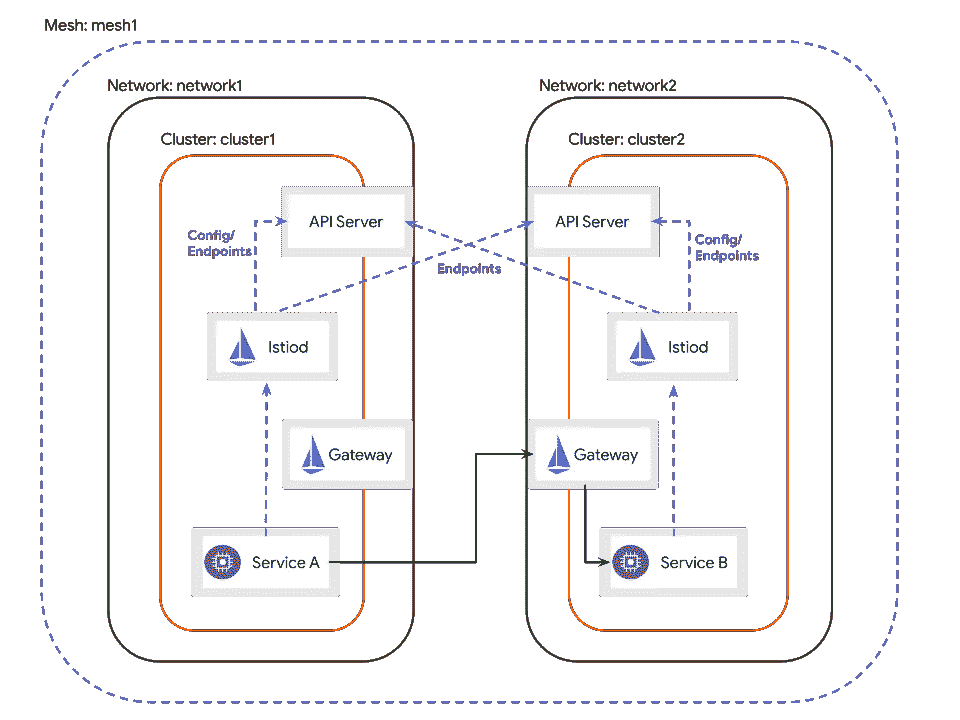

# 在旧 PC 中构建多集群 Istio 网格

> 原文：<https://medium.com/geekculture/building-a-multi-cluster-istio-mesh-in-a-old-pc-7d5e2a8ff622?source=collection_archive---------9----------------------->

The architecture diagram of Multi-Primary-Cluster example from Istio

在多集群上运行 Istio 网格是在您驯化了使用单个 Kubernetes 集群的 Istio 基本功能之后的下一个级别。对于新手来说，这个水平似乎不可企及，至少要跑两个 Kubernetes 集群才能练出来。要准备一个 Kubernetes 多集群环境，使用云是一个好办法，或者如果您正在寻找一个本地设置，这里…