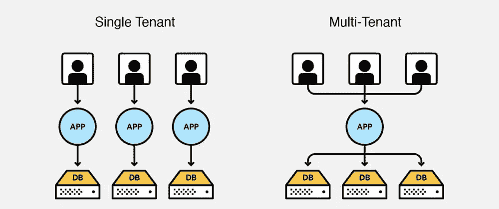
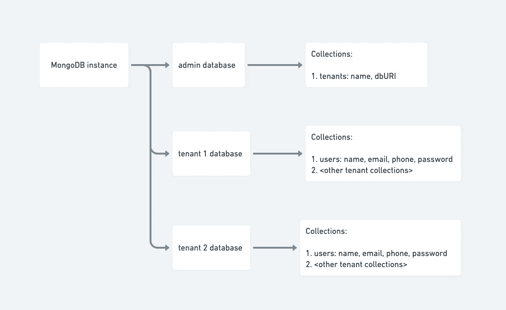
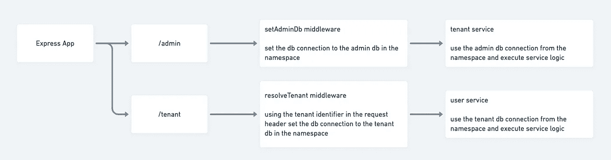

# 用 NodeJS + MongoDB 构建多租户应用

> 原文：<https://medium.com/geekculture/building-a-multi-tenant-app-with-nodejs-mongodb-ec9b5be6e737?source=collection_archive---------0----------------------->

今天，我们完成了一个应用程序的重写，并将其投入生产。这是一次从单租户 Ruby on Rails + ReactJS 到多租户 MERN 的迁移，我想借此机会分享一些东西，希望有些人会觉得相关和有用。

什么是多租户 app？构建和部署多租户应用的好处和缺点是什么？这篇文章不打算讨论这些细节。TL；灾难恢复多租户应用程序允许您部署可服务多个客户的单一代码库，并允许您优化服务应用程序所需的基础架构。这已经成为现代基于云的 SaaS 应用的事实。

如果你有一些 Ruby on Rails 的背景知识，你可能会遇到一个叫做[公寓](https://github.com/influitive/apartment)的宝石，它是任何 RoR 多租户应用程序构建的基础。但是如果你在 NodeJS 中构建一个 app，你会怎么做呢？NodeJS 的公寓 gem 有没有等价的库？看到 NodeJS + MongoDB 在现代 web 应用程序开发中非常流行，人们会认为已经有一些稳定且流行的东西了。啊，不太好！就像其他人一样，我试图用 MongoDB 在 NodeJS 中找到一些现成的多租户解决方案，但没有找到任何好的东西，所以我决定从头开始构建一些东西(查看[样例 repo](https://github.com/syook/node_mongo_multitenant) 以获得完整的样板代码)。

因此，让我们深入了解一下多租户 NodeJS + MongoDB 应用程序的构建模块。

app(和 db)分为 2 类:**租户 app** 和**管理员 app**(API 路由被隔离为`/admin`和`/tenant`)。

**管理应用**用于管理租户创建、存储和获取租户数据库连接信息等。

**租户应用**是每个租户将使用的主要应用，在这里您将编写业务逻辑的核心，如用户管理等。

每个租户将获得自己的数据库，该数据库在管理应用程序中创建新租户时进行初始化。为了简化设置，所有数据库(管理员和租户)都将托管在同一个 mongoDB 实例中，并带有一个连接池，一个公共数据库连接管理器将管理数据库连接池，但这可以根据您的架构和偏好非常容易地向外扩展。

admin and tenat db segregation

以下是该系统的关键组件:

*   `initAdminDbConnection`:通过连接到管理数据库 URI 返回数据库连接池。

*   `initTenantDbConnection`:通过连接到租户数据库 URI 返回数据库连接池。

*   这是一个帮助文件，它将管理所有的数据库连接请求。

`connectAllDb`方法需要在`index.js`中的应用程序启动时调用。这个方法将获得在 admin db 中注册的所有租户，然后为每个租户初始化 db 连接。缓存变量`connectionMap`将保存所有初始化的租户数据库连接。每当在管理应用程序中创建新租户时，该租户的 db 连接都应该被添加到这个连接缓存中(您可以添加一个方法来完成此操作，或者只是简单地从服务中再次调用`connectAllDb`)。

每当发出任何租户数据库请求时，`getConnectionByTenant`方法将连接到所需的租户数据库。

每当发出任何 admin db 请求时，`getAdminConnection`方法将提供到 admin db 的连接。

*   `connectionResolver`:这个中间件将负责为每个 api 请求解析 db 连接，并使 db 连接可用于 api 处理链的下游。

对于每个租户 api 请求，需要调用`resolveTenant`中间件方法来设置所需的租户数据库连接。我们需要在标头中传递租户标识符，然后用它来设置 db 连接。每个请求都需要确定范围，以便独立处理一个请求(这里我使用[continuation-local-storage](https://www.npmjs.com/package/continuation-local-storage)来保持到租户数据库的连接，直到请求被处理)。

对于每个 admin api 请求，我们使用`setAdminDb`中间件方法以相同的方式设置 db 到 admin db 的连接。

*   示例路由以及用于解析数据库连接的中间件

*   **管理应用程序 API**(租户服务):用于获取所有租户和创建新租户的租户服务示例 API。由`connectionResolver`中间件方法提供的管理数据库连接作为参数传递给服务方法，然后服务方法调用所需的模型并在模型上执行数据库查询。

*   **租户应用程序 API**(用户服务):用户服务的示例 API，将用于获取租户的所有用户和创建新用户。由`connectionResolver`中间件方法提供的租户数据库连接作为参数传递给服务方法，然后服务方法调用所需的模型并在模型上执行数据库查询。

**API 请求流程**

api routes with middleware for resolving db connections

这只是一个基本设置，可以根据所设计系统的需要进行修改。例如，在我们的生产应用程序中，我使用 [awilix](https://www.npmjs.com/package/awilix) 进行 DI 和管理范围，因此有些事情的处理方式与这里描述的略有不同。我可能会写另一篇后续文章，在未来提出这些细节，并与 DI 一起提交一个样板文件，以及我们在生产中运行应用程序时学到的一些技巧。直到那时快乐编码:)