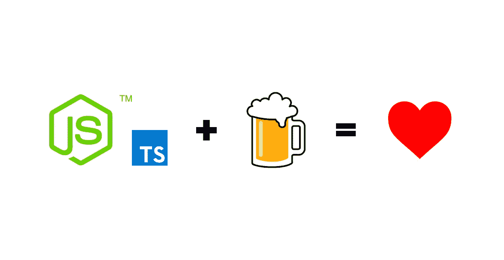
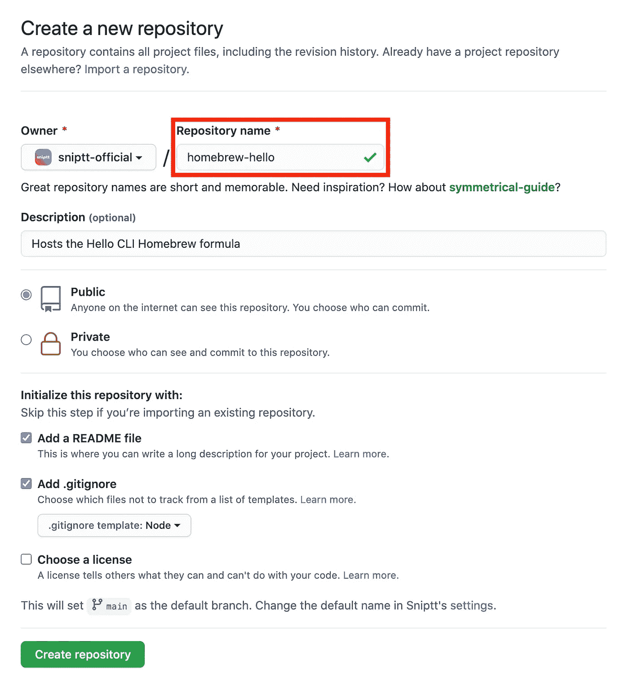
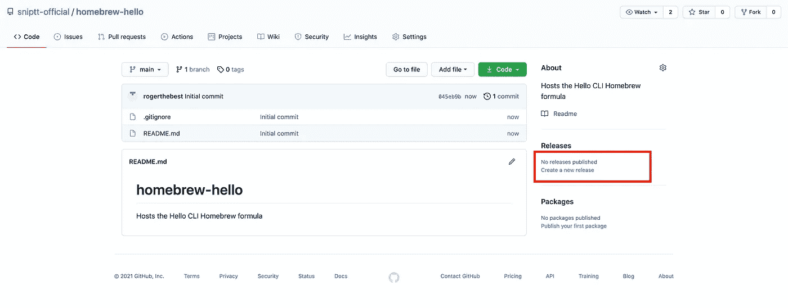
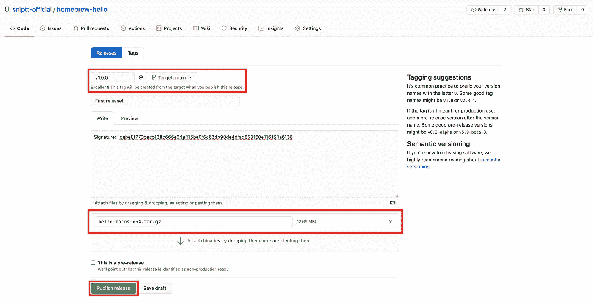
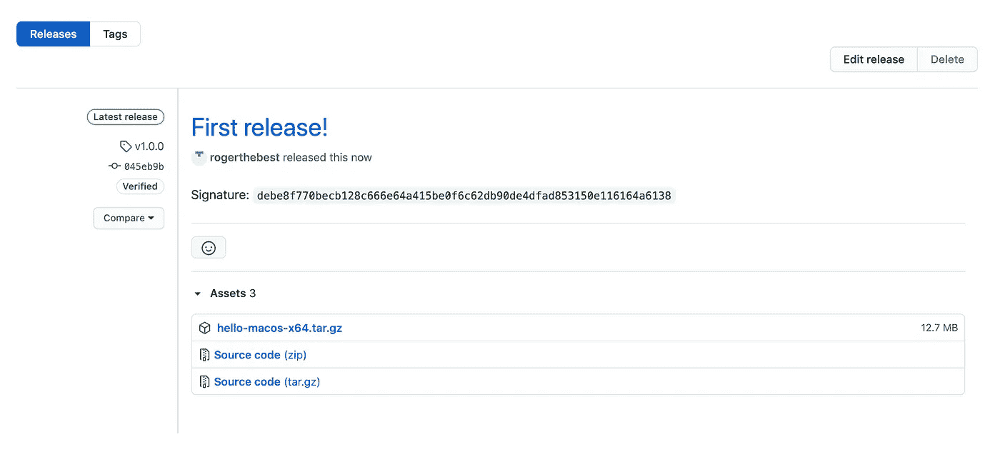

# 使用 TypeScript 构建 Node.js CLI，通过自制软件打包和分发

> 原文：<https://medium.com/geekculture/building-a-node-js-cli-with-typescript-packaged-and-distributed-via-homebrew-15ba2fadcb81?source=collection_archive---------0----------------------->



在 Sniptt，我们的大部分经验都是为 Node 编写 TypeScript 和 JavaScript，所以我们决定使用相同的技术来构建最初几个版本的 [Snip CLI](https://github.com/sniptt-official/snip-cli) 。然而，我们的初步测试表明，在 npm 上专门分发安全软件并不适合我们的许多用户。虽然我们的长期目标是将 Snip CLI 移植到 Golang(见我们的第一次尝试[这里](https://github.com/sniptt-official/ots))，但我们决定在此之前采取一种务实的方法，将我们的 JavaScript 代码打包成适用于 macOS 和 Linux 的独立可执行二进制文件。

在本教程中，我们将向您展示如何使用 TypeScript 构建一个简单的 Node.js CLI，然后通过 Homebrew 打包并分发它。

**TLDR；**要查看包括工作流自动化在内的完整设置，请查看我们如何在[https://github.com/sniptt-official/snip-cli](https://github.com/sniptt-official/snip-cli)使用我们的官方 CLI 完成这项工作😎。

## 项目设置

让我们通过`npm init`初始化一个名为`hello`的新 Node.js 项目。这将创建一个`package.json`文件，我们将在其中跟踪我们的依赖项和脚本。

```
$ mkdir hello
$ cd hello
$ npm init -y
```

接下来，让我们安装 TypeScript 和所需的 Node.js 类型，然后用 TypeScript 编译器注册我们的项目。这将创建一个带有默认编译器选项的`tsconfig.json`。

```
$ npm i typescript @types/node -D
$ npx tsc --init
```

让我们更新`tsconfig.json`来满足我们的需求:

```
{
  "compilerOptions": {
-   "target": "es5",
+   "target": "ES2020",
    ...
+   "outDir": "./build",
+   "importHelpers": false,    ...
  }
}
```

**注意:**我们选择了`ES2020`作为目标，因为我们假设使用的是 Node.js 版本 14 或更高版本。

最后，让我们向 CLI 添加一个入口点，并验证 TypeScript 编译是否按预期工作。

```
$ mkdir src
$ touch src/cli.ts
$ npx tsc
$ ls build
cli.js
```

## 处理命令

假设我们想要实现一个简单的`greet`命令，它将`name`作为位置参数，以及一个可选的`--upper`标志。生成的 CLI 将如下所示:

```
$ hello greet Alice
Hello, Alice!
$ hello greet Alice --upper
HELLO, ALICE!
```

我们将使用 [yargs](https://github.com/yargs/yargs) 来帮助我们解析参数和标志，并搭建 CLI 命令处理程序。它还附带了许多有用的功能，可以提供更好的用户体验，例如自动生成的帮助菜单等等。

```
$ npm i yargs
$ npm i @types/yargs -D # for TypeScript
```

让我们创建`greet`命令模块。

```
$ mkdir src/commands
$ touch src/commands/greet.ts
```

`greet.ts`文件将如下所示:

接下来，让我们更新`cli.ts`入口点。

**注意:**`#!/usr/bin/env node`[she bang 字符序列](https://en.wikipedia.org/wiki/Shebang_(Unix))将 JavaScript 文件“转换”成 Node.js 命令行脚本。

让我们再次用 TypeScript 编译我们的源代码，并试用这个脚本。

```
$ npx tsc
$ ./build/cli.js greet Alice
Hello, Alice!%
$ ./build/cli.js greet Alice --upper
HELLO, ALICE!%
```

👏万岁！我们的 CLI 按预期工作。

## 构建单个可执行文件

假设您想将您的 CLI 打包用于商业用途(没有源代码)。在这种情况下，您可能不希望通过 npm 进行分发，而是希望在某个地方提供下载。

为了将我们的`hello` CLI 打包成一个可执行文件，我们将使用来自 Vercel 的 [pkg](https://github.com/vercel/pkg) 模块。

```
$ npm i pkg -D
```

我们需要更新`package.json`来添加一个使用`pkg`模块为 macOS 构建的脚本，以及一个配置来告诉`pkg`包含`build`文件夹中的所有`.js`文件:

```
{
  ...
+ "bin": {
+   "hello": "./build/cli.js"
+ },
  "scripts": {
    "test": "echo \"Error: no test specified\" && exit 1",
+   "package": "pkg . --targets node14-macos-x64 --output hello"
  },
  ...
+ "pkg": {
+   "scripts": "build/**/*.js"
+ }}
```

**注意:**我们需要添加`bin`条目，以便正确封装带有`pkg`的模块。这也允许用户通过`npm install -g hello`安装模块，只要它发布在 npm 上，或者通过`npm link`本地安装。

让我们试试这是否像预期的那样工作。

```
$ npm run package
$ ./hello greet Bob --upper
HELLO, BOB!%
```

厉害！现在，让我们通过自制程序使`hello`可用。

## 通过自制程序分发

最简单的方法是用正确配置的公式托管一个存储库。存储库的名称必须遵循`homebrew-[name]`约定，在我们的例子中是`homebrew-hello`，这将使它可以通过`brew install sniptt-official/hello/hello`安装。



现在，我们需要在某个地方存放我们的二进制文件。我们发现最简单的方法是在 GitHub 上创建一个发布版本，并将压缩的归档文件作为附件添加进来。

要创建归档文件，请运行:

```
$ tar -cvzf hello-macos-x64.tar.gz hello
```

要计算其签名:

```
$ sha256sum hello-macos-x64.tar.gz
```

我们需要注意签名，因为自制公式需要签名，在我们的例子中，签名是`debe8f770becb128c666e64a415be0f6c62db90de4dfad853150e116164a6138`。

接下来，我们将创建一个版本并上传人工制品。



确认后，应该会看到这样的东西。



最后一步是在我们的新回购中创建自制公式。

```
$ git clone git@github.com:sniptt-official/homebrew-hello.git
$ cd homebrew-hello
$ mkdir Formula
$ touch Formula/hello.rb
```

在`hello.rb`中:

```
class Hello < Formula
  desc "A simple greeter"
  homepage "https://github.com/sniptt-official/hello"
  url "https://github.com/sniptt-official/homebrew-hello/releases/download/v1.0.0/hello-macos-x64.tar.gz"
  sha256 "debe8f770becb128c666e64a415be0f6c62db90de4dfad853150e116164a6138"
  version "1.0.0" def install
    bin.install "hello"
  end
end
```

**注意:**URL 可以在发布的新闻稿的资产部分获得，签名必须与之前获得的签名相匹配。

我们将推动我们的变化，然后它最终是测试时间！

```
$ git add Formula
$ git commit -m "feat(formula): add formula for hello"
$ git push origin main
```

一旦公式被推送到 GitHub，我们就可以通过 Homebrew 安装 hello CLI:

```
$ brew install sniptt-official/hello/hello
```

为了测试:

```
$ hello greet "Homebrew user"
Hello, Homebrew user!%
```

🎉耶，你成功了！恭喜你！

## 后续步骤和高级使用示例

想了解更多？请访问我们在 GitHub 上的 [Snip CLI 项目，了解更多信息:](https://github.com/sniptt-official/snip-cli)

*   支持多命令的高级 CLI 配置
*   Linux 的打包
*   通过 GitHub 操作实现工作流自动化

还有更多。

厌倦了使用密码管理器与您的团队共享 API 密钥、数据库密码、配置文件和其他秘密吗？

**试试** [**Sniptt**](https://www.sniptt.com/) **，这是一款面向开发者的新型秘密管理器，可以让你直接从命令行分享端到端的加密秘密！**