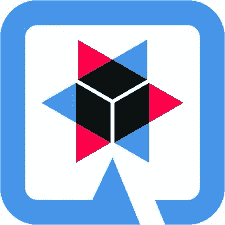

# 用 Kotlin、MongoDB、Panache 和 Quarkus 创建一个反应式 CRUD todo 应用程序

> 原文：<https://medium.com/geekculture/building-a-reactive-crud-todo-app-with-kotlin-mongodb-panache-and-quarkus-1bcac2335e23?source=collection_archive---------7----------------------->


[**Kotlin**](https://kotlinlang.org/) 是一种非常流行的编程语言，目标是 **JVM** (以及其他环境)。Kotlin 在过去几年里经历了一次流行的激增，使它成为最流行的 JVM 语言，当然除了 Java。在基于 **Quarkus** 的项目中拥有 **Kotlin** 可以给我们带来更多好处，同时仍然有可能使用来自 **Quarkus** 生态系统的其他扩展。


kotlinlang.org

Quarkus 为 Kotlin 和一个 **MongoDB Panache Kotlin** 扩展一起使用提供了出色的支持，该扩展以一种反应方式无缝地与反应 **Panache** 实体一起工作时，给用户一些熟悉感。本指南提供了使用该扩展的简单实践经验。



code.quarkus.io

# 先决条件

*   码头工人
*   Java 8+
*   Maven ≥ 3.6.2
*   科特林≥ 1.5.21

# Quarkus 扩展

```
$ ./mvnw quarkus:add-extension -Dextensions="quarkus-mongodb-panache-kotlin,quarkus-resteasy-reactive-jackson,quarkus-resteasy-reactive"
```

# 开发服务的最低配置

当您开发或测试应用程序时，开发服务会自动启动所需的容器。在我们的例子中，它将把 **MongoDB** 数据库开箱即用。仅需要在 **application.properties** 文件中进行配置。

```
quarkus.mongodb.database = todos
```

就是这样！当运行**开发服务时**将根据所提供的扩展使用 **Testcontainers** 旋转特定的数据库。

# 派头和科特林

在 **MongoDB Panache** 指南中，简要提到了两种设计模式方法，即**活动记录模式**和**存储库模式**。使用 Kotlin，我们可以从两者中选择一个稍有变化的。在 Kotlin 版本中，使用`**companion object**`提供活动记录模式。

**伴随对象**包含所有与特定实例无关的方法，允许一般管理和查询绑定到特定类型。有多种选择，但目前是`lateinit`方法。这允许我们将这些字段声明为非空，因为我们知道它们将由构造函数(未显示)或从数据库加载数据的 **MongoDB POJO 编解码器**正确分配。

# 科特林和杰克逊

在本指南中，我们将使用 **rest-easy-jackson** 扩展。如果`com.fasterxml.jackson.module:jackson-module-kotlin`依赖项和`quarkus-jackson`扩展(或`quarkus-resteasy-jackson`扩展)已经被添加到项目中，那么 Quarkus 会自动将`KotlinModule`注册到`ObjectMapper` bean 中(参见[本](https://quarkus.io/guides/rest-json#jackson)指南了解更多细节)。

# 反应性实体和储存库

带有 **Panache** 的 **MongoDB** 允许对实体和存储库使用反应式实现。为此，在定义您的实体:`ReactivePanacheMongoEntity`或`ReactivePanacheMongoEntityBase`，以及定义您的存储库:`ReactivePanacheMongoRepository`或`ReactivePanacheMongoRepositoryBase`时，您需要使用反应变量。

> MongoDB with Panache 的反应式 API 使用哗变反应式类型。如果你不熟悉哗变，查看[哗变——一个直观的反应式编程库](https://quarkus.io/guides/mutiny-primer)。

# 问题域

在这个场景中，我们将使用包含实体方法的**活动记录模式**。这将是一个典型的待办事项列表应用程序，具有包含待办事项的待办事项列表。没什么特别的，只是给出一个关于从哪里开始以及如何对不同的实体和它们的操作建模的想法。

# TodoList 反应式 Panache MongoDB 实体

这是我们的 **TodoList** 实体及其包含由**small rye-哗变**提供的不同反应方法的伙伴对象。使用 **smallrye 哗变**将 conscise Kotlin 代码和优雅的流处理这两个世界混合起来有几个好处。

# 待办事项实体

# 待办事项列表 API 资源

我们定义的所有可用的支持 API 调用。

# 运行应用程序

从现在开始，只需要运行带有实时编码预览的 quarkus 应用程序。

```
$ ./mvnw compile quarkus:dev
```

# API 调用

下面是我们可以对反应式 API 端点进行的 API 调用。

创建一个**待办事项列表**

```
$ curl -X POST "localhost:8080/v1/todos"{"name":"Travel"}
```

获取所有**待办事项列表**

```
$ curl "localhost:8080/v1/todos"
```

将**待办事项**添加到**待办事项列表**

```
$ curl -X PUT "localhost:8080/v1/todos/61054ea7c547c3533bc06a25"

{
    {"title":"Hotelbooking","description":"Somewhere to stay"}
}
```

通过**待办事项列表** id 和**待办事项** Id 完成一个**待办事项**项

```
$ curl -X PUT "localhost:8080/v1/todos/610547059137493daac0367a/3b955596-442d-481a-947b-396d06bdd7b4/complete"
```

按 id 删除**待办事项列表**

```
$ curl -X DELETE "localhost:8080/v1/todos/60db4b085d2d613300cc136b"
```

# 示例响应

获取所有**待办事项列表**

```
[
   {
      "id":"61054ea1c547c3533bc06a24",
      "name":"Groceries",
      "todos":[
         {
            "title":"Avocado",
            "description":"Something Interesting",
            "created":"2021-07-31",
            "id":"3acf9399-55cc-4418-af07-4b194ef37b8b",
            "completed":true
         },
         {
            "title":"Bananas",
            "description":"Something nice",
            "created":"2021-07-31",
            "id":"ea1ebf70-62df-47a6-b5e4-f4a4c73c9eb1",
            "completed":false
         }
      ]
   },
   {
      "id":"61054ea7c547c3533bc06a25",
      "name":"Travel",
      "todos":[
         {
            "title":"Hotelbooking",
            "description":"Somewhere to stay",
            "created":"2021-07-31",
            "id":"3be2f3cc-32ea-4553-b099-45f6a3a440e0",
            "completed":false
         }
      ]
   }
]
```

# 科特林协同作战和兵变

Kotlin 协同例程提供了一个命令式编程模型，它实际上是以异步、反应式的方式执行的。如果你想深入研究夸库和科特林，特别是协程。有一个模块`io.smallrye.reactive:mutiny-kotlin`，这里描述的[是](https://smallrye.io/smallrye-mutiny/guides/kotlin)。

如果你想看这个项目的完整源代码，你可以在 GitHub 上找到。

[在这里找到 GitHub 源码项目](https://github.com/dvddhln/quarkus-kotlin-reactive-mongodb)

其他有用的资源可以在下面的链接中找到。

祝你好运！

[](https://quarkus.io/guides/kotlin) [## 夸库斯-使用科特林

### 当没有选择 Kotlin 时，生成的 pom.xml 相对于它的对应物包含以下修改:

quarkus.io](https://quarkus.io/guides/kotlin) [](https://quarkus.io/guides/mongodb-panache-kotlin) [## Quarkus -带有 Panache 和 Kotlin 的简化 MongoDB

### 正如我们在 MongoDB with Panache 指南中看到的，它允许我们扩展我们的实体和存储库中的功能…

quarkus.io](https://quarkus.io/guides/mongodb-panache-kotlin) [](https://quarkus.io/guides/mongodb-panache) [## Quarkus -简化的 MongoDB

### Kotlin 数据类是定义数据载体类的一种非常方便的方式，使它们成为定义数据载体类的一个很好的匹配

quarkus.io](https://quarkus.io/guides/mongodb-panache)