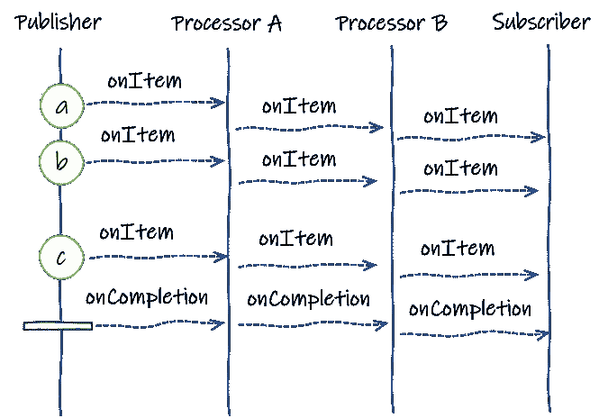

# 用 SmallRye 兵变和 Quarkus 构建反应式轮询机制

> 原文：<https://medium.com/geekculture/building-a-reactive-polling-mechanism-with-smallrye-mutiny-and-quarkus-f86802653140?source=collection_archive---------12----------------------->


正如人们可能知道的，有一组不同的反应式 java 库。兵变**和很多人有什么不同？当然是它的 API。**反应式编程**可能是一个陌生的世界，兵变就在这里，所以帮助学习曲线，使反应式代码更容易访问和阅读。这是 SmallRye 叛乱基金会的几根支柱。**

> 如上所述，异步对于大多数开发人员来说很难掌握，这是有充分理由的。因此，API 不能要求高深的知识或增加认知负荷。它应该可以帮助你设计你的逻辑，并且在 6 个月内仍然可以理解。
> 
> 为了实现这一点，兵变建立在三个支柱上:
> 
> **事件驱动** —哗变时，你监听*事件*并处理它们，
> 
> **API 导航性** —基于事件驱动的本质，API 围绕事件类型构建，并基于您想要处理的事件类型驱动导航。
> 
> **简单性** —哗变只提供两种类型(`Multi`和`Uni`)，可以处理任何种类的异步交互。
> 
> 哗变是一个新颖的反应式编程库。它提供了一个简单但强大的异步开发模型，让您可以构建反应式应用程序。哗变可以用在任何表现出异步的 Java 应用程序中。从反应式微服务、数据流、事件处理到 API 网关和网络实用程序，哗变非常适合。

[https://smallrye.io/smallrye-mutiny/pages/philosophy](https://smallrye.io/smallrye-mutiny/pages/philosophy)

[](https://smallrye.io/smallrye-mutiny/) [## 兵变！

### Java Uni request =(...)Uni uni =请求…

smallrye.io](https://smallrye.io/smallrye-mutiny/) 

考虑到这一点，我们将演示一些基本概念，以及如何将它们应用到我们的问题领域中。

# 先决条件

*   Java 8+
*   龙目岛≥ 1.18.18
*   Maven ≥ 3.6.2
*   关于 SmallRye 兵变的简单知识

# Quarkus 扩展

用于下面介绍的 GitHub 项目。

```
$ ./mvnw quarkus:add-extension -Dextensions="quarkus-rest-client-reactive,quarkus-resteasy-reactive,quarkus-resteasy-reactive-jsonb,quarkus-config-yaml, quarkus-smallrye-openapi"
```

我们将更密切地关注`Uni<T>`和`Multi<T>`的两种不同发射器类型，它们稍后将服务于我们的特定目的。首先，简单介绍一下不同的发射类型。

# Uni 类型

一个`Uni<T>`是一个专门的流，它只发出一个项目或一个失败。通常，`Uni<T>`非常适合表示异步动作，比如远程过程调用、HTTP 请求或者产生单个结果的操作。

# 一个简单的例子

```
Uni.createFrom().item(1)
        .onItem().transform(i -> "hello-" + i)
        .onItem().delayIt().by(Duration.ofMillis(100))
        .subscribe().with(System.out::println);
```

# 使用发射器创建 Unis(高级)

您可以使用发射器创建一个`Uni`。这种方法在集成基于回调的 API 时非常有用:

```
Uni<String> uni = Uni.createFrom().emitter(em -> {
    // When the result is available from callback, emit it
    em.complete(result);
});
```

发射器也可以发送失败。它还可以收到取消通知，例如，停止正在进行的工作。

# 多类型

`Multi<T>`是一个数据流，它:

*   放出`0..n`项事件
*   发出失败事件
*   为有界流发出完成事件

例如，你可以从已知物品或者从一个`Iterable`中创建一个`Multi`:

```
Multi<Integer> multiFromItems = Multi.createFrom().items(1, 2, 3, 4);
Multi<Integer> multiFromIterable = Multi.createFrom().iterable(Arrays.asList(1, 2, 3, 4, 5));
```

来自 SmallRye 指南文档

[https://small rye . io/small rye-哗变/入门/创建-multis](https://smallrye.io/smallrye-mutiny/getting-started/creating-multis)

# 从分笔成交点创建多点(高级)

您可以创建一个周期性发出*滴答*的流:

```
Multi<Long> ticks = Multi.createFrom().ticks().every(Duration.ofMillis(100));
```

下游接收一个计数器`long,`。对于第一个刻度，它是 0，然后是 1，然后是 2，依此类推。这将产生一个 ScheduledExecutorService，它以预定义的频率运行分笔成交点。

# 使用发射器创建多重(高级)

您可以使用发射器创建一个`Multi`。这种方法在集成基于回调的 API 时非常有用:

```
Multi<Integer> multi = Multi.createFrom().emitter(em -> {
    em.emit(1);
    em.emit(2);
    em.emit(3);
    em.complete();
})
```

# Quarkus 反应式 Rest 客户端

那么，我们如何结合这两种反应流方法呢？我们将使用来自 **Quarkus** 的反应式 Rest 客户端，它利用了 **Vertx** 。事件**输入/输出**线程。它产生一个结果`Uni<String>`。这将服务于我们稍后基于回调的发射器。如果您要使用工作线程池，您将使用非反应性 rest 客户端部分。

```
<dependency>
  <groupId>io.quarkus</groupId>
  <artifactId>quarkus-rest-client-reactive</artifactId>
</dependency>
```

它应该看起来像这样。

```
@Path("/")
@RegisterRestClient
public interface MyReactiveRestClient {

    @GET
    @Produces(MediaType.*APPLICATION_JSON*)
    Uni<String> getAPIResponse();
}
```

# 问题域

假设我们想要一个基于回调的**轮询**机制，该机制尝试向几个后端执行一组 **API 调用**，收集数据，并在最后一步完成时执行某些动作。我们如何用**兵变的方法**来解决呢？

我们可以开始结合基于 tick 的 multi 来创建轮询机制。对于每个分笔成交点，我们基于配置中预定义的 API 服务生成一组 multi。我们**为服务转换**一个 Uni 列表，该列表基于来自我们稍后将订阅的反应客户端的 Uni 响应。

现在 uni 被延迟创建，这意味着我们必须开始订阅管道，以便订阅者开始接收来自发布者的事件。从上游到下游的事件由`Publishers`发布，由(下游)`Subscribers`消费。然而，由于 API 调用是基于回调的，为了执行我们的动作`doSomethingOnComplete()`，当所有的请求完成时，我们仍然必须有一些完成的概念。



Event flow from Publisher to Subscriber

这就是**发射器**发挥作用的地方。我们创建一个线程安全的原子计数器，用于计算响应的数量，并在接收到所有回调时完成发射器。我们的订阅者将完整的发射订阅为一个`onCompletion()`事件，然后该事件执行操作。该事件基本上表明源不会再发出任何项目。

差不多就是这样！

如果你想知道更多关于实践中的用法，有一个 GitHub repo 应用了这个机制。

[在这里找到 GitHub 源代码项目](https://github.com/dvddhln/quarkus-reactive-open-api-merger)

祝你好运！