# 构建富文本编辑器:第 4 天

> 原文：<https://medium.com/geekculture/building-a-rich-text-editor-day-4-bb6af36521e7?source=collection_archive---------23----------------------->

## 基本写作经验

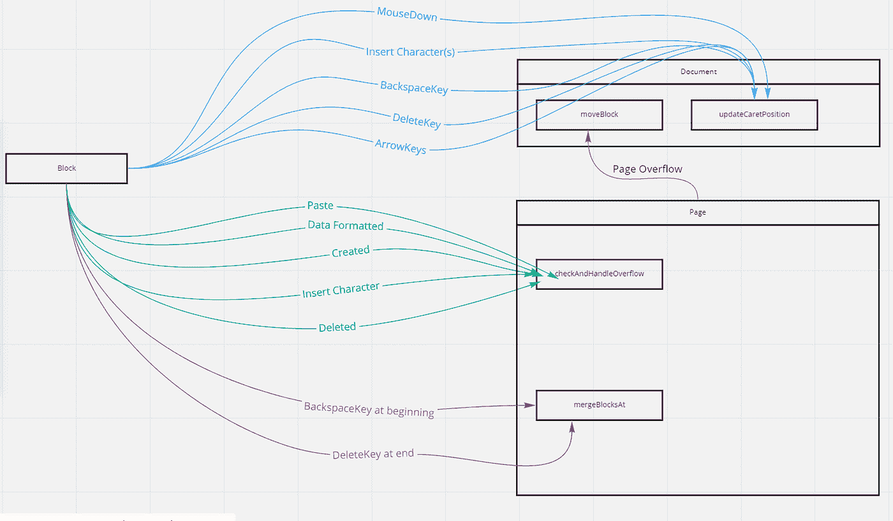

Editing Events

## [索引](https://svr8.medium.com/building-a-rich-text-editor-index-5d11d23c5111)

它可能看起来像一些复杂的电子电路，但这简化了许多编码。

块之间的箭头告诉我们，源将触发目标块。在这种情况下，该块将通过父`Page`的`checkAndHandleOverflow the` 方法触发`pageOverflow` 处理机制。

连接箭头上的文字代表了将要发生的“事件”。

这将使处理和预测边缘情况变得更加容易。为什么？插入字符可能由于简单的按键而发生，或者可能在用户粘贴剪贴板中的内容时发生。

## 紧密耦合的问题

考虑下面的场景。

有 3 个菜单可以导致数据格式化。一个菜单是包含工具列表的通用标题，第二个是让用户快速选择一组字体的弹出菜单，第三个只是用户选择的“最后文本格式”。所有 3 个菜单或小部件在块上触发相同的行为:`formatData`。现在，假设我想添加另一个特性，让用户看到最近执行的 50 种数据格式的列表。点击其中任何一个都会触发相同的格式。

让块跟踪每个将导致数据格式化的小部件会变得很乏味。相反，它将监视事件`DataFormatEvent` ，并在它完成时执行它。所以添加历史跟踪器很容易，因为我可以简单地让它订阅这个事件，而不需要从多个块中复制任何数据。

# 如何在 Angular 中实现 Publisher Subscriber？

我的实现是这个要点的稍微修改版本，以处理引用问题。我将构建现有解决方案并对其进行修改，这将有助于您理解问题。

在`util` 目录中创建了`PubSub.ts` 文件后，我开始使用订阅-取消订阅机制:

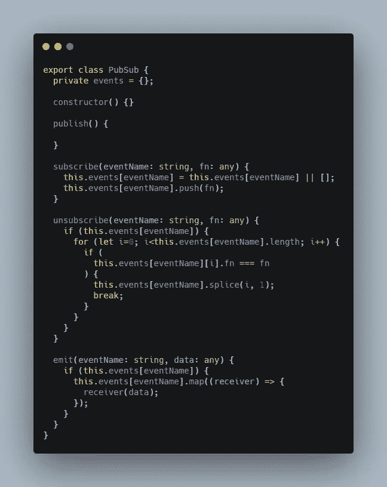

Simple Publisher Subscriber

在`subscribe` 方法中，将给定的回调函数`fn` 插入到 eventLog: `events` 对象中。这将跟踪已订阅事件的函数。

在`unsubscribe` 方法中，所有的`fn` 方法都被迭代，以检查匹配的函数并将其从列表中删除。

最后，`emit` 方法将简单地遍历所有 fn 方法并调用它们。注意，这些函数是通过这个`PubSub` 对象调用的。这意味着被调用的函数与这个`PubSub` 对象相关联。

**测试 PubSub**

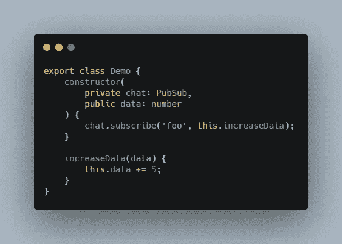

A test class

让我们创建一个演示类:

在这里，对象订阅或进入一个名为`foo`的聊天室，每次有消息发送到这个房间，它就执行它的方法`increaseData`。

`increaseData`将简单地将其`data`的值增加 5。操作简单，易于通过控制台日志进行监控。

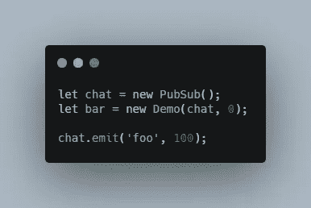

生成一个临时角度组件，编写以下代码并监控日志。

您将看到以下错误消息:

`Cannot read property data of undefined`。

这里发生了什么事？

进一步调试，如果你通过`console.log(this)`打印`this` 对象，它将显示它是一个 PubSub 对象。因为它是通过 PubSub 在源代码中调用的，所以它与它相关联。

为了解决这个问题，我添加了另一个属性来跟踪真正的来源。

我在文件`util/PubSub/PubSubReceiver.ts`中创建了一个快速包装器模型:

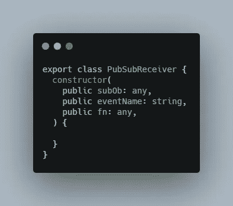

并且，更新`util/PubSub/PubSub.ts`:

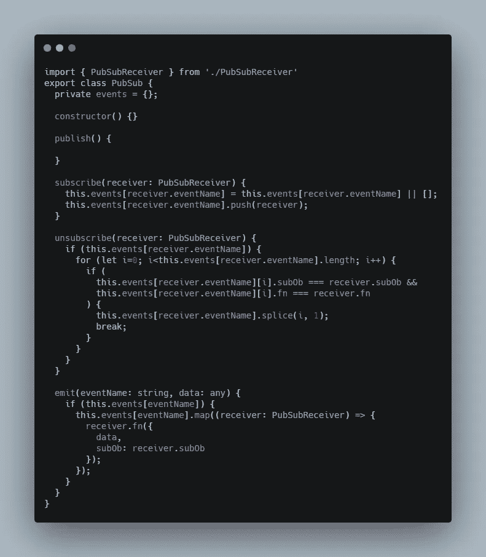

在这种情况下，接收器函数将能够通过`event.subOb`获取当前对象。

我将遵循这个指导模板来组织代码。每个模型文件都有以下部分:

1.  对象数据:对象属性的 getter setter。(请记住，所有属性都是私有的或只读的)
2.  DOM 工具:直接与网页交互
3.  用户操作:复杂任务的高级实现
4.  事件发射器:简单地向相关事件广播数据
5.  事件处理程序:处理外部更改
6.  实用工具:快捷方便的工具

# 开发块模型

现在我们已经准备好了思维导图，让我们从定义事件开始。

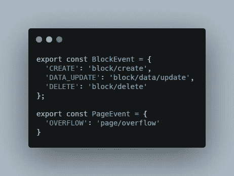

config/modeEvents.ts

创建一个`config/modelEvents.ts`文件，添加以下内容:

转到块模式，从简单的东西开始:处理对象数据和 DOM 操作部分。请注意，根据图表，Block 没有订阅任何事件。因此，构造函数在这里保持为空。

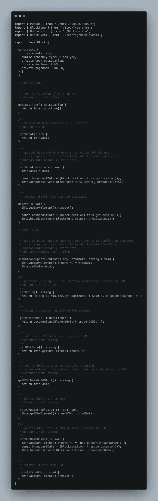

Block.ts

这些工具将提供易于使用的 getter/setter 来与块交互。我已经添加了一个`broadcastEvent` 方法，接下来我将构建它:

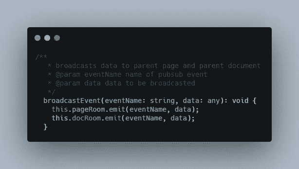

Block.ts

这个简单的方法将广播到与之连接的所有模型。

`pageRoom` 是父页面的私人房间。

我将定义一个简单的方法:`characterInput()`来表示基本的文本添加:

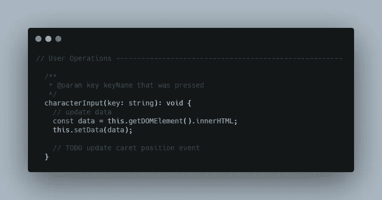

在`models/Block.ts`文件的事件处理程序部分，添加:

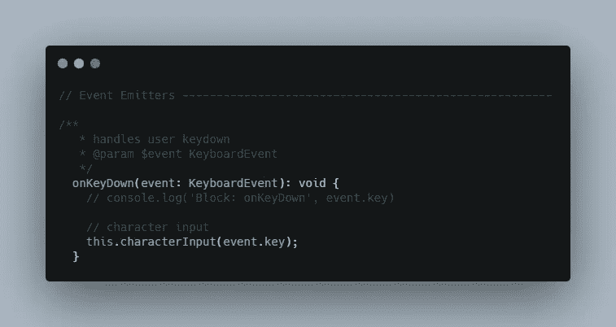

这将建立处理字符输入的基本模型。

# 开发页面模型

在编写之前，通过注释准备文件中的 6 个部分，并添加以下方法:

初始化:

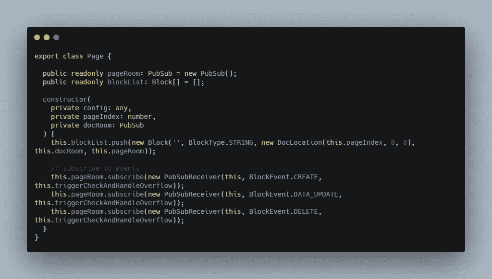

Page.ts

请注意，构造函数已经为当前对象订阅了事件。

1.  对象数据部分

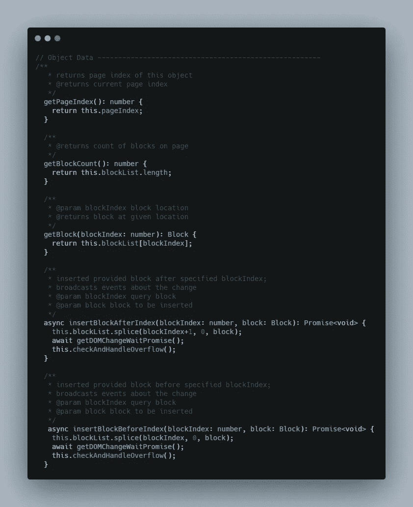

2.DOM 工具

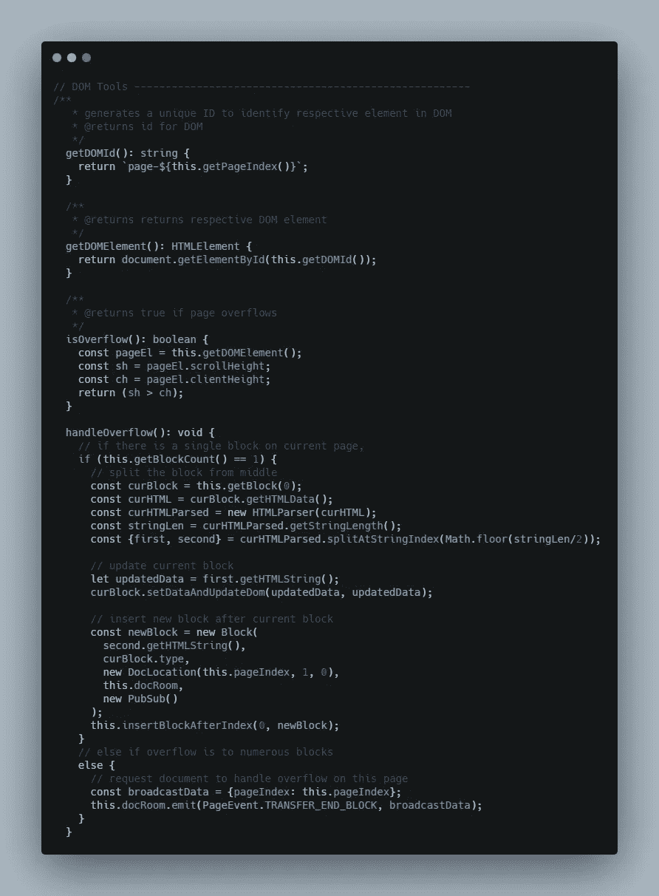

这种页面溢出处理机制完全是任意的。在中间分割块的决定是随机决定的。您可能会找到更好的机制来处理这个问题。虽然这是一种罕见的情况，其中存在一个单独的块，但您可能希望以 75%的高度拆分块，或者考虑插入符号位置并在当前插入符号位置拆分。

今天，我将跳过用户操作部分，转而讨论事件。

4.事件发射器

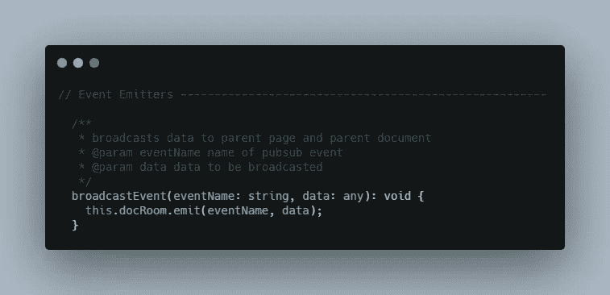

这非常类似于 Block 的事件发射器部分。

5.事件处理程序

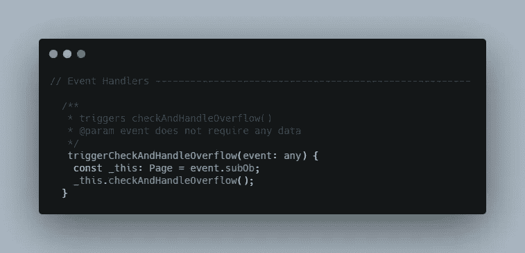

6.公用事业

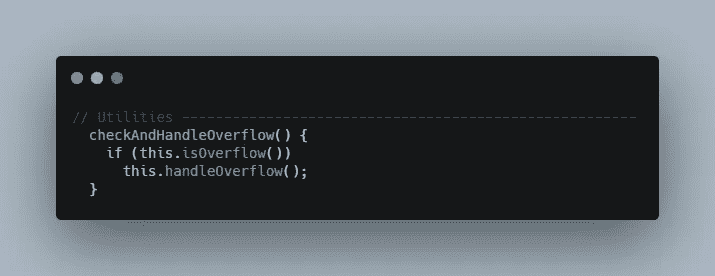

我必须在这里为实用程序创建一个额外的触发器来解决`PubSub`中的引用问题。

# 开发文档模型

希望你能了解我是如何一点一点地建造这些模型的。我现在将直接分享 Doc 模型，通过它的各个部分应该很容易理解它:

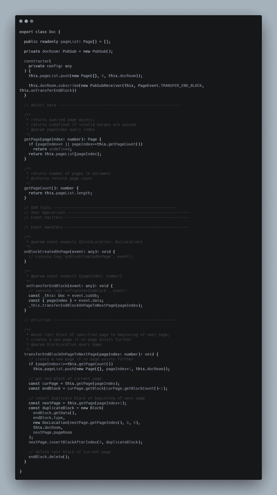

# 现在最简单的部分是:')

使用 angular cli 创建组件:文档，并创建文档属性:

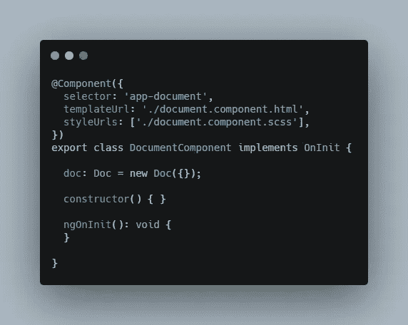

在 corresponding.html 文件中，添加:

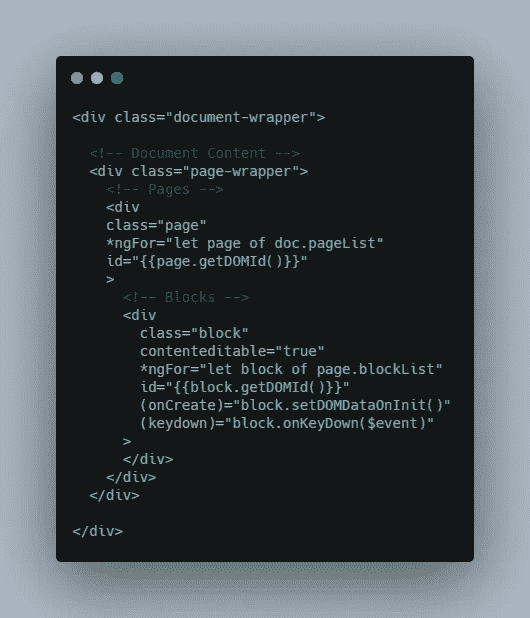

TADAAA

这将为您提供以下结构，并在页面上输入直到溢出:

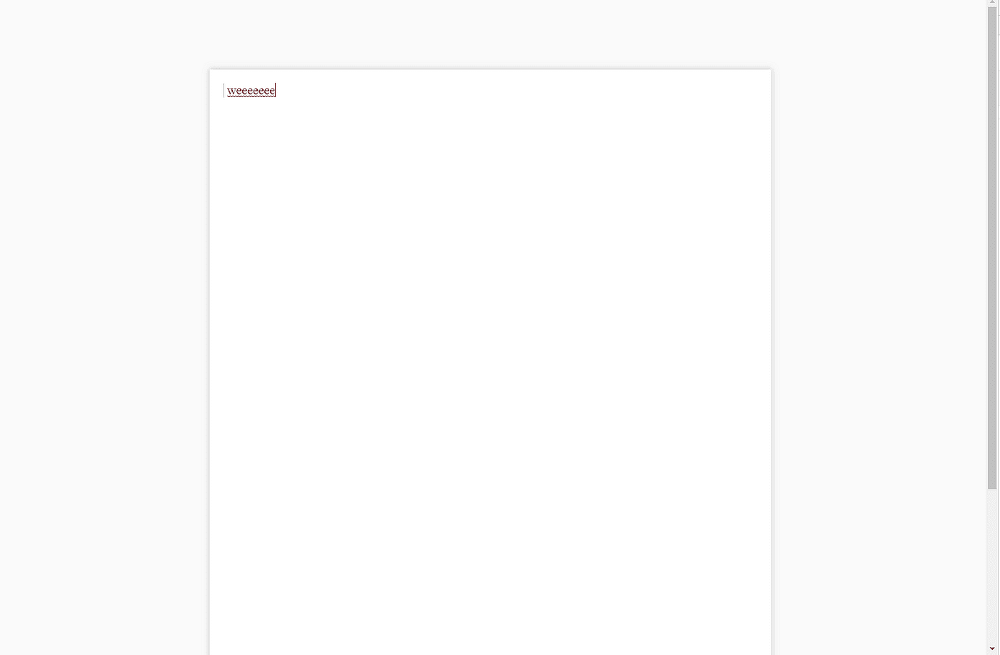

我在这里将页面宽度和高度设置为 A4 纸大小。

这应该给你一个想法，如何着手开发一个有这么多数据操作和边缘情况的软件。这里使用 pub/sub 的想法来自机器人技术。

> 在群体机器人中，机器人必须不断调整以适应周围环境的突然变化，这相当于极高数量的边缘情况。鲁棒的算法是通过事件设计的，因此每个机器人都可以很好地处理自己，并且很容易向这些机器人添加功能。

我现在要结束这个系列了。希望这在某种程度上帮助了你。

拜拜。