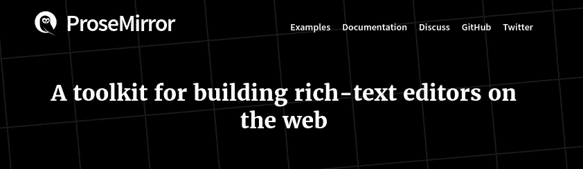

# 为现代出版商构建富文本编辑器

> 原文：<https://medium.com/geekculture/building-a-rich-text-editor-for-modern-publishers-cff7db6dc2e9?source=collection_archive---------11----------------------->

深入了解一个灵活的富文本编辑器的制作，它将作为我正在构建的新博客平台 Blogody 的一个组成部分发布。选择最适合现代出版商的编辑器技术是一条崎岖不平的道路。偷偷预览最后的结果…


如果你像这个数字时代的大多数人一样，你每天都在使用文本编辑器，更有可能是每隔一分钟就使用一次。只是给你朋友的一条短信，给你同事的一封电子邮件，或者给你老板的一份文件:大多数电子文本都是用编辑器编写的。

编辑器的无处不在可能会让你认为你在处理相当简单的技术，但事实远非如此。流畅、自然的编辑器体验只能由一种非常先进的技术来创造，这种技术考虑了所有可能的用户交互，同时保持极快的速度和惊人的响应。


对于网络编辑来说更是如此，他们需要处理不同的浏览器技术，缓解他们的怪癖，补偿缓慢的网络速度，并默默地掌握所有复杂的状态和用户交互。

现代作家和出版商需要一个编辑器来生成干净的、语义有意义的文档，让他们专注于写作和文章写作。这个行业最好的编辑是那些不太死板，但是仍然使用一些约束的人，这些约束对于特定的用例来说并不觉得是约束。这些编辑器巧妙地弥合了明确和僵化的降价编辑器和成熟的所见即所得编辑器之间的差距。

# 面向 web 的富文本编辑器

为网络选择合适的编辑技术并不容易。由于浏览器本身理解 JavaScript，所以编辑器应该用这种语言编写，或者在像 React 这样的框架中使用 JavaScript。虽然有许多开源编辑器框架可用，但在 2021 年构建一个伟大的有意义的编辑器需要投入多少工作，这仍然让我感到惊讶。

对于 [Blogody](https://www.https://www.blogody.com) ，我要求框架包含原始的构建模块*和*定制编辑器以精确匹配主要目标群体的能力:现代内容出版商和作家。


我从 Ghost 的[knig 编辑器](https://github.com/TryGhost/Admin/tree/main/lib/koenig-editor)开始，因为它是开源的。它使用 [Mobiledoc](https://github.com/bustle/mobiledoc-kit) 连接 [EmberJS](https://emberjs.com) 。我也打算使用 React Mobiledoc 变体，但是 nig 编辑器与 EmberJS 和 Ghost 的 NodeJS 管理接口耦合得太紧了。我想，把它雕刻出来比重新开始需要更多的工作。从零开始还让我有更多的自由从一开始就选择更好的技术堆栈。

因为 [Blogody](https://www.blogody.com) 是用 React 构建的，所以更明智的选择是寻找一个原生 React 编辑器框架。这就是我了解 [Slate](https://github.com/ianstormtaylor/slate) 的方式，它是由瑞士著名在线报纸[Republic](https://www.republik.ch/)的一位全栈开发者推荐给我的。Slate 看起来非常有前途，有着清晰的原则、充满活力的开源社区和出色的 React 集成。受 Republik 团队成功故事的启发，我花了一个多月的时间构建了一个基于 Slate 的新编辑器。

虽然我仍然认为 Slate 具有最好的 React 接口，但它在一些意想不到的方面被证明是缺乏的:当你需要为原始元素构造合理的边界时，你没有得到太多的工具。例如，如果你想确保一个图片元素后面总是跟着一个段落，你必须在一个所谓的[规格化器](https://docs.slatejs.org/concepts/11-normalizing)函数中自己定义。虽然这是可能的，但您很快就会发现，您需要从头开始开发一个内容模式，这不是一个周末就能轻松完成的事情。更让我吃惊的是:在一台快速的台式电脑上粘贴长文档会使用户界面冻结超过 7 秒钟。就在那时，我对石板失去了耐心。

如果您需要为自己的项目选择一个编辑器框架，下面的建议可以节省我很多时间:

> *在您决定采用哪种技术之前，请使用苛刻的测试数据进行一些简单的最终用户测试。对于一个编辑来说，复制&粘贴大量文本，高速书写文本等。看看在压力下这项技术是否还能打动你。*

# 进入 ProseMirror

有了这些发现，我发现自己又回到了原点。缓慢的编辑器是获得无缝 React 集成的代价吗？有没有我还没发现的替代品？

在四处寻找时，我偶然发现了一篇关于 [ProseMirror](https://prosemirror.net) 的文章，这是另一个广受好评的编辑器框架，用于 [New Your Times](https://open.nytimes.com/building-a-text-editor-for-a-digital-first-newsroom-f1cb8367fc21) 的数字新闻室。开源了一个更传统但有用的论坛社区，完全由创作者和大师维护。这个项目得到了一些知名公司的支持，所以引起了我的注意。第一次最终用户测试显示了惊人的性能特征。上面提到的例子在 Slate 中用了 7 秒钟，在 ProseMirror 中用了 150 毫秒就完成了——这立刻让我兴奋不已。



ProseMirror 只有一个问题。我怎么可能将 ProseMirror 集成到 Blogody React 应用程序中？我发现的所有 ProseMirror-React 样板实现看起来都非常复杂，我几乎不明白它们在做什么:React 和 ProseMirror 之间的状态通信既不直接也不容易。

在 ProseMirror 论坛社区的一些人的帮助下，我开始尝试做一个简单的 React 桥。第一步真的很难，我经常想退出那个实验。我需要多少时间来完成简单的事情，比如集成一个简单的段落反应组件？

虽然我学到了很多关于 ProseMirror 乐高积木和你可以连接的精心设计的界面的知识，但当我突然想到一个绝妙的主意时，我几乎放弃了 ProseMirror:

> *让 ProseMirror 处理原始元素，如段落、图形等。使用它的原生 JavaScript 框架，只对交互式覆盖元素使用 React，比如悬停栏或下拉菜单。*

有了这种清晰的概念区分，我能够更快地取得进展，并确保 ProseMirror 良好的性能特征，同时能够将编辑器集成到主 React 应用程序中。

再过一个月回头看，我确信这最终是正确的选择。ProseMirror 在处理基本编辑器元素方面非常有效，它很容易通过插件方法进行扩展，并通过灵活的模式设计系统确保文档的完整性。此外，它允许我通过我定制的 React 桥用复杂的 React 覆盖组件修改它。

渴望看到一些演示结果吗？开始了。

# 悬停工具栏

我一直是上下文工具栏的粉丝，这些工具栏提供了此时此刻有意义的编辑选择。只需选择一些文本，嵌入式格式工具栏就会打开:


侧菜单允许您插入块级内容，如水平线或图像。如下图所示，每一行都会出现一个加号按钮:


# 侧菜单

侧菜单允许您插入块级内容，如水平线或图像。如下图所示，每一行都会出现一个加号按钮:


# 快捷键

Blogody 编辑器的早期设计目标之一是让键盘成为一流的输入法。虽然每个动作都可以用鼠标调用，但键盘也是一个不错的选择。

*   `Ctrl` + `b`切换选择**粗体**。
*   `Ctrl` + `i`切换选择*斜体。*
*   `Ctrl` + ```切换选择`inline code`。
*   `Ctrl` `Shift` + `1...3`将文本块更改为某一级别的标题。
*   `Ctrl` `Shift` + `8`在有序列表中包装选择。
*   `Ctrl` `Shift` + `9`在项目符号列表中换行。

# 输入规则

您也可以使用受降价启发的输入规则。按下`/`即可打开侧菜单，您可以用箭头键移动当前选择，用`Enter`确认或用`Esc`离开。

下面的截屏演示了在不离开键盘的情况下构建文本是多么容易:


*   `#`后跟一个空格，作为标题行的开始。
*   `##`后跟一个空格，以此行开始一个子标题。
*   `###`后跟一个空格，使该行成为子标题。
*   `-`或`*`后跟一个空格，创建一个项目符号列表。
*   `1.`后跟一个空格，创建一个有序列表。
*   `>`后跟一个空格，创建一个引号。
`````创建一个代码块。

# Unsplash 小工具

ProseMirror React 桥还可以实现更复杂的功能。我已经与 Unsplash 合作，能够将免版税的图像拾取器集成到 Blogody 编辑器中:


# 摘要

Blogody 的 richt-text 编辑器非常适合现代网络，将帮助作家和出版商专注于为他们的观众制作令人惊叹的内容。该编辑器由 ProseMirror 提供支持，非常稳定和快速。使用新开发的用于 Blogody 的 React bridge，甚至像 Unsplash 图像拾取器这样的复杂小部件也可以轻松集成，并且您可以期待在未来的 [Blogody 版本](https://www.blogody.com/news)中出现更多引人注目的功能。

> [*你想提前使用我正在创建的全新博客平台 Blogody 吗？只需在新的 Blogody 登录页面注册，成为第一批收到通知的人！*](https://www.blogody.com/landing)

*原载于 2021 年 4 月 30 日 https://www.jamify.org**[*。*](https://www.jamify.org/2021/04/30/building-a-rich-text-editor-for-modern-publishers/)*