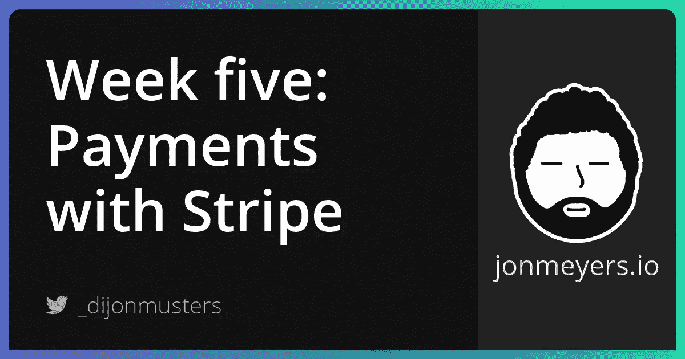

# 构建 SaaS 项目第五周:用 Stripe 和 Webhooks 处理支付

> 原文：<https://medium.com/geekculture/building-a-saas-project-week-five-processing-payments-with-stripe-and-webhooks-89078bbd8d4f?source=collection_archive---------19----------------------->

## 本周的主题是用 Stripe 处理信用卡支付。我们着眼于创建一个会话并订阅 webhooks，以便了解用户何时购买了一门课程。



[项目回购](https://github.com/dijonmusters/courses)

本周的主题是用 Stripe 支付。我们将实现一个无服务器的功能来收费卡，并实现 webhooks 来更新 Prisma 用户购买的课程。

## 扩展用户模式

为了跟踪用户购买了哪些课程，我们需要扩展我们的用户模式，以包含“stripeId”字段。

```
// prisma/schema.prisma

model User {
  id           Int           @id @default(autoincrement())
  email        String        @unique
  courses      Course[]
  stripeId     String        @unique
  createdAt    DateTime      @default(now())
}
```

这将用于将 Prisma 用户映射到 Stripe 客户。

> 这一修改将暂时中断我们的应用程序，因为“stripeId”现在是必填字段，当我们在应用程序中创建用户时，我们不会设置它。

让我们创建一个迁移，将这些更改应用到我们的数据库。

```
npx prisma migrate dev --name add-stripe-id-to-user --preview-feature
```

## 设置条带

你需要做的第一件事是[创建一个条纹账户](https://dashboard.stripe.com/register)。

一旦您创建了一个帐户并登录到您的 Stripe 仪表盘，您将需要输入您的企业详细信息以激活您的帐户。这将使您能够访问生产 API 密钥，并允许您处理实际支付。您不需要激活您的帐户来完成这个系列，但如果您想在现实世界中使用它，您可能需要这样做！

接下来，我们需要在应用程序中安装两个条带库。

```
npm i stripe @stripe/stripe-js
```

> “stripe”是一个后端库，我们将使用它来处理支付，而“@stripe/stripe-js”是一个前端库，我们的客户将使用它来启动支付会话。

现在我们需要修改我们的。env 文件来添加我们的新 API 密钥—这些可以在“Get your API keys”面板下的 Stripe 仪表板中找到。确保您使用“测试”键进行本地开发。

```
// .env

// other secrets
STRIPE_SECRET_KEY=your-secret-key
NEXT_PUBLIC_STRIPE_PUBLIC_KEY=your-publishable-key
```

> 我们必须在前端环境变量前加上“NEXT_PUBLIC_”。不包含它的变量将只对我们的无服务器功能可用。

遵循相同的逻辑从[托管在 Vercel 上，自动部署与 GitHub 和配置自定义域](https://jonmeyers.io/blog/build-a-saas-platform-with-stripe/hosting-on-vercel-automatic-deploys-with-github-and-configuring-custom-domains)添加秘密在 Vercel 中——没有这个我们的托管应用将无法工作。

太好了！现在我们应该有条纹线了！

## 创建条带客户

我们需要创建一个 Stripe 客户来跟踪购买情况以及订阅是否有效。我们可以在用户第一次购买时这样做，但是，我们不知道他们是否会购买特定的课程或激活他们的订阅。这将需要我们在每个支付场景中添加一些逻辑，以便在向他们的账户收费之前首先检查是否存在 stripe 用户。我们可以极大地简化这个逻辑，只需在 Prisma 用户的同时创建一个 Stripe 客户，这是新用户首次登录我们的应用程序。

在 Prisma 中创建用户之前，让我们修改我们的 auth hook 来创建一个 stripe 客户。这样，我们可以使用新创建的条带 ID 来创建我们的用户。

```
// pages/api/auth/hooks.js

// other imports
import initStripe from 'stripe'
const stripe = initStripe(process.env.STRIPE_SECRET_KEY)

module.exports = async (req, res) => {
  // other auth code
  const customer = await stripe.customers.create({
    email,
  })
  const user = await prisma.user.create({
    data: { email, stripeId: customer.id },
  })
}
```

整个文件应该是这样的。

```
// pages/api/auth/hooks.js

import { PrismaClient } from '@prisma/client'
import initStripe from 'stripe'

const prisma = new PrismaClient()
const stripe = initStripe(process.env.STRIPE_SECRET_KEY)

module.exports = async (req, res) => {
  try {
    const { email, secret } = JSON.parse(req.body)
    if (secret === process.env.AUTH0_HOOK_SECRET) {
      const customer = await stripe.customers.create({
        email,
      })
      const user = await prisma.user.create({
        data: { email, stripeId: customer.id },
      })
      console.log('created user')
    } else {
      console.log('You forgot to send me your secret!')
    }
  } catch (err) {
    console.log(err)
  } finally {
    await prisma.$disconnect()
    res.send({ received: true })
  }
}
```

很好，现在每当有新用户登录时，我们都应该创建一个 Stripe 客户，然后创建一个 Prisma 用户，该用户引用该客户的 ID。

## 用条纹卡充电

现在，我们希望构建一个无服务器的函数，可以处理特定课程的付款。我们需要告诉这个函数用户正在购买哪个课程，所以将使用一个动态 API Route 来传递课程 ID。让我们在“/ pages/API/charge-card/[courseId]. js”处创建一个新的无服务器函数。

```
// pages/api/charge-card/[courseId].js

module.exports = async (req, res) => {
  const { courseId } = req.query
  res.send(`charging card for course ${courseId}`)
}
```

> 您可以通过访问“http://localhost:3000/API/charge-card/any-value-you-want”来触发此无服务器功能。在这种情况下，它应该打印出“当然，任何值你想要的充值卡。

下一步将是算出这门课我们需要收多少钱。我们可以把它和来自前端的请求一起传递，但是，这很容易被用户修改。

**我们不能相信客户的任何东西！**

让我们给我们的 Prisma DB 打个电话，了解一下真实的价格。

```
// pages/api/charge-card/[courseId].js

import { PrismaClient } from '@prisma/client'

const prisma = new PrismaClient()

module.exports = async (req, res) => {
  const { courseId } = req.query

  const course = prisma.course.findUnique({
    where: {
      id: parseInt(courseId),
    },
  })

  await prisma.$disconnect()

  res.send(`charging ${course.price} cents for ${courseId}`)
}
```

> 我们在这里使用 parseInt()将从 req 的查询中得到的字符串转换成一个整数，这是 Prisma 所期望的 ID。

接下来，我们想知道购买本课程的用户是谁。这意味着我们希望 API 路由只能被登录的用户访问。让我们用“withApiAuthRequired”来包装它，并通过他们的会话电子邮件来确定谁是用户。

```
// pages/api/charge-card/[courseId].js

import { PrismaClient } from '@prisma/client'
import { withApiAuthRequired, getSession } from '@auth0/nextjs-auth0';

const prisma = new PrismaClient()

module.exports = withApiAuthRequired(async (req, res) => {
  const { courseId } = req.query
  const { user: { email } } = getSession(req, res)

  const course = prisma.course.findUnique({
    where: {
      id: parseInt(courseId),
    },
  })

  const user = await prisma.user.findUnique({
    where: {
      email,
    },
  })

  await prisma.$disconnect()

  res.send(`charging ${user.email} ${course.price} cents for ${courseId}`)
})
```

接下来，我们要告诉 Stripe 我们实际向客户收取的费用。我们通过创建一个行项目列表和一个支付会话来实现这一点。

```
// pages/api/charge-card/[courseId].js

//other imports
import initStripe from 'stripe'

const stripe = initStripe(process.env.STRIPE_SECRET_KEY)

module.exports = async (req, res) => {
  // course and user stuff

  const lineItems = [
    {
      price_data: {
        currency: 'aud', // swap this out for your currency
        product_data: {
          name: course.title,
        },
        unit_amount: course.price,
      },
      quantity: 1,
    },
  ]

  const session = await stripe.checkout.sessions.create({
    customer: user.stripeId,
    payment_method_types: ['card'],
    line_items: lineItems,
    mode: 'payment',
    success_url: `${process.env.CLIENT_URL}/success`,
    cancel_url: `${process.env.CLIENT_URL}/cancelled`,
  })

  res.json({ id: session.id })
})
```

我们需要为 stripe 提供一个成功和取消 url 来转发用户。这些需要在“pages/success.js”和“pages/cancelled.js”中创建。此外，我们需要为 CLIENT_URL 创建一个环境变量。按照前面的步骤将其添加到。env 的值为“http://localhost:3000 ”, Vercel 中的新 secret 的值为您托管的 URL 我的是“https://courses-SaaS . Vercel . app”。

最后，我们希望将所有这些封装在一个 try/catch 块中，以防出错。整个文件应该是这样的。

```
// pages/api/charge-card/[courseId].js

import { withApiAuthRequired, getSession } from '@auth0/nextjs-auth0';
import { PrismaClient } from '@prisma/client'
import initStripe from 'stripe'

const prisma = new PrismaClient()
const stripe = initStripe(process.env.STRIPE_SECRET_KEY)

module.exports = withApiAuthRequired(async (req, res) => {
  try {
    const { courseId } = req.query
    const { user: { email } } = getSession(req, res)

    const course = prisma.course.findUnique({
      where: {
        id: parseInt(courseId),
      },
    })

    const user = await prisma.user.findUnique({
      where: {
        email,
      },
    })

    const lineItems = [
      {
        price_data: {
          currency: 'aud', // swap this out for your currency
          product_data: {
            name: course.title,
          },
          unit_amount: course.price,
        },
        quantity: 1,
      },
    ]

    const session = await stripe.checkout.sessions.create({
      customer: user.stripeId,
      payment_method_types: ['card'],
      line_items: lineItems,
      mode: 'payment',
      success_url: `${process.env.CLIENT_URL}/success`,
      cancel_url: `${process.env.CLIENT_URL}/cancelled`,
    })

    res.json({ id: session.id })
  } catch (err) {
    res.send(err)
  } finally {
    await prisma.$disconnect()
  }
})
```

接下来，我们需要在我们的前端添加一个功能来触发这种支付。这个模块可以通过点击应用程序中的任何一个按钮来触发，只需要传递一个课程 ID 来启动 Stripe 支付。

```
import { loadStripe } from "@stripe/stripe-js";
import axios from 'axios'

const processPayment = async (courseId) => {
  const stripe = await loadStripe(process.env.NEXT_PUBLIC_STRIPE_PUBLIC_KEY);
  const { data } = await axios.get(`/api/charge-card/${courseId}`);
  await stripe.redirectToCheckout({ sessionId: data.id });
}
```

最后，我们想知道课程何时被购买，以便我们可以在 Prisma 中更新我们的用户。这是由 Stripe 的 webhooks 实现的。与我们的 Auth0 挂钩类似，我们可以订阅特定的事件，当事件发生时，Stripe 将调用我们的无服务器函数，并告诉我们哪个用户购买了特定的课程。

我们从 Stripe 获得了很多关于交易本身的数据，但不是哪个课程或 Prisma 用户。让我们修改我们的收费卡函数，将它作为元数据传递给会话。

```
// pages/api/charge-card/[courseId].js

const session = await stripe.checkout.sessions.create({
  // other session stuff

  payment_intent_data: {
    metadata: {
      userId: user.id,
      courseId,
    },
  },
})
```

整个文件应该是这样的。

```
// pages/api/charge-card/[courseId].js

import { withApiAuthRequired, getSession } from '@auth0/nextjs-auth0';
import { PrismaClient } from '@prisma/client'
import initStripe from 'stripe'

const prisma = new PrismaClient()
const stripe = initStripe(process.env.STRIPE_SECRET_KEY)

module.exports = withApiAuthRequired(async (req, res) => {
  try {
    const { courseId } = req.query
    const { user: { email } } = getSession(req, res)

    const course = prisma.course.findUnique({
      where: {
        id: parseInt(courseId),
      },
    })

    const user = await prisma.user.findUnique({
      where: {
        email,
      },
    })

    const lineItems = [
      {
        price_data: {
          currency: 'aud', // swap this out for your currency
          product_data: {
            name: course.title,
          },
          unit_amount: course.price,
        },
        quantity: 1,
      },
    ]

    const session = await stripe.checkout.sessions.create({
      customer: user.stripeId,
      payment_method_types: ['card'],
      line_items: lineItems,
      mode: 'payment',
      success_url: `${process.env.CLIENT_URL}/success`,
      cancel_url: `${process.env.CLIENT_URL}/cancelled`,
      payment_intent_data: {
        metadata: {
          userId: user.id,
          courseId,
        },
      },
    })

    res.json({ id: session.id })
  } catch (err) {
    res.send(err)
  } finally {
    await prisma.$disconnect()
  }
})
```

现在，我们可以从 Stripe 创建一个 API 路由来处理这些事件。

```
// pages/api/stripe-hooks

export default async (req, res) => {
  // check what kind of event stripe has sent us
  res.send({ received: true })
}
```

为了不陷入与 Auth0 挂钩相同的问题，让我们实现一个签名秘密来确认请求来自 Stripe。

让我们首先[安装 Stripe CLI](https://stripe.com/docs/stripe-cli#install) 来模拟 webhook 事件。如果你安装了 macOS 和 homebrew，我们可以运行这个命令。

```
brew install stripe/stripe-cli/stripe
```

现在运行以下命令，使用 Stripe 对 CLI 进行身份验证。

```
stripe login
```

现在，我们应该能够运行以下代码来将 webhook 事件转发到我们的本地主机。

```
stripe listen --forward-to localhost:3000/api/stripe-hooks
```

这将在终端上打印出一个签名密码。把这个复制到你的。名为“条带签名秘密”的 env 文件。

```
// .env

// other secrets
STRIPE_SIGNING_SECRET=your-webhook-signing-secret
```

Stripe 提供了一个方便的助手函数，称为“constructEvent ”,可以确认这个请求是否是他们发出的。不幸的是，在 Next.js 中我们需要做一点修补工作。[这里有一个非常好的指南](https://codedaily.io/tutorials/Stripe-Webhook-Verification-with-NextJS)来逐步完成这个过程。

让我们从安装“微”开始。

```
npm i micro
```

现在，我们可以更新我们的 stripe-hooks API 路由来验证请求是否来自 stripe。

```
// pages/api/stripe-hooks

import initStripe from 'stripe'
import { buffer } from 'micro'

const stripe = initStripe(process.env.STRIPE_SECRET_KEY)

export const config = { api: { bodyParser: false } }

export default async (req, res) => {
  const reqBuffer = await buffer(req)
  const signature = req.headers['stripe-signature']
  const signingSecret = process.env.STRIPE_SIGNING_SECRET

  let event

  try {
    event = stripe.webhooks.constructEvent(reqBuffer, signature, signingSecret)
  } catch (err) {
    console.log(err)
    return res.status(400).send(`Webhook Error: ${err.message}`)
  }

  // check what kind of event stripe has sent us

  res.send({ received: true })
}
```

来自 Vercel 的“req”对象没有按照 Stripe 期望的方式构造，所以除非我们做一些工作，否则不能正确验证。

> stripe.webhooks.constructEvent()是 stripe 建议使用的一个函数，用于确认他们已经发送了这个请求。如果它可以验证这一点，那么它将返回条带事件，否则它将抛出一个异常，我们将返回一个 400 状态代码。在这里阅读更多。

好了，现在我们可以忘记所有的验证，专注于处理从 Stripe 接收的事件。

```
// pages/api/stripe-hooks

export default async (req, res) => {
  // signing logic

  switch (event.type) {
    case 'charge.succeeded':
      // update user in prisma
      console.log('charge succeeded')
      break
    default:
      console.log(`Unhandled event type ${event.type}`)
  }
}
```

> event.type 将包含已触发事件的字符串。我们将在以后对订阅进行扩展，所以我们使用 case 语句来保持清晰。

我们可以通过在新的终端窗口中运行以下命令来测试这一点，这需要运行“stripe listen”和“npm run dev”命令。

```
stripe trigger charge.succeeded
```

这应该会在控制台上打印出“充电成功”。

接下来，我们需要从元数据中提取用户和课程 ID，并更新用户在 Prisma 中购买的课程。

```
// pages/api/stripe-hooks

import { PrismaClient } from '@prisma/client'

const prisma = new PrismaClient()

export default async (req, res) => {
  // signing logic

  const { metadata } = event.data.object

  switch (event.type) {
    case 'charge.succeeded':
      // update user in prisma
      if (metadata?.userId && metadata?.courseId) {
        const user = await prisma.user.update({
          where: {
            id: parseInt(metadata.userId)
          },
          data: {
            courses: {
              connect: {
                id: parseInt(metadata.courseId)
              }
            }
          },
        })
      }
      break
    default:
      console.log(`Unhandled event type ${event.type}`)
  }
}
```

> “连接”用于为用户将现有课程 ID 插入课程数组。如果我们想创建此课程，那么我们将使用“创建”。

完整的文件应该如下所示。

```
// pages/api/stripe-hooks

import initStripe from 'stripe'
import { buffer } from 'micro'
import { PrismaClient } from '@prisma/client'

const stripe = initStripe(process.env.STRIPE_SECRET_KEY)
const prisma = new PrismaClient()

export const config = { api: { bodyParser: false } }

export default async (req, res) => {
  const reqBuffer = await buffer(req)
  const signature = req.headers['stripe-signature']
  const signingSecret = process.env.STRIPE_SIGNING_SECRET

  let event

  try {
    event = stripe.webhooks.constructEvent(reqBuffer, signature, signingSecret)
  } catch (err) {
    console.log(err)
    return res.status(400).send(`Webhook Error: ${err.message}`)
  }

  const { metadata } = event.data.object

  switch (event.type) {
    case 'charge.succeeded':
      // update user in prisma
      if (metadata?.userId && metadata?.courseId) {
        const user = await prisma.user.update({
          where: {
            id: parseInt(metadata.userId)
          },
          data: {
            courses: {
              connect: {
                id: parseInt(metadata.courseId)
              }
            }
          },
        })
      }
      break
    default:
      console.log(`Unhandled event type ${event.type}`)
  }

  res.send({ received: true })
}
```

现在，我们应该有一个完整的解决方案，我们可以在我们的应用程序中触发特定课程的支付-我们需要从应用程序中完成，而不是 CLI，以便它包括我们的元数据。这将请求我们的收费卡无服务器功能为该课程创建一个支付会话。然后，用户应该被带到 Stripe 的用户界面，在那里他们可以输入他们的信用卡信息，然后在他们被收费后被重定向到我们的成功页面。在后台 Stripe 将调用我们的 webhook serverless 函数，该函数将用新购买的课程更新我们的 Prisma 用户！

太神奇了！而且我们的 app 不需要知道任何用户的信用卡详细信息！

> Stripe 文档非常棒，我强烈推荐你看看除了我们在这个系列中介绍的之外，你还能做些什么！

## 跟我来

[网站](https://jonmeyers.io/)

[推特](https://twitter.com/_dijonmusters)

[YouTube](https://www.youtube.com/channel/UCPitAIwktfCfcMR4kDWebDQ)

## 下星期

[实施带条带的订阅](https://jonmeyers.io/blog/build-a-saas-platform-with-stripe/implementing-subscriptions-with-stripe)