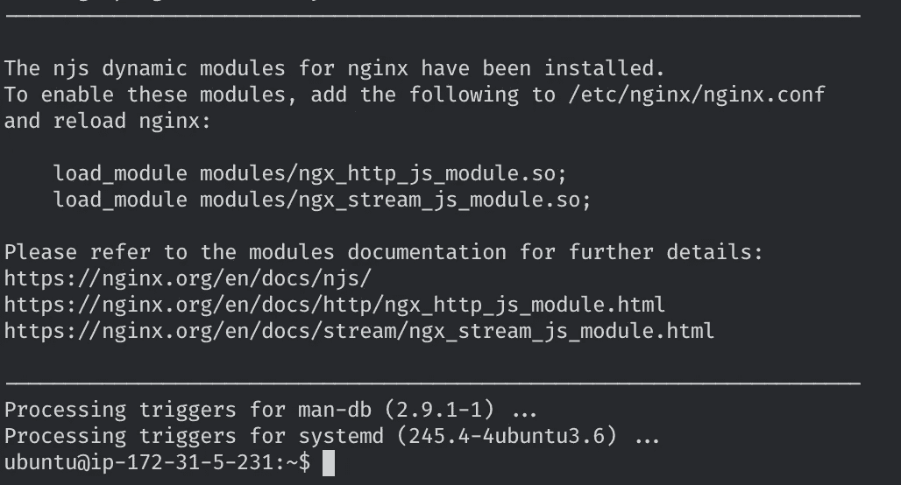
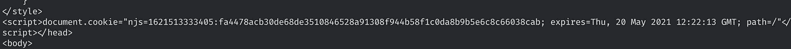

# 用 NGINX JavaScript 模块(NJS)和 TypeScript 构建一个简单的 Bot 保护

> 原文：<https://medium.com/geekculture/building-a-simple-bot-protection-with-nginx-javascript-module-njs-and-typescript-386b2207ba90?source=collection_archive---------3----------------------->


Photo by [Phillip Glickman](https://unsplash.com/@phillipglickman?utm_source=unsplash&utm_medium=referral&utm_content=creditCopyText) on [Unsplash](https://unsplash.com/s/photos/robots?utm_source=unsplash&utm_medium=referral&utm_content=creditCopyText)

我爱 Lua。我也爱 NGINX。我们三个相处得很好。像每段感情一样，我们也有高潮和低谷(是的，我正看着你的 Lua 模式)，但总的来说生活是完美的。然后，NGINX JavaScript 模块(简称 NJS)出现了。


I ❤️ JS/TS

NGINX JavaScript 模块于 2015 年首次推出，但最近随着 0.5.x 更新，功能得到了大幅提升。因为我对 JS 的任何东西都很感兴趣，所以我决定通过构建一个简单的(读幼稚和**非生产就绪**)机器人保护模块来测试它🤖。

# 配置 NGINX

在进入 bot fight 之前，我们必须设置 NGINX 来支持 JavaScript 模块。下面的说明是针对我的设置的(Ubuntu 20.4/Nginx 1.18)，所以 YMMV，但是大部分设置的大致思路应该是一样的。

1.  通过运行
    `curl -s [https://nginx.org/keys/nginx_signing.key](https://nginx.org/keys/nginx_signing.key) | sudo apt-key add -`来添加 NGINX PPA 密钥

2.通过运行以下命令设置存储库密钥:

```
sudo sh -c 'echo "deb http://nginx.org/packages/ubuntu/ focal nginx" >> /etc/apt/sources.list.d/nginx.list'
```

3.通过运行`sudo apt update`更新存储库列表。

4.通过运行`sudo apt install nginx-module-njs`安装 NJS。

如果一切顺利，此时，您应该会在终端上收到这条可爱的消息:



Big success 🥂

5.通过将以下内容添加到主 **nginx.conf** 文件的顶部来启用 NJS:

```
load_module modules/ngx_http_js_module.so;
```

6.重启 NGINX，将 NJS 加载到正在运行的实例中:

```
sudo nginx -s reload
```

现在你的 NGINX 已经准备好接受一些 JS 的爱了，所以让我们继续前进，创建我们的第一道防线——IP 过滤！


damn right you are!

# 开始行动—创建项目

我们的 bot 保护项目将使用 TypeScript 编写。为此，我们需要创建一个项目，将文件类型脚本转换成 NJS 能够理解的 ES5 JavaScript。正如您可能已经猜到的，NodeJS 在这里是必须的，所以在继续之前，请确保您已经设置好了。

1.  创建新的项目文件夹并初始化它:

```
mkdir njs-bot-protection && cd njs-bot-protection
npm init -y
```

2.安装所需的软件包:

```
npm i -D @rollup/plugin-typescript @types/node njs-types rollup typescript
```

3.将**构建**脚本添加到 **package.json** 的**脚本**部分:

```
{
    ...
    "scripts": {
        "build": "rollup -c"
    },
    ...
}
```

4.为了编译项目，您需要告诉 TypeScript 编译器如何使用 **tsconfig.json** 文件来完成这项工作。在项目的根目录下创建一个新的 **tsconfig.json** 文件，并在其中添加以下内容:

5.最后，让我们添加汇总配置，这将包装一切，并产生 NJS 将阅读的 endgame js 文件。
在项目的根目录下新建一个 **rollup.config.js** 文件，并在其中添加以下内容:

至此，我们的样板文件已经准备就绪。这意味着是时候踢一些机器人了！

# 第 1 轮— IP 过滤

我们 bot 防御的第一道防线是 IP 阻断；我们将传入请求的 IP 与一系列已知的声誉不佳的 IP 进行比较，如果发现匹配，我们会将请求重定向到“阻止”页面。

我们将从创建 JavaScript 模块开始:

1.  在项目根文件夹中，创建一个名为 **src，**的新文件夹，然后在其中创建一个新的 **bot.ts** 文件。
2.  将以下代码片段添加到 **bot.ts** 中:

💡那么我们这里有什么？

*   **第 1 行**:导入文件系统的内置模块(即 fs)。这个模块处理文件系统，允许我们读写文件以及其他活动。
*   **第 2 行**:调用`loadFile`函数，给它传递我们希望加载的文件的名称。
*   **第 4–12 行**:执行`loadFile`。首先，我们将`data`变量初始化为一个空字符串数组(第 5 行)，然后我们尝试将一个包含错误 IP 地址列表的文本文件读取并解析到`data`对象中(第 7 行)，最后我们返回`data`对象(第 11 行)。
*   **第 14–21 行**:我们模块的核心`verifyIP`的实现(目前)。这是我们将向 NGINX 公开的验证 IP 的函数。我们首先检查不良信誉 IP 的阵列是否包含当前的请求客户端 IP(第 15 行)。如果是，将请求重定向到块页面并结束处理(第 16 和 17 行)。如果不是，在内部重定向到`pages`位置(第 20 行)。
*   **第 23 行**:对外导出(read expose)`verifyIP`。

3.在终端中运行`npm run build`构建模块。如果一切顺利，你应该在 **dist** 文件夹中找到编译好的 **bot.js** 文件🎉

有了这个文件，让我们配置 NGINX 来使用它:

1.  在你的 NGINX 文件夹中(在我的例子中是 **/etc/nginx** )创建一个名为 **njs** 的文件夹，并在其中复制前面部分的 **bot.js** 。
2.  在 **/var/lib** 下创建一个名为 **njs** 的新文件夹，在里面创建一个名为 **ips.txt** 、的文件，并在其中填充一个信誉不好的 IP 列表(每行一个 IP)。你可以添加你自己的 IP 列表或者使用类似于 https://github.com/stamparm/ipsum 的东西。
3.  在您的 **nginx.conf** 中，在`http`部分下，添加以下内容:

```
js_path "/etc/nginx/njs/";
js_import bot.js;
```

💡那么我们这里有什么？

*   **js_path** —设置 NJS 模块文件夹的路径。
*   **js_import** —从 NJS 模块文件夹中导入模块。如果没有指定，导入的模块名称空间将由文件名决定(在我们的例子中，`bot`)

4.在`server`部分下(我的在**/etc/nginx/conf . d/default . conf**)修改`/`位置如下:

```
location / {
    js_content bot.verifyIP;
}
```

通过使用`js_content`指令调用`verifyIP`,我们将其设置为内容处理程序，这意味着`verifyIP`可以控制我们发送回调用者的内容(在我们的例子中，要么显示一个阻塞页面，要么将请求传递给源)

5.仍然在`server`部分下，添加`block.html`位置和`pages`命名位置:

```
location [@pages](http://twitter.com/pages) {
    root /usr/share/nginx/html;
    proxy_pass [http://localhost:8080](http://localhost:8080);
}location /block.html {
    root   /usr/share/nginx/html;
}
```

(命名的`pages`位置将被我们的 NJS 模块用来在内部重定向请求，如果它不应该被阻塞的话。对于这种重定向，您可能有自己的逻辑，所以请根据您的需要进行更改)

6.在文件的底部，添加端口 8080 的服务器块:

```
server {
        listen 8080;
        location / {
        root /usr/share/nginx/html;
        index index.html index.htm;
    }
}
```

7.在 **/usr/share/nginx/html** 文件夹下，添加**block.html**文件如下:

至此，我们的知识产权保护准备就绪！将自己的 IP 添加到 **ips.txt** 文件中，重启 NGINX ( `sudo nginx -s reload`)。浏览到您的实例，您应该看到以下内容:


Take that Mr. Evil Bot! 🤖 ⛔

# 第 2 轮— JavaScript 检测

我们的第二个保护层是 JavaScript 检测。我们使用这种检测来确定访问我们站点的访问者是否正在运行 JavaScript(每个普通浏览器都应该这样做)(这是一个警告信号，表明该访问者可能不是合法用户)。我们首先向页面注入一个 JavaScript 片段，它将在根路径上烘烤一个 cookie:

1.  将以下代码片段添加到 **bot.ts** 中:

💡那么我们这里有什么？

*   **第 1 行**:导入内置加密模块。这个模块处理密码学，我们很快会用它来创建一个 HMAC。
*   **第 5–18 行**:执行`getCookiePayload`。该函数将一个`date`对象设置为比当前时间早一个小时(第 6–8 行)，然后使用`date`对象(使用`crypto`模块)将我们传递给该函数的签名(`value`对象)和`date`对象(第 10–14 行)。最后，该函数以字符串格式返回 cookie 信息(名称、值、到期时间等)。).您可能注意到 cookie 值不仅包含散列签名，还包含我们用来 HMAC 签名的`date`对象。你很快就会明白我们为什么这么做了。
*   **第 20–30 行**:执行`addSnippet`。该函数缓冲请求数据，一旦完成(第 23 行)，它:
    -基于客户机 IP 和用户代理头创建一个签名(第 24 行)。
    -用一个`script`部分替换结束的`head`标签，该部分使用 JavaScript 的`document.cookie`属性在浏览器端插入一个 cookie(来自`getCookiePayload`函数)。(第 25–28 行)。
    -将修改后的响应发送回客户端(第 29 行)。

2.通过更新文件底部的导出语句，导出新的`addSnippet`函数:

```
export default { verifyIP, addSnippet };
```

3.在`@pages`位置块下，修改`/`位置如下:

```
location [@pages](http://twitter.com/pages) {
    js_body_filter bot.addSnippet;
    proxy_pass [http://localhost:8080](http://localhost:8080);
}
```

与`verifyIP`不同，我们不希望`addSnippet`管理响应的内容，我们希望它将内容(在我们的例子中是一个`script`标签)注入到从源返回的任何响应中。这就是`js_body_filter`发挥作用的地方。使用`js_body_filter`指令，我们告诉 NJS，我们提供的函数将从原点修改原始响应，并在完成后返回。

4.重启 NGINX 并浏览到实例上的页面。您应该会看到我们的新脚本就添加在结束标记`head`之前:



如果客户端运行 JavaScript，一个名为 **njs** 的新 cookie 将被烘焙。接下来，让我们为这个 cookie/缺少 cookie 创建验证:

1.  将`verifyCookie`功能(及其支持功能/变量)添加到**机器人**:

💡那么我们这里有什么？

*   **第 5–11 行**:`updateFile`函数的实现，它使用`fs`模块将字符串数组保存到一个文件中。
*   **行****13–52**:母载实现。在验证 **njs** cookie 时，我们有一个验证流程和必须遵循的结果:

a.我们从从请求的 **Cookie** 头中提取 **njs** cookie 开始(第 14-20 行)。

b.如果我们没有 cookie(或者我们有，但格式不正确)，我们会将客户端 IP 与我们收到的没有 cookie 的客户端 IP 列表进行比较。如果我们在最后一个小时内找到一个匹配项，我们会使请求失败(返回 false，第 26–27 行)。如果没有，我们就删除该 IP(如果它在列表上，但是超过了一个小时)并传递请求(第 29–34 行)。

c.如果我们有一个 cookie，我们将它分成一个时间戳和一个有效负载，并使用时间戳根据请求的用户代理头和客户机 IP 创建我们自己的 HMAC 散列。如果我们自己的 HMAC 与 **njs** cookie 的 HMAC 匹配，我们就通过请求。否则，我们会失败(第 38–45 行)。

d.如果在验证过程中出现任何问题，我们会失败打开(意味着通过)请求(第 48–51 行)。

2.添加新的`verify`函数，该函数调用新的`verifyCookie`函数，并根据其结果进行操作:

🔥此时你可能会想，这个`verify`函数看起来与之前的`verifyIP`函数惊人地相似——你完全正确，我马上会谈到这一点！

3.为了测试我们新的 cookie 验证功能，打开您的配置文件(我的在**/etc/nginx/conf . d/default . conf**)并将 js_content 指令从`verifyIP`更改为`verify`:

```
location / {
    js_content bot.verify;
}
```

4.重启 NGINX，尝试在没有 njs cookie 的情况下访问该站点两次——✋🎤-你被挡住了！


Not today Mr. Evil Bot! 🤖 ⛔

# 最后一轮——将所有人聚集在一起

现在我们有了 cookie 验证，但是我们取消了 IP 验证，因为我们只能有一个`js_content`指令，我们如何解决这个问题呢？

您可能还记得几分钟前我们创建了`verify`函数(眼尖的读者可能已经注意到了，它与我们之前使用的`verifyIP`函数非常相似)。如果我们更新我们的`verifyIP`函数，使它返回一个布尔响应作为验证，并将该验证添加到`verify`，我们就可以用一个大函数来验证对 IP 和 cookies 的请求，从而两全其美！

1.  如下重构`verifyIP`函数:

2.更新`verify`函数以调用`verifyIP`，如下所示:

3.更新`export`语句，因为我们不再需要公开`verifyIP`:

```
export default { addSnippet, verify };
```

4.重启 NGINX，使用 NJS 和 TypeScript 享受你自制的 bot 保护🎉


Ewwwww, so cute ❤️

🍾模块源代码可在 [GitHub](https://github.com/jtordgeman/njs-bot-protection) 上获得！