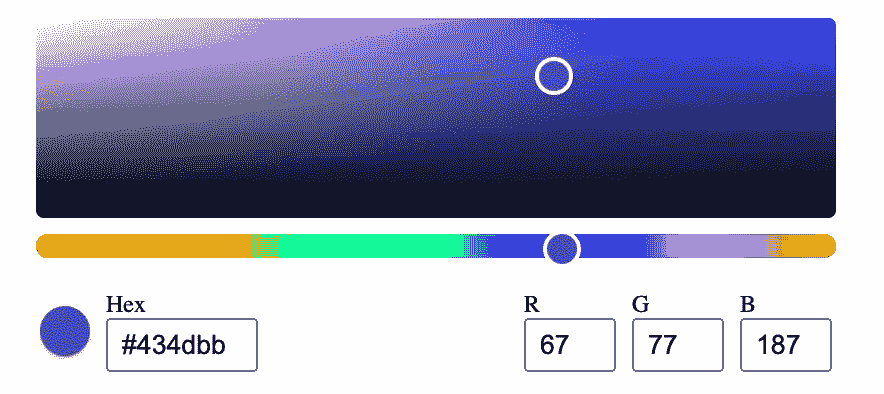

# 从头开始构建一个简单的颜色选择器

> 原文：<https://medium.com/geekculture/building-a-simple-colour-picker-in-react-from-scratch-8ef0d3f4e9cc?source=collection_archive---------6----------------------->



在致力于减少 [FormBlob](https://formblob.com/) 的依赖性和浏览器包大小时，我写了一个轻量级版本的颜色选择器来代替 react-color。我已经将它发布为开源库 [react-mui-color](https://github.com/jzcling/react-mui-color) ，尽管它依赖于 Material UI。

本教程将带你从头开始创建一个没有依赖的颜色选择器，如下图所示。完整的代码可以在[这里](https://codesandbox.io/s/color-picker-tzo31)找到。如果你不熟悉 Typescript，不要气馁，如果你只懂 javascript，你会发现这里的东西是完全可以理解的。

# 关键特征

我们将要构建的拾色器将有两个不同的选择选项:

1.  预定义的调色板和
2.  连续的彩色地图

用户可以使用选择器设置颜色，或使用输入键输入十六进制或 rgb 颜色。

# 规划组件

根据功能要求，我们的拾色器需要 4 个道具:

1.  `color` -当前选中的颜色
2.  `colors` -调色板的预定义颜色阵列
3.  `onChange` -选择新颜色时的处理程序
4.  `variant` -选择器的类型，预定义或自由

```
// ColorPicker.tsxexport enum ColorPickerVariant {
  Predefined = "predefined",
  Free = "free"
}interface ColorPickerProps {
  color: string;
  colors: Array<string>;
  onChange(color: string): void;
  variant: ColorPickerVariant;
}export const ColorPicker = (props: ColorPickerProps) => {
  const { color, colors, onChange, variant } = props; ...
}
```

如果我们想添加更多的选择器，我们还应该为每个选择器提供一个组件，以使整个 ColorPicker 组件更易于管理，并且可能更具可扩展性。我们的预定义选择器相当简单——我们需要上面定义的`color`、`colors`和`onChange`道具来填充组件并处理用户做出的任何颜色选择。

```
// PredefinedSelector.tsxinterface PredefinedSelectorProps {
  color: string;
  colors: Array<string>;
  onSelect(color: string): void;
}export const PredefinedSelector = (props: PredefinedSelectorProps) => {
  const { color, colors, onSelect } = props; ...
}
```

我们的彩色地图选择器(从现在开始我们称之为免费选择器)更具挑战性。我们需要找到一种方法来渲染彩色地图，并将地图上的选择转换成 CSS 能够理解的颜色表示。幸运的是，HSV 颜色模型很好地映射到 3D 线性渐变，但是稍后会有更多的描述。现在，我们知道我们有两个不同的贴图——一个较大的饱和度贴图和一个线性色调贴图，我们需要处理每个贴图的点击事件。

```
// FreeSelector.tsxinterface FreeSelectorProps {
  color: string; // we'll need to convert this to HSV
  satCoords: Array<number>; // [x, y] coordinates for saturation map
  hueCoords: number; // x coordinates for hue map
  onSaturationChange: MouseEventHandler;
  onHueChange: MouseEventHandler;
}export const FreeSelector = (props: FreeSelectorProps) => {
  const {
    color,
    satCoords,
    hueCoords,
    onSaturationChange,
    onHueChange
  } = props; ...
}
```

# 设置视图

此时，我们有三个组件:

1.  color picker——我们将使用的整体组件
2.  预定义选择器—调色板选择器
3.  自由选择器——颜色地图选择器

我们继续为每个组件设置视图，从选择器开始。让我们首先解决最困难的组件——自由选择器。

正如我前面提到的，HSV 颜色模型很好地映射到 3D 线性渐变。HSV(色调、饱和度、值)每个都是数字表示，我们可以将其分为一维色调图和二维饱和度(x)和值(y)图。为了渲染这些地图，我们使用线性渐变 CSS 函数。让我们看一些代码。

```
// FreeSelector.css....cp-saturation {
  width: 100%;
  height: 150px;
  /* This provides a smooth representation 
     of brightness, which we overlay with an 
     inline background-color for saturation */
  background-image: linear-gradient(transparent, black),
    linear-gradient(to right, white, transparent);
  border-radius: 4px;
  /* This allows us to position an absolute
     indicator over the map */
  position: relative;
  cursor: crosshair;
}.cp-hue {
  width: 100%;
  height: 12px;
  /* This covers the full range of hues */
  background-image: linear-gradient(
    to right,
    #ff0000,
    #ffff00,
    #00ff00,
    #00ffff,
    #0000ff,
    #ff00ff,
    #ff0000
  );
  border-radius: 999px;
  /* This allows us to position an absolute
     indicator over the map */
  position: relative;
  cursor: crosshair;
}...// FreeSelector.tsximport "./FreeSelector.css";...export const FreeSelector = (props: FreeSelectorProps) => {
  ... return (
    <div className="cp-free-root">
      <div
        className="cp-saturation"
        style={{
          backgroundColor: `hsl(${parsedColor.hsv.h}, 100%, 50%)`
        }}
        onClick={onSaturationChange}
      >
        // TODO: create an indicator to show current x,y position
      </div>
      <div className="cp-hue" onClick={onHueChange}>
        // TODO: create an indicator to show current hue
      </div>
    </div>
  );
};
```

在上面的代码中，您可能想知道 parsedColor.hsv.h 来自哪里。这是 HSV 颜色模型的色调表示。如前所述，我们需要将`color`字符串转换成 HSV 表示。我们稍后将讨论这个问题。现在，我们完成了自由选择器视图。这是自由选择器的完整代码。

```
// FreeSelector.css.cp-free-root {
  display: grid;
  grid-gap: 8px;
  margin-bottom: 16px;
  max-width: 100%;
  width: 400px;
}.cp-saturation {
  width: 100%;
  height: 150px;
  background-image: linear-gradient(transparent, black),
    linear-gradient(to right, white, transparent);
  border-radius: 4px;
  position: relative;
  cursor: crosshair;
}.cp-saturation-indicator {
  width: 15px;
  height: 15px;
  border: 2px solid #ffffff;
  border-radius: 50%;
  transform: translate(-7.5px, -7.5px);
  position: absolute;
}.cp-hue {
  width: 100%;
  height: 12px;
  background-image: linear-gradient(
    to right,
    #ff0000,
    #ffff00,
    #00ff00,
    #00ffff,
    #0000ff,
    #ff00ff,
    #ff0000
  );
  border-radius: 999px;
  position: relative;
  cursor: crosshair;
}.cp-hue-indicator {
  width: 15px;
  height: 15px;
  border: 2px solid #ffffff;
  border-radius: 50%;
  transform: translate(-7.5px, -2px);
  position: absolute;
}// FreeSelector.tsximport React, { MouseEventHandler } from "react";
import { Color } from "../../Interfaces/Color";
import "./FreeSelector.css";interface FreeSelectorProps {
  parsedColor: Color;
  satCoords: Array<number>;
  hueCoords: number;
  onSaturationChange: MouseEventHandler;
  onHueChange: MouseEventHandler;
}export const FreeSelector = (props: FreeSelectorProps) => {
  const {
    parsedColor,
    satCoords,
    hueCoords,
    onSaturationChange,
    onHueChange
  } = props; return (
    <div className="cp-free-root">
      <div
        className="cp-saturation"
        style={{
          backgroundColor: `hsl(${parsedColor.hsv.h}, 100%, 50%)`
        }}
        onClick={onSaturationChange}
      >
        <div
          className="cp-saturation-indicator"
          style={{
            backgroundColor: parsedColor.hex,
            left: (satCoords?.[0] ?? 0) + "%",
            top: (satCoords?.[1] ?? 0) + "%"
          }}
        />
      </div>
      <div className="cp-hue" onClick={onHueChange}>
        <div
          className="cp-hue-indicator"
          style={{
            backgroundColor: parsedColor.hex,
            left: (hueCoords ?? 0) + "%"
          }}
        />
      </div>
    </div>
  );
};
```

我们最终使用了`satCoords`和`hueCoords`。它们分别用于定位饱和度贴图和色调贴图的指示器。使用 CSS 属性 position、left 和 top，我们可以精确地定位指示器。请注意，我们还使用 transform 属性来调整指示器的宽度和高度。

恭喜你。最难的部分完成了！

现在，预定义的选择器看起来很简单。我们所需要的只是一个预览调色板。这是预定义选择器的完整代码。

```
// PredefinedSelector.css.cp-predefined-root {
  padding-bottom: 16px;
  display: flex;
  flex-direction: column;
  flex-wrap: wrap;
  max-width: 100%;
  min-width: 200px;
  overflow: auto;
  scrollbar-width: none;
  -ms-overflow-style: none;
}.cp-predefined-root::-webkit-scrollbar {
  display: none;
}.cp-color-button {
  width: 37px;
  padding: 5px;
  border-radius: 4px;
  background-color: inherit;
}.cp-preview-color {
  /* Shadow so we can see white against white */
  box-shadow: 0px 1px 3px 0px rgba(0, 0, 0, 0.2),
    0px 1px 1px 0px rgba(0, 0, 0, 0.14), 0px 2px 1px -1px rgba(0, 0, 0, 0.12);
  width: 25px;
  height: 25px;
  border-radius: 50%;
}// PredefinedSelector.tsximport React from "react";
import { Color } from "../../Interfaces/Color";
import "./PredefinedSelector.css";const predefinedRows = 3;interface PredefinedSelectorProps {
  parsedColor: Color;
  colors: Array<string>;
  onSelect(color: string): void;
}export const PredefinedSelector = (props: PredefinedSelectorProps) => {
  const { parsedColor, colors, onSelect } = props; return (
    <div
      className="cp-predefined-root"
      style={{
        height: 2 + 35 * predefinedRows + "px",
        width: 16 + 35 * Math.ceil(colors.length / predefinedRows) + "px"
      }}
    >
      {colors.map((color) => (
        <button
          className="cp-color-button"
          key={color}
          onClick={(event) => onSelect(color)}
          style={{
            border: color === parsedColor?.hex ? "1px solid #000000" : "none"
          }}
        >
          <div
            className="cp-preview-color"
            style={{
              background: color
            }}
          />
        </button>
      ))}
    </div>
  );
};
```

这里，我们根据我们想要的行数和调色板中的颜色总数来设置根容器的高度和宽度。然后我们遍历`colors`数组，用我们预定义的颜色填充调色板。

接下来，我们转到主要的 ColorPicker 组件。现在我们已经完成了选择器，唯一新的是输入。让我们为他们添加视图。

```
// ColorPicker.css.cp-container {
  padding: 12px;
  overflow: auto;
  scrollbar-width: none;
  -ms-overflow-style: none;
  width: fit-content;
}.cp-container::-webkit-scrollbar {
  display: none;
}.cp-input-container {
  display: flex;
  flex-direction: row;
  justify-content: space-between;
  margin: 2px;
}.cp-input-group {
  display: grid;
  grid-template-columns: auto auto auto;
  grid-gap: 8px;
  align-items: center;
}.cp-color-preview {
  /* Shadow so we can see white against white */
  box-shadow: 0px 1px 3px 0px rgba(0, 0, 0, 0.2),
    0px 1px 1px 0px rgba(0, 0, 0, 0.14), 0px 2px 1px -1px rgba(0, 0, 0, 0.12);
  width: 25px;
  height: 25px;
  border-radius: 50%;
}input {
  padding: 4px 6px;
}label,
input {
  display: block;
}.cp-input-label {
  font-size: 12px;
}.cp-hex-input {
  width: 60px;
}.cp-rgb-input {
  width: 30px;
}// ColorPicker.tsxexport const ColorPicker = (props: ColorPickerProps) => {
  ... return (
    <div className="cp-container">
      // TODO: add selectors <div className="cp-input-container">
        <div className="cp-input-group">
          <div
            className="cp-color-preview"
            style={{
              background: color
            }}
          />
          <div>
            <label className="cp-input-label" htmlFor="cp-input-hex">
              Hex
            </label>
            <input
              id="cp-input-hex"
              className="cp-hex-input"
              placeholder="Hex"
              value={parsedColor?.hex}
              onChange={handleHexChange}
            />
          </div>
        </div> <div className="cp-input-group">
          <div>
            <label className="cp-input-label" htmlFor="cp-input-r">
              R
            </label>
            <input
              id="cp-input-r"
              className="cp-rgb-input"
              placeholder="R"
              value={parsedColor.rgb.r}
              onChange={(event) => handleRgbChange("r", event.target.value)}
              inputMode="numeric"
              pattern="[0-9]*"
            />
          </div>
          <div>
            <label className="cp-input-label" htmlFor="cp-input-g">
              G
            </label>
            <input
              id="cp-input-g"
              className="cp-rgb-input"
              placeholder="G"
              value={parsedColor.rgb.g}
              onChange={(event) => handleRgbChange("g", event.target.value)}
              inputMode="numeric"
              pattern="[0-9]*"
            />
          </div>
          <div>
            <label className="cp-input-label" htmlFor="cp-input-b">
              B
            </label>
            <input
              id="cp-input-b"
              className="cp-rgb-input"
              placeholder="B"
              value={parsedColor.rgb.b}
              onChange={(event) => handleRgbChange("b", event.target.value)}
              inputMode="numeric"
              pattern="[0-9]*"
            />
          </div>
        </div>
      </div>
    </div>
  );
};
```

# 处理颜色模型和转换

到目前为止，我们还没有添加任何逻辑来处理视图中的事件。在此之前，我们需要设置`Color`模型和各种颜色表示之间的转换方法。有三种颜色表示对我们的拾取器很重要:十六进制、RGB 和 HSV。我们因此定义了`Color`模型:

```
// Color.tsexport interface Color {
  hex: string;
  rgb: ColorRGB;
  hsv: ColorHSV;
}export interface ColorRGB {
  r: number;
  g: number;
  b: number;
}export interface ColorHSV {
  h: number;
  s: number;
  v: number;
}
```

通过谷歌搜索，我们可以找到预先存在的颜色转换方法。以下是我用过的方法。

```
// Converters.tsimport { ColorHSV, ColorRGB } from "../Interfaces/Color";export function rgbToHex(color: ColorRGB): string {
  var { r, g, b } = color;
  var hexR = r.toString(16);
  var hexG = g.toString(16);
  var hexB = b.toString(16); if (hexR.length === 1) hexR = "0" + r;
  if (hexG.length === 1) hexG = "0" + g;
  if (hexB.length === 1) hexB = "0" + b; return "#" + hexR + hexG + hexB;
}export function hexToRgb(color: string): ColorRGB {
  var r = 0;
  var g = 0;
  var b = 0; // 3 digits
  if (color.length === 4) {
    r = Number("0x" + color[1] + color[1]);
    g = Number("0x" + color[2] + color[2]);
    b = Number("0x" + color[3] + color[3]); // 6 digits
  } else if (color.length === 7) {
    r = Number("0x" + color[1] + color[2]);
    g = Number("0x" + color[3] + color[4]);
    b = Number("0x" + color[5] + color[6]);
  } return {
    r,
    g,
    b
  };
}export function rgbToHsv(color: ColorRGB): ColorHSV {
  var { r, g, b } = color;
  r /= 255;
  g /= 255;
  b /= 255; const max = Math.max(r, g, b);
  const d = max - Math.min(r, g, b); const h = d
    ? (max === r
        ? (g - b) / d + (g < b ? 6 : 0)
        : max === g
        ? 2 + (b - r) / d
        : 4 + (r - g) / d) * 60
    : 0;
  const s = max ? (d / max) * 100 : 0;
  const v = max * 100; return { h, s, v };
}export function hsvToRgb(color: ColorHSV): ColorRGB {
  var { h, s, v } = color;
  s /= 100;
  v /= 100; const i = ~~(h / 60);
  const f = h / 60 - i;
  const p = v * (1 - s);
  const q = v * (1 - s * f);
  const t = v * (1 - s * (1 - f));
  const index = i % 6; const r = Math.round([v, q, p, p, t, v][index] * 255);
  const g = Math.round([t, v, v, q, p, p][index] * 255);
  const b = Math.round([p, p, t, v, v, q][index] * 255); return {
    r,
    g,
    b
  };
}
```

还记得我们之前访问的`parsedColor`对象吗？我们还需要一个方法将颜色的字符串表示转换成我们的`Color`模型。

```
// ColorUtils.tsimport { Color, ColorRGB } from "../Interfaces/Color";
import { hexToRgb, rgbToHex, rgbToHsv } from "./Converters";export function getRgb(color: string): ColorRGB {
  const matches = /rgb\((\d+),\s?(\d+),\s?(\d+)\)/i.exec(color);
  const r = Number(matches?.[1] ?? 0);
  const g = Number(matches?.[2] ?? 0);
  const b = Number(matches?.[3] ?? 0); return {
    r,
    g,
    b
  };
}export function parseColor(color: string): Color {
  var hex = "";
  var rgb = {
    r: 0,
    g: 0,
    b: 0
  };
  var hsv = {
    h: 0,
    s: 0,
    v: 0
  }; if (color.slice(0, 1) === "#") {
    hex = color;
    rgb = hexToRgb(hex);
    hsv = rgbToHsv(rgb);
  } else if (color.slice(0, 3) === "rgb") {
    rgb = getRgb(color);
    hex = rgbToHex(rgb);
    hsv = rgbToHsv(rgb);
  } return {
    hex,
    rgb,
    hsv
  };
}export function getSaturationCoordinates(color: Color): [number, number] {
  const { s, v } = rgbToHsv(color.rgb); const x = s;
  const y = 100 - v; return [x, y];
}export function getHueCoordinates(color: Color): number {
  const { h } = color.hsv; const x = (h / 360) * 100; return x;
}export function clamp(number: number, min: number, max: number): number {
  if (!max) {
    return Math.max(number, min) === min ? number : min;
  } else if (Math.min(number, min) === number) {
    return min;
  } else if (Math.max(number, max) === number) {
    return max;
  }
  return number;
}
```

在上面的 utils 文件中，我还包含了`getSaturationCoordinates`和`getHueCoordinates`方法来定位我们的指示器。如果你注意到，HSV 模型非常好地映射到我们的线性梯度，因为 s 和 v 是百分比。色调映射到一个 360 度的圆，所以我们需要对线性标度的值进行归一化。

# 添加处理程序和逻辑

最后，我们准备添加处理程序，这是拼图的最后一块。此时，唯一不完整的组件是整个 ColorPicker。让我们回到那个话题。

```
// ColorPicker.tsxexport const ColorPicker = (props: ColorPickerProps) => {
  const { color, colors, onChange, variant } = props; const parsedColor = useMemo(() => parseColor(color), [color]);
  const satCoords = useMemo(() => getSaturationCoordinates(parsedColor), [
    parsedColor
  ]);
  const hueCoords = useMemo(() => getHueCoordinates(parsedColor), [
    parsedColor
  ]); const handleHexChange = useCallback(
    (event) => {
      var val = event.target.value;
      if (val?.slice(0, 1) !== "#") {
        val = "#" + val;
      }
      onChange(val);
    },
    [onChange]
  ); const handleRgbChange = useCallback(
    (component, value) => {
      const { r, g, b } = parsedColor.rgb; switch (component) {
        case "r":
          onChange(rgbToHex({ r: value ?? 0, g, b }));
          return;
        case "g":
          onChange(rgbToHex({ r, g: value ?? 0, b }));
          return;
        case "b":
          onChange(rgbToHex({ r, g, b: value ?? 0 }));
          return;
        default:
          return;
      }
    },
    [parsedColor, onChange]
  ); const handleSaturationChange = useCallback(
    (event) => {
      const { width, height, left, top } = event.target.getBoundingClientRect(); const x = clamp(event.clientX - left, 0, width);
      const y = clamp(event.clientY - top, 0, height); const s = (x / width) * 100;
      const v = 100 - (y / height) * 100; const rgb = hsvToRgb({ h: parsedColor?.hsv.h, s, v }); onChange(rgbToHex(rgb));
    },
    [parsedColor, onChange]
  ); const handleHueChange = useCallback(
    (event) => {
      const { width, left } = event.target.getBoundingClientRect();
      const x = clamp(event.clientX - left, 0, width);
      const h = Math.round((x / width) * 360); const hsv = { h, s: parsedColor?.hsv.s, v: parsedColor?.hsv.v };
      const rgb = hsvToRgb(hsv); onChange(rgbToHex(rgb));
    },
    [parsedColor, onChange]
  ); ...
};
```

我们首先解析作为 prop 接收的`color`字符串。一旦我们得到了`parsedColor`，我们就可以使用我们的 getters 来检索`satCoords`和`hueCoords`。然后，我们在选择器中定义变更事件的处理程序- `handleHexChange`、`handleRgbChange`、`handleSaturationChange`和`handleHueChange`。`handleSaturationChange`和`handleHueChange`正好是`getSaturationCoordinates`和`getHueCoordinates`的反函数。

和..我们已经完成了颜色选择器！这是 ColorPicker 的完整代码。

```
// ColorPicker.tsximport React, { useCallback, useMemo } from "react";
import {
  clamp,
  DEFAULT_COLOR,
  DEFAULT_COLORS,
  getHueCoordinates,
  getSaturationCoordinates,
  hsvToRgb,
  parseColor,
  rgbToHex
} from "../Utils";
import "./ColorPicker.css";
import { FreeSelector, PredefinedSelector } from "./Options";export enum ColorPickerVariant {
  Predefined = "predefined",
  Free = "free"
}interface ColorPickerProps {
  color: string;
  colors: Array<string>;
  onChange(color: string): void;
  variant: ColorPickerVariant;
}export const ColorPicker = (props: ColorPickerProps) => {
  const { color, colors, onChange, variant } = props; const parsedColor = useMemo(() => parseColor(color), [color]);
  const satCoords = useMemo(() => getSaturationCoordinates(parsedColor), [
    parsedColor
  ]);
  const hueCoords = useMemo(() => getHueCoordinates(parsedColor), [
    parsedColor
  ]); const handleHexChange = useCallback(
    (event) => {
      var val = event.target.value;
      if (val?.slice(0, 1) !== "#") {
        val = "#" + val;
      }
      onChange(val);
    },
    [onChange]
  ); const handleRgbChange = useCallback(
    (component, value) => {
      const { r, g, b } = parsedColor.rgb; switch (component) {
        case "r":
          onChange(rgbToHex({ r: value ?? 0, g, b }));
          return;
        case "g":
          onChange(rgbToHex({ r, g: value ?? 0, b }));
          return;
        case "b":
          onChange(rgbToHex({ r, g, b: value ?? 0 }));
          return;
        default:
          return;
      }
    },
    [parsedColor, onChange]
  ); const handleSaturationChange = useCallback(
    (event) => {
      const { width, height, left, top } = event.target.getBoundingClientRect(); const x = clamp(event.clientX - left, 0, width);
      const y = clamp(event.clientY - top, 0, height); const s = (x / width) * 100;
      const v = 100 - (y / height) * 100; const rgb = hsvToRgb({ h: parsedColor?.hsv.h, s, v }); onChange(rgbToHex(rgb));
    },
    [parsedColor, onChange]
  ); const handleHueChange = useCallback(
    (event) => {
      const { width, left } = event.target.getBoundingClientRect();
      const x = clamp(event.clientX - left, 0, width);
      const h = Math.round((x / width) * 360); const hsv = { h, s: parsedColor?.hsv.s, v: parsedColor?.hsv.v };
      const rgb = hsvToRgb(hsv); onChange(rgbToHex(rgb));
    },
    [parsedColor, onChange]
  ); return (
    <div className="cp-container">
      {variant === ColorPickerVariant.Predefined ? (
        <PredefinedSelector
          colors={colors}
          parsedColor={parsedColor}
          onSelect={onChange}
        />
      ) : (
        <FreeSelector
          parsedColor={parsedColor}
          satCoords={satCoords}
          hueCoords={hueCoords}
          onSaturationChange={handleSaturationChange}
          onHueChange={handleHueChange}
        />
      )} <div className="cp-input-container">
        <div className="cp-input-group">
          <div
            className="cp-color-preview"
            style={{
              background: color
            }}
          />
          <div>
            <label className="cp-input-label" htmlFor="cp-input-hex">
              Hex
            </label>
            <input
              id="cp-input-hex"
              className="cp-hex-input"
              placeholder="Hex"
              value={parsedColor?.hex}
              onChange={handleHexChange}
            />
          </div>
        </div> <div className="cp-input-group">
          <div>
            <label className="cp-input-label" htmlFor="cp-input-r">
              R
            </label>
            <input
              id="cp-input-r"
              className="cp-rgb-input"
              placeholder="R"
              value={parsedColor.rgb.r}
              onChange={(event) => handleRgbChange("r", event.target.value)}
              inputMode="numeric"
              pattern="[0-9]*"
            />
          </div>
          <div>
            <label className="cp-input-label" htmlFor="cp-input-g">
              G
            </label>
            <input
              id="cp-input-g"
              className="cp-rgb-input"
              placeholder="G"
              value={parsedColor.rgb.g}
              onChange={(event) => handleRgbChange("g", event.target.value)}
              inputMode="numeric"
              pattern="[0-9]*"
            />
          </div>
          <div>
            <label className="cp-input-label" htmlFor="cp-input-b">
              B
            </label>
            <input
              id="cp-input-b"
              className="cp-rgb-input"
              placeholder="B"
              value={parsedColor.rgb.b}
              onChange={(event) => handleRgbChange("b", event.target.value)}
              inputMode="numeric"
              pattern="[0-9]*"
            />
          </div>
        </div>
      </div>
    </div>
  );
};ColorPicker.defaultProps = {
  color: DEFAULT_COLOR,
  colors: DEFAULT_COLORS,
  onChange: (color: string) => {},
  variant: ColorPickerVariant.Predefined
};
```

# 结束语

同样，完整的代码可以在[这里](https://codesandbox.io/s/color-picker-tzo31)找到。这是一个除了 React 之外没有任何依赖性的实现，但是您可以随时使用您最喜欢的 UI 库来替换视图。我还要感谢 [react-color-palette](https://github.com/Wondermarin/react-color-palette) 和这篇 [css-tricks 文章](https://css-tricks.com/converting-color-spaces-in-javascript)，因为我用它们作为色彩映射实现和色彩转换方法的参考。