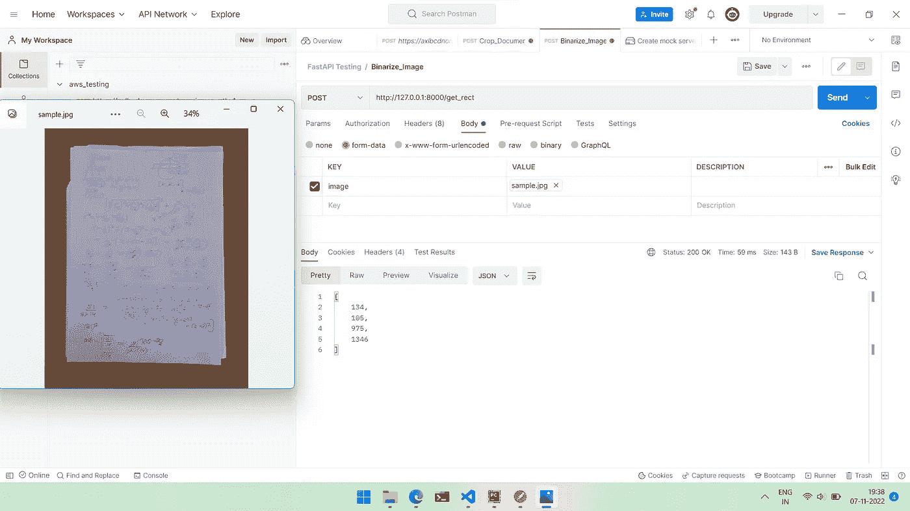
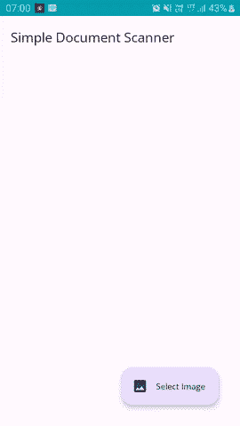
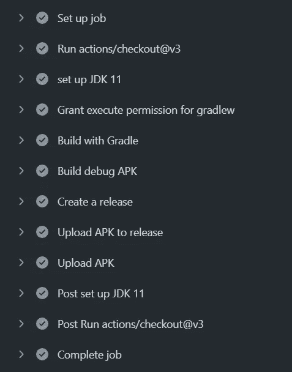

# 在 Android 中构建一个简单的文档扫描仪

> 原文：<https://medium.com/geekculture/building-a-simple-document-scanner-in-android-1b4b11b3e407?source=collection_archive---------6----------------------->

## [安卓开发](/@equipintelligence/list/android-development-8b0114100205)

## 在发展中学习

Photo by [Cytonn Photography](https://unsplash.com/@cytonn_photography?utm_source=medium&utm_medium=referral) on [Unsplash](https://unsplash.com?utm_source=medium&utm_medium=referral)

我有一段时间全神贯注于机器学习，训练模型，清理和处理数据并部署它们。我认为有一个新项目可以提高我在 Android 中的开发技能，这将是一件很棒的事情。由于我已经在 OpenCV 上尝试了一段时间，我决定在 Android 上做一个文档扫描仪，因为我知道有很多库可以做得更好。这里是我的项目和用于构建应用程序的技术栈的概述。

# 内容

1.  应用概述
2.  用 OpenCV Python 开发文档抽取算法
3.  用 Python 中的 FastAPI 开发文档抽取服务器
4.  创建用于文档提取和 Docker 图像的 Streamlit web 应用程序
5.  用 OpenCV Android(on-device solution)在 Kotlin 中实现文档提取算法
6.  从 Android 应用程序调用 API(基于 API 的解决方案)
7.  实现 GitHub 动作来构建这两个应用的版本

— — — — — — — — — — — — — — — — — — — — — — — — — — — — — — — — — — — — —

# 1.应用概述

因此，我们将开发一个应用程序，它可以提取一个文档(或裁剪一个文档)，给用户一张图片。为了从图像中提取文档，我们将使用 OpenCV 中实现的图像处理管道或算法。

图像处理将使用 OpenCV 的 Android SDK 在设备上进行，此外，我们将有一个服务器运行，应用程序将向其发布图像并获取图像中文档的坐标。因此，对于图像文档提取，我们有两种选择—基于设备和基于 API 的解决方案

# 2.开发文档提取算法— Python

OpenCV 是一个用 C++编写的跨平台图像处理库。我们将使用操纵图像的各种参数来提取所需信息的技术，而不是使用笨重(在内存和大小方面)的花哨的 ML 算法。

 [## OpenCV: OpenCV-Python 教程

### 编辑描述

docs.opencv.org](https://docs.opencv.org/4.x/d6/d00/tutorial_py_root.html) 

我们将开发的算法将用于服务器(基于 API 的解决方案)以及 Android 应用程序(设备上的解决方案)。据我所知，在 Python 中使用 OpenCV 是最简单的，所以我们将用 Python 开发我们算法的原型。

Snippet 1: The document extraction algorithm written in Python using OpenCV. See [document.py](https://github.com/shubham0204/Simple_Document_Scanner_Android/blob/api/document.py) in the [api](https://github.com/shubham0204/Simple_Document_Scanner_Android/tree/api) branch of the repo.

这里的算法是用一系列固定的步骤来处理图像，以提取文档的边界。`get_binarized_img`方法返回一个灰度+高对比度(ed)图像，给文档一个典型的类似“扫描仪”的效果。

# 3.用 Python 中的 FastAPI 开发文档抽取服务器

对于我们的应用程序需要的基于 API 的解决方案，我们需要一个服务器，应用程序可以用图像调用它，以返回提取的文档的坐标。为了开发这样一个服务器，我们使用了 [FastAPI](https://fastapi.tiangolo.com/) ，这是一个用 Python 编写的框架，可以用来开发 API。

Snippet 2: Creating an API to extract document and return the coordinates to the app. See [main.py](https://github.com/shubham0204/Simple_Document_Scanner_Android/blob/api/main.py) in the [api](https://github.com/shubham0204/Simple_Document_Scanner_Android/tree/api) branch of the repo.

在给定(张贴的)图像中，包含文档的框的坐标采用 x，y，宽度(w)和高度(h)的格式。我们可以在`localhost:8000`试试邮递员托管的 API

Fig 1\. The left window shows the image that was POSTed to the server. The response, as shown above, contains the coordinates in the form (x , y , w , h)

您可以使用 [ngrok](https://ngrok.com/) 临时部署或隧道服务器所在的端口。

# 4.创建用于文档提取和 Docker 图像的 Streamlit web 应用程序

为了用 Python 测试我们自己的文档提取算法，我们用 Streamlit 创建了一个简单的基于 web 的 GUI，它调用了`get_rect`方法。以这种方式返回的边界框的坐标。

Snippet 3: Streamlit app for testing the document extraction algorithm. See [app.py](https://github.com/shubham0204/Simple_Document_Scanner_Android/blob/api/app.py) in the [api](https://github.com/shubham0204/Simple_Document_Scanner_Android/tree/api) branch of the repo.

用`streamlit run app.py`运行应用程序，一个漂亮而简单的网络应用程序在`localhost`上打开，

Fig 2\. Demo video of the Streamlit web app. Video by the Author

我们得出结论，我们的 API 和 web 应用程序已经准备好了，所以我们可以将所有这些打包到 Docker 映像中。

<docker_image_code></docker_image_code>

# 5.用 OpenCV Android(on-device solution)在 Kotlin 中实现文档提取算法

我们现在从 Python 转到 Kotlin 代码。我们用 Python 和 OpenCV 开发的图像处理管道将被镜像，就像在 Kotlin 中使用 [OpenCV 的 Android SDK](https://opencv.org/android/) 一样。

Snippet 4: The document extraction algorithm written in Kotlin with OpenCV Android SDK. See [CoreAlgorithm.kt](https://github.com/shubham0204/Simple_Document_Scanner_Android/blob/on_device_scanning_app/app/src/main/java/com/ml/shubham0204/simpledocumentscanner/opencv/CoreAlgorithm.kt) in the [on_device_scanning_app](https://github.com/shubham0204/Simple_Document_Scanner_Android/tree/on_device_scanning_app) branch

# 6.从 Android 应用程序调用 API(基于 API 的解决方案)

由于我们已经用 Python 开发了 API，我们将用 [OkHttp](https://square.github.io/okhttp/) 从 Android 客户端发送请求。我们确实有像 [Ktor](/google-developer-experts/how-to-use-ktor-client-on-android-dcdeddc066b9) 、[凌空](https://google.github.io/volley/)和[改型](https://square.github.io/retrofit/)这样的选项，用于从服务器发送和接收数据。

Snippet 5: Sending requests to the server (built with FastAPI in Python). See [DocScanner.kt](https://github.com/shubham0204/Simple_Document_Scanner_Android/blob/main/app/src/main/java/com/ml/shubham0204/simpledocumentscanner/api/DocumentScanner.kt) in [main](https://github.com/shubham0204/Simple_Document_Scanner_Android/tree/main) branch of the repo.

虽然不可能分享这两个应用的全部代码，但我已经包括了代码库中重要和有趣的部分。用`TextureView`在屏幕上画一个框并从用户那里选择文件仍然需要很多代码。这是最终应用的演示，

Fig 3\. A demo for Simple Document Scanner. Image by the Author

# 7.实现 GitHub 动作来构建这两个应用的版本

一旦我们开发了应用程序，我们希望用 GitHub Actions 为这两个解决方案构建 apk。我们的工作流程将执行以下步骤，用 Gradle 构建一个 APK，并在 GitHub 存储库上创建一个发布。

Fig 4\. Steps involved in [build_apk](https://github.com/shubham0204/Simple_Document_Scanner_Android/blob/main/.github/workflows/build_apk.yml) workflow.

Snippet 6: The workflow for the [build_apk](https://github.com/shubham0204/Simple_Document_Scanner_Android/blob/main/.github/workflows/build_apk.yml) action.

# 这就把我们带到了终点

通过开发应用程序来学习新的技术和框架是我所经历的编程中最棒的部分。这对其他初学者来说也是一个很好的学习项目。确保你启动了 [GitHub repo](https://github.com/shubham0204/Simple_Document_Scanner_Android) 并分享开源之爱！

欢迎在 GitHub repo 上或这里的评论中分享你的建议和问题。祝你有美好的一天！