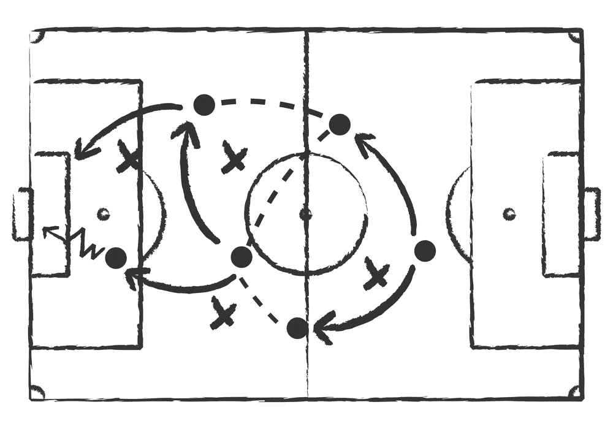
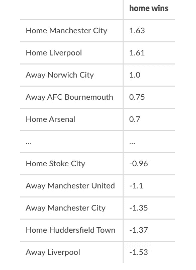
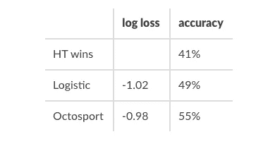

# 使用机器学习构建简单的足球预测模型

> 原文：<https://medium.com/geekculture/building-a-simple-football-prediction-model-using-machine-learning-f061e607bec5?source=collection_archive---------3----------------------->

## 机器学习变得简单

## 在没有先验知识的情况下



Image by [burakowski](https://depositphotos.com/portfolio-1003153.html) from depositphotos

# 介绍

足球一直是一项具有挑战性的运动。最著名的模型是 Dixon-Coles，它利用泊松分布作为模型目标得分的先验。基于成对比较和排名的评级模型已经成为进行预测的替代方法。例如，国际足联使用 Elo rating⁴对国家队进行排名。在这篇文章中，我们提出了一个不同的方法，不需要足球知识或作出任何假设，因此可以推广到其他运动。我们将展示如何训练模型，并使用**正则化逻辑回归**和 scikit-learn 对相关概率进行预测。

我们不会深入这个模型的细节，因为网上有很多[非常好的资源](https://www.coursera.org/lecture/machine-learning/regularized-logistic-regression-4BHEy)比我们做得更好。但是我们将介绍一些 python 代码的基础知识，这些代码可以在 GitHub 上找到[。](https://github.com/octosport)

# 正则化逻辑回归

逻辑回归是用于**分类**的统计模型。分类意味着你处理分类变量来预测。例如，您想预测谁将赢得一场比赛。以足球为例，你会有三个等级:主队赢，客队赢或者是平局。

> 如果你曾经使用过逻辑回归，你就会知道它是两类的模型:0 表示事件没有发生，1 表示事件发生了。为了预测足球比赛的获胜者，我们将需要三个模型，除非你使用多项损失，否则每个模型都将预测不同的事件。一个是主队赢，一个是客场队赢，一个是平局。

逻辑回归模型可以用概率来解释，但你也可以把它看作一个预测 0 和 1 的模型。事实上，预测并不完美，并且以这样的方式落入范围{0，1}，即它们可以被解释为事件实现(预测接近 1)或事件不实现(预测接近 0)的概率。如果你想知道这个想法[背后的数学原理，看看这篇文章](https://www.octosport.io/post/logistic-regression-revisited)，但是你也可以对最初的[概率模型](https://en.wikipedia.org/wiki/Logistic_regression)感兴趣。

## 处理数据

我们已经知道**我们需要用代表比赛结果的二进制目标`y`来训练三个逻辑**模型。例如，对于“平局模型”，如果比赛结果是平局，则目标为 1，否则为 0。幸运的是，我们不需要显式地将三个模型设置为[scikit-learn](https://scikit-learn.org/stable/modules/generated/sklearn.linear_model.LogisticRegression.html)`LogisticRegression`**将通过指定正确的选项来为我们完成这项工作。因此`y`将根据结果分成三个等级。为了表示团队，我们将使用**一键编码器**。**

**假设我们有一个联赛，有 20 支球队主客场比赛。每个队被编码在长度为 40 的向量中，其中每个条目可以取值 1 或 0。前 20 名代表主队，后 20 名代表客队。然后，要对两个队之间的比赛进行编码，我们只需将 1 放在正确的位置。使用 sci kit-了解该步骤可以轻松完成:**

```
from sklearn.preprocessing import OneHotEncoder
team_encoding = OneHotEncoder(sparse=False).fit(team_names)
```

**现在我们可以对过去的匹配列表进行编码来训练模型。例如，我们可以使用过去的三个赛季。有了主队和客场队的名字，我们就可以对它们进行编码，得到我们的虚拟特征。**

```
home_dummies = team_encoding.transform(home_team_names)
away_dummies = team_encoding.transform(away_team_names)
```

**假设我们有 100 个过去的匹配，那么`home_dummies` 和`away_dummies` 是 100 行 20 列的数组，分别为 0 和 1。现在我们可以连接这两个数组来构建每个逻辑模型都将使用的特性`X`**

```
import numpy as np
X = np.concatenate([home_dummies, away_dummies], 1)
```

**目标可以直接设置在三个类中。有了主队和客场队的历史得分，我们将`y`编码为三类:1 代表主队获胜，0 代表平局，1 代表客场获胜**

```
y = np.sign(home_score - away_score)
```

****模型的参数数量等于团队数量的两倍**。每个团队都有一个参数来表示其主客场实力。我们所需要的就是训练模型的时间。**

## **训练模型**

**我们已经提到我们正在使用 scikit-learn `LogisticRegression` 回归模型。与库中的许多其他模型一样，**带有默认选项，我们可能不想使用**。我们希望独立训练三个逻辑回归模型。我们没有一个常数项已经把主场优势编码在特征里了。我们想用岭(l2)惩罚来正则化模型。**

> **正规化将有助于减少强弱球队的强弱。例如，如果一个团队总是获胜，模型将倾向于将一个非常大的系数与该团队相关联，并导致过于乐观的预测。**

**正则化参数`C`可以使用交叉验证找到，但是默认值给出了不错的结果。我们想要的模型是**

```
from sklearn.linear_model import LogisticRegression
model = LogisticRegression(
    penalty="l2", fit_intercept=False, multi_class="ovr", C=1
)
```

**最后是经典的`model.fit(X, y)`模型。模型参数在`model.coef_`中以 3 行多列的数组形式提供，等于团队数量的两倍。第一排对应的是客队获胜的模式，第二排对应的是平局的模式，第三排对应的是主队获胜的模式。我们将在下一个例子中给出这些参数的直觉。**

**要做预测，我们有两个选择。我们可以获得**每个结果的概率或预期赢家****

```
probablities = predict_proba(home_team_name, away_team_name)
winner = predict_winner(home_team_name, away_team_name)
```

**从处理数据到做出预测的流水线在`LogisticModel`可用[这里](https://github.com/octosport/octopy/blob/master/octopy/logistic_model.py)可用。**

## **模型解释:一个具体的例子**

**让我们用一些英超联赛的真实数据。我们使用 2018 年 3 月至 2021 年 3 月的数据，按照上述步骤训练模型。其中有 1110 场比赛和 27 支队伍。**

**模型系数有助于解释模型如何理解数据。请记住，该模型试图使用我们为三种不同结果编码的团队信息来预测 0 和 1。团队系数不是很有用，但它们的符号和大小与其他系数相比是有用的。例如，让我们看看主场获胜的模式。**团队系数上的正号意味着团队增加了主场获胜的机会。团队系数上的负号意味着该团队减少了主队获胜的机会。****

****

**Home wins model coefficients (EPL, 2018-2021)**

**我们观察到曼联客场作战的系数为负(-1.35)，这意味着**曼联对主队赢得**的机会有负面影响。换句话说，曼联在客场打得很好，但主场也很好，因为系数是 1.63。**

**当哈德斯菲尔德镇主场比赛时，系数也是负的(-1.37)，这意味着他们对自己的获胜机会有负面影响。**

**当诺维奇城客场比赛时，它增加了主队获胜的机会，因为它的系数是正的(1.0)。我们可以在亚足联伯恩茅斯得到同样的结论，但系数更小(0.75)，影响也更小。任何主场对阵诺维奇城或亚足联伯恩茅斯的球队，与对阵曼城或利物浦这样系数为负的球队相比，获胜的机会都会增加。**

# ****5 大联赛表现****

**现在我们有了一个模型，我们理解了它，是时候进行测试了。为此，我们使用欧洲的 5 大联赛，即英格兰超级联赛、法甲联赛、德甲联赛、意甲联赛和西甲联赛。数据由 [Sportmonks](https://www.sportmonks.com/) 提供。**

**为了估计模型的样本外性能，我们使用 3 年的匹配来预测下一轮。预测最后 5 轮，总共产生 500 个样本外预测。所有数字都是截至 2021 年 3 月 4 日计算的。逻辑模型的性能将与【Octosport 模型的实际性能进行比较。**

**在下表中，我们展示了两种不同的性能指标。**

*   ****准确率**:正确预测的百分比，最接近 100%最好**
*   ****对数损失:**它给出了概率质量的度量，最接近 0。**

**我们还增加了主队获胜的百分比作为基准，500 场比赛的 41%。**

****

**Top 5 leagues performance comparison**

**逻辑模型将这一数字增加了 7%，而 Octosport 模型将这一数字增加了 14%。如对数损失所示，Octosport 模型的概率也更好。总的来说，逻辑模型显示了一个合理的性能，但如果你想超越它是另一回事。**

> **像 Dixon-Coles 或 Poisson 回归等其他简单模型很有可能会产生相同的性能水平，因为它们都使用相同的信息，匹配结果。**

**这个结果中重要的是****要持续击败简单模型**需要很大的努力，就像本文中介绍的模型一样。Octosport 模型使用了复杂得多的机器学习模型和基础设施。它处理来自多个来源的大量数据，预测全球超过 580 场比赛。我们需要处理大量异构数据，监控性能，及时做出预测，处理[过度拟合风险](https://en.wikipedia.org/wiki/Overfitting)，理解数学，我们还没有提到基础设施。****

# ****结论****

****在本文中，我们提出了一个简单而有效的模型来预测以足球为重点的体育赛事。没有进行任何假设，逻辑模型与简单的机器学习技巧结合使用，如一键编码和岭正则化。该模型可用于任何其他基于团队的运动。****

****利用统计学习进行足球预测是任何人都能做的事情。但是当你想改进这些模型时，困难就出现了。Octosport 旨在通过我们的 API 向任何人提供这种改进，但我们也希望在足球和体育预测方面对人们进行教育。****

****预测在赌博中起着重要的作用，但是击败庄家不仅仅是一场预测游戏。****

> ****物流模型在 [Github](https://github.com/octosport/octopy) 上有，玩得开心。****

## ****参考****

****[1] M. J. Dixon 和 S. G. Coles (1997)，[模拟足球协会的足球比分和足球博彩市场的低效率](https://www.jstor.org/stable/2986290?seq=1)。皇家统计学会杂志:C 辑(应用统计学)，46:265–280。****

****[2] L. Maystre，V. Kristof 和 M. Grossglauser，[与弹性时间动力学的成对比较](https://arxiv.org/abs/1903.07746)，KDD，2019****

****[3] R. A. Bradley 和 M. E. Terry (1952)，[不完全区组设计的秩分析:ⅰ.配对比较的方法。生物计量学，39(3–4)，502–537。](https://www.jstor.org/stable/2334029?seq=1)****

****[4]艾罗。1978.国际象棋选手的等级，过去和现在。阿科出版公司。****