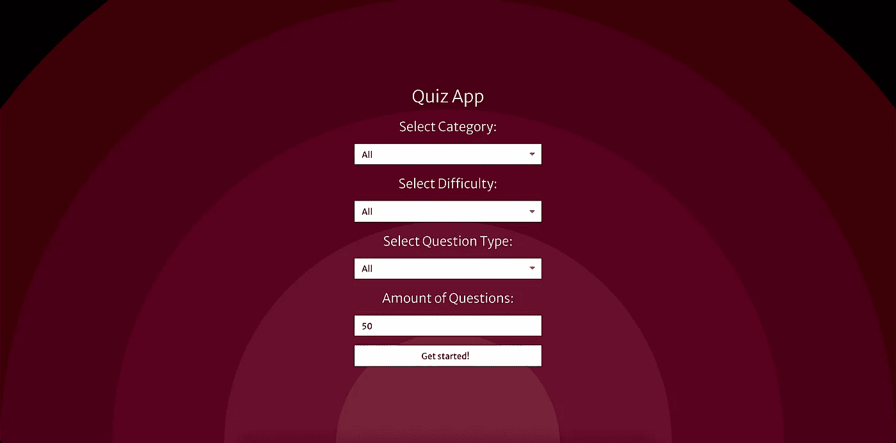
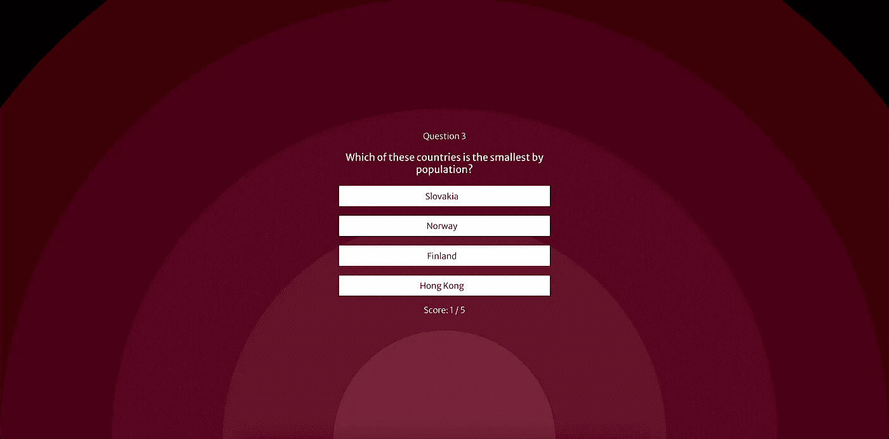
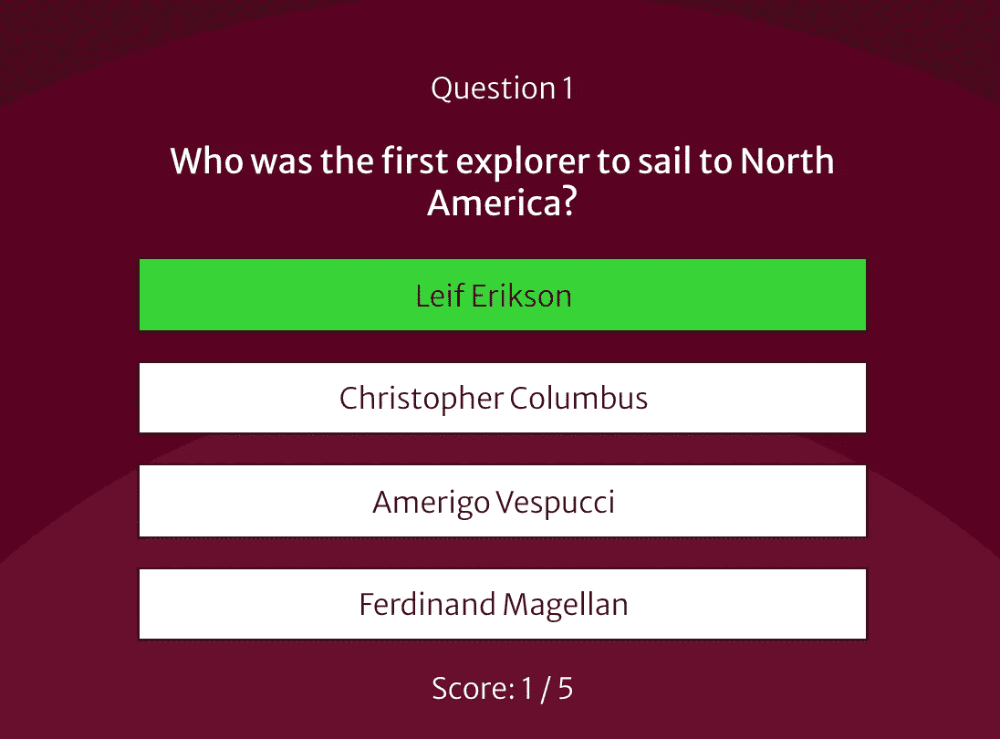
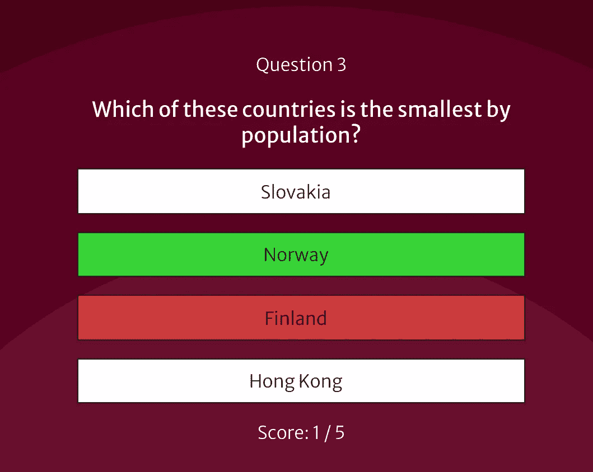
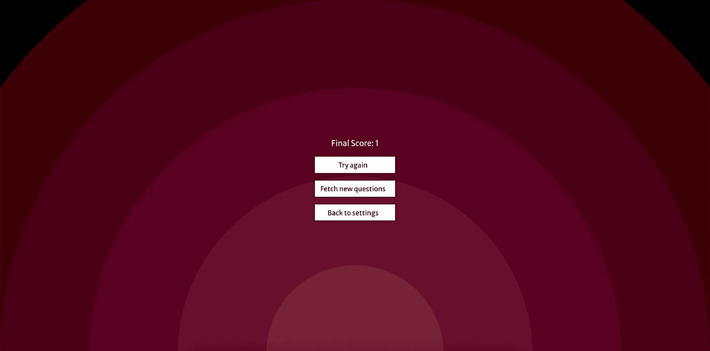

# 使用 Rest API、React 和 Redux 构建一个简单的测验应用程序

> 原文：<https://medium.com/geekculture/building-a-simple-quiz-app-using-a-rest-api-react-and-redux-5c8a85a9447f?source=collection_archive---------0----------------------->

这篇文章描述了如何构建一个简单的单人游戏测试平台。该应用发布于 Netlify 的[，完成的源代码可以在 Github](https://pedantic-joliot-d97b7d.netlify.app/) 的[这里看到。](https://github.com/emily-wheatcroft/quiz-app)

这是我们将要经历的 5 个步骤:

1.  [设置组件](https://www.emilywheatcroft.com/13-04-21-quiz-app/#settings)
2.  [建立一个简单的 redux 商店](https://www.emilywheatcroft.com/13-04-21-quiz-app/#setting-up-a-simple-redux-store)
3.  [提出问题要求](https://www.emilywheatcroft.com/13-04-21-quiz-app/#making-the-questions-request)
4.  [添加问题组件](https://www.emilywheatcroft.com/13-04-21-quiz-app/#adding-a-question-component)
5.  [最后一页](https://www.emilywheatcroft.com/13-04-21-quiz-app/#the-final-page)

你会注意到我没有在文章中包括样式文件，但是你可以在这里看到应用 css 文件。

# 入门指南

我做的第一件事是为这些问题找到一个好的 API 资源。在谷歌搜索了一下之后，我发现[开放琐事数据库](https://opentdb.com/)，里面有数千个问题，并且是经过审核的。如果你看一下 [API 配置](https://opentdb.com/api_config.php)，你可以看到创建一个测验平台需要的所有参数:问题数量、类别、难度、类型&编码选项。

使用 [create-react-app](https://reactjs.org/docs/create-a-new-react-app.html) ，我使用默认选项进行设置，选择最初不添加 redux(这是我后来重新评估的事情)。首先在您的终端中运行以下命令:

```
npx create-react-app quiz-app
cd quiz-app
yarn start
```

# 设置



A settings page for the user to customise the question request

让我们从位于`src/Components/Settings.js`的设置页面开始，这是用户将看到的第一个组件。

我们将使用一个[功能组件](https://reactjs.org/docs/components-and-props.html)，所以第一步是概述这个:

然后将设置组件导入 App.js

接下来，我们想使用 JSX 创建界面的结构。我们从 [API 配置](https://opentdb.com/api_config.php)中知道，我们希望输入控制问题类别、问题难度、问题类型和问题数量。

我们可以从这个端点检索问题类别:[https://opentdb.com/api_category.php](https://opentdb.com/api_category.php)。我们将发出这个请求，并使用 React [状态挂钩](https://reactjs.org/docs/hooks-state.html)和[效果挂钩](https://reactjs.org/docs/hooks-effect.html)保存组件中的类别，如下所示:

我们从 react 导入`useEffect`和`useState`，然后我们可以为选项声明一个初始为空值的状态变量。这是我们使用`setOptions`存储来自 API 响应的数据的地方。

在一个`useEffect`钩子中，我们声明 api url，使用 fetch 发出请求，然后在`setOptions`中将必要的 json 作为有效载荷传递。

问题类别现在在状态中作为选项可用，所以让我们使它们可选！

首先，我们为`questionCategory`声明一个状态变量，初始值为空字符串。我们将使用`setQuestionCategory`来更新这个值。

然后，我们希望提供从所有类别中检索问题的选项，我们将该选项硬编码。对于其余的选项，我们映射选项的数组，确保为每个选项分配一个反应键。我们使用`name`作为选项显示，同时使用`id`作为选项值，因为这是 API 期望的值。

现在我们添加一个名为`handleCategoryChange`的 onChange 事件，每当用户选择一个选项时，它使用`setQuestionCategory`来更新状态中的`questionCategory`。

最后，我们将选择元素的值绑定到`questionCategory`。

现在我们可以添加一个简单的加载状态:

其余的问题选项必须硬编码，因为它们在 API 端点上不可用。我们可以使用相同的`useEffect`和`useState`模式，让`src/Components/Settings.js`看起来像这样:

现在我们已经拥有了 API 调用问题所需的所有信息。

这时我意识到，将这些信息保存在 redux store 中是最容易的。在组件之间传递选项和问题是可能的，但我更喜欢将应用程序数据保存在一个集中的存储中，因为它允许更大的灵活性和可扩展性。

# 设置一个简单的 redux 存储

由于这是一个小应用程序，我们不需要担心复杂的存储结构 reducers 的单个文件应该足够了。

我们需要运行下面的代码将 [**redux**](https://redux.js.org/) 和 [**react-redux**](https://react-redux.js.org/) 添加到我们的应用程序中:

```
yarn add redux react-redux
```

并更新`App.js`这样:

现在我们需要创建`src/Reducer.js`，并开始将选项状态从`src/Components/Settings.js`转移到 redux 状态。

如下图所示，我们可以将初始状态声明为一个变量。在这个变量的 options 键下，我们可以存储当前保存在`Settings`组件中的值。

我们还需要一种方法来更新这些值。因为这是一个相对简单的 redux 设置，所以我们可以在 reducer 中使用一个开关函数来消费将从我们的组件发送的动作:

您可能会注意到，在更新状态对象时，我们使用了[扩展操作符(…)](https://developer.mozilla.org/en-US/docs/Web/JavaScript/Reference/Operators/Spread_syntax) 。通过这样做，我们创建了状态对象的一个副本，然后我们将把我们的新值添加到其中，这意味着我们没有直接改变状态对象。[这是与商店](https://redux.js.org/recipes/using-object-spread-operator)合作的最佳实践。

我们可以返回到`Settings`组件，用 redux 动作替换状态和效果挂钩。我们需要从 react-redux 导入`useSelector`和`useDispatch`。`useSelector`允许我们访问状态，同时我们可以使用`useDispatch`来更新它。

你会注意到，我们没有改变任何 JSX 在这里，这是伟大的！这是因为我们已经在函数中巧妙地处理了所有的更改事件，我们可以简单地更改钩子函数来分派动作，将动作类型和值作为有效载荷传递。

我们可以将`handleCategoryChange`中的变化作为一个具体的例子来看。原来是这样的:

```
const handleCategoryChange = event => {
  setQuestionCategory(event.target.value)
}
```

现在:

```
const handleCategoryChange = event => {
  dispatch({
    type: 'CHANGE_CATEGORY',
    value: event.target.value
  })
}
```

我们现在定义有效载荷对象中的动作类型。我们这样做是因为动作现在由`Reducer.js`中的开关函数解释:

```
// src/Components/Reducer.js
...
case "CHANGE_CATEGORY":
      return {
        ...state,
        options: {
          ...state.options,
          question_category: action.value
        }
      }
...
```

所以`Reducer`意识到在这种情况下，我们想要更新处于 redux 状态的`question_category`。有效负载中的`value`就是我们希望`question_category`在商店中更新的值。

您可能还会注意到`useDispatch()`是这样分配给一个变量的:

```
const dispatch = useDispatch()
```

这样我们就可以将它作为依赖项传递给`useEffect()`。我们仍然在一个钩子中获取问题类别，并且需要在更新加载状态时从钩子中调度一个动作。

# 提出问题请求

既然问题选项在 redux 存储中可供所有组件访问，我们就可以对测验问题发出 API 请求，并将它们保存在存储中。

我们将创建一个名为`FetchButton`的组件来完成这项工作。

在这里，您可以看到使用`useSelector`从商店收集的相关信息。然后，当按钮被点击时，我们在`handleQuery`中处理这个信息。我们根据是否选择了某个选项来动态构建 API url 参数——如果用户选择了“all ”,那么我们不会将它作为参数添加。

在同一个函数中，我们使用`fetch`发出 API 请求。

现在我们可以处理响应并将其设置为如下状态:

我们在这里添加了一个新动作`SET_QUESTION`，所以我们也想更新`Reducer.js`中的开关功能:

# 添加问题组件



The Question component will display the question, options and the user score.

现在我们已经将问题保存在状态中，我们可以创建一个组件来显示问题并让用户选择他们的答案。因为我们需要保存用户当前所在问题的索引，以及用户的当前分数，所以我们可以将它们添加到 redux 存储中，初始值为`0`。此外，我们可以在`Reducer` switch 语句中为更新这些值的操作添加实例:

我们可以在`src/Components/Question.js`将这些添加到我们的空组件中，就像这样:

除了从 redux 存储中检索分数、问题和问题索引之外，还有当前问题和正确答案的变量。useDispatch 也已经导入并定义，可以使用了。

问题的形状如下:

```
{
  "category": "Entertainment: Video Games",
  "type": "boolean",
  "difficulty": "easy",
  "question": "Peter Molyneux was the founder of Bullfrog Productions.",
  "correct_answer": "True",
  "incorrect_answers": [
    "False"
  ]
}
```

正确答案与错误答案的数组分开返回。因此，我编写了一个简单的`useEffect`函数，将正确和不正确的选项一起返回，正确答案放在数组中的随机位置。然后，答案选项被保存为状态`options`:

在为`Question`组件添加 JSX 之前，要考虑的最后一件事是，我们想要一个“未回答”和“已回答”的状态。在用户选择答案之前，我们需要显示的主要信息是问题和答案选项。当用户做出选择时，我们应该显示他们是否选择了正确的答案，如果没有，显示他们正确的答案是什么。因为我们将在同一个组件中完成所有这些工作，所以没有必要将这些信息发送到 redux store，所以我们可以使用钩子来控制这个状态:

目前，该组件将显示第一个问题和答案选项，但单击选项不会更新任何内容。为了解决这个问题，我们向选项的`onClick`处理程序添加了功能。点击时，我们需要:

*   将`answerSelected`设置为`true`
*   根据选择的内容，将`answerCorrect`设置为`true`或`false`
*   如果答案正确，更新`score`
*   如果不是最后一个问题，通过更新他们的`index`进入下一个问题

参数为 2500 毫秒的`setTimeout`功能意味着我们显示用户是否得到了正确答案，并在进入下一个问题之前显示正确答案一秒钟。

现在我们需要解码从 API 发送的文本。由于没有本地的 Javascript 函数，所以我在这里实现了这个解决方案——它并不漂亮，但是完成了工作:

最后，我们可以在用户做出选择后向选项添加一个动态类。我使用了 if 语句，以便:

*   如果尚未选择答案，则没有列表项具有动态类名
*   当选择了一个选项时，正确答案将具有类别`correct`
*   当选择了一个选项时，用户点击的列表项将具有类别`selected`

在`App.css`中，我们可以为这些类添加一些样式。如果列表项有类别`correct`，那么它的背景颜色应该是绿色。如果一个列表项有类别`selected`并且没有类别`correct`，那么它应该有红色背景。因此，如果用户选择了正确的项目，它将是绿色的。如果他们选择了一个不正确的项目，该项目将显示为红色，正确答案将以绿色突出显示:

```
...li:hover {
  background-color: #772139;
  color: white;
}li.correct {
  background-color: rgb(53, 212, 53);
}li.selected:not(correct) {
  background-color: rgb(206, 58, 58);
}...
```



We can use dynamic classes to show the correct answer. Here the user has selected the correct option



Here they have chosen the incorrect option

这就是完成的`Question`组件:

# 最后一页

我们在最后冲刺阶段！`FinalScreen`是我们将为测验应用程序制作的最后一个组件。

目前，一旦用户回答了最后一个问题，就无处可去了——他们被卡在一个页面上，告诉他们这个答案是正确的还是不正确的。

我们有多种方法来完成这一轮的问题，但我决定给用户 3 个选项:

*   再次尝试相同的问题
*   使用相同的设置获取新问题
*   返回到设置页面



The final page should show the final score, and give the user options for what to do next.

如果用户选择重试相同的问题，我们只需将问题索引和分数设置回 0，它们将返回到第一个问题:

```
// src/Components/FinalScreen.js
...const dispatch = useDispatch() const replay = () => {
    dispatch({
      type: 'SET_INDEX',
      index: 0
    }) dispatch({
      type: 'SET_SCORE',
      score: 0
    })
  }...
```

如果用户选择获取新的问题，我们需要重置索引、评分并对问题进行另一次 API 调用。为此，我们可以重用已经在`Settings`中导入的`FetchButton`组件。因为我们的设置存储在 redux 存储中，所以我们只需要在这里做几件事情:

*   将按钮文本作为道具提供给`FetchButton`
*   如果`questionIndex`大于 0，重置`FetchButton`中`handleQuery`函数的问题索引和分数。这是因为如果用户选择请求更多的问题，我们希望转到第一个问题并重置分数

最后，由于如果 redux 存储中没有问题，那么`Settings`组件将显示在`App.js`中——如果用户选择返回设置，我们只需清空存储中的问题数组，并将`score`重置为`0`:

```
// src/Components/FinalScreen.js
...const settings = () => {
    dispatch({
      type: 'SET_QUESTIONS',
      questions: []
    }) dispatch({
      type: 'SET_SCORE',
      score: 0
    })
  }...
```

以下是完整的`FinalScreen`组件:

# 感谢您的阅读

这就是我们想要的——一个小型的、适合特定用途的测验应用程序。

这个应用程序肯定有扩展的空间。有几件事我想在以后补充，比如:

*   使用 API 的会话令牌，此外还有一个平台，如 [firebase](https://firebase.google.com/) 来存储用户的设置、问题和得分历史
*   创建多人游戏选项

在 Medium 上关注我以获取更多内容！