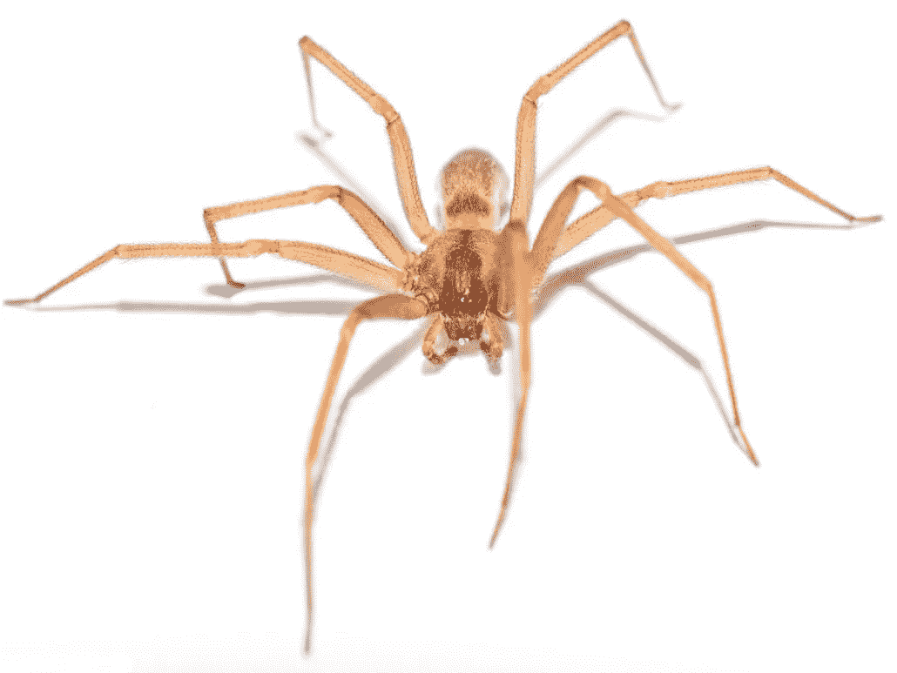
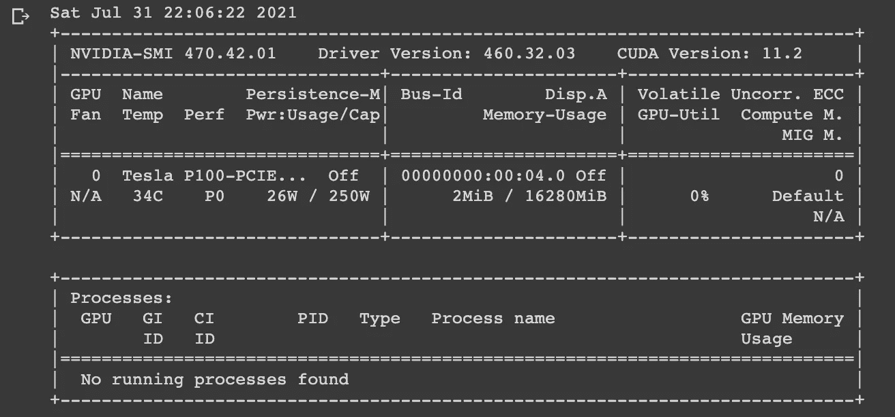
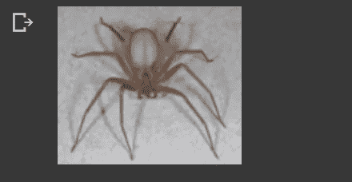

# 用 fastAi 分类肯塔基蜘蛛。第一部分

> 原文：<https://medium.com/geekculture/building-a-state-of-the-art-fastai-app-to-identify-the-strange-and-dangerous-spiders-of-kentucky-4817183ef604?source=collection_archive---------22----------------------->

# 第一部分:获取数据



所以，大约六个月前，我搬到了肯塔基州一个叫布兰登堡的小镇。在我工作的六个月里，我见过一些奇怪而可怕的蜘蛛种类。然而，我不是蜘蛛专家，除了黑寡妇和棕色隐士之外，我对蜘蛛并不太了解。然而，在我做研究的时候，我不知道有一只南北黑寡妇和一只狼蛛生活在我的区域。这个地区也有生活在枯木下的蝎子。要查看代码，请导航到 github 库[这里。](https://github.com/chris-kehl/Spider_Classifier)

这个项目的目标是建立一个应用程序，使用人工智能来快速识别不易识别的蜘蛛。如果你觉得你有棕色隐士蜘蛛的侵扰，这是肯塔基州常见的蜘蛛侵扰，你可以拍下蜘蛛的快照，并将照片上传到应用程序。我们的第一个目标是使用一个名为 binder 的简单程序上传应用程序进行测试。在这篇文章的另一个系列的后面，我们将把我们的应用程序转换成一个 IOS 和 android 应用程序，我们可以把它放在我们的手机上。当我们看到一只蜘蛛而不知道它是否危险时，在我们的手机上建立一个应用程序将会非常方便。大多数人会把棕色隐士蜘蛛和狼蛛搞混。

现在开始构建我们应用程序的第一部分。首先，我们必须从应用程序的人工智能部分开始。为此，我将使用 fastAi 库。我选择这个库是因为它的简单性和易于遵循的步骤。

从我们最先进的模型开始，我们首先必须得到所有蜘蛛的图像。我使用 Google Colab 作为我的首选 IDE。我用 Google Colab 做 GPU。到目前为止，我已经使用 Google Colab 大约一年了，对于我需要做的任何数据科学工作，它都是我的头号工具。为了获取图像，我将使用 bing，但在此之前，让我们在 colab 中设置所有的导入和库。

```
# import all the needed starter packages!pip install -Uqq fastbookimport fastbook
import warnings
import osfastbook.setup_book()
from fastai.vision.all import *
from fastbook import *
```

pip 安装将确保为您设置了 fastbooks 和 fastai 库。如果你在 jupyter labs 上使用自己的电脑，一定要研究如何开始使用 pytorch 和 fastai，以防有额外的设置步骤。我发现 Google Colab 对初学者来说很棒，因为它设置简单，配置方便。

对于我们的第一个代码块，我们导入 fastbook 并设置所有的导入和库。我导入 os(操作系统),这样我们就可以管理我们的文件和目录。我的 google drive 文件夹里有我所有的文件夹。您可能已经注意到，当您运行上面的代码时，系统可能会提示您安装 google drive。现在，如果你不想保存文件，你不必保存到你的谷歌硬盘，你可以使用操作系统把你的文件放在你想放的地方。

我喜欢利用 Google Colab 提供的 GPU。因此，在我们继续之前，让我们确保我们使用的是 GPU。对于 Colab，您可以通过单击主菜单中的运行时来启用 GPU。然后单击运行时类型，更改并选择 GPU。您还可以选择 TPU，但我们将把它留到以后的主题中。您还可以选择高内存，当我们在培训中要使用许多纪元时，我们可以选择这个选项。

```
# setup for the use of the GPU vs CPUif torch.cuda.is_available():
    device = torch.device("cuda")
else:
    device = torch.device("gpu")!nvidia-smi
```



Showing our GPU connectivity

你可以看到我连接到一个特斯拉 P100 图形处理器。这就是我喜欢谷歌 Colab 的地方，我查看了特斯拉 P100 GPU 的价格，发现现行价格约为 3000.00 美元，上下浮动几百美元。现在是时候开始建立我们的数据文件了。首先，我想看看我目前所在的目录。然后，我们将导航到我们希望设置数据文件的文件夹。您可能需要在驱动器中创建目录。我在 Google MyDrive 里做了一个目录，名字叫 spider。你点击我的硬盘旁边的我的硬盘，你会看到…，选择它，应该会出现一个下拉菜单，您可以选择添加文件夹。新文件夹将被标记为无标题，所以您只需重命名它，您可以选择无标题旁边的…并选择重命名(如果需要)。

```
# current working directory
os.getcwd()
```

/content/是 os.getcwd()带我去的地方。因此，我将更改当前目录，以包含 MyDrive 目录。这是我的所有数据将去的地方，并在几分钟内为我们建立一个蜘蛛文件夹。

```
# change to google drive
os.chdir('/content/gdrive/MyDrive/')os.getcwd()
```

我们的目录现在位于/content/gdrive/MyDrive 目录中。你的也应该如此，除非你的 google drive 设置与我的略有不同，或者你希望使用另一个目录。接下来，我们设置如何检索数据。我将使用微软 Azure 帐户，并使用阿炳 API 来抓取网页。因此，如果你没有 Azure 搜索关键字，你需要点击这个[链接](https://carldesouza.com/bing-custom-search-api-key-azure/)【https://carldesouza.com/bing-custom-search-api-key-azure/】T2 来获得你的 Azure 搜索关键字。一旦你拿到钥匙，回来我们继续我们的旅程。我们上传最好的八眼爬虫的照片只是时间问题。

```
key = os.environ.get('AZURE_SEARCH_KEY','Add your key here')
```

我们将测试我们的密钥以确保它工作正常

```
search_images_bing
```

上面的代码应该返回这个<function fastbook.search_images_bing="">，让我们知道它正在识别我们的键。</function>

```
results = search_images_bing(key, 'Brown Recluse')
ims = results.attrgot('content_url')
len(ims)
```

上面的代码进一步测试了我们的 bing，以确保它可以下拉图像，所以当这段代码运行 len(ims)时，ims 的长度应该是 150。这意味着我们已经下载了 150 张棕色隐居蜘蛛的图片。

```
results
```

我们查看结果，它会给出一长串内容 url，(# 150)[{ ' webSearchUrl ':'[https://www.bing.com/images/search?view=detailv2&FORM = OIIRPO&q = Brown+Recluse&id = 6916 baeeb 9697 FD 81 d3a 5a 97 DDC 3 CB 24 b5 d87 F3 b&simid = 60802400323232360099](https://www.bing.com/images/search?view=detailv2&FORM=OIIRPO&q=Brown+Recluse&id=6916BAEEB9697FD81D3A5A97DDC3CB24B5D87F3B&simid=608024003232360099)'，' name ':id = OIP . y 6 mgbeniupw 5 eojwnq 5 cwhae 8&PID = Api，' date published ':' 2018–02–04t 12:00:00:00.0000000 z '，' isFamilyFriendly': True，' content URL ':'[https://www . hopperenvironmentalservices . com/images/blog/brown-recluse . jpg](https://www.hopperenvironmentalservices.com/images/blog/brown-recluse.jpg)。

```
ims = ['https://scx2.bcdn.net/gfx/news/hires/2018/brownrecluse.jpg']
```

使用 url 设置即时消息，这样我们就可以查看刚刚下载的图像。

```
dest = 'brownrecluse.jpg'
download_url(ims[0], dest)
```

我们的 dest = brownrecluse.jpg，我们的 download_url(ims[0]，dest)将指向我们下载的第一个图像。

```
im = Image.open(dest)
im.to_thumb(128,128)
```

上面的代码允许我们打开图像。我们将所有的像素设置为 128 x 128。



image of the url

接下来的几个代码块将让我们设置文件夹来下载应用程序所需的所有数据文件。

```
spider_types = 'Southern Black Widow', 'Northern Black Widow', 'Brown Recluse', 'Star-bellied Orb-weaver', 'Red-spotted Orb-weaver', 'Arabesque Orb-weaver', 'Arrowhead Orb-weaver','Yellow Garden', 'Banded Garden', 'Arrow-shaped Micrathena', 'Araneus miniatus', 'Bold Jumper', 'Canopy Jumping', 'Tan Jumping', 'Dimorphic Jumper','Emerald Jumping Spider', 'Marpissa lineata', 'Phidippus putnami','Dark Fishing', 'Six-spotted Fishing', 'Striped Fishing', 'Dolomedes vittatus','White-banded Crab', 'Southeastern Wandering', 'Subsocial Tangle Web', 'Twospotted Cobweb', 'Triangulate Cobweb', 'Common House', 'Rhomphaea fictilium', 'Spintharus flavidus', 'Ariadna bicolor', 'Castianeira amoena', 'Castianeira longipalpa', 'Meriola decepta', 'Cesonia bilineata', 'Sergiolus capulatus', 'Thanatus formicinus', 'Tiger Wolf (Tigrosa aspersa)', 'Tigrosa georgicola', 'Tigrosa helluo', 'KENTUCKY PURSEWEB'path = Path('spider')
```

蜘蛛类型是我在一个列出肯塔基州所有蜘蛛的网站上找到的所有蜘蛛类型。可能有更多的物种，但这是我所拥有的。我们将为列出的每个生物建立所有的训练、验证和测试文件夹。

```
if not path.exists():
    path.mkdir()
    for o in spider_types:
        dest = (path/o)
        dest.mkdir(exist_ok=True) 
        results = search_images_bing(key, f'{o} spider')
        download_images(dest, urls=results.attrgot('contentUrl'))
```

这是我们创建蜘蛛目录的地方，在这个目录中，我们为每个蜘蛛类型创建文件夹。当你打开文件夹时，你会看到大约 150 张图片被下载到每个文件夹中。

```
fns = get_image_files(path)
fns
```

fns 将所有下载的映像放入正确的映像路径。我们使用 failed = verify_images(fns)来查找任何损坏的文件。

```
failed.map(Path.unlink)
```

然后，我们使用 failed.map(Path.unlink)来取消链接，并忽略可能已经下载的任何损坏的图像。

```
#remove failed files
failed.map(Path.unlink);
```

这是它当谈到建立和下载我们的图像。第二部分将包括设置我们的数据加载器，并完成我们的初始基线。第三部分将继续使用迁移学习对我们的 spider 预测器进行改进。第四部分将构建一个原型，第五部分将把我们的模型投入生产。我最有可能使用 SWIFT 和 ios 将我的第一个工作模型部署到苹果商店。在后面的系列中，我们可能会考虑使用 flutter 来部署一个 ios 和 android 应用程序。

同时，请留意第二部。请务必在 medium 和以下社交媒体网站上关注我:

@ckehl_chris

@linked-in_ [chriskehl](https://www.linkedin.com/in/chris-kehl-552017109/)

感谢预览，我希望你会喜欢所有即将到来的职位。

参考:

霍华德，杰里米；古格，西尔万。利用 fastai 和 PyTorch 为编码人员提供深度学习。奥莱利媒体。Kindle 版。