# 用 fastAi 分类肯塔基蜘蛛。第二部分

> 原文：<https://medium.com/geekculture/building-a-state-of-the-art-fastai-app-to-identify-the-strange-and-dangerous-spiders-of-kentucky-50c0995b20c3?source=collection_archive---------30----------------------->

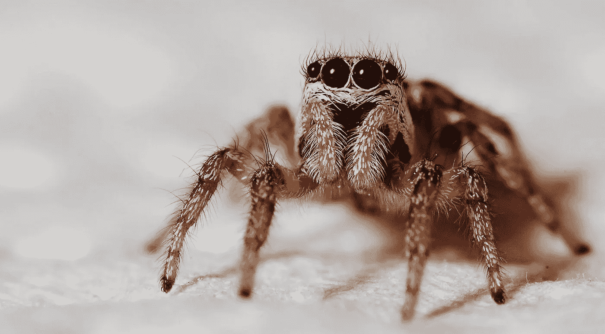

# 第二部分:获取基线

当构建像我们目前正在构建的深度学习应用程序时，我们会想要构建一个基线模型。基线模型将在我们构建改进模型时用作比较模型。因此，我们的目标是建立这个简单的模型，并看看通过使用不同的迁移学习模型、添加层和调整我们的超参数，我们可以取得多大的改善。要查看代码，请点击这里查看 github 库[。](https://github.com/chris-kehl/Spider_Classifier)如果你还没有收集数据文件，请查看[第一部分](/@chris.kehl/building-a-state-of-the-art-fastai-app-to-identify-the-strange-and-dangerous-spiders-of-kentucky-4817183ef604)。

当我们继续使用我们的模型时，我们开始实现我们的数据加载器。**数据加载器**是一个内置的 PyTorch 对象，它从数据集中抓取一批要素，并将数据转换为张量。通过将数据转换成张量，我们可以确保模型尽可能高效地工作。张量能够与 GPU 一起工作，并允许多个工人处理张量，从而允许并行加载多个批次。

```
class DataLoaders(GetAttr):
def __init(self, *loaders): self.loaders = loaders
def __getitem__(self, i): return self.loaders[i]
train, valid = add_props(lambda i,self: self[i])
```

现在，我们已经创建了数据加载器并运行了代码块，是时候将我们的数据拆分到我们的 spider 文件夹中，以允许 80%的数据用于我们的训练集，20%的数据用于测试集。

```
spiders = DataBlock(
    blocks=(ImageBlock, CategoryBlock),
    get_items=get_image_files,
    splitter=RandomSplitter(valid_pct=0.2, seed=42),
    get_y=parent_label,
    item_tfms=Resize(128))
```

让我们为数据加载器设置路径，并用一行显示 4 个图像。我们将数据加载器命名为 dls，并将其指向数据加载器可以访问图像的路径。

```
dls = spiders.dataloaders(path)
dls.valid.show_batch(max_n=4, nrows=1)
```

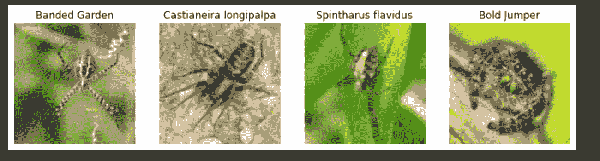

现在我们已经有了图像，并且对我们的数据加载器实际上正在工作有了很好的感觉，我们将希望确保我们的图像是正方形 128 x 128。

```
# resize the images to make them square (128)spiders = spiders.new(item_tfms=Resize(128, ResizeMethod.Pad, pad_mode='zeros'))
dls = spiders.dataloaders(path)
dls.valid.show_batch(max_n=4, nrows=1)
```

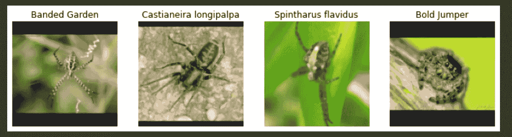

我们注意到，当我们对图像进行方形处理时，我们为一些照片提供了一些填充。我们希望将数据扩充应用于训练集。这将允许我们的 150 个图像物种获得更多的数据来训练。我们从不同角度翻转数据，模糊照片，裁剪照片，并应用其他技术来帮助训练我们的数据。首先我们将裁剪我们的图像。

```
spiders = spiders.new(item_tfms=RandomResizedCrop(128, min_scale=0.3))
dls = spiders.dataloaders(path)
dls.train.show_batch(max_n=8, nrows=2, unique=True)
```

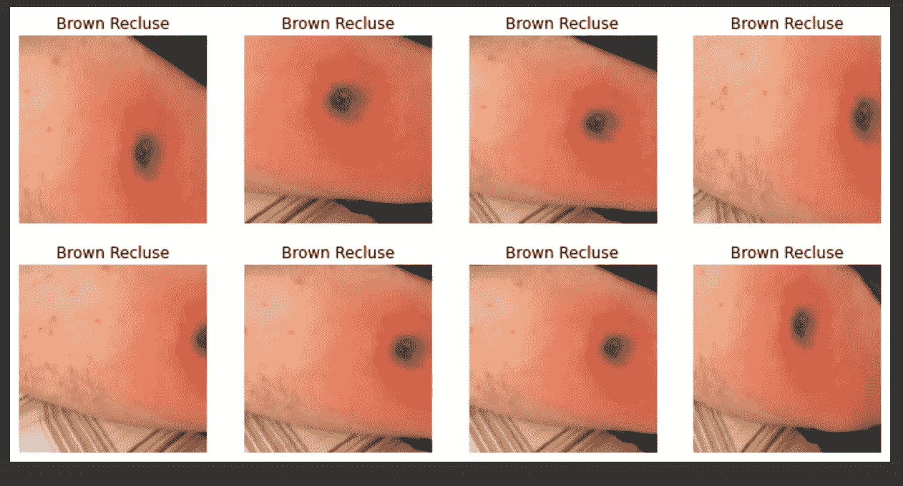

呀，你可以看到出现的不是一只蜘蛛，而是一个棕色的咬伤。一会儿我们将看看如何清理我们的数据。当然，为了正确识别我们的物种，我们不想添加这些照片。

```
spiders = spiders.new(item_tfms=RandomResizedCrop(224, min_scale=0.5),
batch_tfms=aug_transforms())
dls = spiders.dataloaders(path)
```

上面的代码应用了我们在上面的照片中讨论的数据扩充。我们的下一步是训练模型，我们可以看到我们的初始基线在哪里。我们要训练 5 个纪元。

```
learn = cnn_learner(dls, models.vgg19_bn, metrics=error_rate)
learn.fine_tune(5)
warnings.filterwarnings('ignore')
```

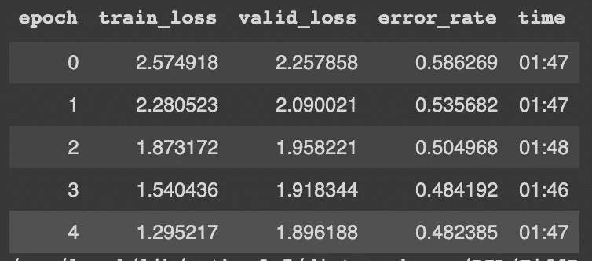

因此，我们看到错误率为 0.482。目前情况不太好。让我们来看一个混淆矩阵，看看我们的图像是如何表现的。

```
# implement a confusion matrix
interp = ClassificationInterpretation.from_learner(learn)
interp.plot_confusion_matrix(figsize=(12,12), dpi=60)
```

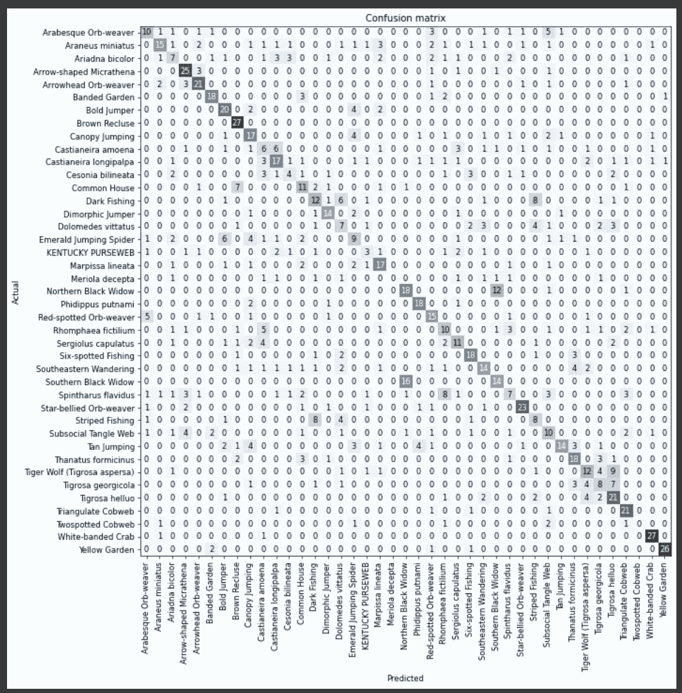

```
interp.most_confused(min_val=8)
```

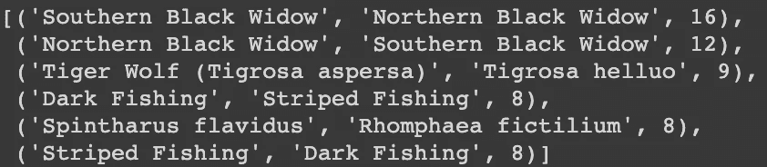

这是我们在前面的代码中所做的。我们对我们的模型进行了 5 个时期的训练，并查看了我们的错误率。然后，我们绘制了一个混淆矩阵，以查看我们的模型识别哪些图像有问题。然后我们打印出哪些图像错过了他们的目标识别 8。因此，如果我们的模型错过了 8 个或更多的图像识别，我们会在上面的打印结果中列出。从这一点，我们可以看到我们的黑寡妇北部和黑寡妇南部是我们最大的错误。现在我不是蜘蛛专家，所以我该如何解决这个问题。我推荐谷歌，我们用谷歌搜索两种蜘蛛的区别。FastAi 实现了一个名为 imageClassifierCleaner()的工具。这使我们能够检查每一个训练和测试图像，并选择哪些图像要删除或放入另一个类别。我承认，在 Google Colab 上这么做很费时间，过一会儿你的记忆可能会停滞不前。我的建议是仔细检查这些图片，然后用下面的清洁剂清理它们，或者一张一张地检查每张图片。我去试试吸尘器。

```
# Add the cleaner to clean up images that don't belong
cleaner = ImageClassifierCleaner(learn)
cleaner
```

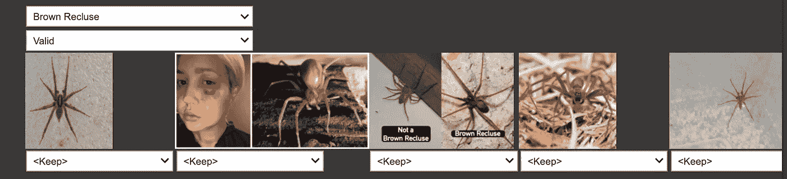

好吧，我知道棕色隐士长什么样了。我用吸尘器清除了狼蛛的照片和咬伤的照片。我会谷歌一下南北黑寡妇的区别，看看我是否能通过清理我们的图像来改善我们的基线。我在谷歌上搜索了北方和南方黑寡妇的区别，北方黑寡妇有明显的沙漏图案，但已经破碎，而南方黑寡妇的沙漏是完整的。所以，我会用清洁剂，看看能不能发现一些出入。如果我发现任何不一致的地方，我不想删除它们，我只会把它们移到适当的类别。很难说，但我确实清理了一些不属于我的照片。试图修复黑暗捕鱼蜘蛛和条纹捕鱼蜘蛛可能是一个挑战。谷歌照片对我来说看起来是一样的，所以我想只要它是一个钓鱼蜘蛛，我们就会有这个想法。对于虎尾兰和虎尾兰也是一样，我们需要一个主题专家(SME)来协助这项任务。这是一个很好的观点，要建立严肃的模型，你需要确保你与 SME 合作，以确保你对正确的图像进行分类。

```
for idx in cleaner.delete():
cleaner.fns[idx].unlink()
```

上面的代码是在我们完成清洁器之后运行的。我们现在将再次运行我们的模型，看看我们是否有任何改进。

```
learn = cnn_learner(dls, models.vgg19_bn, metrics=error_rate)
learn.fine_tune(5)
warnings.filterwarnings('ignore')
```

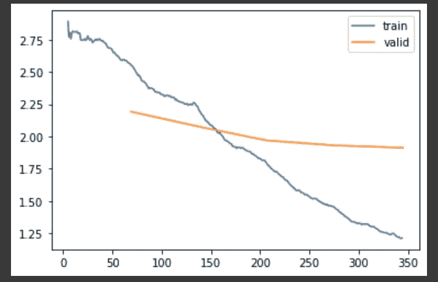

这个模型并没有让我们做得更好。让我们用 resnet34 代替 vgg_19 来尝试一下我们的迁移学习。我们正在寻找最低的错误率。

```
learn = cnn_learner(dls, resnet34, metrics=error_rate)
learn.fine_tune(2)
```

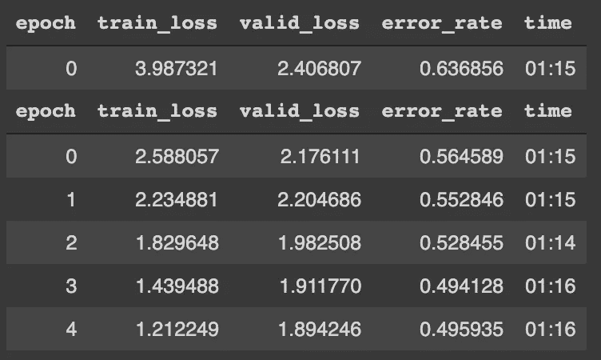

```
learn.recorder.plot_loss()
```

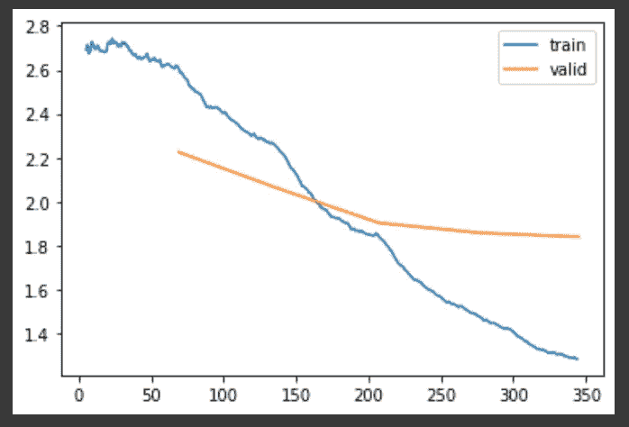

我们的 resnet34 型号性能大致相同。我们将声明我们已经完成了基线模型。我们的目标是提高模型的基线分数，误差率为 0.484。我们将在第三部分改进我们的模型。

@ckehl_chris

@linked-in_ [chriskehl](https://www.linkedin.com/in/chris-kehl-552017109/)

感谢预览，我希望你会喜欢所有即将到来的职位。

参考:

蜘蛛图片:[https://www.pexels.com/search/spider/](https://www.pexels.com/search/spider/)

霍华德，杰里米；古格，西尔万。利用 fastai 和 PyTorch 为编码人员提供深度学习。奥莱利媒体。Kindle 版。