# 用 fastAi 分类肯塔基蜘蛛。第三部分

> 原文：<https://medium.com/geekculture/building-a-state-of-the-art-fastai-app-to-identify-the-strange-and-dangerous-spiders-of-kentucky-9e070246c180?source=collection_archive---------26----------------------->

**第三部分**

好了，你回来了，我们的蜘蛛探测器模型的第三部分。为了概括我们到目前为止的进展，我们回顾一下第一部分。第一部分演示了我们如何使用 bing API 来获取 web 上的蜘蛛图像，将我们的数据下载到单独的文件夹中，并使用 fastAi 通过数据加载器来管理我们的下载。数据加载器用于将我们的训练和验证文件输入机器学习模型。

[第二部分](/@chris.kehl/building-a-state-of-the-art-fastai-app-to-identify-the-strange-and-dangerous-spiders-of-kentucky-50c0995b20c3)建立我们的初始基线模型，以便在我们创建更复杂的模型时对自己进行评估，目的是通过微调超参数进行改进。使用 VGG19 迁移学习模型时，我们的基线错误率为 0.047，使用 resnet34 时，基线模型的错误率为 0.049。因此，为了改进这些模型，我们将应用某些技术，如清理我们的数据，微调我们的超参数以降低我们的错误率。我用来清理数据集的技术是查看每个文件夹中的每张照片。这似乎很乏味，而且确实如此。我删除了所有包含蜘蛛位置地图的照片；另外，我把所有看起来和其余蜘蛛不搭的照片都去掉了。从第二部分的混淆矩阵中，我注意到模型很难区分北方黑寡妇蜘蛛和南方黑寡妇蜘蛛。为了努力改进模型，我在谷歌上搜索了差异。我发现南方黑寡妇的下腹有完整的沙漏形状，而北方黑寡妇的沙漏有一个缺口。你可以在谷歌上搜索每个文件夹中的物种，了解这个物种的样子。如果你在我们的数据集中得到奇怪的图像，我会把它们去掉。

从我们的模型改进开始，我将设置我们的笔记本来安装所有必要的库。这一步和第一部分完全一样。

```
# import all the needed libraries and packages!pip install -Uqq fastbook
import fastbook
import warnings
import osfastbook.setup_book()
from fastai.vision.all import *
from fastbook import *
from fastai.vision.widgets import *
```

我还将确保我们的设备正在 gpu 上运行，因此，如果 gpu 可用，我将使用以下代码来启用它。

```
# enable fastai to access the GPU
# ensure to enable runtime to GPUif torch.cuda.is_available():
device = torch.device("cuda")
else:
device = torch.device("cpu")!nvidia-smi
```

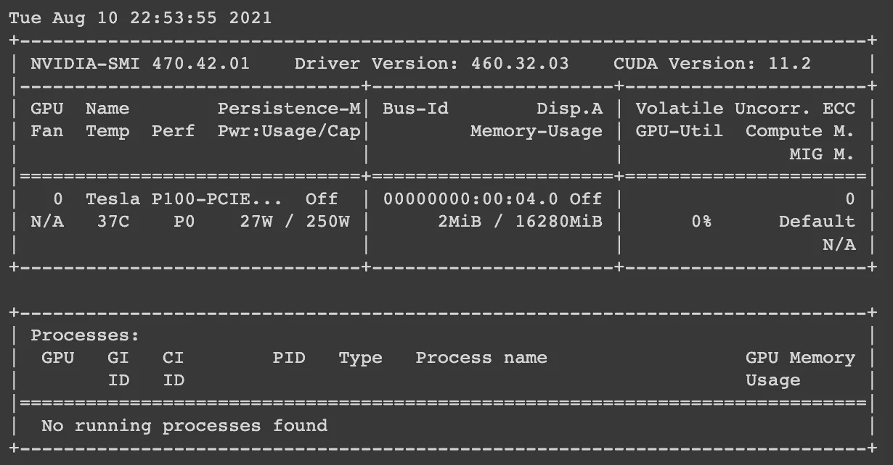

运行上述代码后，我们可以看到我正在使用 Tesla p100-PCIE GPU 运行笔记本和模型。现在我正在使用谷歌 Colab，如果你是深度学习的新手，并且没有配备英伟达 GPU 的系统，我建议你使用 Colab。

我还将我的文件存储在 Google Drive 上，所以我使用下面的代码来更改我的驱动器，并将我的路径设置为 spider 目录。

```
os.getcwd()
```

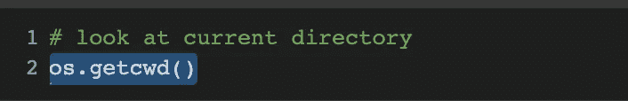

```
# change to your working directory where you have your spider foldersos.chdir('/content/gdrive/MyDrive/')
os.getcwd()
```

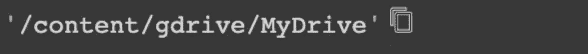

我们使用 path = Path('spider ')来设置目录，在这个目录中我们有每种蜘蛛的所有文件夹。在第一部分中，我们使用 Bing API 来抓取网页，并得到许多蜘蛛标本的图像。如果您没有执行该步骤，您可以返回并重新访问第一部分。

```
path = Path('spider')
```

接下来，我们实际上通过简单地命名 fns 来获得图像文件，因为我们想要获得路径 path 中的所有蜘蛛种类文件夹。

```
fns = get_image_files(path)
fns
```

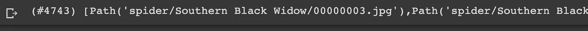

下面的代码为我们设置了数据加载器。DataLoader 是 pytorch 在数据集(spider 目录和所有子目录)周围包装 iterable 的方法，这允许 fastai(即 pytorch)轻松访问我们的样本图像。

```
class DataLoaders(GetAttr):
    def __init(self, *loaders): self.loaders = loaders
    def __getitem__(self, i): return self.loaders[i]
    train, valid = add_props(lambda i,self: self[i])
```

在这一点上，就像在第一部分中一样，我们将识别我们的数据，执行所有的过程，让我们的模型说这是我们的数据，并将数据分成我们的训练和验证集。我们将 80%的数据设置为训练集，20%的数据进入验证集。你还会注意到，我们已经调整了我们的图像大小为 224 像素。

```
# were using the splitter here to split the data 80% training set and 20% test set
# with this we are resizing our images to 224spiders = DataBlock(
    blocks=(ImageBlock, CategoryBlock),
    get_items=get_image_files,
    splitter=RandomSplitter(valid_pct=0.2, seed=42),
    get_y=parent_label,
    item_tfms=Resize(224))
```

让我们检查并确保我们的数据加载器正在工作，我们指向正确的路径。现在，我的路径再次指向我的 google drive 中的蜘蛛目录。

```
dls = spiders.dataloaders(path)
dls.valid.show_batch(max_n=4, nrows=1)
```

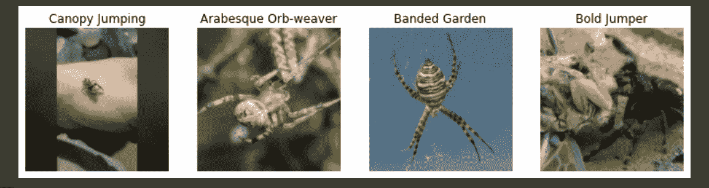

在第一部分中，我们讨论了数据扩充。现在，数据增强帮助我们让数据集看起来更大。我们通过旋转图像、裁剪图像的一部分、模糊图像等方式来改变图像。对于我们正在处理的数据集，我们绝对需要这个。清理该数据集后，我们创建了一个不平衡的数据集。这真的是一种不可取的数据科学方法，但是嘿，我们不是要去月球。如果我们想尽可能完美，我会聘请专家收集照片，把它们送到野外，让他们给每个物种分类。这可能需要很长时间，所以现在我们只是让 Bing 做它的事情。

```
# apply augmented transformations to the imagesspiders = spiders.new(item_tfms=RandomResizedCrop(224, min_scale=0.5),
batch_tfms=aug_transforms(size=224, min_scale=0.75))
dls = spiders.dataloaders(path)
```

很好，目前为止我们做得很好。现在是时候开始用我们的模型工作了，让它打败我们的基线模型。让我们开始让这个模型学习。

我添加了下面的代码，你会看到我只是将学习率设置为 0.0001。

```
learn = cnn_learner(dls, resnet152,metrics=error_rate)
learn.fit_one_cycle(3, 0.0001)
```

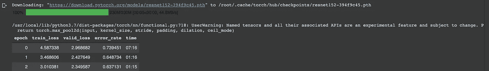

我们在模型中使用迁移学习。这里我用的是 resnet152。当我们使用迁移学习时，我们使用的是一个已经包含训练权重和模型的预训练模型。resnet152 是我上次运行的型号。为了使本文简单，resnet152 是我结束我的模型的地方。我从 resnet18 开始，然后运行 resnet34、resnet50，一直到 resnet152。我建议做同样的事情，这样你就可以看到不同的转移模型是提高了还是降低了。所以，我有 resnet152 使用 152 层，最后一层可能不会为蜘蛛模型工作，所以我们需要扔掉它，并添加另一层，我们可以训练。我们将冻结训练好的模型，并允许我们使用微调方法修改最终层，这将使我们的模型符合数据。让我们开始吧。

```
learn.unfreeze()
```

Fastai 有一个工具，我们可以找到合适的学习率。我们需要这一点，这样我们就不只是猜测使用什么学习率，或者必须使用一个通用的学习率，如 0.001，或 0.0001。

```
learn.lr_find()
```

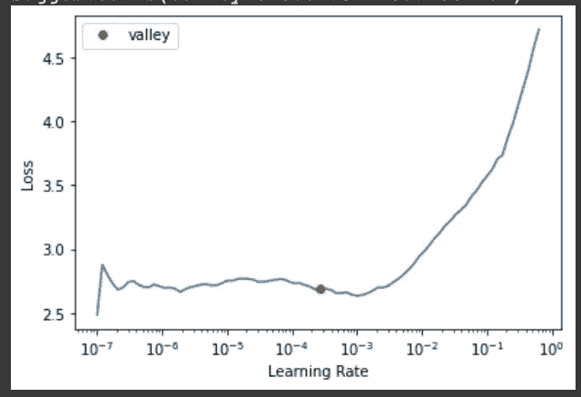

如果你跟着代码走，你会注意到在我们的学习率图表上面会给你建议的学习率。它提供了 0.000275，所以我将它四舍五入为 0.0003，如下面的代码所示。

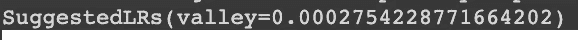

```
learn.fit_one_cycle(6, lr_max=0.0003)
```

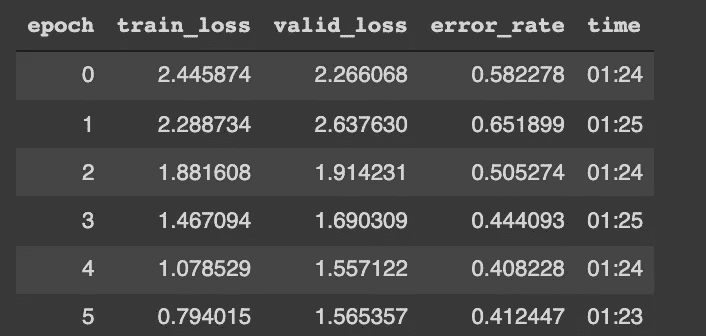

你可以看到我用的是学习率 max 0.0003。顺便说一下，我们已经用 6 个时期 0.41 的错误率击败了我们的基线模型。fit_one_cycle 是我们的模型从低训练重量开始，逐步提高学习率的一种方式。这里，我们将最大学习速率设置为 0.0003。我们可以使用 learn.fit_one_cycle(6，lr_max=slice(1e-5，1e-3 ),这将为我们的图形提供一个范围，以找到我们的梯度，而不是反弹到我们的图形的一部分向上。让我们来看一个混淆矩阵，看看我们的模型在找到与我们的样本完全匹配时遇到了什么问题。

```
interp = ClassificationInterpretation.from_learner(learn)
interp.plot_confusion_matrix(figsize=(12,12),dpi=60)
```

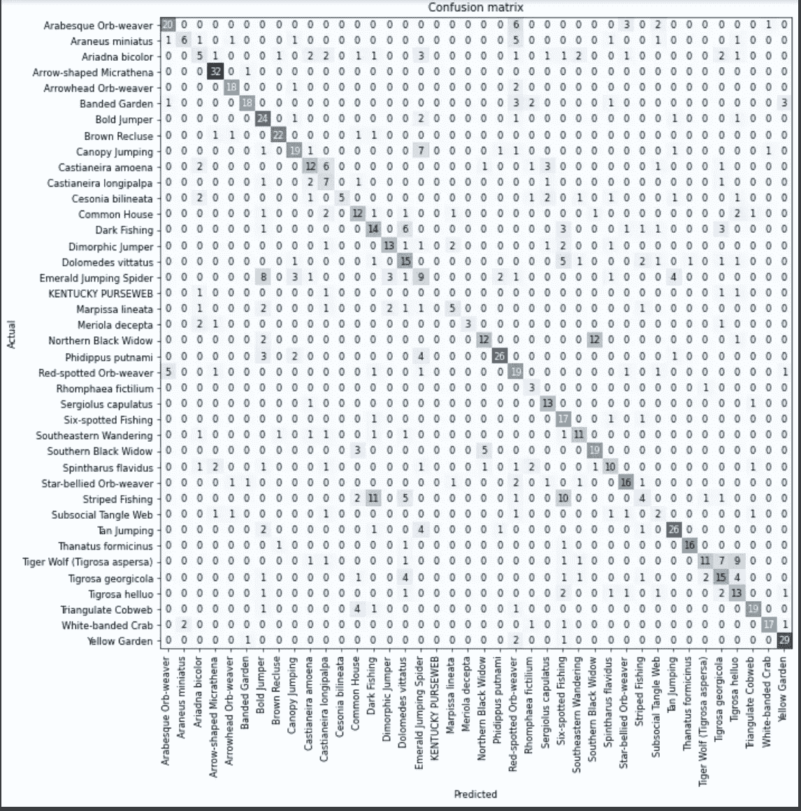

Geezz 看起来我们的模型真的很难区分北黑寡妇蜘蛛和南黑寡妇蜘蛛。同样在这个模型中，捕鱼蜘蛛很难被区分。圆球蜘蛛遇到了一点小问题。其余的都马马虎虎。

```
# look at the predictions that have greater than 5 wrong
interp.most_confused(min_val=5)
```

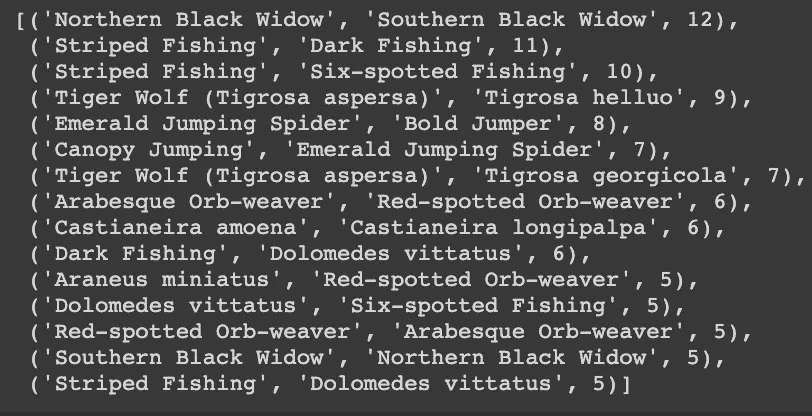

好，我们看着这个，然后说，嘿，我们从这里去哪里。嗯，就像我之前说的，要取得更大的进步需要一些时间来平衡我们的数据集，并雇佣主题专家去实地识别这些野生物种，或者找到一个平衡的数据集，并为我们准确标记所有蜘蛛图像。我会看着 Kaggle，我想我在那里看到了一些蜘蛛种类的数据集。

我不想再浪费你的时间了，事实上 0.41 和 6 个纪元是我最好的模型。如果您愿意，您可以进一步重新启动您的模型并添加更多的历元，或者使用 learn.fit_one_cycle(6，lr_max=slice(1e-5，1e-3)来尝试降低错误率。你可以在 github [这里](https://github.com/chris-kehl/Spider_Classifier)关注我的模型。