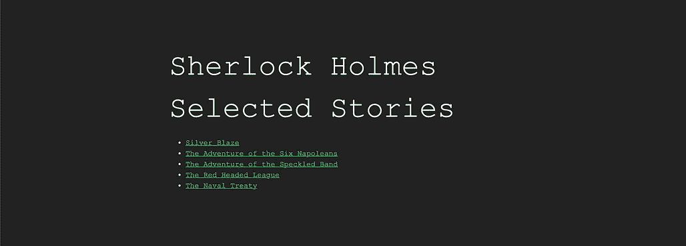
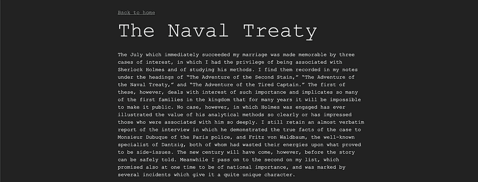

# 构建静态站点生成器。

> 原文：<https://medium.com/geekculture/building-a-static-site-generator-b5ca4b457c48?source=collection_archive---------39----------------------->


Photo by [Sai Kiran Anagani](https://unsplash.com/@_imkiran?utm_source=medium&utm_medium=referral) on [Unsplash](https://unsplash.com?utm_source=medium&utm_medium=referral)

我的任务是构建一个静态站点生成器 CLI。txt 文件或一个文件夹，该程序将生成 HTML 并建立一个静态网站。该项目的要求包括:

1.  支持`-h`和`-v`标志显示程序版本和帮助页面。
2.  强制`-i`指定输入文件/文件夹。
3.  为每个输入文件生成一个`.html`输出文件。
4.  解析段落和文本标题，并将它们放入相应的 HTML 标签中。
5.  通过`-o`标志将生成的文件默认放入`dist`文件夹或用户输入路径。
6.  允许输入文件和文件夹的深度树，这意味着可以递归扫描文件夹。
7.  如果`input`是一个文件夹，生成一个包含生成的 HTMLs 的相对路径的索引文件。
8.  制作一个用户友好的前端界面，或者让用户通过`-s`标志指定他们的自定义样式表。

我自己的附加特性是将生成的文件放在相对文件夹中，就像它们在输入文件夹中一样。

# **实施**

在进入概述之前，这里是项目 [OSD_SSG](https://github.com/DukeManh/OSD_SSG) 的源代码。

这个项目我选 TS。第一步是用 npm 初始化一个项目，并设置`Prettier`和`Eslint`。做完这些之后，写代码就是一件乐事了。

指定执行程序的环境。

```
#!/usr/bin/env node
```

我选择`yargs`而不是`minimist`和`commander`，因为它简单明了，文档清晰明了。

首先，我们需要一个助手函数来从给定的文件路径生成 HTML 标记。

接下来，我有一个函数，它使用上面 helper 函数的返回输出将 HTML 标记写入文件。如果`-r`标志为真，该函数将递归解析子文件夹，如果`-e`标志存在，则将它们放入相关文件夹中。它返回生成的文件路径的列表，因此稍后它们会被呈现到内容表中。

这两个函数完成了大部分工作。最后，我们需要生成包含所有页面链接的索引文件。

就是这样。我没有讲太多细节，请随意检查源代码以获得更多信息。

# **用途**

```
Options:
  -i, --input       File or folder to be parsed [string] [required]
  -o, --output      Output folder for generated files      [string] [default: "dist"]
  -r, --recursive   Recursively parsed files              [boolean]
  -e, --relative    Maintain relative folder of files                  [boolean]
  -s, --stylesheet  Custom stylesheet                      [string]
  -h, --help        Show help                             [boolean]
  -v, --version     Show version number                   [boolean]
```

示例:

```
ts-node src/index.ts 
                    -i dirName  (input file or folder)
                    -r          (Recursively parse files)
                    -e          (Put HTML in their relative folder)
                    -s style.css (Custom stylesheet)
                    -o output    (Ouput folder)
```

# **演示**

[OSS_SSD](https://dukemanh.github.io/OSD_SSG/demo/)



# **资源**

这个项目使用了 [MarkdownCSS](https://github.com/markdowncss) ，一个专门为 Markdown 提供 CSS 样式的模块。该项目得到了麻省理工学院的许可。