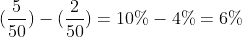

# 从头开始构建在线实验系统

> 原文：<https://medium.com/geekculture/building-a-system-for-online-experiments-from-scratch-cda85f49d0d7?source=collection_archive---------21----------------------->

## 如何在初创公司建立实验方法时保持理智？

Photo by [John Barkiple](https://unsplash.com/@barkiple?utm_source=medium&utm_medium=referral) on [Unsplash](https://unsplash.com?utm_source=medium&utm_medium=referral)

A/B 测试和数据驱动的产品开发遍布科技行业，并成为许多公司的标准决策工具。如果创新出现问题，这种方法可以为你提供证据来支持你的想法或保护你的系统。

虽然受控实验的一般概念[非常简单](https://www.khanacademy.org/science/high-school-biology/hs-biology-foundations/hs-biology-and-the-scientific-method/a/experiments-and-observations)并且有许多可用的材料，但在实践中，需要做出许多定义和决定来确保实验有效进行。当我开始在一家初创公司从事在线实验方法的工作时，我遇到的一个挑战是定义操作和扩展实验所需的最小功能集，同时证明它们相对于工程团队的优先级。

在这篇文章中，我不会深入探讨实验方法的细微差别，而是分享在设计、运行和分析实验时需要解决的 4 个基本挑战，并提出可能的解决方案。

# **挑战 1:定义实验单位**

在开始一个实验之前，你需要定义实验的单位，并确保你能在合理的时间内识别它们。

## 为什么它很重要？

准确的识别将影响你在整个实验中为同一个人提供相同变体的能力，将实验结果与所提供的经验联系起来，并正确计算长期结果。

## 有什么挑战性？

在许多情况下，你理想的实验单位是使用你的技术的人。然而，这并不总是你能衡量的。在实践中，您可以识别独特的应用程序下载或设备，写入和读取 cookies。重要的是要意识到，在现实世界中，可能会有不同的人使用同一台设备，同一批人下载-卸载一个应用程序几次，或者删除你的 cookies。

## 你能做什么？

在每种情况下，可能有不同的产品、工程和算法解决方案的组合来提高单元质量。解决方案通常针对您的领域。但是这里有一些解决这个问题的不同方法的例子:

*   **产品**:鼓励用户创建并登录个人资料，即使他们从不同的设备连接，
*   **工程**:通过保存设备 uuid 来识别来自同一设备的安装，
*   **算法**:基于不同参数的组合，计算 2 次访问属于同一个人的概率，例如。鼠标移动、经常访问的页面、IP 地址等。

# **挑战 2:随机分配实验变量**

一旦您在单元上达成一致，您就可以开始将用户分配到实验变量。

## 为什么它很重要？

您需要一个解决方案来确保分配是随机的，并支持测试方法。您还需要为每个 uuid 保存分配的变量，以分析结果，并在用户再次回到系统时提供相同的体验。

## 有什么挑战性？

根据您系统中的读/写与计算成本，您可能更喜欢实时访问数据库以获得变量，或者以伪随机方式动态计算变量。

## 你能做什么？

**方案一。**假设我们有 uuid，想要分配给两个可能的实验变量之一。简单的解决方法是产生一个随机数，0 或 1，给那些得到 0 的人一个控制变量，给那些得到 1 的人一个治疗变量。

**方案二。**另一种方法是从唯一的用户参数中“即时”生成一个变量，而无需访问之前分配的值。例如，我们可以散列 uuid，并将最后一个偶数分配给控制用户，最后一个奇数分配给处理用户。

需要牢记的重要事项！使用 uuid 的最后一位数字而不进行哈希分配不是最佳做法。你永远不知道在你的数据中能找到什么样的模式。它可能会引入偏倚，随机分配是可靠的受控实验的先决条件。所以保险一点，随机一点总是好的。

# 挑战 3: **更快地运行更多实验**

一旦你开始运行你的第一个实验，是时候考虑规模了。

## 为什么它很重要？

如果您投入所有这些努力来为数据驱动的决策构建基础，您将需要为规模而构建。你做这些不是为了做一个实验，对吗？

## 有什么挑战性？

一次做一个实验意味着你每次可以测试的想法数量有限。在实践中，一个实验可能需要几周到几个月的时间，这使得你每年做出实验驱动的决策的最大数量为 6 到 24 个。如果你想快速行动，用数据评估你所有的想法，这是不够的。

Waiting for the results of one experiment to start running a new one won’t allow you to build a scalable data-driven decision-making methodology. Photo by [Matt Lee](https://unsplash.com/@mattlee?utm_source=medium&utm_medium=referral) on [Unsplash](https://unsplash.com?utm_source=medium&utm_medium=referral)

此外，重要的是要记住[在每个实验中你需要最少数量的用户](https://sciencing.com/meaning-sample-size-5988804.html)来得出相关的结论。

## 你能做什么？

**解决方案 1。**你可以对不同的用户群进行不同的实验。如果你想评估的想法旨在影响不同的用户群，这会很有帮助。这听起来可能不太直观，但是如果你想在相同的用户群中测试几个想法，这种方法会让你慢下来。

为了说明这一点，假设我们想要同时运行两个实验，并且我们每周有 100 个相关用户。我们可以给第一个实验分配 50 个用户，给第二个实验分配另外 50 个用户。例如，每个实验至少需要 200 个用户。最终，你将无法在 4 周内看到两个实验的结果。如果你一个接一个地进行实验，你将会得到想要的用户数量，并且在 2 周后做出至少一个决定。

**方案二。**在同一细分市场上运行独立的实验，用户可以同时参与多个实验。为了做到这一点，你需要为每个实验独立地随机化。

如果我们采用挑战 2 中的随机化选项，在第一种情况下，您需要为您正在运行的每个实验生成一个随机数并存储用户变量。

因此，您将获得一份分配记录，无论您何时提供此体验，您都需要访问该记录。

在第二种情况下，您可以将实验标识符添加到用户标识符中，并将它们散列在一起，以便在每次提供体验时计算一致的变量。

Example of user experiment hashing

# **挑战 4:确定最有机会成功的细分市场**

## 为什么它很重要？

虽然没有实验效果或实验效果非常小的情况并不少见，但是为那些有限接触治疗经验或根本没有治疗经验的用户计算结果会导致你错误地声称实验失败。

## 有什么挑战性？

有时候，你想测试的想法只影响那些在漏斗中达到某个体验里程碑的用户——没有在一周内流失或到达结账页面。如果您在加入后立即将用户分配给变体，这可能会成为一个问题。因此，您需要一种方法来识别受影响或潜在受影响(在控制组中)的用户。

例如，您想尝试在用户第一次与您的系统交互一周后发送促销信息。如果你的第一周流失率是 50%，那么只有一半的用户有可能看到你的信息。

## 你能做什么？

尝试将分配范围缩小到治疗组和对照组中您可以识别的最细微的特征。

假设我们每周有 100 个用户加入。我们随机分配了 50 名用户进行治疗，50 名用户进行控制。因此，如果治疗组中有 5 名用户完成了订单，对照组中有 2 名用户完成了订单，那么我们在所有加入的用户中推广的最初效果将是:

仅比较保留 1 周的用户的实验结果将有助于您更准确地了解您将获得的效果。如果我们考虑到用户流失和没有潜力接受我们的推广，效果将会是:

切记重要的一点！这种逻辑有时很复杂。例如，您可以说只有打开邮件的人受到的影响最大。但是在控制变量中，您将无法识别相似的用户群，因为您从未向他们发送过促销信息。

另一个问题是，如果你试图隔离一部分最容易接触到实验体验的用户。你可以认为比较“重度”用户会让你更好地了解你所产生的效果。但如果你的某个体验更有效地将用户转化为“重度”——这样的分析就有失偏颇了。如果你想使用这种策略——你需要一种方法在“重度”用户进入实验之前定义他们。

因此，请确保您选择的标准可以在所有组中识别，并且不会在治疗和控制之间产生偏差。

# **结论**

设计、运行和分析在线实验可能会有细微差别。我相信这篇文章将有助于你与你的工程团队进行讨论，规划实验基础设施，并获得有价值的结果。

*在建立你的在线实验系统和方法时，你还面临过其他什么挑战？请在评论中告诉我！*

*如果你想了解更多关于大规模在线控制实验的信息，请查看* [Kohavi，r .、Tang，d .、& Xu，Y. (2020)。可信的在线控制实验:A/B 测试实用指南。在*可信的在线控制实验:A/B 测试实用指南*](https://www.cambridge.org/core/books/trustworthy-online-controlled-experiments/D97B26382EB0EB2DC2019A7A7B518F59)