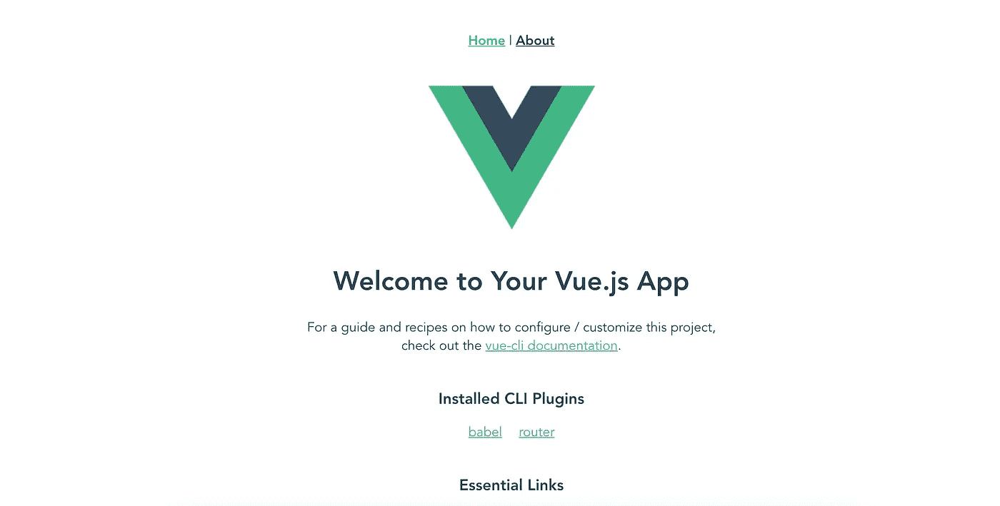
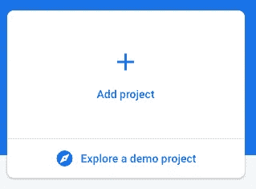
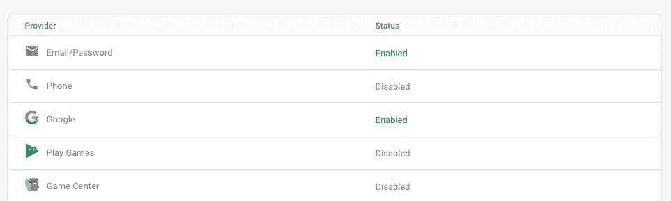

# 用 VUE 和 Firebase Auth 建立用户注册和登录

> 原文：<https://medium.com/geekculture/building-a-user-registration-and-login-with-vue-and-firebase-auth-8c6612d9f45e?source=collection_archive---------8----------------------->


R 注册和登录流程是几乎所有数字平台中最重要的功能之一。这一点非常重要，任何电子商务或 SAAS 平台通常都将注册作为其 KPI 之一。**在这篇文章中，我想分享我用 Vue 和 Firebase 建立用户注册和登录的经验。**

要使用 Vue 和 Firebase 进行用户注册和登录，有两个主要的先决条件:

1.  某视频剪辑软件
2.  重火力点

我们将一步一步地构建它，这样我们可以更好地了解注册和登录是如何用 Vue 和 Firebase 实现的。

> 这里可以看到现场演示[](https://project-real-2d9d9.web.app)**和 [**Github**](https://github.com/Lughnizaid/Registration) 中的源代码。**

# **构建 Vue 项目**

**首先，您需要构建一个 Vue 项目。要构建 Vue 项目，可以使用 Vue CLI。要在您的系统中安装它，我们可以使用以下命令:**

```
npm install -g @vue/cli
```

**现在，使用 Vue CLI，您可以使用 Vue Create 通过以下命令创建 Vue 项目:**

```
vue create project-x 
```

**在创建了一个 vue 项目之后，您需要运行您的 Vue 项目，并使用以下命令在本地查看它**

```
npm run serve
```

**当开始运行本地服务器时，您可以打开浏览器进入`localhost:8080`。默认情况下，您应该会看到:**

****

**完美！。现在，您已经完成了创建 Vue 项目。现在，您可以继续创建一个 Firebase 项目。**

# ****创建一个 Firebase 项目****

**下面的步骤是在 Firebase 控制台中创建一个项目。我假设你已经有了 firebase 帐户。单击按钮添加新项目。**

****

**创建 Firebase 项目后，您需要将 Firebase 添加到您的应用程序中。由于本文是专门针对 web 应用程序的，请单击 web 图标。**

****

**完美！。现在您需要在 Firebase 中设置身份验证系统。在这篇文章中，将有 2 个主要的注册和登录方法:电子邮件和谷歌。启用电子邮件和谷歌部分的认证系统。**

****

**一旦启用了电子邮件和 Google 方法，下一步将是将 Firebase 项目集成到您创建的 Vue 项目中。**

# ****在 Vue 项目中集成 Firebase****

**要集成 Firebase 项目，需要将 firebase ID 和配置细节插入 main.js 文件。您可以在 Firebase 设置中找到 Firebase ID 和配置。**

```
import Vue from 'vue'import App from './App.vue'import router from './router'import firebase from "firebase/app";var firebaseConfig = {apiKey: "Firebase data",authDomain: "Firebase data",projectId: "Firebase data",storageBucket: "Firebase data",messagingSenderId: "Firebase data",appId: "Firebase data",measurementId: "Firebase data"};*// Initialize Firebase*firebase.initializeApp(firebaseConfig);Vue.config.productionTip = falsenew Vue({router,render: *h* => h(App)}).$mount('#app')
```

**完成集成后，就该在我们的 Vue 项目中创建注册和登录页面了**

# ****创建注册和登录页面****

**在创建注册和登录页面之前，让我们创建一个导航，用户可以在其中来回访问其他链接。**

```
<template> <div id="app"> <div class="bar"> <router-link to="/" class="project">Project X</router-link> <div class="nav"> <p class="email" v-if="auth === true">{{email}}</p> <router-link  v-if="auth === false" to="/register"              
    class="register">Register</router-link> <router-link v-if="auth === false" to="/login"     
    class="login">Login</router-link> <p v-if="auth === true" @click="logout" class="register">Log  
    out</p> </div> </div> <router-view></router-view></div></template>
```

**在上面的代码中，我创建了 4 个条件。第一个是电子邮件，如果用户已经注册或登录，它将显示电子邮件。第二个是注册，如果用户已经登录，注册按钮将不会出现。与第三个条件相同，当用户已经登录时，登录按钮将不存在。最后一个条件是注销，如果用户没有登录，注销按钮将不会出现。**

**回到导航，使用 router-link，您可以重定向到 vue 项目中的任何页面。在这里，您可以在单击按钮时导航到注册和登录页面。**

**完成后，您需要在路由器部分设置路由。您可以在路由器文件夹中找到 index.js 文件。**

```
const routes = [ { path: '/', name: 'Home', component: Home }, { path: '/register', name: 'Register', component: () => import(*/* webpackChunkName: "about" */* 
   '../views/Register.vue') }, { path: '/login', name: 'Login', component: () => import(*/* webpackChunkName: "about" */* 
   '../views/Login.vue') },]
```

**上面的代码显示路径/register 和/login 将使用户转到注册和登录页面。**

**为了更好地了解 router-link，您可以打开这个文档[](https://router.vuejs.org/guide/)**

# ******注册页面******

****我很高兴你终于上了这个阶段！。让我们创建注册页面。****

```
**<div class="google"> <div class="google-button" @click="socialLogin">  <a class="google-word">Continue with Google</a> </div></div><p>OR</p><form @submit.prevent="register" class="register-child"> <input type="email" placeholder="Email address..." v-model="email" /> <input type="password" placeholder="password..." v-model="password" /> <button type="submit">Register</button></form>**
```

****注册页面有两种方法。第一种是使用谷歌，第二种是使用电子邮件。这里有两个事件，分别是@click="socialLogin "和@submit.prevent="register "。****

****在表单部分，您输入两个内容，即电子邮件和密码。当点击注册按钮时，它将激活某个名为“注册”的功能。在谷歌注册时也是一样，其中会调用名为“socialLogin”的特定功能。****

****接下来的步骤将是创建方法来实现在谷歌和电子邮件注册。****

```
**methods: { register() { firebase .auth() .createUserWithEmailAndPassword(this.email, this.password) .then(() => { this.$router.push('/'); }) .catch(*error* => { alert(error.message); }); }, socialLogin() { const provider = new firebase.auth.GoogleAuthProvider(); firebase.auth().signInWithPopup(provider).then((*result*) => { this.$router.push('/'); }).catch((*err*) => { alert('Oops. ' + err.message) }); }},**
```

****你可以在 和[**谷歌**](https://firebase.google.com/docs/auth/web/google-signin) **找到完整的 Firebase 文档。**在上面的代码中，当用户完成注册时，无论是使用电子邮件还是 Google，用户都会被重定向到主页(/)。****

****与使用电子邮件和密码注册不同，任何社交登录都是“登录”过程。因此，Firebase 中没有使用社交登录(例如 Google 授权)的注册过程。任何流程都是“签到”。因此，开发人员可以在注册和登录页面重用代码。****

****您完成注册页面。让我们继续在登录页面中构建登录功能。****

# ******登录页面******

****让我们在登录页面中创建登录元素。****

```
**<div class="google"> <div class="google-button" @click="socialLogin">  <a class="google-word">Continue with Google</a> </div> </div><p>OR</p><form @submit.prevent="login" class="login-child"> <input type="email" placeholder="Email address..." v-model="email" /> <input type="password" placeholder="password..." v-model="password" /> <button type="submit">Register</button></form>**
```

****与注册页面一样，登录页面有两种方法。第一种是使用谷歌，第二种是使用电子邮件。这里有两个事件，分别是@click="socialLogin "和@submit.prevent="login "。****

****接下来的步骤将是创建方法来实现谷歌和电子邮件的登录过程。****

```
**methods: { login() { firebase .auth() .signInWithEmailAndPassword(this.email, this.password) .then(() => { this.$router.push('/'); }) .catch(*error* => { alert(error.message); }); }, socialLogin() { const provider = new firebase.auth.GoogleAuthProvider(); firebase.auth().signInWithPopup(provider).then((*result*) => { this.$router.push('/'); }).catch((*err*) => { alert('Oops. ' + err.message) }); }},**
```

****用 email 和密码登录 Firebase 的文档，你可以在 **这里找到 [**。**](https://firebase.google.com/docs/auth/web/password-auth)******

**Firebase 有不同的注册和电子邮件登录方式。在注册时，使用 Firebase”。createUserWithEmailAndPassword(this . email，this.password)"在登录过程中，Firebase 使用 signinwithemailand password(this . email，this.password)。**

**至于社交登录，方法完全相同，因为 Firebase 中的社交登录始终是“登录”过程。**

****完成所有这些步骤后，注册和登录功能终于就绪。****

# ****结论****

**这里 **可以看到现场演示 [**。**](https://project-real-2d9d9.web.app)****

****

**至于 CSS，因为这篇文章是专门为了用 Vue 和 Firebase 构建注册和登录功能而创建的，所以可以看看 [**Github**](https://github.com/Lughnizaid/Registration) 中显示的源代码。**

# ****我的笔记****

**Firebase 是在您的平台上实现认证的非常有效的方法，无论是对于电子商务还是 SAAS。您不需要编写自己的后端服务，因为它已经由 Firebase 提供。此外，目前使用社交账户进行认证也很流行，使用 Firebase 将帮助您节省大量时间来在您的平台上实现社交认证。**

**我希望你喜欢它。如果你喜欢这篇文章，请分享。感谢您的阅读。**