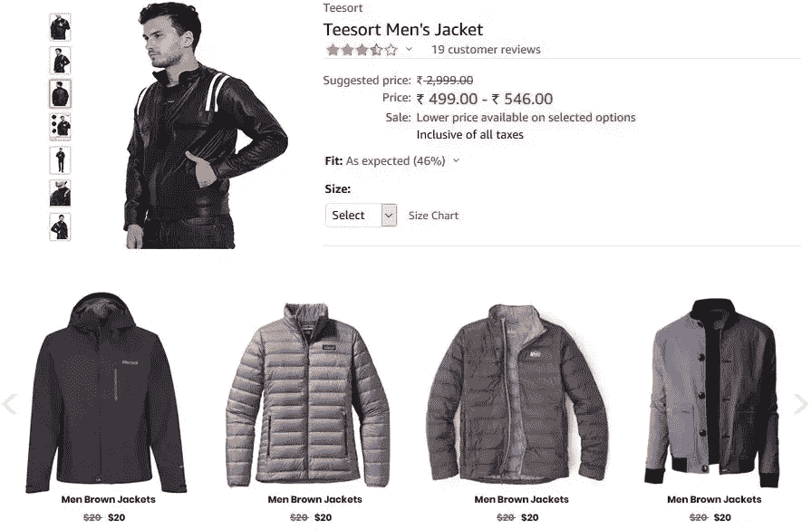
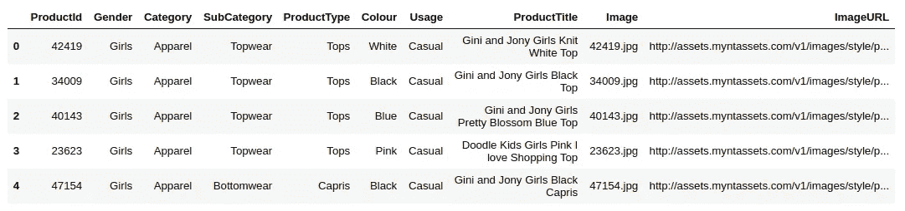
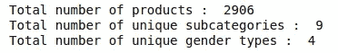
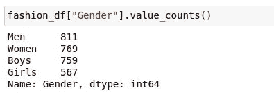
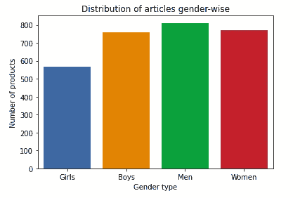
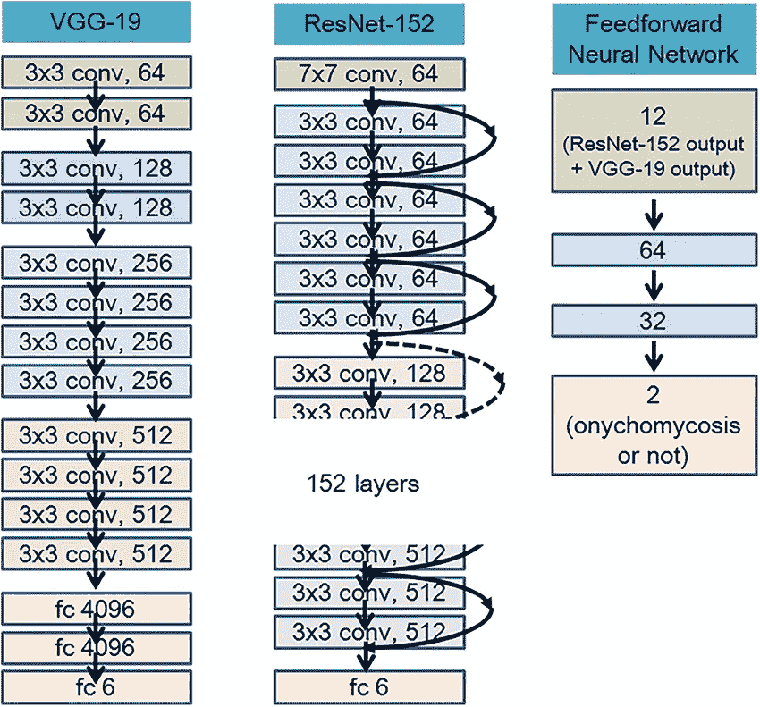
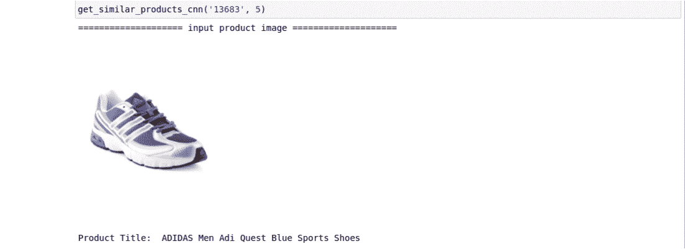
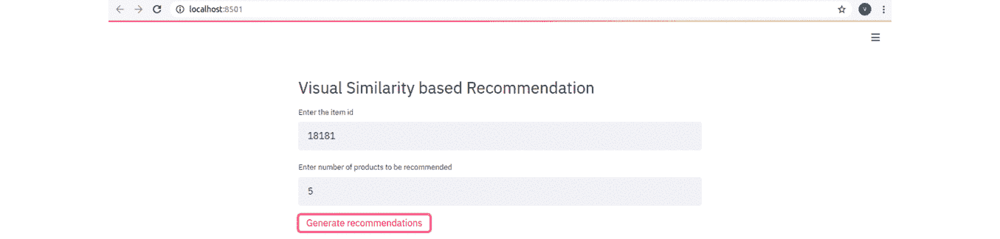

# 使用 Python 构建基于视觉相似性的推荐系统

> 原文：<https://medium.com/geekculture/building-a-visual-similarity-based-recommendation-system-using-python-872a5bea568e?source=collection_archive---------4----------------------->

## 从头开始执行基于图像的推荐的全面指南

在当今竞争激烈的技术世界中，对于一个成长中的*电子商务平台*来说，吸引客户并保持一致的品牌体验至关重要。 ***推荐*** 这样的相关项目，而不是让用户为了得到他们想要的项目而进行一次又一次的搜索，这更令人印象深刻，并且提供了更好的满足感。

***产品推荐*** 通过分析客户之前的购买行为和目前的平台使用情况，可以非常有效地应对这样的挑战。

*产品推荐*可以帮助:

*   将购物者转化为顾客
*   吸引客户
*   提高销售额和收入
*   提供最相关的内容
*   维护品牌体验

概括地说，有两种推荐方法:

1.  **基于内容的推荐**
2.  **协同过滤**

顾名思义，*基于内容的*方法基于*关于客户或产品的*附加内容(元数据)进行推荐。对于产品，该*内容*可以是产品名称、描述、图片、类别/子类别、规格等。

因此，这种方法*通过基于*内容*找到与给定产品最相似的产品来推荐*产品。

> *在本帖中，我们将利用*产品图片*实现一个*基于内容的*推荐系统。基本上，目标是推荐与最近购买/检查的*产品图片*非常相似的*产品图片*。*

因此，这种基于 ***图像的*** 推荐将有助于*基于顾客最近的购物行为/平台使用向其推荐*最相似的产品。



让我们开始使用[时尚产品图像数据集](https://www.kaggle.com/vikashrajluhaniwal/fashion-images)来实现这一点。该数据集包含 2906 张*产品图片*，涵盖四个不同的*性别*类别(男人、女人、男孩和女孩)。它还包含各种产品特征，如标题、类别、子类别、颜色、性别、类型、用途等。

> *补充说明:为了访问完整的 python 代码，请遵循 kaggle 内核* [*此处*](https://www.kaggle.com/vikashrajluhaniwal/building-visual-similarity-based-recommendation)*(*[https://www . ka ggle . com/vikashrajluhaniwal/building-visual-similarity-based-recommendation](https://www.kaggle.com/vikashrajluhaniwal/building-visual-similarity-based-recommendation)*)。*

## 1.基础数据分析

数据集中的前几条记录如下所示。



First 5 records from the data

**a.** **基本统计—产品数量、子类别&性别**



如前所述，该数据集包含 9 个不同*子类别*的 2906 种产品，涵盖 4 种不同*性别*类型。

**b .每种性别的频率**



从输出中，我们可以观察到大部分产品属于`Men`类别，然后是`Women`，以此类推。

**c .产品的性别分布**



从条形图中，我们还可以观察到`Men`的产品数量最多。同样，数据集几乎是平衡的。

## 2.数据准备

既然跨品类*推荐*不优选，比如*向一个光棍推荐*女生的产品。因此，让我们将数据*按性别划分为 4 个不同的数据帧。*

## 3.使用 ResNet 的特征提取

通常，产品图像包含独特的图案及其颜色、形状和边缘。

具有同类特征的图像应该是相似的。因此，从图像中提取这些特征将非常有助于*向*推荐最相似的产品。

**如何从图像中提取特征？**

计算机视觉技术可用于从图像中提取特征。这里，由于我们在数据大小、计算资源和时间上有限制，所以让我们使用标准的*预训练的*模型，如 **ResNet** 来提取特征。这种*预训练的*模型已经在一个巨大的数据集上进行微调和训练(像 **ImageNet** )。这个过程也被称为*迁移学习*。

**ResNet**

ResNet 是*残差网络*的简称，由何于 2015 年首次提出。目前，它被认为是许多计算机视觉任务的经典神经网络。在 2015 年的 **ImageNet** 挑战赛中，这款机型的表现超过了之前的机型，如 *GoogleNet* 、 *VGGNet* 和 *AlexNet* 。



ResNet Architecture

该体系结构允许我们成功地训练一个具有 152 层的非常深和宽的网络。在我们的实现中，我们将使用 *ResNet50* (缩小版的 *ResNet152* )来提取特征。

*extract_features()* 函数从给定的图像中提取特征。首先根据 *ResNet* 标准，我们将图像的大小调整为 224 x 224，并使用`Keras`中可用的 **ImageDataGenerator** 对其进行归一化。最后，每个图像被表示为一个 *100352 维的*特征向量。

为了避免部署后的运行时特性提取，提取的特性保存在`NumPy`数组中。我们在这里分别为产品 id 和提取的特性维护两个数组。

类似地，同样的*特征提取*过程按性别对其他产品图像重复进行。

## 4.计算欧几里德距离并推荐相似产品

*距离*是评估项目/记录之间相似性的最优选的度量。距离越小，相似度越高，而距离越大，相似度越低。

根据几何学有各种类型的距离，如*欧几里德距离*、*余弦距离*、*曼哈顿距离*等。我们将使用*欧几里德距离*来计算相似度。

因为我们已经提取了图像特征，所以可以使用*pairwise _ distances()*函数形式 *sklearn.metrics* 轻松计算*欧几里德距离*。

一旦计算出这个距离，我们就可以很容易地按照距离的升序*推荐*产品。我们开始吧！

**a .加载提取的特征**

**b .距离计算和建议**

上面的*get _ similar _ products _ CNN()*函数*根据提取的特征向查询商品推荐* 5 个最相似的商品。该函数接受两个参数—最近购买/检查的商品的*产品 id* 和推荐的*产品数量*。

针对产品 id *13683* 推荐的前 5 *产品如下图所示。*



同样，我们也可以针对其他性别类型的产品向*推荐*产品。让我们看看使用 **Streamlit** 的最终部署。

## 5.部署解决方案

***Streamlit*** 是一个交互式库/框架，用于构建数据应用& web 应用和部署机器学习工作负载。最重要的是，它不需要任何网页设计和开发的知识。Python 知识足以与之交互，因为它是 Python 兼容的。

这里，下面的内置函数用于进行交互式部署:

*   st.text_input() —接受用户的动态输入
*   st.write() —将消息/参数写入应用程序
*   ST . title()-显示图像或图像列表。

像前面一样，这里的*get _ similar _ products _ CNN()*函数*根据指定的参数推荐*最相似的产品。

要在终端类型中执行此部署脚本:

```
streamlit run recom_deployment.py
```



*提示:这个完整的部署代码可以从* [*这里*](https://drive.google.com/file/d/123XGxKvRY7sk2pnTmVOyLp9FH-iFL5oN/view?usp=sharing) *下载。*

## 结束注释

在这篇文章中，我们讨论了关于*产品推荐*的内容，并通过使用 *ResNet* 利用可用的产品图片实现了一个*基于视觉相似性的推荐*系统。