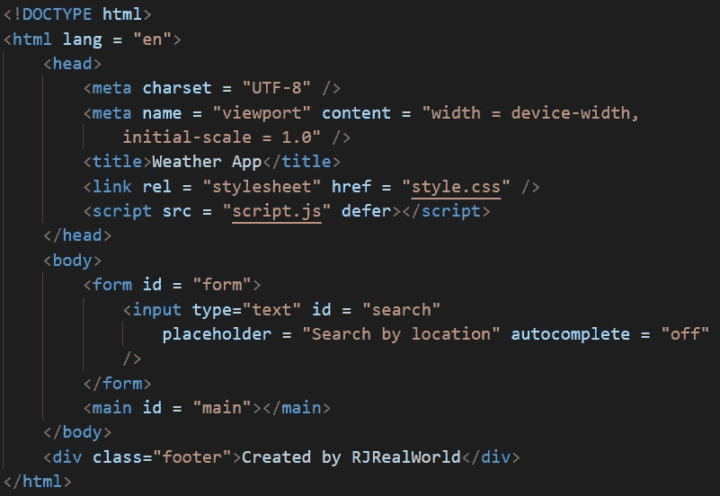
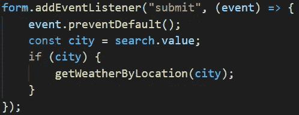
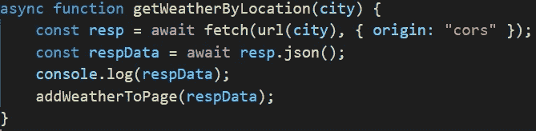
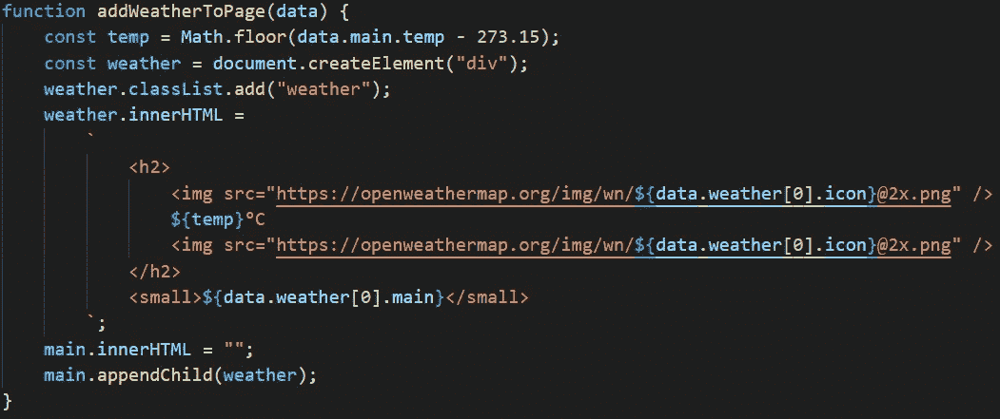

# 用 Javascript 构建天气应用程序

> 原文：<https://medium.com/geekculture/building-a-weather-app-with-javascript-1754b4d5e97e?source=collection_archive---------18----------------------->

我最近的一个项目要求我构建一个天气应用程序，它与我选择的 API 一起工作，根据个人键入的位置提供某个地区的天气。这是我第一次介绍使用 API，所以我知道会有一个陡峭的学习曲线，但我很高兴有机会最终获得 Javascript 的一些实际应用并构建一个功能产品。

我通过决定我的项目要使用什么 API 来开始我的项目。这些项目是用代码笔构建和提交的，为了最大限度地减少我要使用的外部资源，我知道我想要一个带有天气图标的 API。

在做了一些研究并看到一些来自其他露营者的反馈后，我决定使用 OpenWeatherMap API。建立一个账户非常简单，他们的免费账户每天最多允许 7200 次通话，每分钟通话上限为 60 次。这显然不会是一个理想的高流量产品，为了这个项目，它会工作得非常出色。

一旦我设置好了，我就可以开始编码了。我从构建我的 HTML 开始。我并没有对这个架构太感兴趣，因为构建的重点是 JS。我在 HTML 中做的一件事是，我将 id 放在我知道以后要用 JS 定位的元素上。

HTML 就绪后，我花了几分钟时间给它做了一点样式。同样，这个项目的主要目的是与 JS 一起工作，所以 HTML 和 CSS 得到了最低限度的待遇。

现在开始有趣的事情！

这是我第一次在这个层面上使用 API 和 Javascript，所以我必须做大量的阅读、观察和研究来完成这个项目。对我来说不幸的是，这个项目 99.9%的教程、论坛、博客等都是用 jQuery 的。我并不反对这种语言，但是我已经下定决心要使用 JS，所以在这个过程中我所能得到的帮助是有限的。

我从创建空变量开始我的 JS，这些空变量是我以后要调用和操作的信息，它们是 main、search 和 search location。我还创建了一个名为 APIKEY 的变量，并在其中存储了我的 API 密钥，这样我就可以在需要时轻松调用它，而不是每次都键入 32 位字母数字序列。

一旦我设置了全局变量，我就编写一个函数来获取用户输入的位置。我可以通过在代码中添加一个事件侦听器来做到这一点。在代码中，我检索用户在我用 id = "search "表示的输入字段中键入的值(位置)。

现在，我需要一个设置，将检索使用 API 的位置的天气。我能够通过使用字符串和数字来测试这一点，因为我还没有完全设置好 API。

在所有这些之后，剩下的是最后和主要部分，即在屏幕上显示获取的天气，但在此之前，我还必须将获取的温度转换成适当的比例。在我的例子中，我选择了摄氏度。

就是这样！我们现在有了一个用 javascript 构建的正常运行的天气应用程序！我在这个项目中学到了很多。最值得注意的是，如何使用 APIs 在某种程度上。我知道每个 API 的工作方式都不同，但是最终接触到一个 API，并且在实际意义上使用 javascript，而不是编写随机的循环或字符串，这是一次非常有益的学习经历。

如果你已经做到了这一步，感谢你花时间阅读这篇文章，我希望它能帮助那些因为寻求帮助而来到这里的人。