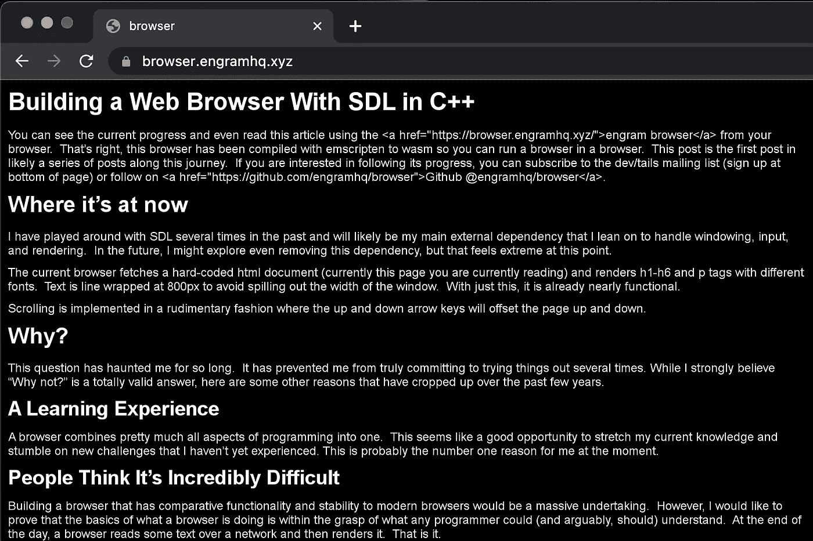

# 用 C++中的 SDL 构建 Web 浏览器

> 原文：<https://medium.com/geekculture/building-a-web-browser-with-sdl-in-c-edc8fe8d55c6?source=collection_archive---------9----------------------->

*最初发布于*[*https://devtails . XYZ*](https://devtails.xyz/@adam/building-a-web-browser-with-sdl-in-c++)*。*

您可以在浏览器中使用 [engram 浏览器](https://browser.engramhq.xyz/)查看当前进度，甚至阅读这篇文章。没错，**这个浏览器已经用 emscripten 编译成 wasm 所以你可以在一个浏览器里运行一个浏览器**。这篇文章可能是这个旅程中一系列文章的第一篇。如果你有兴趣关注它的进展，你可以…