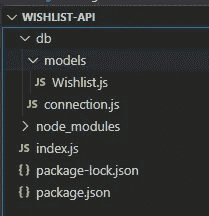
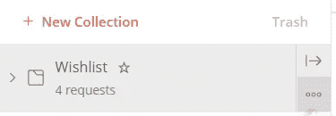
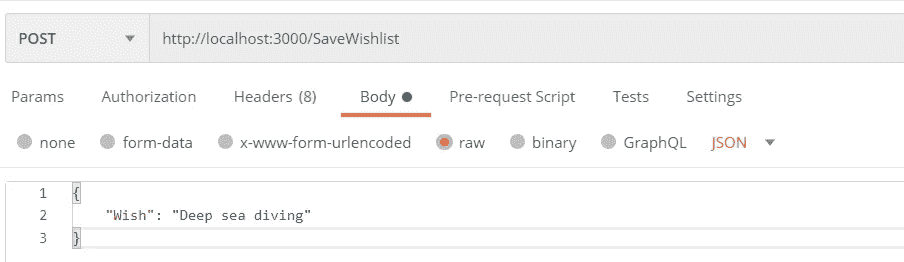
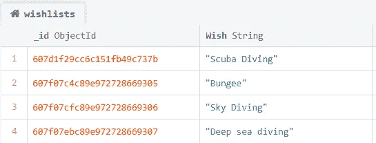
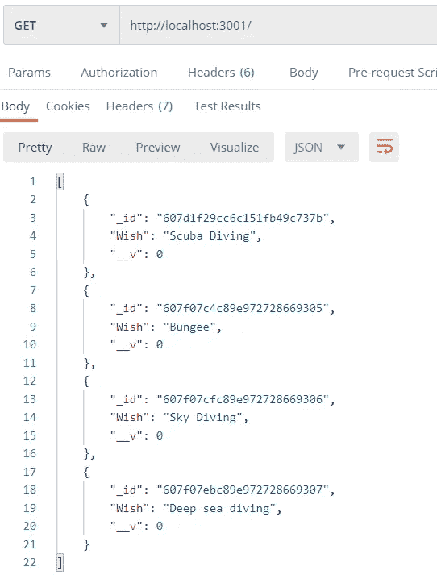
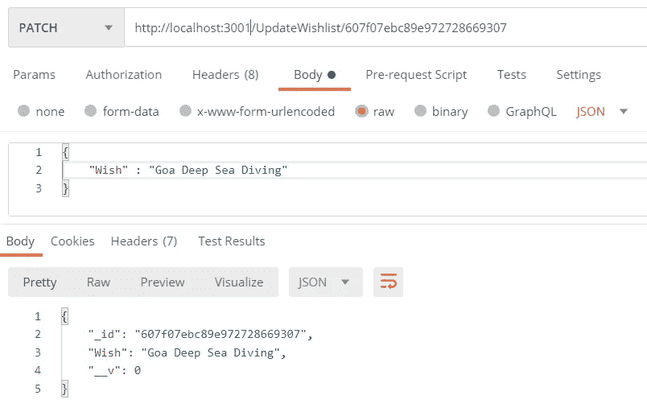
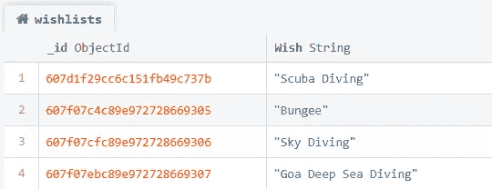
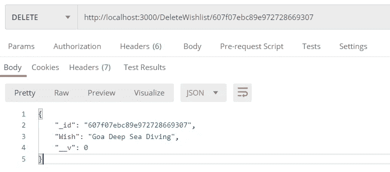
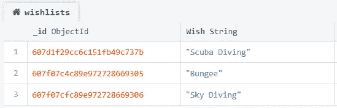

# 使用 Express 构建 API。JS 和 MongoDB (Wishlist API 应用程序)

> 原文：<https://medium.com/geekculture/building-an-api-using-express-js-and-mongodb-wishlist-api-application-1aa3215fde6d?source=collection_archive---------4----------------------->

通过阅读本课程，我们的目标是使用 Express.js 构建并理解 RESTful API 的实现。到本文结束时，我们将构建一个基本的 Wishlist API。你可以在[这里](https://github.com/mritunjay-tomar/wishlist-api)找到这篇文章包含的所有代码。

> **预科—**JavaScript 基础，对 Node.js，Express.js，Postman 软件一知半解。
> 
> **所需工具—** Node.js，NPM，快递。JS，mongoose，MongoDB，MongoDB Compass，Visual Studio 代码(或者 Sublime Text)和 Postman 软件。

# 设置环境

1.在所需的位置创建项目目录。

2.在 VS 代码中打开文件夹，打开终端，使用终端导航到创建的文件夹(如果使用 sublime text 或任何其他编辑器，请使用 windows CMD)。

3.在终端内部运行以下命令:

```
npm init -y
npm install mongoose express
npm install -D nodemon
```

每个命令的解释—

1.  *npm init* 用于通过在文件夹结构中创建 package.json 文件来初始化您的节点目录。 *-y* 会将 package.json 文件初始化为默认值。
2.  *NPM install mongose express*将在节点上安装 mongose 和 express 框架。
3.  *npm install -D nodemon* 将 nodemon 作为一个开发依赖项安装(开发依赖项意味着这个包不会在生产中部署)

# 我们在使用什么，为什么要使用:

express . js——express . js 为 web 开发提供了一组强大的特性，主要用于创建 RESTful APIs。

mongose—mongose 是一个允许 node/express 与 MongoDB 通信的节点框架。

node mon——node mon 是一个开发工具，它在每次代码文件发生变化时刷新节点应用程序。

Postman——Postman 是一个测试 REST APIs 的软件。

# 我们项目的文件夹结构



Project folder structure

db — db 是用于编写了 MongoDB 逻辑的 JavaScript 文件的文件夹。

模型-模型文件夹包含不同集合的数据库模式。

wish list . js-wish list . js 是一个包含意愿列表集合模式的文件。

connection.js —用于在 express 和 MongoDB 之间建立连接的 js 文件。

node_modules —使用 npm install 命令安装的所有目录，它们存储在 node_modules 文件夹中。

Index.js —包含我们的应用程序逻辑的文件。

Package.json 节点配置文件。

# 构建意愿列表 API:

> 步骤 1:设置数据库

Database setup snippet

上面的代码片段展示了如何使用 mongoose 库连接 MongoDB 数据库。

Mongoose 提供了一个名为“ *connect”的承诺，*基本上只需要几个参数，首先是数据库的 URL(你可以从 MongoDB compass 或 MongoDB CMD 获得)
第二个参数是一个对象，它基本上设置了一些参数以避免贬值警告。你可以在[这里](https://mongoosejs.com/docs/deprecations.html)读到这些警告。

> 步骤 2:为意愿列表创建模式

Defining wishlist schema

这里，我们为我们的愿望列表项定义模式。Mongoose 的“模式”是一个文档数据结构(或文档的形状),它是通过应用层实现的。为此，我们创建 mongoose.schema 类的实例，并在其中定义模式。你可以在[这里](https://mongoosejs.com/docs/guide.html#definition)阅读所有关于 mongoose 模式的内容。

> 步骤 3:为我们的 API 编写逻辑

第 1 步和第 2 步与一些数据库相关。现在，让我们从处理 API 的主要任务开始。

在本文中，我们将处理四种类型的 API 方法，它们是 GET、POST、PUT/PATCH 和 DELETE。

在编码这些方法之前，我们需要设置一些东西。

```
const express = require("express");
require("./db/connection");
const Wishlist = require("./db/models/Wishlist")
const app = express();
const port = process.env.PORT || 3000;
app.use(express.json());
```

为了解释上面的每一行，首先我们在这个文件中导入了 express 模块，因为这里我们要处理我们的 API 调用。
第二行导入我们的数据库，建立数据库连接。在第三行中，我们从模式中创建了 Wishlist 对象。第四行从 express 创建一个' *app* '对象。第五，我们设置了端口变量。在第六行，我们已经定义了我们的 express 应用程序将使用 JSON 对象(如果删除这一行，express 将无法识别 JSON 对象)。

> P OST

第一种方法是 POST。Post 方法用于将数据从客户端发送到 API 服务器。在我们的例子中，我们将使用 POST 方法向服务器发送数据，并在数据库中插入一个文档。

正如我所说的，express 被广泛用于设计 API，我们已经有了预定义的方法，比如“ *POST* ”。我们可以直接使用这个方法来发布我们的数据。

express 中的每个 API 方法都需要两个参数，第一个是调用 API 方法的 URL，第二个是回调函数，它定义了当这个 URL 被点击时将执行什么操作。这个回调函数接受两个参数，即请求和响应对象。

在上面的代码片段中，我们希望将文档插入到数据库中，因此将直接使用我们设计的 wishlist 模式，并将请求体(在我们的例子中是一个 JSON 对象)传递给它。schema.save()函数将插入文档并提交到数据库。

> 得到

我们将使用的第二个方法是 GET 方法。发出 GET 请求是为了从服务器检索数据。

如上面的代码片段所示，我们使用了 mongoose 的" *find()* "方法，该方法从数据库中获取所有文档，并以 JSON 对象的形式返回它们。你可以在[这里](https://mongoosejs.com/docs/api.html#model_Model.find)阅读更多关于这个方法的内容。对于 *find* 方法，我们有另一个名为*“find byid()”*的方法，它根据提供的 Id 返回记录。你可以在[这里](https://mongoosejs.com/docs/api.html#model_Model.findById)阅读这个方法。

> 上传/修补

在 GET 和 POST 方法(基本上是在数据库中获取和放置文档)之后，接下来是与数据库更新相关的方法。
有两个 API 请求用于更新服务器上的记录，即 PUT 和 PATCH。
上传请求用于更新或创建新源。修补方法用于部分更新数据源。PUT 和 PATCH 的区别在于，PUT 将更新整个数据源，而 PATCH 只更新数据源中需要的部分。

Mongoose 提供了一个方法" *findByIdAndUpdate()* "，使用这个方法我们可以通过 ID 找到一个文档并更新它。你可以在[这里](https://mongoosejs.com/docs/api.html#model_Model.findByIdAndUpdate)阅读更多信息。

> 删除

我们将看到的第四个 API 是 DELETE API，它用于删除资源。

Mongoose 提供了一个方法" *findByIdAndDelete()* "，使用这个方法我们可以通过 ID 找到一个文档并删除它。你可以在这里阅读更多关于这个方法的内容。

# 测试意愿列表 API

步骤 1:通过以下命令启动 express 服务器:

```
nodemon index.js
```

第二步:打开邮差软件，添加新收藏。



Postman collection snapshot.

1.  从三个水平点(基本上代表更多操作:P)，点击添加请求并创建一个 POST 请求。



Postman request snapshot

输入您的 express 服务器 URL，继续使用您使用的扩展名(在我的例子中为 *SaveWishlist* )，转到 Body 选项卡，从单选按钮中选择“raw ”,选择 formatting as JSON，然后键入您的 JSON 对象。然后点击发送按钮。



MongoDB documents Snapshot

刷新 MongoDBCompass 上的数据库，检查是否插入了文档。

2.就像我们为 POST 创建一个请求，为 GET 创建一个请求，输入 URL 并点击 Send 按钮。



Postman response body after GET request.

3.创建一个补丁请求，输入需要更新的带有 ID 的 URL，像我们对 POST 请求所做的那样填充请求正文，然后点击发送并交叉验证您的结果。



Postman update body after PATCH request.



Database snapshot after PATCH request

4.创建一个删除请求，输入需要删除的 URL 和 ID，然后点击 Send 按钮。



Postman body snapshot after DELETE request.



MongoDB Database snapshot after DELETE request.

因此，我们使用 Express.js 和 MongoDB 构建了一个 API 来创建、更新和删除 wishs。这个 wishlist API 仅仅是一个能够执行数据库 CRUD 操作的简单 API。

就是这样！这对你有用吗？请在下面留下任何问题和评论！

感谢您的阅读！

如果你觉得这篇文章有帮助，鼓掌！👏👏👏。