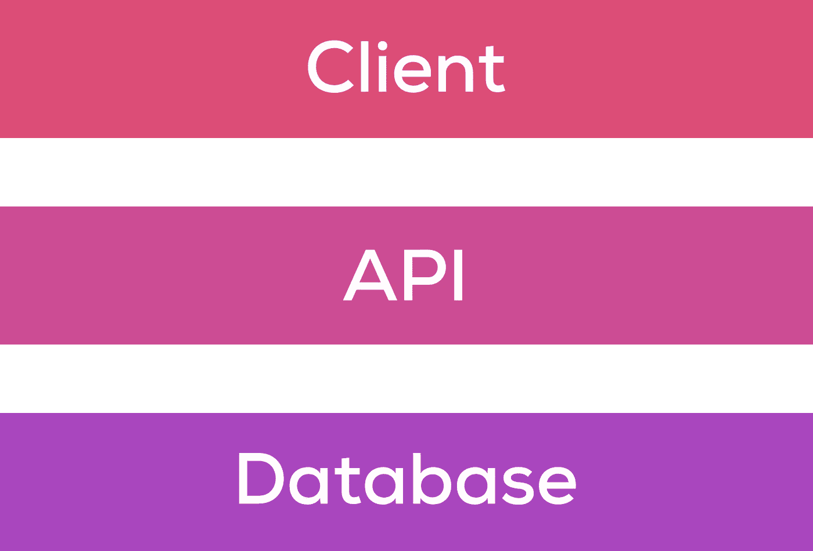

# 构建应用后端:第 1 部分

> 原文：<https://medium.com/geekculture/building-an-app-backend-part-1-949cd4cbc6e1?source=collection_archive---------36----------------------->

当构建一个应用程序时，无论是 web 应用程序还是移动应用程序，都有很多教程和博客介绍应该使用哪种技术堆栈，选择正确的语言并将其连接到服务，但很少有人讨论如何构建后端堆栈。如何进行扩展，应用程序是否直接与数据库“对话”，峰值负载、本地化等情况如何，等等。

我们来解决这个问题。

High level app stack