# 用 Plotly Dash 构建通货膨胀跟踪仪表板

> 原文：<https://medium.com/geekculture/building-an-inflation-tracking-dashboard-with-plotly-dash-93edf01e1fcf?source=collection_archive---------4----------------------->


Credit: Kenny Eliason

随着美国通货膨胀率达到几十年来的最高水平，许多长期跟踪价格的措施正受到经济观察家和政策制定者的密切关注。即使是普通人也可以从了解最新数据显示的环境是改善还是恶化中受益，这样他们就可以相应地规划和预算他们的财务。然而，跟踪不同的通胀指标可能会很困难，如果能够建立一个单一的仪表板来在一个地方跟踪所有指标，将会更加方便。

谢天谢地，这一切都可以通过使用 [Plotly Dash](https://plotly.com/dash/) 和一点点 [Python](https://www.python.org/downloads/) 来完成。

第一步是确保安装了必要的 Python 库。虽然根据特定的目标，这些库中的一些不是绝对必要的，但是它们对于快速建立仪表板的基础是有用的，可以在以后进行改进或调整。Dash 还对应用程序的最终样式和布局提供了大量的控制。

在继续之前，应安装这些 Python 库:

*   [破折号](https://pypi.org/project/dash/)
*   [仪表板自举组件](https://pypi.org/project/dash-bootstrap-components/)
*   [美丽组图](https://pypi.org/project/beautifulsoup4/)
*   [熊猫](https://pypi.org/project/pandas/)
*   [熊猫 Datareader](https://pypi.org/project/pandas-datareader/)
*   [阴谋地](https://pypi.org/project/plotly/)
*   [lxml](https://pypi.org/project/lxml/)
*   [请求](https://pypi.org/project/requests/)

这些都可以通过运行命令提示符并使用`pip`来安装，如下例所示。

```
pip install dash
```

一旦所有的东西都安装好了，就该获取这个项目所需的数据了。

## 商品价格

第一步是为整个项目编写所有必要的导入语句。下面列出了创建这个 Dash 应用程序所需的一切:

```
import pandas as pd
import pandas_datareader as pdr
import plotly.express as px
import datetime
from datetime import date
import dash
from dash import dcc, html
from dash.dependencies import Output, Input
import dash_bootstrap_components as dbc
from bs4 import BeautifulSoup
from urllib.request import Request, urlopen
```

从这里开始，是时候寻找和构建不同的元素，这些元素将组合起来组成仪表板。

需要定义开始和结束日期，因为所获取的大部分数据都是历史数据，可以追溯到比所需时间更早的时间。此仪表板的主要目的是跟踪新冠肺炎疫情之前、期间和之后的相同通货膨胀指标。为此，开始日期将被定义为 2019 年 3 月，结束日期将是现在，因为经济仍处于大流行后阶段。

```
start = datetime.datetime(2019, 3, 1)
end = date.today()
```

当使用 Pandas Datareader 从 Yahoo Finance 等来源收集数据时，定义日期范围很有帮助。

仪表板的第一个组件是一个带有商品选择下拉菜单的折线图，它跟踪大多数主要商品的收盘价。跟踪商品价格的意义在于[投入价格](https://www.econport.org/content/handbook/supply/changeSupply.html)对成品价格的贡献。在现实世界中，很少有商品价格大范围上涨而成品价格不会随之上涨的情况。

```
com = pdr.DataReader(['GC=F', 'SI=F', 'PL=F', 'HG=F', 'PA=F',
                      'CL=F', 'HO=F', 'NG=F', 'RB=F', 'ZC=F',  
                      'SB=F', 'ZO=F', 'ZS=F', 'LE=F', 'HE=F',  
                      'CC=F', 'KC=F', 'CT=F', 'LBS=F'],
                     'yahoo', start, end)['Adj Close']
```

使用 Pandas Datareader，可以使用每种商品的适当符号从雅虎财经收集商品的调整后收盘价。在最后定义`'Adj Close'`将确保只收集调整后的收盘价，不收集其他。

```
com = com.rename(columns={'GC=F': 'Gold',
                          'SI=F': 'Silver',
                          'PL=F': 'Platinum',
                          'HG=F': 'Copper',
                          'PA=F': 'Palladium',
                          'CL=F': 'Crude Oil',
                          'HO=F': 'Heating Oil',
                          'NG=F': 'Natural Gas',
                          'RB=F': 'Gasoline Futures',
                          'ZC=F': 'Corn',
                          'SB=F': 'Sugar',
                          'ZO=F': 'Oat',
                          'ZS=F': 'Soybean',
                          'LE=F': 'Live Cattle',
                          'HE=F': 'Lean Hogs',
                          'CC=F': 'Cocoa',
                          'KC=F': 'Coffee',
                          'CT=F': 'Cotton',
                          'LBS=F': 'Lumber'})com = com.stack().reset_index()
com = com.rename(columns={com.columns[2]: 'Closing Price'})
```

上面的代码将包含价格数据的每一列重命名为更加用户友好的格式。它还使用`.stack()`将数据框架从多指数重新整形，并通过`.rename()`重命名收盘价列，以使数据框架适合 Plotly。这种可视化将在以后建立，因为它需要[破折号回调](https://dash.plotly.com/basic-callbacks)才能完全发挥作用。

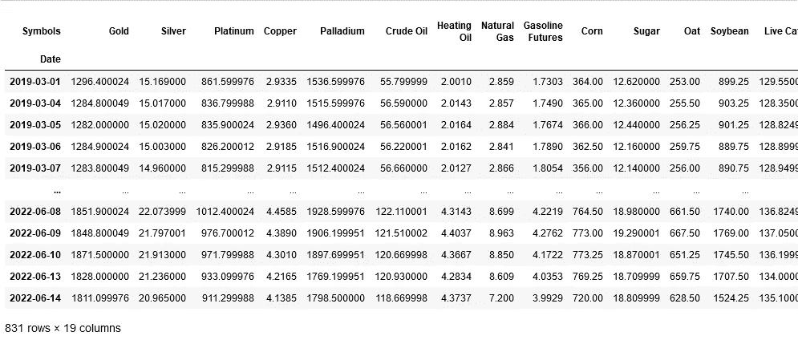

Initial shape of Dataframe from Yahoo Finance via Pandas Datareader

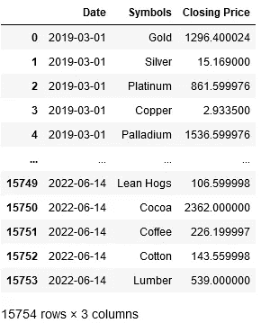

After applying .stack() and resetting the index

## 汽油零售价格

汽油价格在塑造消费者情绪方面发挥着重要作用，因为每次人们外出驾车时都可以看到它们。出于多种原因，包括当前俄罗斯入侵乌克兰，天然气价格远高于前几年。

美国汽车协会(AAA)跟踪汽油零售价格，并在其网站上发布每日全国平均价格和各州平均价格。通过网络搜索他们的州平均油价表，我们可以将油价的 choropleth 图整合到仪表板中。

```
url = '[https://gasprices.aaa.com/state-gas-price-averages/'](https://gasprices.aaa.com/state-gas-price-averages/')
req = Request(url, headers={'User-Agent': 'Mozilla/5.0'})page = urlopen(req).read()
soup = BeautifulSoup(page, 'lxml')
table = soup.find_all('table')gas = pd.read_html(str(table))[0]
```

上面的代码片段将 AAA 的州天然气价格平均值表解析并加载为 Dataframe。请注意，为了使请求不出错，必须设置`'User-Agent'`。在这种情况下，`'Mozilla/5.0'`工作正常，数据*几乎*准备好进行可视化。

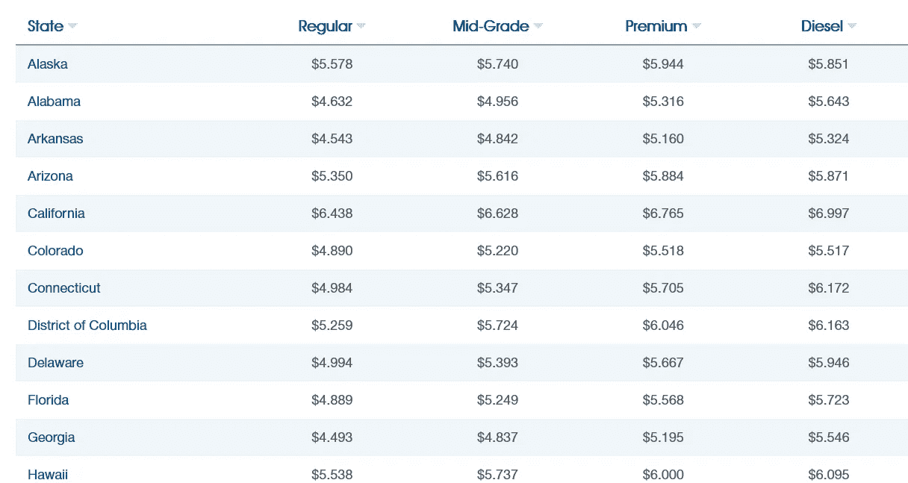

Table on AAA website

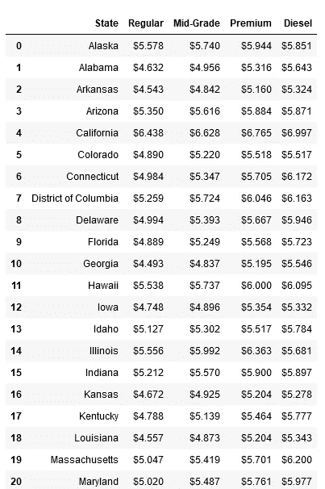

Dataframe after being web scraped

为了让 Plotly 正确识别这些数据，我们仍然需要删除每个价格前面的美元符号，创建一个对应的列，其中包含每个州名的缩写，并将价格列转换为`float`数据类型。

```
def remove_dollar(sign):
    sign = sign.str.replace('$', '', regex=True)
    return sign
```

上面的函数将替换字符串中的任何美元符号。但是，在继续之前，需要使用`.apply()`将其应用于整个数据帧。

```
gas = gas.apply(remove_dollar)
```

接下来创建一个列，用每个州的两个字母缩写，因为这是 Plotly 识别位置的方式。在这种情况下，只需要一个[字典](https://realpython.com/python-dicts/)，其中包含每个州的名称和缩写。

```
abbv = {'Alabama': 'AL',
        'Alaska': 'AK',
        'Arizona': 'AZ',
        'Arkansas': 'AR',
        'California': 'CA',
        'Colorado': 'CO',
        'Connecticut': 'CT',
        'Delaware': 'DE',
        'District of Columbia': 'DC',
        'Florida': 'FL',
        'Georgia': 'GA',
        'Hawaii': 'HI',
        'Idaho': 'ID',
        'Illinois': 'IL',
        'Indiana': 'IN',
        'Iowa': 'IA',
        'Kansas': 'KS',
        'Kentucky': 'KY',
        'Louisiana': 'LA',
        'Maine': 'ME',
        'Maryland': 'MD',
        'Massachusetts': 'MA',
        'Michigan': 'MI',
        'Minnesota': 'MN',
        'Mississippi': 'MS',
        'Missouri': 'MO',
        'Montana': 'MT',
        'Nebraska': 'NE',
        'Nevada': 'NV',
        'New Hampshire': 'NH',
        'New Jersey': 'NJ',
        'New Mexico': 'NM',
        'New York': 'NY',
        'North Carolina': 'NC',
        'North Dakota': 'ND',
        'Ohio': 'OH',
        'Oklahoma': 'OK',
        'Oregon': 'OR',
        'Pennsylvania': 'PA',
        'Rhode Island': 'RI',
        'South Carolina': 'SC',
        'South Dakota': 'SD',
        'Tennessee': 'TN',
        'Texas': 'TX',
        'Utah': 'UT',
        'Vermont': 'VT',
        'Virginia': 'VA',
        'Washington': 'WA',
        'West Virginia': 'WV',
        'Wisconsin': 'WI',
        'Wyoming': 'WY'}
```

使用`.map()`创建一个新列，每个州都有相应的缩写。

```
gas['Abbreviation'] = gas.State.map(abbv)
```

完成所有这些后，最后一步将是确保每个价格列只包含`float`数据，并且价格四舍五入到小数点后一位。

```
gas[['Regular', 'Mid-Grade', 'Premium', 'Diesel']] = gas[['Regular', 'Mid-Grade', 'Premium', 'Diesel']].astype(float).round(2)
```

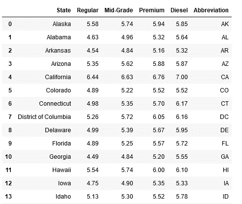

The final result

现在可以定义和构建 choropleth 图了。

```
fig2 = px.choropleth(gas,
                     locations='Abbreviation',
                     color='Regular',
                     color_continuous_scale='spectral_r',
                     locationmode='USA-states',
                     scope='usa',
                     title='Price of Regular Unleaded Gasoline',
                     height=1000)fig2.add_scattergeo(locations=gas['Abbreviation'],
                    locationmode='USA-states',
                    text=gas['Abbreviation'],
                    mode='text',
                    hoverinfo='skip')fig2.update_layout(coloraxis_colorbar_title='Price $',
                   title=dict(xanchor='center',
                              yanchor='top',
                              font_size=18,
                              x=0.5,))
```

这种可视化的构建可以总结为三个步骤。首先，使用`.choropleth()`识别正在使用的数据帧和地图的特征，如颜色、标题、范围和高度。其次，通过`.add_scattergeo()`添加州标签，在地图上洒上另一层视觉信息。第三，使用`.update_layout()`更新地图本身和颜色栏的标题，使价格更加美观。

地图本身可以在下图中看到，但还有更多可以添加到这个仪表板…

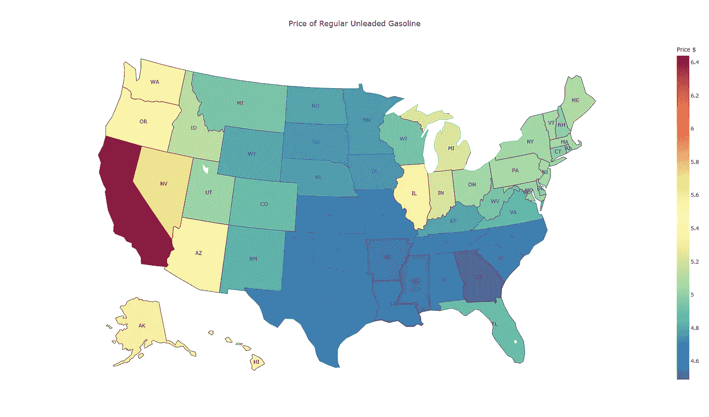

Prices are typically highest in California

## 通货膨胀的主要宏观经济措施

在进入 Dash 应用程序本身的布局和创建之前，必须开发仪表板的最后一部分，这是一个 2×3 的条形图和折线图配置，其中包含一些最受关注的宏观经济通胀指标，概述如下:

*   消费者物价指数
*   生产价格指数
*   凯斯席勒房价指数
*   个人消费支出
*   圣路易斯联邦储备银行的价格压力
*   密歇根大学消费者通胀预期

所有这些数据都可以通过 Pandas Datareader 使用圣路易斯美联储经济数据库(FRED)获得。就像股票和商品符号一样，弗雷德对每个指标都使用特定的代码。

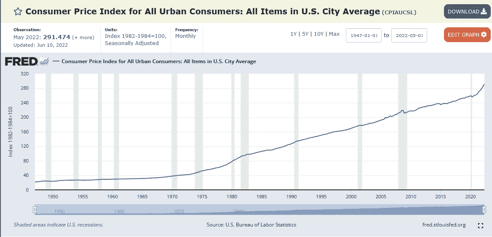

The code is at the very end of the title in parenthesis

以上是上述相同衡量标准列表的六个唯一代码，顺序相同:

*   CPIAUCSL
*   PPIFIS
*   CSUSHPINSA
*   PCE
*   STLPPM
*   密歇根州

有了这些信息，我们就可以获得我们需要的数据，并在继续之前执行一些简单的数据操作。

Gather, calculate, and rename

除了密歇根大学的通胀预期和圣路易斯联邦储备银行的价格压力，这些数据的其余部分通常是按月环比和同比衡量的。这就是为什么新列中应用了`.pct_change()`来计算这些指标的每月百分比变化。

通过这些修改和列的重命名，现在可以定义可视化效果了。

Building out each visualization

当使用`.bar()`生成条形图时，使用连续色标来可视化每个数据点的相对高点和低点是很有帮助的。

有了`.line()`图，对于初学者来说，默认的 Plotly 设置已经足够了，所以不需要定制。

移除 x 和 y 轴标题消除了一些不必要的混乱，而不会使可视化更加难以理解。

下图展示了成为仪表板一部分后的最终设置。

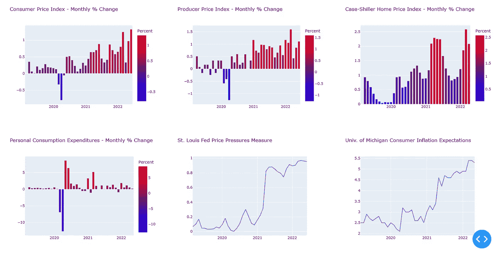

Having an array of different indicators all in one place makes things easier and faster

## Dash Bootstrap 布局和主题

虽然 Dash 作为一个框架，使得基于数据的 web 应用程序的创建更加简单，但是通过添加 Dash Bootstrap 组件，这种简单性可以更进一步。Bootstrap 是基于包装在容器`dbc.Container`中的行`dbc.Row`和列`dbc.Column`构建的，它们一起形成了[网格系统布局](https://getbootstrap.com/docs/4.0/layout/grid/)。

在这个布局中，我们可以放置图表、文本、图像和其他组件。

要开始这样做，我们必须启动应用程序并声明一个主题。这个例子使用了这里可用的主题之一[但是主题可以来自任何地方。](https://www.bootstrapcdn.com/bootswatch/)

Using the theme FLATLY for this example

`meta_tags`允许应用程序快速响应，以便它可以适应不同的屏幕尺寸，并兼容移动设备。

使用`app.layout`和`dbc.Container`是添加行和列之前的第一步。第一行只是一个带有仪表板标题的 HTML 标题。

```
app.layout = dbc.Container([dbc.Row(
        dbc.Col(html.H1('Inflation Tracking Dashboard',
                        className='text-center text-primary mb-4'),
                width=15)
            ),
```

下一行有一个下拉列表和一个图表，分别使用`dbc.Dropdown`和`dbc.Graph`制作。

A commodity selection dropdown will load a price chart for each commodity

一旦启动并运行，下拉菜单将允许 dashboard 应用程序的用户从可用的商品中进行选择，并加载一个价格图表供他们选择。`id`和`figure`行是需要注意的重要部分，因为它们将在最后的回调中使用。

```
dbc.Row(
        dbc.Col([
            dcc.Graph(id='gas_map', figure=fig2)
                ]), justify='center'
            ),dbc.Row([
        dbc.Col(
            dcc.Graph(id='cpi_bar', figure=fig3)),
        dbc.Col(
            dcc.Graph(id='ppi_bar', figure=fig4)),
        dbc.Col(
            dcc.Graph(id='hpi_bar', figure=fig5))
            ]),dbc.Row([
            dbc.Col(
                dcc.Graph(id='pce_bar', figure=fig6)),
            dbc.Col(
                dcc.Graph(id='ppm_line', figure=fig7)),
            dbc.Col(
                dcc.Graph(id='exp_line', figure=fig8))
            ]),
```

接下来的三行是零售天然气价格和宏观经济指标的 choropleth 图。因为这些都不需要回调函数，所以没有什么需要做的了。

布局完成后，剩下的唯一任务是创建商品价格图表，并为 Dash 应用程序设置能够在本地运行的条件。

## 回调和启动应用程序

```
@app.callback(Output('commodity-select', 'figure'),
              Input('drpdwn', 'value'))def update_plot(commodity_selected):
    com_select = com[com['Symbols'] == commodity_selected]
    fig1 = px.line(com_select,
                   y='Closing Price',
                   x='Date',
                   height=700)
    fig1.update_xaxes(title=None)
    return fig1
```

回调函数使仪表板具有反应性，其中用户可以选择一个输入组件，并根据已更改的属性显示不同的输出。在上例中，`Output()`是根据下拉菜单中的`Input()`选择的商品生成的新价格图表。前面创建的数据框架，包括所有商品的收盘价，最终在这里使用。

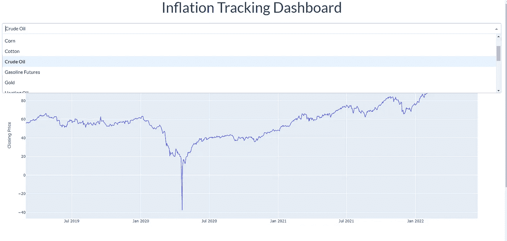

The dropdown and the price chart working together

万事俱备，只需增加两行代码就可以确保这个仪表板可以在本地运行，并在 web 浏览器中进行测试。

```
if __name__ == '__main__':
    app.run_server(debug=True, port=8080)
```

现在它可以运行了。如果所有东西都保存到一个`.py`文件中，并且该文件正在运行，那么应该会有一条命令行消息确认 Dash 正在运行。

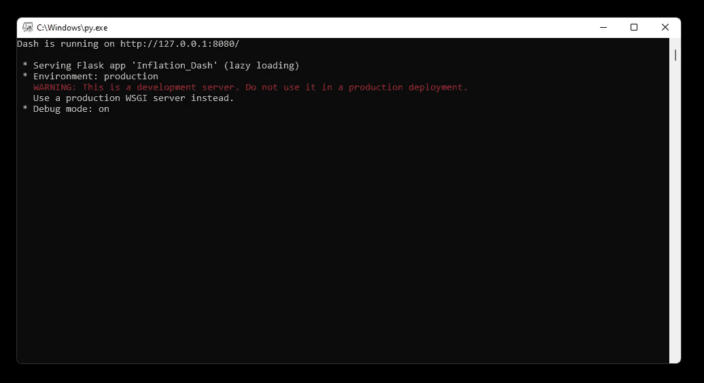

Dash is powered by [Flask](https://flask.palletsprojects.com/en/2.1.x/)

将该地址插入同一台机器上的任何 web 浏览器都会加载仪表板，如下图所示。

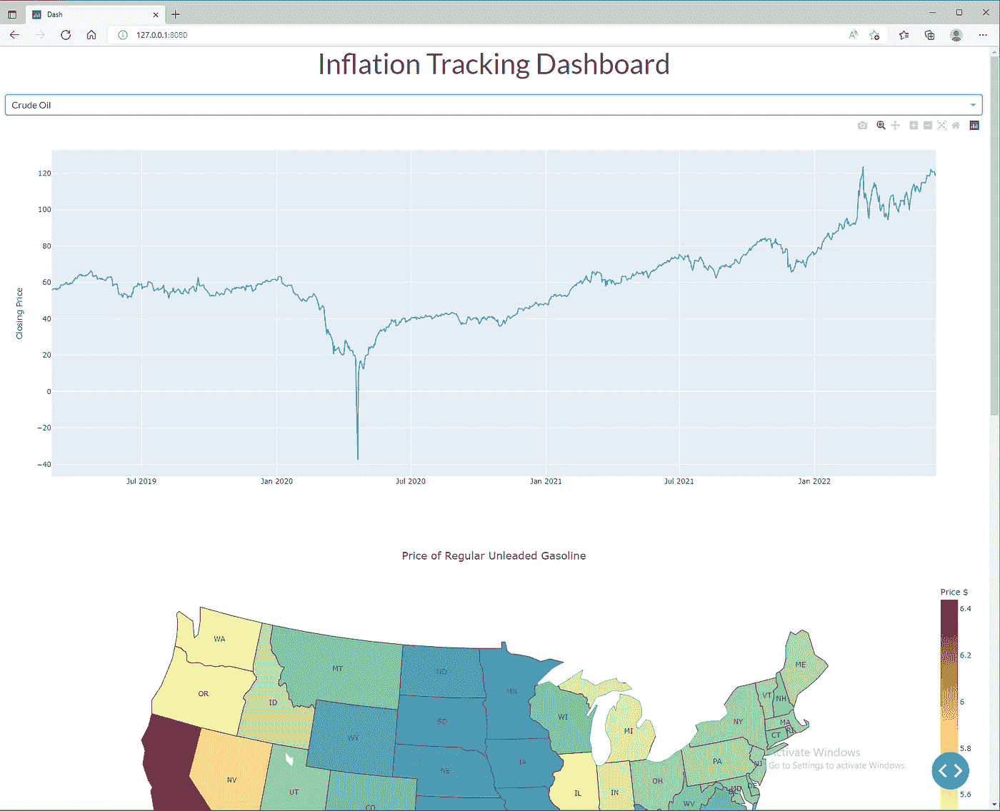

Running in Debug mode

多年来，除了经济学家之外，很少有人跟踪通胀数据，这当然不会成为头条新闻，因为没有太多的过度通胀发生。当经济按预期运行时，没有什么会成为新闻。然而，在过去几年里发生了一系列事件，通货膨胀是每个人心中的话题。像这样的仪表板可以帮助显示通货膨胀是升温还是降温。将所有数据放在一个地方当然不会有坏处，Plotly Dash 允许任何人这样做。

完整的代码可在[这里](https://github.com/styounessi/Inflation_Dashboard)。←于 2023 年 2 月 4 日更新，以解决 Pandas Datareader 和 Yahoo Finance 数据的问题。还重构了大部分代码。