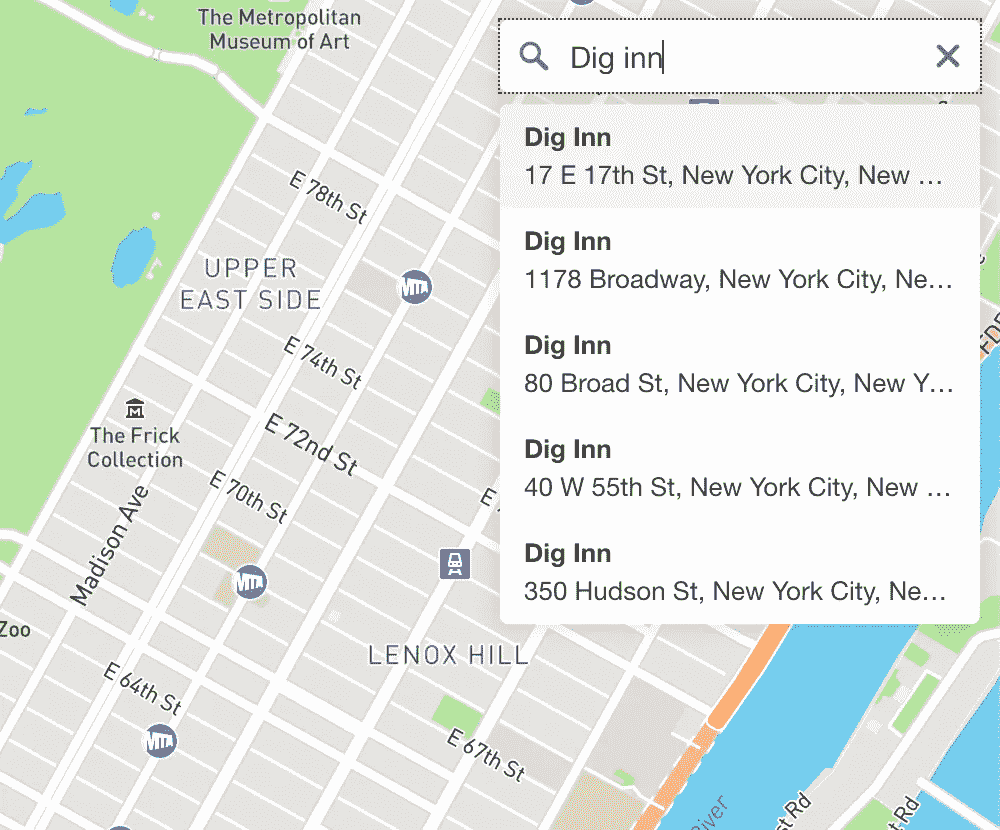
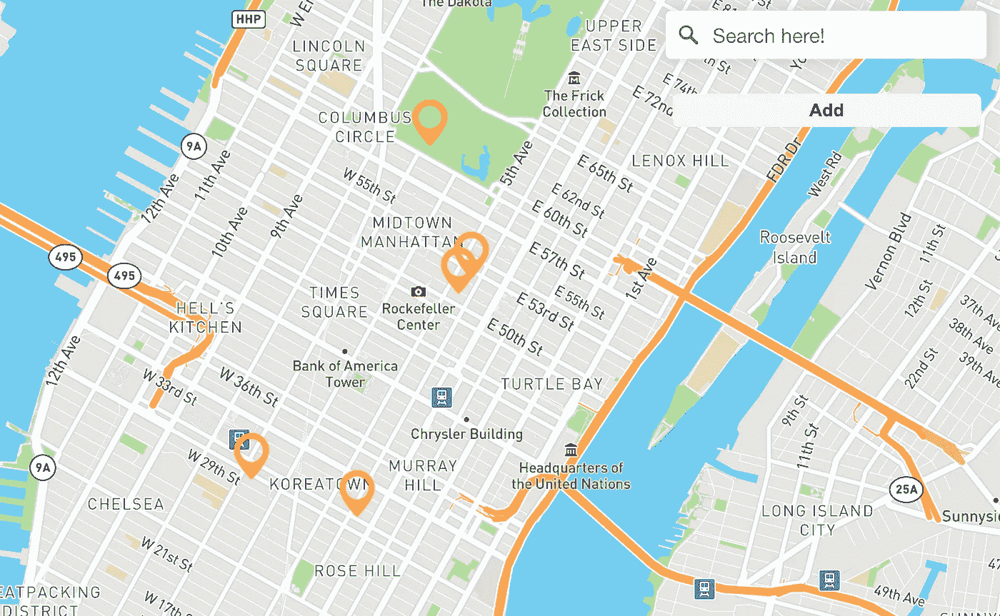
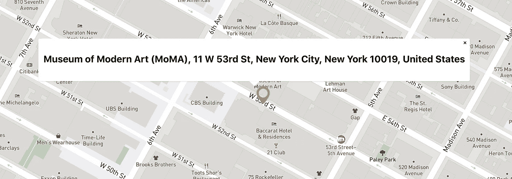

# 使用 Mapbox & React 构建交互式地图

> 原文：<https://medium.com/geekculture/building-an-interactive-map-with-mapbox-react-f335384f4863?source=collection_archive---------0----------------------->

Mapbox API 是一个非常棒的工具，可以用来构建定制的交互式地图。然而，将 Mapbox 集成到一个更大的应用程序中一开始可能会感到棘手——就我个人而言，我发现自己花了一些时间搜索文档之外的资源，以便将关键特性集成到我的 React 应用程序中。如果你能感同身受，希望这篇文章将是你读过的最后一篇！在这里，我将分解使用两个库 react-map-gl 和 react-map-gl-geocoder 构建交互式地图的步骤。具体来说，我将介绍如何:1)渲染地图，2)合并地理编码器，3)创建标记，4)添加弹出窗口。

## 1.创建 React 应用程序并安装依赖项

首先，让我们使用[创建 React app](https://github.com/facebook/create-react-app) 并安装 [react-map-gl](https://visgl.github.io/react-map-gl/) 和 [react-map-gl-geocoder](https://www.npmjs.com/package/react-map-gl-geocoder) 来建立一个项目。将以下内容粘贴到您的终端中:

```
npx create-react-app mapbox-project
cd mapbox-project
npm i react-map-gl react-map-gl-geocoder
npm start
```

## 2.获取地图框 API 令牌

接下来，我们必须为[地图框](https://www.mapbox.com/)创建一个账户。如果您没有使用令牌自动重定向到您的控制面板，请单击蓝色的“创建令牌”按钮创建一个。


## 3.创建地图

现在我们有了 API 令牌，让我们开始编码吧！接下来，我将使用类组件。(如果您更喜欢使用无状态组件，请查阅[文档](https://visgl.github.io/react-map-gl/docs)。)为了构建地图，我们将利用 react-map-gl 提供的 *ReactMapGl* 组件。它接受大量的道具，包括 API 令牌、 *viewport* 、 *mapStyle* 和 *onViewportChange* 。

*   *视口*:地图的尺寸、中心点和缩放常数。
*   地图风格:地图盒子上有各种各样的风格(有不同的配色方案、街景、标签等组合。)，甚至在这里创造自己的[。](https://studio.mapbox.com/)
*   *onViewportChange* :控制视口过渡(即当用户拖动地图时更新视口)的函数。

保存后，您应该能够在本地主机上看到地图渲染！


Rendered map

## 4.添加地理编码器

接下来，让我们使用 react-map-gl-geocoder 在地图上添加一个地理编码器。该库方便地为我们提供了*地理编码器*组件，它接受几个道具，包括一个 API 令牌、 *mapRef* 、 *onResult* 和 *onViewportChange* 、 *position* 和 *countries* 。导入样式并在 *ReactMapGl* 中添加*地理编码器*组件。

以下描述来自[文件](https://www.npmjs.com/package/react-map-gl-geocoder):

*   *mapRef*:react-map-GL 映射组件的 Ref。

要添加这个属性，请定义一个变量(如下例所示)。然后，在 *ReactMapGl* 组件上添加一个 ref 键。

```
mapRef = React.createRef()
```

*   *onViewportChange* :在执行查询后，被传递更新的视区值
*   *位置*:地图上地理编码器控件将被添加到的位置。有效值为`"top-left"`、`"top-right"`、`"bottom-left"`和`"bottom-right"`。
*   *国家*:逗号分隔的国家代码列表，将结果限制在指定的一个或多个国家。

查看附加定制道具的文档！

在将道具传递给*地理编码器*组件并保存文件后，您应该能够在地图上看到一个搜索栏。您可以键入一个位置，并在选择后将地图重新置于该位置的坐标中心！



Geocoder search bar

## 4.在地图上创建和渲染标记

现在让我们来看看标记。从 react-map-gl 导入*标记*组件。*标记*唯一需要的道具是纬度和经度。要添加标记，只需在父组件中插入纬度为*经度为*和*经度为*的组件，如下所示:

```
import ReactMapGl, {Marker} from 'react-map-gl'
...
<ReactMapGl
...
/>
<Marker
latitude={*insert latitude*}
longitude={*insert longitude*}
>
  *[insert image or custom marker]*
</Marker></ReactMapGl>
...
```

用硬编码值渲染一个标记很酷，但是我们想做一个 ***交互式*** 地图。通过在我们的本地州存储位置信息，我们将能够在搜索和选择地址时创建标记。

```
this.state = {
  ...
  currMarker: null,
  markers: []
}
```

地理编码器组件接受一个 *onResult* prop，其中我们可以传入一个在选择地理编码器输入时要执行的函数。我们将创建一个 *handleResult* 函数来更新 *currentMarker* 的值，并将其传递给 *onResult* (记得在构造函数内部绑定它！).

```
handleResult(result) {
  this.setState({
    currMarker: {
      name: result.result.place_name,
      latitude: result.result.center[1],
      longitude: result.result.center[0]
    }
  })
}
```

接下来，我们将创建一个函数来传递给按钮的 *onClick* 事件属性，以保存地图上的 *currentMarker* ！该功能将通过将*当前标记*推送到*映射*数组来更新状态。

```
addMarker() {
  const {currMarker} = this.state
  this.setState(prevState => ({
    markers: [...prevState.markers, currMarker],
    currMarker: null
  }))
}
```

为了最终渲染保存在我们的 *maps* 数组中的位置标记，只需映射通过(没有双关的意思！)map 组件内部的数组，为每个组件传入各自的属性。您的代码应该类似于下面的示例:

使用上面的代码，您应该能够通过选择一个位置并单击 add 按钮在地图上添加标记！



Map with markers

## 4.创建弹出窗口

最后但同样重要的是，我们将为地图上的标记创建弹出窗口。同样，我们将使用 react-map-gl 提供的内置弹出组件。它接受众多的道具——出于我们的目的，我们将包括以下: *mapRef* 、*纬度*、*经度*、*关闭按钮*、*关闭点击*和*关闭。*

*   *关闭按钮*:(默认:`true`)如果`true`，弹出窗口的右上角会出现一个关闭按钮。
*   *关闭点击*:(默认:`true`)如果`true`，点击地图时弹出窗口会关闭。
*   *onClose* :用户关闭弹出窗口时的回调。

要在单击标记时呈现弹出窗口，让我们将 *selectedMarker* 添加到本地状态，并添加两个实例方法 *handleMarkerClick* 和 *handleClose* 。点击标记时将调用 *handleMarkerClick* 方法，该方法将更新 selectedMarker 以保存该标记的信息。当点击弹出窗口上的关闭按钮时，将调用 *handleClose* 方法，并将 handleMarkerClick 更新为`null`。

以下是最终代码:

保存代码后，您应该能够单击地图上的标记来查看弹出窗口！



Pop-up

恭喜你，你现在有一个交互式地图了！🎉这只是一个开始-尝试实现更多的功能，为您的地图添加更多的复杂图层。感谢您的阅读，如果您有任何问题、评论或担忧，请随时联系我们！

# 参考

[https://github.com/facebook/create-react-app](https://github.com/facebook/create-react-app)

[https://docs.mapbox.com/mapbox-gl-js/api/](https://docs.mapbox.com/mapbox-gl-js/api/)

[https://visgl . github . io/react-map-GL/docs/get-started/get-started](https://visgl.github.io/react-map-gl/docs/get-started/get-started)

[https://www.npmjs.com/package/react-map-gl-geocoder](https://www.npmjs.com/package/react-map-gl-geocoder)