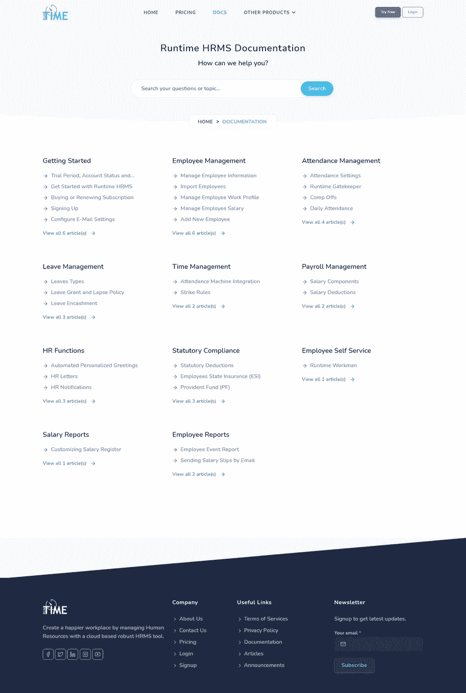
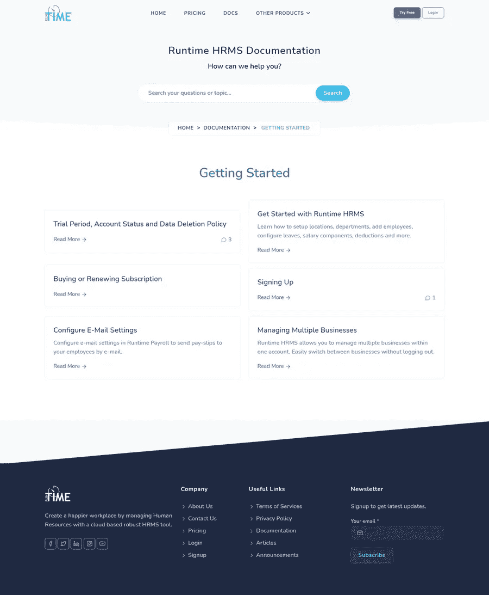
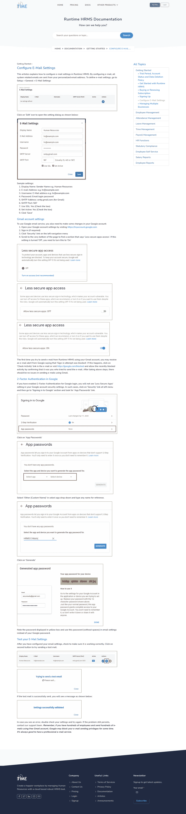

# 在 WordPress 的基础上构建 ASP.NET web 应用程序

> 原文：<https://medium.com/geekculture/building-an-net-web-application-on-top-of-wordpress-4f75a447be2e?source=collection_archive---------7----------------------->


Combining the power of WordPress and .NET

WordPress 非常适合内容管理。但是当谈到运行前端博客或网站时，你可能会惊讶于使用像 ASP.NET 这样健壮的框架的好处。

WordPress 最大的优势之一是能够使用丰富的 WYSIWYG 编辑器轻松创建内容。您可以在您的作品中添加标题、段落、图像、引用和各种丰富的片段。此外，您可以在自定义类别中对内容进行分类。更棒的是，WordPress 在后台以纯 HTML 格式保存文章或页面数据，这完全由您决定！

在过去的几年里，我创建了大量的 WordPress 网站。WordPress 是我的首选，主要是在以下一个或多个条件适用时:

1.  客户的预算很紧张
2.  客户需要能够自己添加/删除/更新内容
3.  该网站只是一个博客或文档门户

除了这些原因，我建议我的客户去定制设计的网站，避免使用 WordPress。为什么？这是另一篇文章的主题:)

如果你选择 WordPress 来实现上面的第二点或第三点，我推荐你试试这篇文章中解释的方法，用。NET，在幕后使用 WordPress CMS。人们仍然可以登录 WordPress panel 并创建/修改内容，但网站前端将使用. NET 呈现。

# 顶级优势

1.  **对渲染的完全控制**:使用对 HTML/CSS 的完全控制来设计页面，不受底层 WordPress 主题或主题文件定制的限制。
2.  **成本效益**:你可以自己做几乎所有的事情，而不是购买高级主题或插件(例如，电子邮件、联系表格、缓存、压缩等。)
3.  **更安全**:通过禁用 WordPress 前端，你基本上消除了大部分黑客和垃圾邮件的漏洞。
4.  **鲁棒码**:自。NET 为您编写的所有内容提供智能感知和设计时编译，无论是 HTML 视图中的 C#代码还是 Razor 代码，您都不太可能出现运行时错误。然而，当你在一个 PHP 文件上工作时(在 WordPress 主题编辑器或任何其他 IDE 中)，你相对来说更容易出错。
5.  **性能提升**:这是一个有争议的话题，我没有任何数据可以证明。但是，根据这个 [SO post](https://stackoverflow.com/a/10906344/2197835) ，使用时有许多性能优势。NET 比 PHP 相同的任务。

让我们深入实施一下…

# 准备 MySQL 数据库

WordPress 使用 MySQL 数据库来存储其所有内容，如页面和帖子。你可能已经知道了，但是以防万一:)。

我们需要找到连接到 WordPress 数据库的连接字符串。查看保存在 WordPress 安装根目录下的`wp-config.php`文件。检查这些值:

```
 /** MySQL database name */
define(‘DB_NAME’, ‘**db_name**’);/** MySQL database username */
define(‘DB_USER’, ‘**username**’);/** MySQL database password */
define(‘DB_PASSWORD’, ‘**p@55word**’);/** MySQL hostname */
define(‘DB_HOST’, ‘**localhost**’);
```

有一种可能，你的`DB_HOST`值不是`localhost`而是某个 IP 地址，这样就好了。记下这些值并继续。

# 远程访问 MySQL 服务器

MySQL 服务器的访问可能仅限于本地服务器。这意味着不能从服务器外部访问数据库。就最终实现而言，这很好，但是，你需要查看一些 WordPress 数据库来理解表和列的结构。

要从外部打开 MySQL 访问，请打开服务器上的端口 3306，并尝试远程连接到 MySQL。您可能还需要向相关用户帐户授予远程连接权限。如果你没有访问服务器的权限或者没有足够的特权，试着在你的电脑上安装 WordPress。这可能是一个漫长的过程，包括相当多的步骤。[查看本文](https://www.themeum.com/install-wordpress-localhost/)了解如何操作的说明。

# 的。网络项目

创建新的。NET 项目来设计网站前端。您可以使用。NET 框架或者。NET Core，就本文而言，这并没有什么不同。所以选一个你觉得舒服的。

**安装 nu-get 包(包名为。净核心)**

微软。EntityFrameworkCore
MySql。实体框架工作核心

现在我们需要添加一些模型来表示 WordPress 数据库表。使用这些模型，我们可以编写 C#代码来读取帖子内容，以生成我们的前端页面。至少，您需要以下型号:

**术语** 此表用于存储*类别列表*，以及 WordPress 或插件使用的其他术语。

```
[Table("wp_terms")]
public class Term 
{
   [Key]
   [Column("term_id")]
   public int TermId {get; set;}

   [Column("name")]
   public string Name {get; set;} [Column("slug")]
   public string Slug {get; set;} [Column("term_group")]
   public int TermGroup {get; set;}
}
```

**术语分类法**
该表确定存储在`wp_terms`表中的特定值是类别、标签还是其他。

```
[Table("wp_term_taxonomy")]
public class TermTaxonomy
{
   [Key]
   [Column("term_id")]
   public int TermId { get; set; } [Column ("taxonomy")]
   public string Taxonomy { get; set; } [Column("description")]
   public string Description { get; set; } [Column("parent")]
   public int Parent { get; set; } [Column("count")]
   public int Count { get; set; }
}
```

*查找类别列表:*
查询`Term`表，基于公共列`TermId`与`TermTaxonomy`连接，查找`Taxonomy`值`'category'`。
稍后会有更多关于查询的内容。

这个表存储了所有帖子、媒体附件、帖子修改和其他东西的列表。我们需要访问这个来阅读文章内容。

```
[Table("wp_posts")
public class Post
{
   [Key]
   [Column("ID")
   public int Id {get; set;} [Column("post_author")]
   public int AuthorId {get; set;} [Column("post_date")]
   public DateTime Date {get; set;}... replicate all columns from table}
```

这是一个小表格(只有 3 列)，但是使用起来有点棘手。我们先来看看表格结构:

```
[Table("wp_term_relationships")]
public class TermRelationship
{
   [Key]
   [Column("object_id")]
   public int ObjectId { get; set; } [Column("term_taxonomy_id")]
   public int TaxonomyId { get; set; } [Column("term_order")]
   public int Order { get; set; }
}
```

*这个可能一开始掌握起来有点复杂，但是忍耐一下:*
当你从 **Post** 表中取一个帖子的时候，你还需要知道这个帖子所属的类别。这就是使用**术语关系**表的地方。 **Post** 表有一个名为`ID`的列。这是每个帖子的唯一 ID。使用 **Post** 的`ID`列和 **TermRelationship 的`ObjectId`列将 **Post** 表和 **TermRelationship** 表连接起来。**在**术语关系**中得到的`TaxonomyId`是**术语**表中相关类别的`TermId`。如果需要，您可以进一步将查询与术语表连接，以获取类别名称。唷！相信我，这很难，剩下的就是普通的香草味了。

*注:
上面显示的模型类用* `*[Table(“wp_name”)]*` *修饰，以指定数据库中表的名称。您的表名可能不是以* `*wp*` *开头。如果是这种情况，只需使用数据库中的确切名称来修饰您的模型类。*

**DbContext** 创建完模型后，在`DbContext`类中添加`DbSet`非常简单。下面是一个示例`DbContext`类:

```
public class WordPressDbContext: DbContext
{ public WordPressDbContext() : base() { } public virtual DbSet<Term> Terms { get; set; }
   public virtual DbSet<TermTaxonomy> TermTaxonomies { get; set; }
   public virtual DbSet<Post> Posts { get; set; }
   public virtual DbSet<TermRelationship> TermRelationships { get; set; }}
```

**连接字符串** 这里是放入`web.config`文件的连接字符串(如果使用。NET Framework)或`appsettings.json`(如果使用。网芯)。如上所述，使用`wp-config`文件中记录的值。

```
"server=localhost;port=3306;database=db_name;uid=username;password=p@55word"
```

# 提取前端页面的数据

一旦上面的设置完成，你可以让你的控制器和视图显示类别列表，文章列表，个人文章页面等等。您甚至可以设计一个表单来发布评论(我还没有讨论过评论表，但是您可以通过查看实际的评论表，以同样的方式为评论表创建一个模型。如果你这样做，不要忘记添加一个验证码来发表评论)。

以下是一些获取数据的示例查询:

**类别列表**

```
var data = (from t in db.Terms
            from tt in db.TermTaxonomies.Where(a => 
                  a.TermId == t.TermId && 
                  a.Taxonomy == ***"category"***)
            select new
            {
                Id = t.TermId,
                Name = t.Name,
                Description = tt.Description,
                Slug = t.Slug,
             }).ToList();
```

**特定类别的职位列表**

```
var posts = (from p in db.Posts.Where(a => 
                     a.Type == "post" && 
                     a.Status == "publish")
             from tr in db.TermRelationships.Where(a => 
                     a.ObjectId == p.Id && 
                     a.TaxonomyId == ***categoryId***)
             select new 
             {
                 Title = p.Title,
                 Slug = p.Slug, 
                 Excerpt = p.Excerpt,
                 PublishedOn = p.Date,
                 Comments = p.CommentCount
              }).ToList();
```

你也可以使用`OrderBy`对结果进行排序，使用`Take(n)`从一个类别中只获取固定数量的文章，例如，创建一个页面导航。

**在帖子里搜索**

```
var data  = (from p in db.Posts.Where(a => 
                    a.Type == "post" && 
                    a.Status == "publish" &&
                    a.Content.Contains(***query***))
             from tr in db.TermRelationships.Where(a => 
                    a.ObjectId == p.Id)
             from t in db.Terms.Where(a => 
                    a.TermId == tr.TaxonomyId)
             select new
             {
                 CategoryName = t.Name,
                 CategorySlug = t.Slug,
                 Title = p.Title, 
                 Slug = p.Slug,
                 Excerpt = p.Excerpt,
                 PublishedOn = p.Date,
                 Comments = p.CommentCount
              }).ToList();
```

可能性是无限的。你可以做 WordPress 所做的一切，甚至更多，有更好的控制，更高的安全级别和一些性能增益！

# 一些样品

这些是使用上述方法创建的页面。后端数据库是一个实时 WordPress 安装，前端使用. NET 核心应用程序呈现。

**排名靠前的分类索引**



**所有帖子的类别存档**



**单篇文章(带右侧导航栏)**



如果您是一名 PHP 开发人员，这一切对您来说可能听起来没什么用。然而，作为一名. NET C#开发人员，它带来了两个世界的精华 WordPress 和。一起网。由于我是一个. NET 人，我总是想到使用。以新的、未被探索的方式。请分享你的想法。