# 用 JavaScript 和 Solana 构建一个 NFT 销售机器人

> 原文：<https://medium.com/geekculture/building-an-nft-sales-bot-with-javascript-and-solana-3d7add28f995?source=collection_archive---------3----------------------->

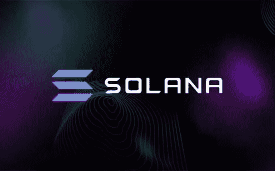

**TL；**博士——如果你是那种“说得多，给我看看代码”类型的人，你可以在这里找到[源代码。](https://github.com/Turk-Mumtaz/nft-sales-bot/blob/main/sales_bot.js)

# 背景

如果你现在想学习如何在 Solana 上制作一个 NFT 销售机器人，你的选择并不多。有一些开源机器人回购，它们写得很好——但我认为它们比必要的更复杂。

此外，出于某些奇怪的原因，Solana 的新开发人员会自动假定您必须是一个 Rust wizard 才能构建任何东西。这不是真的。**你不需要知道 Rust 来构建 Solana** (除非你需要写合同)**。**

更糟糕的是，如果您不是开发人员，您唯一的选择是:

a)付钱给一个随机的开发者(然后被多收了钱)

b)购买一个现有的销售机器人解决方案(然后被多收了钱)

这很烦人——所以我决定做一堆免费的机器人来帮忙。

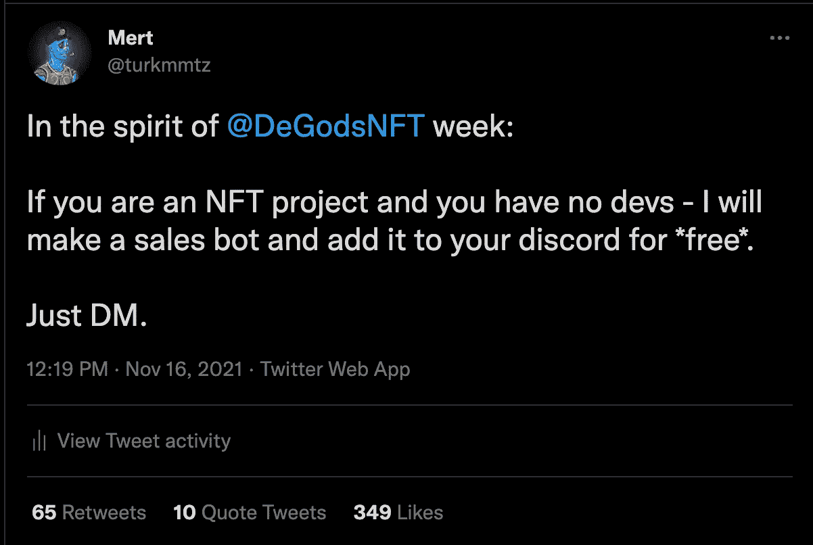

显然，这是不可扩展的。但是在制作了 9 个左右的机器人之后，我想我已经对这个主题有了足够的理解，可以写一个关于它的小指南了。

# 高级概述(可选)

我们正在建立:一个销售机器人，跟踪所有主要的索拉纳市场给定 NFT 的销售，并张贴销售细节到一个不和谐的渠道。

在深入研究代码之前，首先建立一个概念性的理解是有帮助的。

我们实现这一目标的方法如下:

1.  找出 NFT 收藏收取版税的账户/地址
2.  不断轮询此地址以获取新的事务签名
3.  遍历交易签名，获取它们的交易细节，并检查有效的 NFT 销售
4.  如果有效，获取 NFT 的元数据并将详细信息发布到 Discord
5.  转到步骤 2 —确保只轮询在最近观察到的事务之后发生的事务

## 轮询与流(可选)

每当您处理“实时”数据时，您基本上有两种选择:轮询或流/发布。

一般来说，使用流/发布订阅模式是更好的方法，在这种模式下，你只需订阅你的 NFT 收藏的主账户，然后监听变化。

在本教程中，我们将投票获取数据。这是因为 1)从概念上更容易编码和解释(IMO ), 2)这使得回填历史销售数据更容易。

# 设置

首先确保你已经安装了 Node JS(版本 14.17.0 或更高)，我推荐使用 [NVM](https://github.com/nvm-sh/nvm) 。然后，打开一个终端，创建一个新文件夹，`cd`到里面，初始化 npm。

```
$ mkdir nft-sales-bot
$ cd nft-sales-bot
$ npm init
```

一旦回购启动，我们实际上只需要 3 样东西:

```
$ npm i @solana/web3.js @metaplex/js axios
```

[Solana/web3.js](https://github.com/solana-labs/solana-web3.js) 是一个用于与链上的 Solana 节点交互的库(获取交易、账户信息、签名等)。,).

[Metaplex](https://docs.metaplex.com/) 是一套与 Solana NFTs 交互的工具/合同/标准。

而 [axios](https://www.npmjs.com/package/axios) 是一个用于发出 HTTP 请求的库。

# 代码

(在继续之前，我想强调的是，这里的代码仅仅是为了便于理解而优化的，这绝不是一个通用的好模式)

首先，导入我们刚刚安装的库。

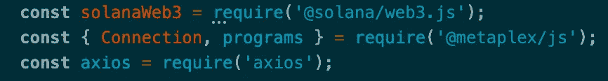

接下来，让我们初始化一些变量并做一些验证。

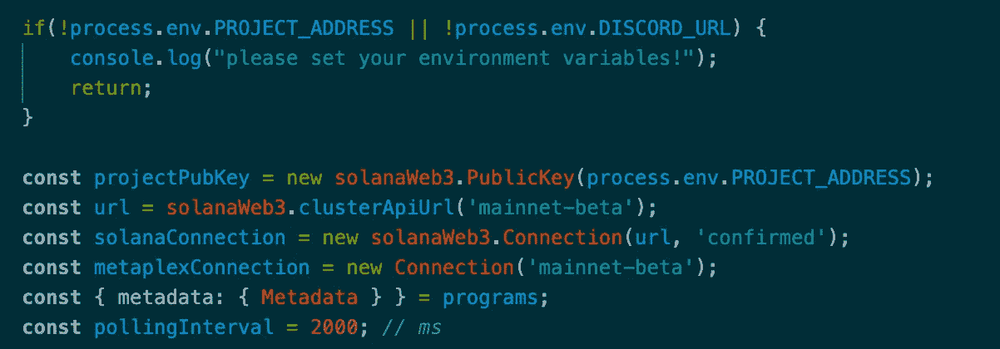

这里发生了一些事情。首先，我们验证项目地址和 Discord URL 是否被传递给了 bot(稍后将详细介绍)。第二，我们正在连接 Metaplex 和 Solana 的 mainnet。或者，您可以连接到 devnet 进行测试。第三，我们正在从 Metaplex 中析构元数据程序，这将帮助我们获取 NFT 元数据。第四，我们将从 PROJECT_ADDRESS 环境变量创建一个新的`PublicKey`对象——这是传递到 solana/web3 库所必需的。最后，我们设置了一个轮询间隔，以确定我们希望机器人检查新销售的频率。我建议至少设置在 2000-5000 毫秒之间。这是因为默认的 Solana RPC 节点有速率限制，如果您在短时间内进行太多的调用，您的请求将不会通过。你可以使用像 GenesysGo 这样的 RPC 提供者进行无限制的调用，尽管这不是免费的。

现在，让我们添加主要的索拉纳 NFT 市场和他们的计划地址。每当市场上出现 NFT 的销售时，市场的程序地址显然必须被包含在内，你可以观察到这种连锁反应([这里有一个关于魔法伊甸园的例子](https://explorer.solana.com/tx/2chhhKzDtuYoke7sVTjZygqwWFL4SrGnDgzi56R8r6xYFrZ1MBUBkKJ8qXmpRUxZEnAxvVHMSFjTcpUavzJmVC9d))。

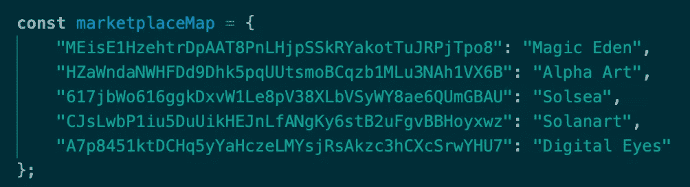

现在让我们开始运行销售机器人的主要功能。

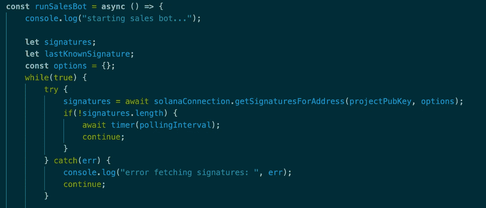

现在可以忽略未赋值的变量——这里要注意的主要是`getSignaturesForAddress`函数。这将返回涉及给定地址的事务的已确认签名，从最近的已确认块开始向后追溯(或者您在选项中传递的任何签名)。基本上，如果主项目地址得到任何新的事务，这个函数将得到它们。如果没有事务，我们等待轮询间隔持续时间，并在无限循环中继续再次检查。您可以在[源代码](https://github.com/Turk-Mumtaz/nft-sales-bot/blob/main/sales_bot.js)中找到`timer` fn 和任何其他帮助器 fns 的实现。

让我们完成主要功能。

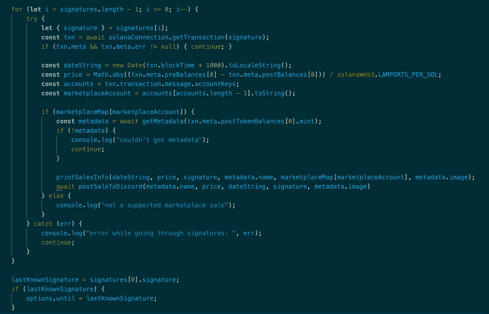

记住`getSignaturesForAddress`按照时间降序返回事务。这意味着我们需要从`signatures`数组的最后一个元素开始循环，按时间顺序显示销售额。对于每个签名，我们可以调用 web3 库上的`getTransaction`方法来获取准确的交易细节。有了手头的细节，我们首先检查交易是否有任何错误，在这种情况下，我们知道不会有一次成功的销售。

接下来，我们将 Unix 时间中的`blockTime`转换成可读性更好的日期对象。然后，我们做一个简单的计算来获得销售价格，并查看最后一个帐户映射到哪个市场(根据我的经验，最后一个帐户总是市场标识符——我不确定这是否普遍适用，因为我很笨，如果你想非常安全，可以查看所有帐户)。

然后我们得到交换的 NFT 的元数据——这样我们就有了在 Discord 上发布销售细节所需的所有信息。

在再次轮询之前，我们还希望确保只获取自上次轮询以来发生的事务。为了做到这一点，`getSignaturesForAddress`方法接受一个`until`选项，我们可以将它设置为我们所知道的最近的事务，`lastKnownSignature`。

(**注意:** `getSignaturesForAddress`默认返回最后 1000 个签名。这意味着销售机器人将实际上开始重放旧的销售。我喜欢这样做，以便回填关于不和谐的历史数据——这是社区喜欢看的。**如果你想只显示新的销售额，你需要修改这个。**例如，您可以在 bot 第一次启动时设置一个`bootupDate`,然后在过账之前检查所有交易的日期必须晚于这个日期)

# 获取元数据

现在是时候定义我们之前提到的`getMetadata`函数了。

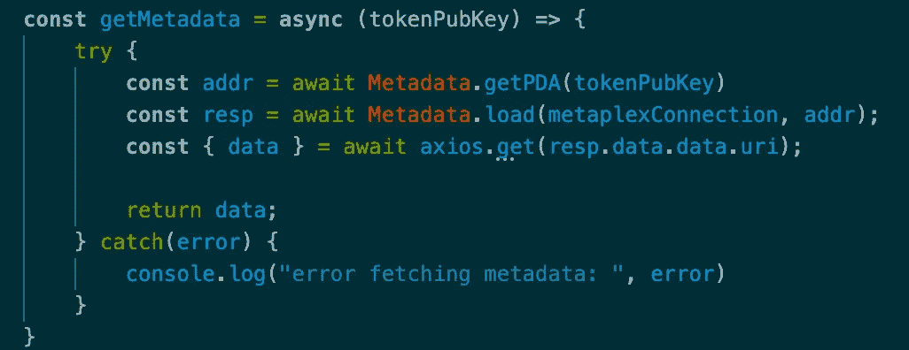

首先，我们获取[程序派生的地址(PDA)](https://pencilflip.medium.com/learning-solana-3-what-is-a-program-derived-address-732b06def7c1) 作为我们的令牌地址，然后我们将它插入 Metaplex 的内置`Metadata.load`中，以获取指向元数据的链接。然后，我们使用这个链接来获取实际的元数据。

我不打算撒谎，这在实践中相当缓慢。我们正在进行连续的网络呼叫，最后一个呼叫通常是打给 IPFS 的，这是一个巨大的瓶颈。

幸运的是，我们实际上可以通过利用我们信任的朋友 Magic Eden 的帮助来优化这一点，Magic Eden 是索拉纳最大也是我认为最好的 NFT 市场。

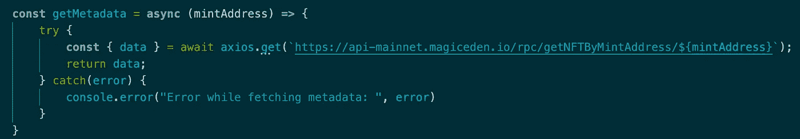

由于这些市场每天必须处理大量的元数据，它们很可能会缓存这些数据，从而大大提高性能。幸运的是，它们还公开了一个非官方的公共端点。由于这是一个非官方的端点，随时都可能发生变化，所以我不鼓励您使用这种方法，除非性能对您来说确实是一个问题。

# 发布到 Discord

为了发布到 Discord，我们首先需要获得一个 webhook URL。要做到这一点:右击你的服务器->服务器设置->集成-> webhooks -> new webhook。在这里，您可以命名 webhook 并配置您希望它将销售发送到哪个渠道。配置完成后——只需点击“复制 Webhook URL”即可。

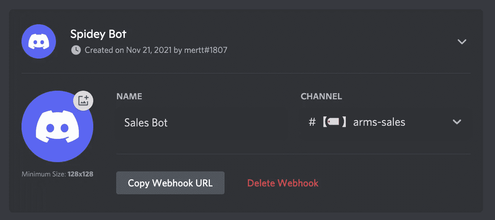

接下来，让我们编写发送销售的函数。

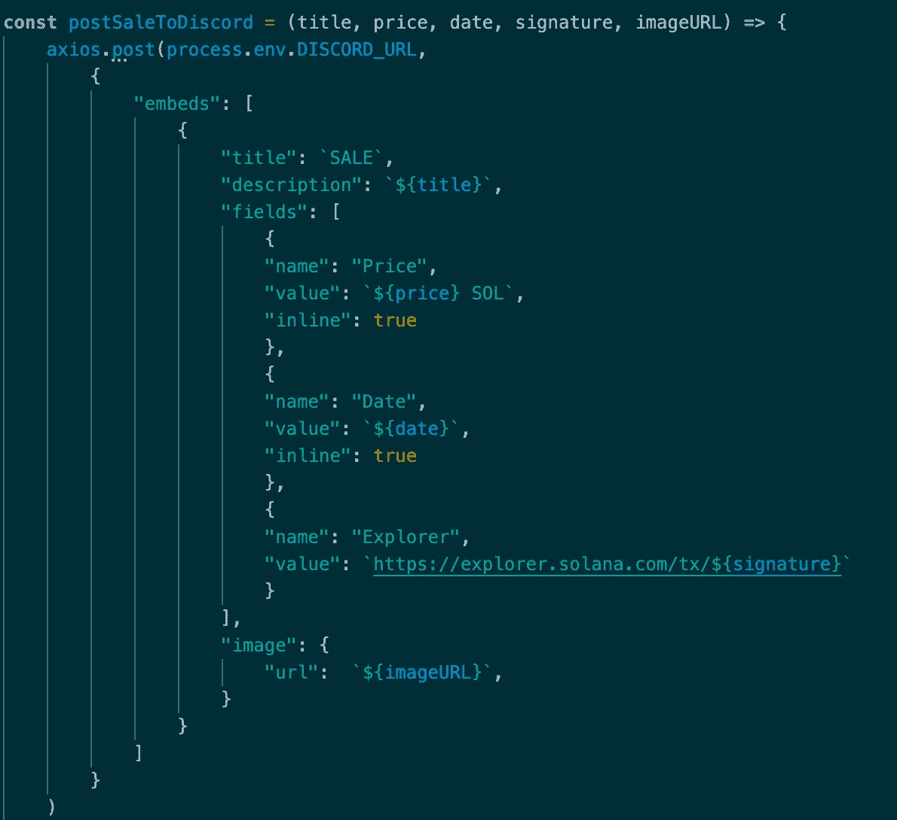

如果你想了解更多关于如何定制的信息，请看一下[这个](https://gist.github.com/Birdie0/78ee79402a4301b1faf412ab5f1cdcf9)文档。

# 运行机器人

代码现在完成了。为了运行它，我们还需要一些东西。

首先，我们需要弄清楚`process.env.PROJECT_ADDRESS`应该是什么。为此，我通常只需在 Solana Explorer 上调出 NFT，确定哪些创作者获得了大部分版税。

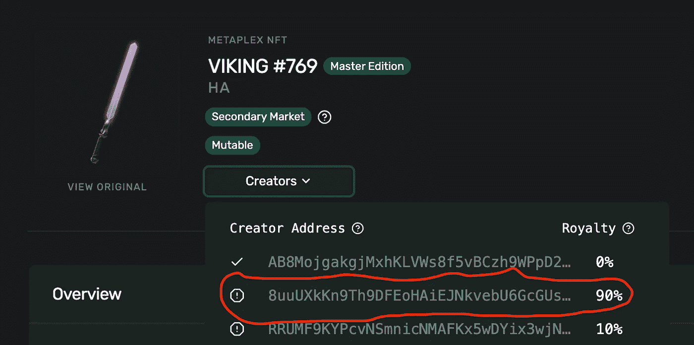

其次，有了这个和 Discord URL，只需添加一行运行 bot `runSalesBot();`的代码，最后运行:

`$ PROJECT_ADDRESS=8u...s DISCORD_URL=paste-url-here node sales_bot.js`

提示:对于托管机器人，我喜欢在永远在线模式下使用 [Replit](https://replit.com/~) ，但是你也可以使用 Heroku 甚至你自己的机器。

# 结论/后续步骤

你可以在这里找到的[成品代码。](https://github.com/Turk-Mumtaz/nft-sales-bot/blob/main/sales_bot.js)

我想重申一下，我并不是说这是构建机器人的最佳方式(甚至是一个好方法)。我相信有无数其他的方法可以让它变得更好。我写这篇教程的主要目的是写一些你能容易阅读/理解和从概念上推理的东西。整个过程大约只有 100 行。在实践中，您最好使用 PubSub 模型和一个更好的项目结构以及经过良好测试的助手函数。

如果你喜欢这个教程或者有任何问题/建议/修正/建议，请在 [Twitter](https://twitter.com/turkmmtz) (@turkmmtz)上关注我。