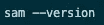
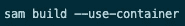
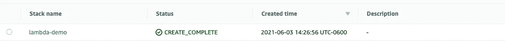
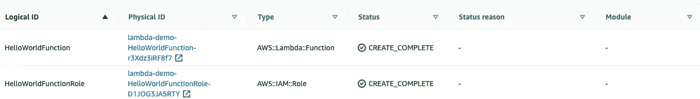
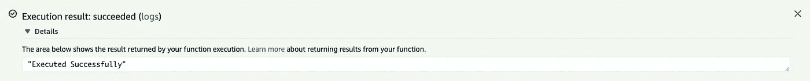

# 使用 AWS SAM 框架构建和部署您的第一个 Lambda 函数

> 原文：<https://medium.com/geekculture/building-and-deploying-your-first-lambda-function-with-the-aws-sam-framework-af02708ad0a9?source=collection_archive---------21----------------------->

Photo by [Alex Kulikov](https://unsplash.com/@burntime?utm_source=medium&utm_medium=referral) on [Unsplash](https://unsplash.com?utm_source=medium&utm_medium=referral)

无服务器是软件工程行业最热门的新词。无服务器是什么意思？当我听到这个术语时，我对云架构非常缺乏经验，很容易认为后台真的没有服务器。事实并非如此。“无服务器”的好处是，作为开发人员，您不必管理服务器。为了在云中运行代码，我们需要一个虚拟机来运行它。对于 AWS，最简单的构建模块是 EC2。这为您提供了基于您的选择，一些容量的 RAM 和存储。在虚拟机上，我们能够运行代码。问题是，运行这个虚拟机有很多事情要做。我们必须决定多少内存，多少存储，安全组，访问控制列表。这些还只是冰山一角。想象一下，如果您获得太多流量，而您的虚拟机无法处理，那么现在我们需要某种方法来水平扩展虚拟机，并进行某种负载平衡。此外，灾难恢复怎么样，如果机器出现故障，我们需要确保它也能重新启动(这可以通过自动伸缩来处理)。作为云计算中的一个概念，无服务器解决了这个问题，它基本上是对客户说，把您的代码给我们，我们会在供应、运行和扩展方面完成剩下的工作。当然，您需要输入，例如要提供多少 RAM 等，以及许多其他参数，具体取决于您正在使用的服务，但您不需要管理所有细节，因为 AWS 会为您处理这些。

# 自动气象站λ

这就把我们带到了 AWS Lambda，它作为一种服务，就像把代码分解成单独的功能。这些功能在执行时运行在云中。您只需在代码实际运行时付费。与虚拟机相比，无论代码是否运行，虚拟机都一直在运行(并耗费资金),这是一笔巨大的资金节省。如果你一周只调用你的函数 100 次，当你的代码运行时，你是在付费。此外，Lambda 提供了一个慷慨的免费层，每月多达 100 万次调用和 400，000 GB 秒的计算时间。之后，您需要为每百万次请求支付 0.20 美元，为每 GB 秒的计算时间支付 0.0000166667 美元。这非常便宜，也是一些人喜欢 lambda 的原因之一。只是为了涵盖 Lambda 的一些高级限制。每个区域有一个 1000 的内置并发限制。这是一个软限制，您可以联系 AWS 提高此限制。此外，Lambda 函数最多只能运行 15 分钟。如果您需要更多的时间，并且仍然想考虑无服务器解决方案，我会考虑运行 Fargate 任务。在语言支持方面，目前 Lambda 支持 Java、Go、PowerShell、Node.js、C#、Python 和 Ruby 代码，如果你想使用不同的语言，你可以通过定制的方式创建自己的运行时。

# SAM 框架入门

AWS SAM 是 AWS 提供的一个无服务器框架，使其更容易使用无服务器资源。它使用了一种相似但不完全相同的云形成形式。您可以使用 AWS SAM 创建许多无服务器服务，例如 DynamoDb 表、Lambda 函数、无服务器应用程序和 API 网关端点。对于本文，我们将重点关注安装 AWS SAM 框架，并创建我们可以在云中调用的第一个 Lambda 函数。如果您从未安装过 SAM 框架，请查看此处的链接[并为您的计算机选择正确的操作系统。不考虑你的操作系统，步骤如下:
1 .您必须创建一个 AWS 帐户。如果没有，您将需要这样做。](https://docs.aws.amazon.com/serverless-application-model/latest/developerguide/serverless-sam-cli-install.html)

2.您必须能够拥有在 AWS 上执行操作的权限。最简单的方法是在控制台中生成凭证，并跟随这个[链接](https://docs.aws.amazon.com/cli/latest/userguide/cli-configure-files.html)。它将向您展示如何在计算机上的正确位置将凭据设置到正确的凭据文件中。

3.按照操作系统的说明实际下载 SAM 应用程序

4.你需要在你的系统上安装 Docker。

完成这些步骤后，您就可以使用 SAM 了。为什么我们需要所有这些？请记住，当我们在后台通过 SAM 进行 API 调用时。当我们部署时，我们正在创建一个 Cloudformation 堆栈，它创建了我们在模板中指定的资源。为此，我们需要得到许可。为了确保正常工作，请确保运行以下命令不会返回错误。

Command To Ensure AWS SAM Is Installed On Your Machine, Screenshot By Author.

# 使用模板开始

让我们从使用模板开始。这是绝对最简单的方法，在不真正知道发生了什么的情况下创建一个函数。此外，这也是一个很好的方法，可以让你有一个开始的地方，用开始的代码替换掉你的代码。我们将从运行`sam init`开始。这从终端中的一组对话开始，在那里我们可以做出选择。首先，系统会提示我们是要使用`AWS Quickstart Templates`还是`Custom Template`。我们在这里看到，如果对提高开发效率有意义，您可以创建自己的模板。对于本演示，我们将选择选项 1。然后我们得到一长串可供选择的语言。Lambda 支持许多语言，正如我前面提到的，在 Lambda 中也有运行定制运行时的方法。对于本演示，我们将选择节点，即选项 1。然后系统会提示我们输入应用程序名称，我会选择`sam-demo`。这将克隆一些模板，我们将选择选项 1，这是`Hello World Template`。这将生成一个文件夹，其名称与您为应用程序命名的名称相同。让我们看看这个文件夹，并从您最喜欢的代码编辑器中的 template.yml 文件开始。

# 了解基本 SAM 模板

这个模板中有很多内容，尤其是如果您是 SAM 框架的新手。首先要叫出来的是`AWSTemplateFormatVersion`和`Transform`属性。这些是该模板文件所必需的，并将出现在所有 SAM 模板文件中。下一个最重要的是`Resources`部分。这也是一个必需的属性，理所当然。如果没有资源，那么 SAM 实际上能做什么。对我们来说，资源就是我们的 Lambda 函数。对于这个初学者模板，他们也正在创建一个 API 网关端点，我们将跳过这一步。事实上，你可以看到我已经删除了模板文件中的大部分项目，因为我只想专注于 Lambda。

在你开始学习的时候，有哪些重要的东西需要学习？`CodeUri`指向包含具有我们功能的文件的文件夹。在这种情况下，模板引擎为我们生成了一个`hello-world`文件夹。`Handler`指向我们想要调用的实际函数名，首先引用文件名。你可以在这个模板中看到，结合`CodeUri`和`Handler`，我们告诉 SAM 在`hello-world`文件夹中查找并找到一个名为 app 的文件，(需要是一个. js 文件，因为我们在 Node 中工作，这对于其他语言会有所不同)，在该文件中，它期望从这个名为`lambdaHandler`的文件中导出一个函数。这三样东西都是可以改变的，只要你的模板做相应的调整。

# 调整处理器功能

现在让我们看一下 app.js 文件。对于本教程，我们真的想获得运行在云中的最基本的 Lambda 函数，并知道如何使用 SAM 重复部署它。因此，我们也将清除该文件中的几乎所有内容。它被设置为充当 API 网关端点的 Lambda 代理，该端点最初是在 template.yml 文件中设置的。现在，我们不需要关心这个，让我们简化文件如下。

基本的，但会完成工作。现在，我们必须将我们的功能部署到云中。我们首先通过运行以下命令，让 SAM 框架为我们构建包。

Command To Build Application Bundle, Screenshot By Author.

这将把我们的功能构建成一个可部署的包。然后，我们可以通过执行以下命令来部署这个包。

Command To Deploy Application Bundle For First Time, Screenshot By Author.

该命令的引导部分有助于引导我们完成部署参数。我通常只在第一次部署时这样做，SAM 会问你是否要将这个配置保存到一个. toml 文件中。如果选择此选项，下次部署时，您只需运行`sam deploy`，SAM 将使用此文件中的参数进行部署。这使得部署更快。当我们用`guided`运行这个命令时，会得到一些提示来帮助我们。首先，你必须给你的栈命名，对于我的栈，我称它为`lambda-demo`。然后你必须选择你的地区，无论哪个地区对你有意义，我都会选择使用 us-east-1。然后我们需要决定，我们是否要在部署之前确认更改。当我们进行后续部署时，这意味着我们将会看到一个变更集，并在部署之前批准它。对于本演示，这不是必需的。我们还必须允许 CLI 为我们创建一个角色。如果我们手动创建一个角色并使用 template.yml 文件附加它，则不需要这样做。对于演示，我们将允许 CLI 为我们创建它，一般来说，这是一个不错的选择。最后，我们需要检查是否应该将这些设置保存在一个. toml 文件中。我建议选择这种方法，因为它可以缩短以后的部署时间。一旦所有这些完成，你的模板被上传，你的栈被创建。

# 运行您的 Lambda 函数

我们现在可以导航到我们的 AWS 帐户，首先，让我们从访问 Cloudformation 部分开始，我们可以看到 SAM 创建的堆栈。

Cloudformation Showing Our Stack Has Been Created, Screenshot By Author.

如果我们单击堆栈名称，就会看到关于堆栈的各种有用信息。我们关心的是`Resources`标签。如果我们单击它，它会打开一个 UI，显示该堆栈创建的所有资源。对我们来说，它既是 Lambda 函数，也是 IAM 角色。

让我们点击`HelloWorldFunction`的物理 Id。这将在 Lambda 函数的新窗口中打开 Lambda，该函数是由我们的 SAM 模板创建的。您应该从`Code`选项卡开始。让我们转而点击`Test`选项卡。我们需要创建我们的第一个测试事件。Hello-world 模板是默认填充的，我们可以继续使用它，给我们的测试用例命名为`myfirstevent`。如果我们继续并点击橙色的`Test` 按钮，我们的函数将在测试事件中被称为 passing。请注意，当它成功时，我们会得到一个漂亮的执行成功绿色框，我们可以打开它，看到我们调用的结果。

Showing Our Text Successfully Returned, Screenshot By Author.

# 下一步是什么？

其实什么都行！现在，您可以返回并更新处理程序函数来做您想做的任何事情。因为我们正在使用 Node，所以我们也能够使用 npm 安装包并在我们的代码中使用它们。Lambda 函数是 AWS 服务的粘合剂，许多服务都与它们进行了本机集成。通过 Cloudwatch，我们可以在 cron 调度上使用 Lambda 函数。例如，想象一下，你想每小时检查一次 S3 桶中上传的新图像，并将它们批量转换为缩略图，Lambda 可以做到这一点。想象一下，你想在图片上传后马上这么做，S3 与 Lambda 的直接集成可以做到这一点。有无限可能。假设您需要能够从 web 调用您的 lambda，那么我们可以直接集成 Lambda 作为 API 网关端点的处理程序。

# 结论

本文是对 SAM 框架和 Lambda 的非常基本的介绍。说实话，对于你可以用这两个服务做的所有事情，我们仅仅触及了皮毛。现在你已经有了一个很好的入门，而摆弄代码和尝试新事物将是你学习的方式。尝试安装软件包并编写一个函数，它不仅仅返回文本。现在你对 lambda 有了更深的理解，也许可以回去再做一遍教程，但是这次留下 API 网关代码并部署它，理解如何使用 Lambda 来支持 API。仅仅用 Lambda 做实验就是一种奇妙的学习方式。如果你不再需要它，最后要做的事情是清理我们的代码。删除这个 Lambda 函数的正确方法是删除栈本身。导航回云形成，并点击你的堆栈。在右上角的一组按钮中，有一个删除按钮，它将删除您的整个堆栈。这是我喜欢使用 SAM 框架的另一个原因，当定义您的无服务器资源集时，因为它是一个隐藏的 Cloudformation 堆栈，所有资源都可以通过单击删除。