# 无需任何编码快速构建计算机视觉应用

> 原文：<https://medium.com/geekculture/building-computer-vision-application-fast-without-any-coding-b09c3eb75912?source=collection_archive---------22----------------------->

## 简单、快速且易于部署！

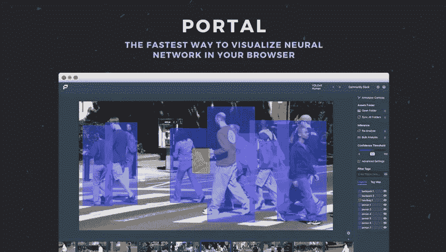

Image from [Datature](https://datature.io)

计算机视觉是人工智能中的一个领域，它帮助计算机理解数字图像和视频。计算机处理能力的提高扩大了计算机视觉应用的范围。计算机视觉现在被用于，

*   自动驾驶
*   安全和监控
*   对病人的诊断
*   疾病进化研究
*   检查和预测性维护

计算机视觉应用已经开始对许多行业产生影响。事实上，它已经开始通过智能电视、面部识别和家庭自动化进入我们的家庭。计算机视觉将在人类的未来发挥关键作用。

计算机视觉应用的实现还没有普及到每个人。它需要技术知识和强大的计算能力。在本文中，我将向您展示使用 [Datature](https://datature.io) 的计算机视觉应用的端到端实现和部署。最重要的是没有一行代码或任何高端计算资源。

# 为什么是 Datature？

Datature 是一个人工智能视觉平台，允许用户快速注释、训练和部署计算机视觉模型。使它成为更好选择的一些功能是，

*   完全基于网络，允许团队一起构建数据集
*   创建工作流的简单拖放功能
*   [最快的人工智能辅助标签](https://www.youtube.com/watch?v=hnY7FqOiHHg)
*   监控和跟踪模型性能的功能
*   在 GCP 上运行并提供数据加密
*   提供对 30 多种模型架构的访问(FasterRCNN、EfficientDet、MaskRCNN)
*   支持实时应用

我以前写过实现计算机视觉应用的脚本。尽管我们可以访问许多开源平台、框架和库。该实现需要更多的技术知识，并且确实需要大量的计算能力。在不使用 GPU 的情况下，训练一个简单的计算机视觉模型可能需要几天时间。计算机视觉模型的实现很少涉及到一些事情，

*   计算机视觉库的安装
*   安装 Cuda 工具包以加快计算速度
*   图像处理和变换
*   开源模型的再培训

这使得非技术人员无法实现计算机视觉应用。

# 为什么不是其他工具？

市场上许多替代的计算机视觉工具在大型数据集上表现不佳。它们在较小的数据集上工作得很好，但在现实生活的用例中存在挑战。许多其他工具并不是无代码的，它们确实需要手动干预和某种程度的代码来实现。此外，很少有工具能够很好地完成特定的任务，但却不能支持端到端的实现。

# 使用数据

我将带您了解一个使用 Datature 的计算机视觉应用的端到端实现。在这个演示中，我将使用一个图像检测应用程序。我用过下面的 [kaggle 数据集](https://www.kaggle.com/aceofspades914/cgi-planes-in-satellite-imagery-w-bboxes)。这里的问题是识别图中的飞机。下面是数据集中的一些卫星图像。

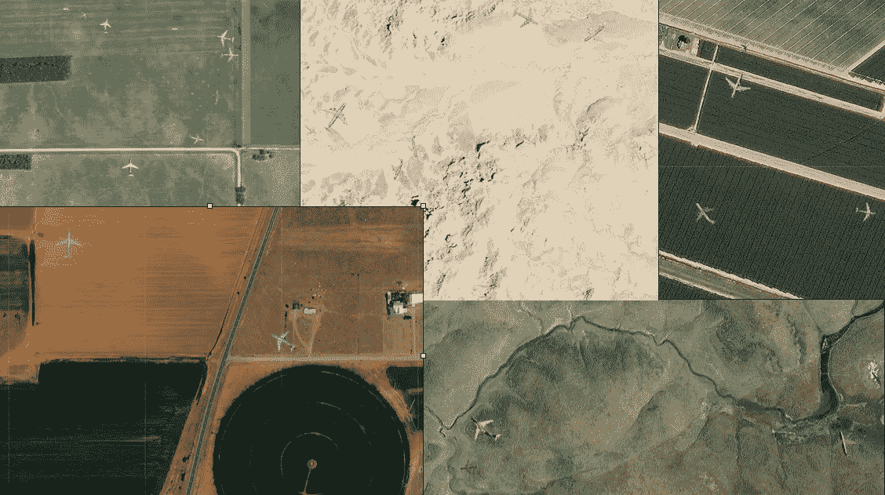

Prepared by Author [Kaggle dataset](https://www.kaggle.com/aceofspades914/cgi-planes-in-satellite-imagery-w-bboxes)

这里涉及的步骤是，

*   登录并在线创建项目
*   上传图像和注释
*   创建工作流的简单拖放功能
*   训练神经网络(NN)模型并监控性能
*   生成并下载模型
*   使用基于网络的工具或一行命令进行预测

首先，如果你还没有登录，使用下面的[链接](https://datature.io/)注册一个免费账户。免费计划为您提供，

*   使用多达 1000 张图像
*   导出多达 5 个神经网络模型
*   每月 500 分钟的 GPU 培训

这足以测试许多用例。

## 登录并在线创建项目

一旦你成功创建了一个帐户。登录平台并创建一个项目。确定您正在处理的问题类型和内容类型。在本例中，我正在处理一个平面检测用例，我要传递的输入是图像。因此，我创建了一个项目，细节如下图所示。

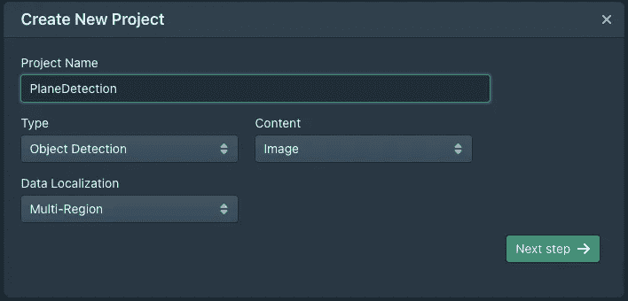

Image by Author

## 上传图像和注释

创建项目后，上传训练图像和图像注释。注释可以作为 CSV 文件传递。这将有助于训练模型。

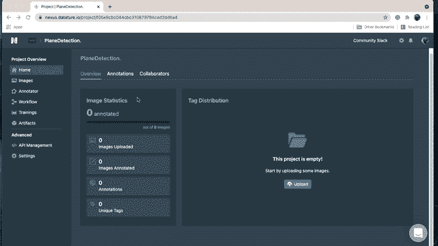

Image by Author

如果有任何缺少注释的图像，该工具会高亮显示这些图像。我使用注释器检查注释是否已经正确上传。这也是团队和开发人员可以使用 Datature 的内置注释套件协作注释他们的数据集的地方，该套件有边界框、多边形工具、画笔，甚至还有一个名为 IntelliBrush 的人工智能标记工具。

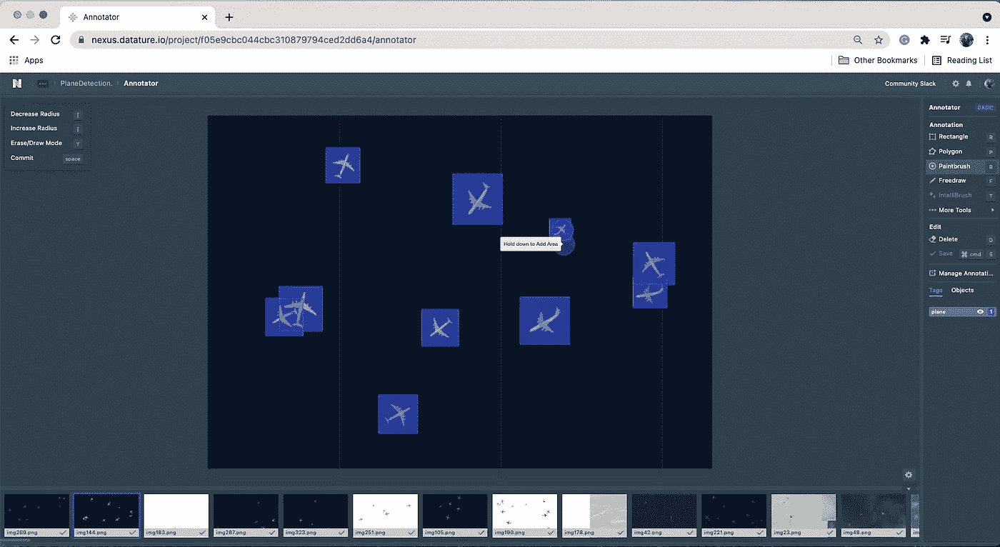

Image by Author

## 创建工作流的简单拖放功能

一旦上传了带有注释细节的图像。现在是创建工作流的时候了。

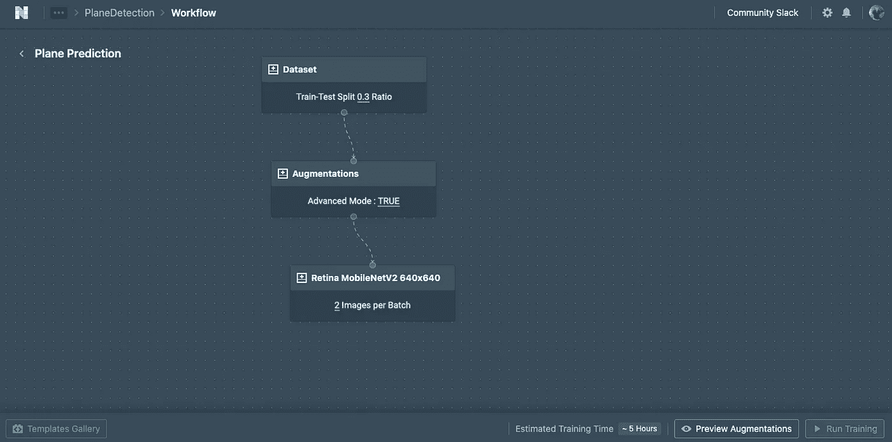

Image by Author

我创建了以下三个步骤，只需几次右键单击和选择。

*   资料组
*   增加
*   模型

数据集节点捕获关于需要如何在训练和测试之间分割数据的细节。增强节点包括用于创建重复图像的细节，这有助于增加训练数据集中的图像数量。有一个免费提供的 30+扩充库。当输入数据很小并且种类繁多时，这非常有用。下面是通过选择**预览增强**增强功能生成的一些图像的增强预览截图。

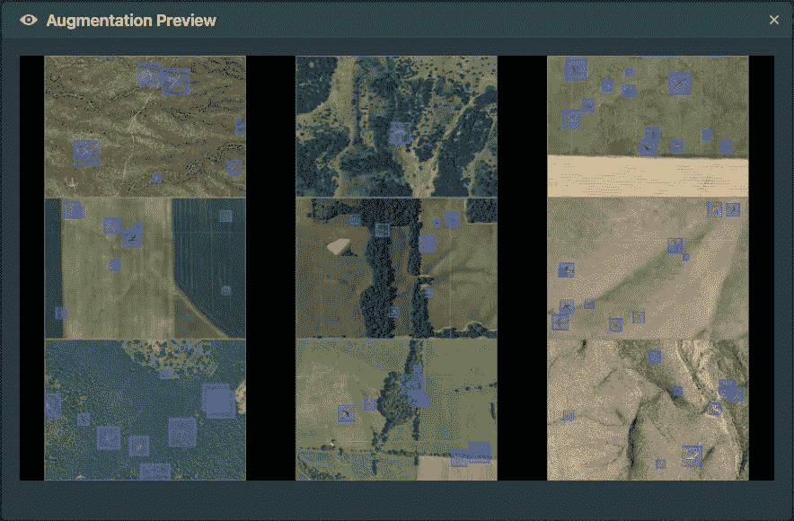

Image by Author

最后一步是选择型号，有许多组合可供选择。

## 训练神经网络(NN)模型并监控性能

有一些很好的模型选择选项。我选择了每批 2 个图像的 MobileNet。

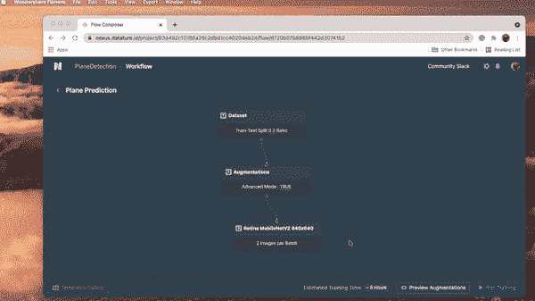

Image by Author

如上所示，模型的性能可以在它们被执行时被监控。根据数据集的大小，通常需要几分钟到几小时。有选择硬件及其处理能力的选项。在这个例子中，由于数据集只包括 400 个训练图像，我选择了 1 个 NVIDIA K80 作为 GPU，并将训练配置为运行 2000 个时期。

还有一个选项来选择您的检查点策略，这有助于系统在您的培训结束时决定要导出哪个检查点。为此，我选择了**最低验证损失**选项。

只花了 10 多分钟，模型就可以使用了。下面是培训模型时监控的指标的屏幕截图。

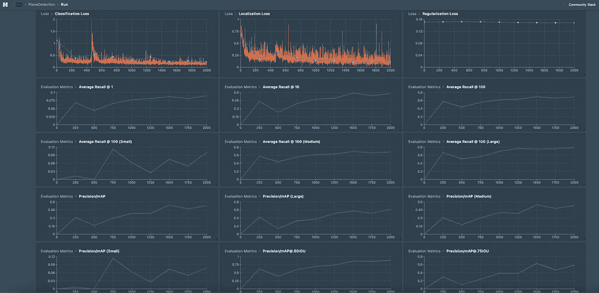

Image by Author

## 生成并下载模型

在完成模型训练之后，经过训练的模型将会出现在工件中。一旦模型生成，就可以下载并进行预测。或者，在使用数据中心或门户加载模型时，也可以使用模型键进行预测。

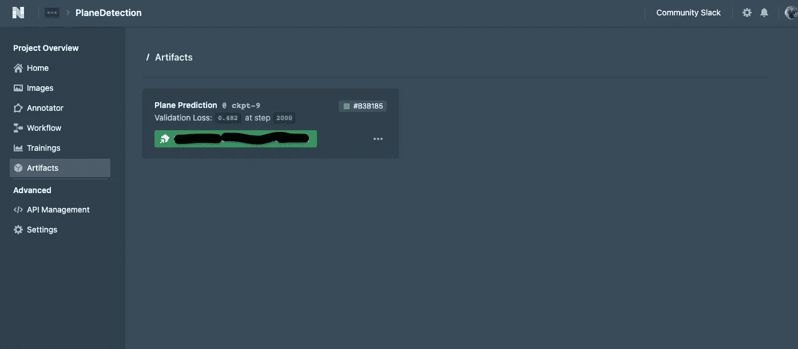

Image by Author

## 使用基于网络的工具或一行命令进行预测

可以使用一个简单的叫做[门户](https://github.com/datature/portal)的基于网络的工具进行预测，也可以使用他们的开源脚本。这种模式可以部署在手机、物联网设备等设备中。下面的屏幕截图显示了来自门户工具的模型推理。

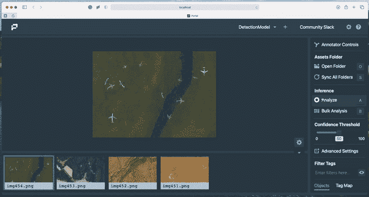

Image by Author

使用入口的细节可以在这里找到[。这里的预测](https://github.com/datature/portal)[脚本](https://github.com/datature/resources/tree/main/scripts/bounding_box)只需一行代码就可以用来调用模型和进行预测。

# 想开始吗？

如果你正在考虑进入计算机视觉领域，或者已经与一个工程师团队合作，并且想要简化你的工作，[现在就注册一个免费帐户](https://nexus.datature.io/),进行一次有指导的演练来启动你的第一个模型！ [Datature](https://datature.io/) 非常用户友好，如果你不完全确定深度学习模型，也不用担心，因为有大量的[文档](https://docs.datature.io/)来指导你的每一步。如果你面临任何困难，他们甚至有一个[社区松弛](https://datature.io/community)！

# 保持联系

*   如果你喜欢这篇文章，并对类似的文章感兴趣，[在 Medium 上关注我](https://rsharankumar.medium.com)
*   我在我的 YouTube 频道上教授和谈论各种数据科学主题。[在这里订阅我的频道](https://www.youtube.com/c/DataSciencewithSharan)。
*   点击这里[注册我的电子邮件列表](https://chipper-leader-6081.ck.page/50934fd077)获取更多数据科学技巧，并与我的工作保持联系