# 从头构建 Cucumber API 测试框架:第 6 部分

> 原文：<https://medium.com/geekculture/building-cucumber-api-testing-framework-from-scratch-part-6-18a95673a630?source=collection_archive---------11----------------------->

在这一部分，我们将使用 ***枚举类*** 来使代码更加优化。

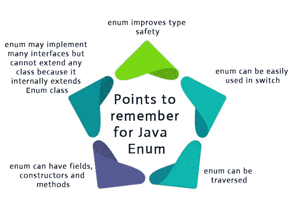

Java Enum

例如，我们在我们的步骤定义文件中传递 API 端点细节，这是不好的，您应该从任何其他集中式文件中驱动它，以便使用此 add JSON 的任何测试用例都应该从该文件中获取它，所以明天，如果资源中有什么变化，我们可以简单地在一个地方进行更改，所有测试用例都将自动更新。

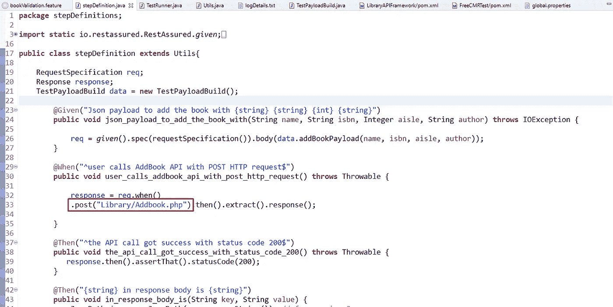

Step Definition File

# java 中的 enum 类是什么？

Java 枚举是一种特殊的 Java 类型，用于定义常量集合。更准确地说，Java 枚举类型是一种特殊的 Java 类。枚举可以包含常量、方法等。

# 为什么我们需要一个枚举类？

假设一个电子商务应用程序有 100 个 API，我们需要从一个文件中驱动，现在要调用每个 API，我们必须创建相同数量的方法来返回 API 字符串，这样做我们必须编写大量的代码，这是绝对不推荐的。

这就是 enum 的用武之地。在 enum 类中，您只需要定义一个驱动所有 API 字符串的方法。

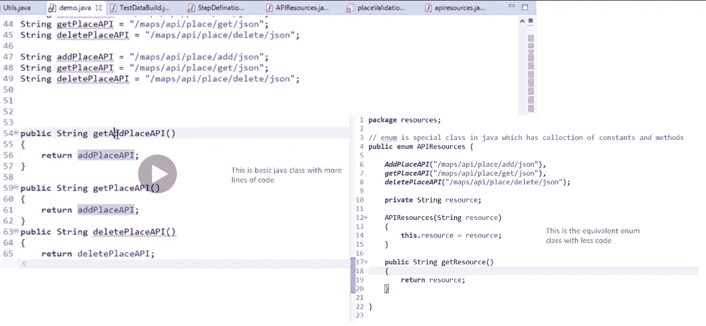

Comparison of Java and Enum Class

# 如何创建枚举类？

转到资源包，右键单击并创建一个名为 API Resources 的新类。

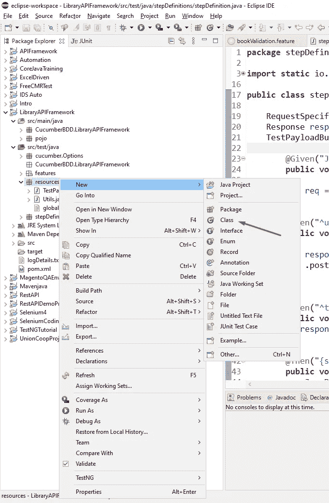

Resources Package

现在，在新的 Java 类窗口中提供名称，并单击 Finish 按钮。

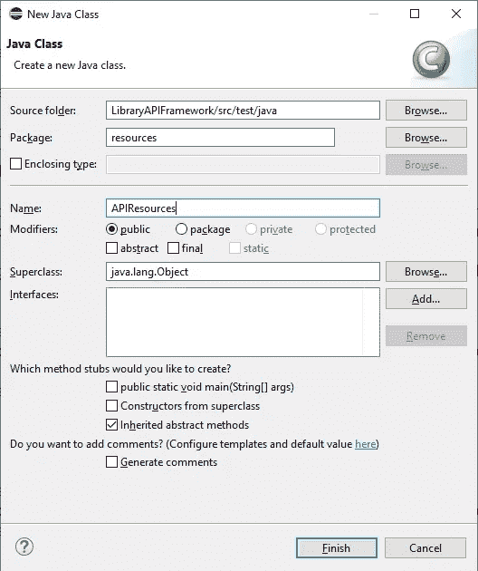

Java Class Window

一旦创建了类，就需要用 enum 替换关键字 class。

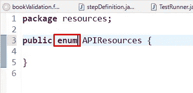

Enum Class

现在，让我们声明我们在步骤定义文件中使用的 Add Book API。

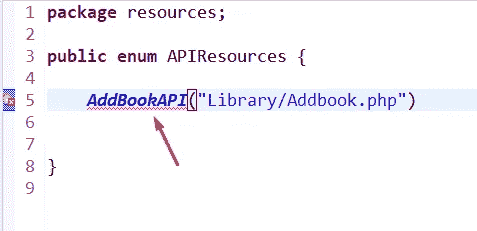

Enum Class

Enum 类将把它当作一个方法，它将返回我们为 API 提供的字符串

同样，您可以声明多个常数，并用逗号分隔这些常数。在我们的例子中，我们可以添加 Get Book 和 Delete Book API。

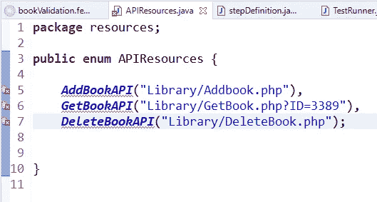

Enum Class

现在，将鼠标悬停在该方法上，它会要求您为该方法创建一个构造函数。

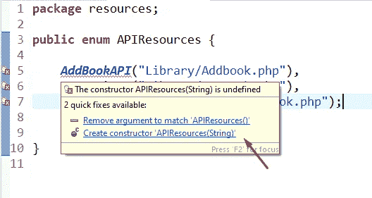

Enum Class

单击 create constructor ' API resource(String)'它将为您创建带有字符串参数的构造函数，以匹配这些方法。

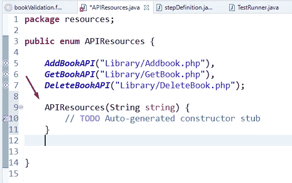

Enum Class

现在我们需要用 ***when*** 步骤在特征文件中做一些更改，这样它可以通过简单地更改双引号下的名称来驱动 API 字符串。

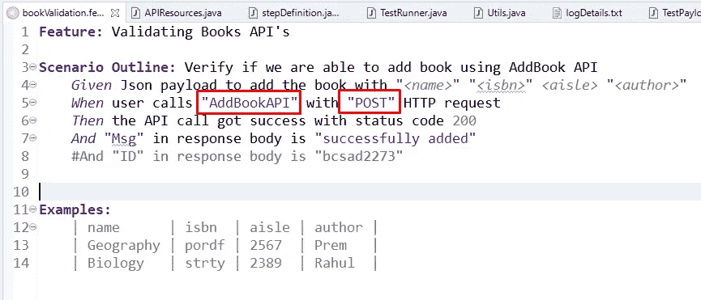

Feature File

现在，我们需要在步骤定义文件中调用 Add Book API 方法，但要这样做，我们首先需要在 Enum 类中创建一个方法，该方法将返回带有名为 resource 的变量的 API 字符串，我们需要将全局变量分配给局部变量 *resource* 。

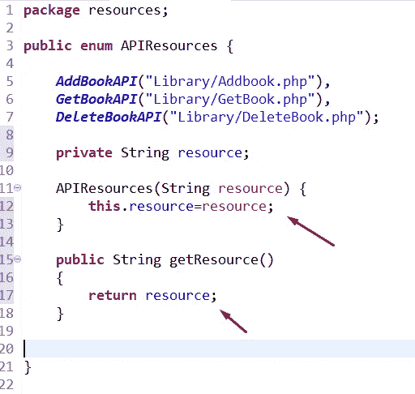

Enum Class

现在，我们需要通过创建 Enum 类的对象来调用步骤定义文件中的 API 字符串。

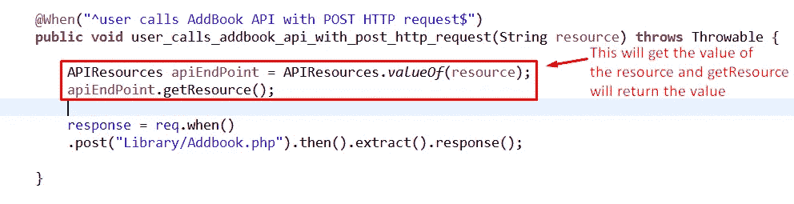

Step Definition Class

现在，我们可以用我们在 post-call 中提供的端点/资源来替换它，我们还将在控制台输出中打印它，以验证哪个方法是从 Enum 类调用的。

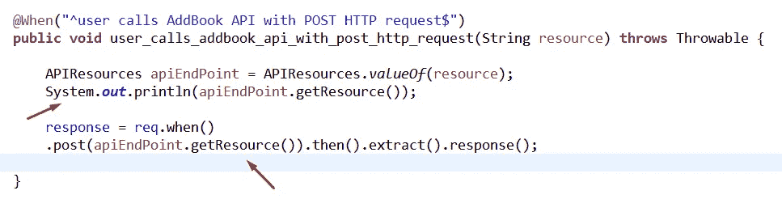

Step Definition Class

让我们用 Test Runner 类运行测试用例，看看它是否运行良好。

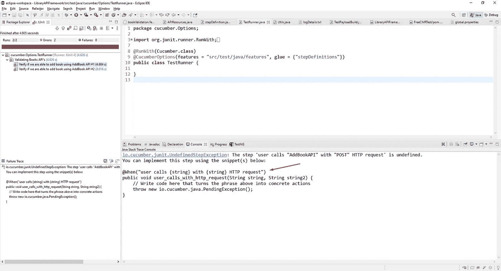

Console Output

从控制台输出中，您可以看到它要求我们修改步骤定义文件中的代码。因此，让我们用控制台中显示的代码替换我们的代码。

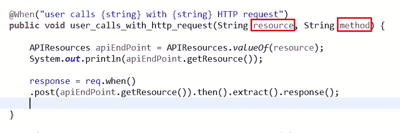

Step Definition Class

你也可以根据你的理解改变变量名，正如你看到的，我给了*资源*和*方法*，但是你可以给任何东西。

现在，我们将使步骤定义类代码也适用于 HTTP 方法。

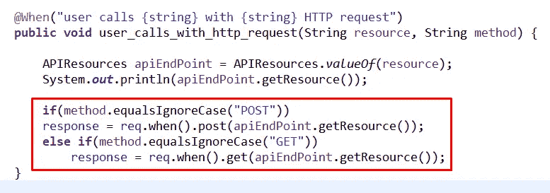

Step Definition Class

如果您注意到您已经使步骤定义类如此通用，以至于它可以接受任何 HTTP 方法和资源，这将使这个类比以前更强大。

为了验证我们开发的代码是否运行良好，让我们从特性文件中调用 Delete Place API 并检查日志文件。

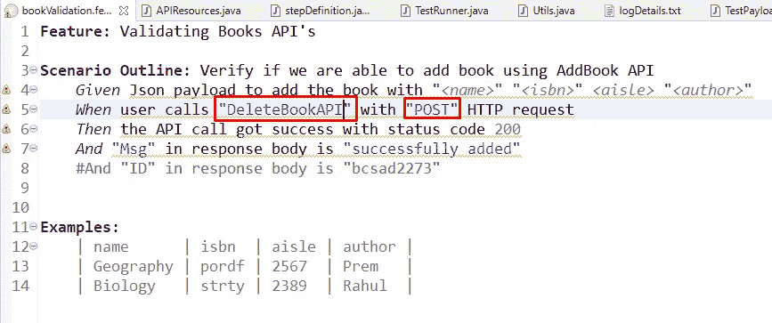

Feature File

让我们在控制台中检查一下，因为我们也在打印 API 资源方法，当然我们的测试会失败，因为我们没有提供 Delete 方法的步骤。

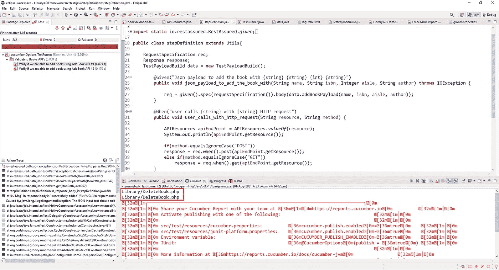

Console Window

此外，我们还可以查看日志文件，了解后端到底发生了什么。

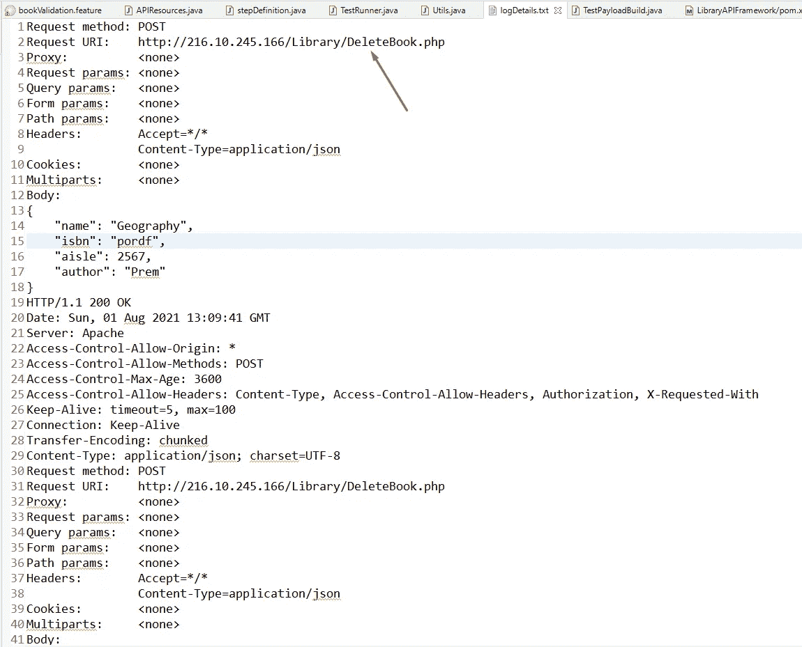

Log File

因此，我们能够通过特性文件调用删除图书 API，这意味着我们的代码正在工作，现在让我们将它改回添加图书 API 以调用添加图书 URL。

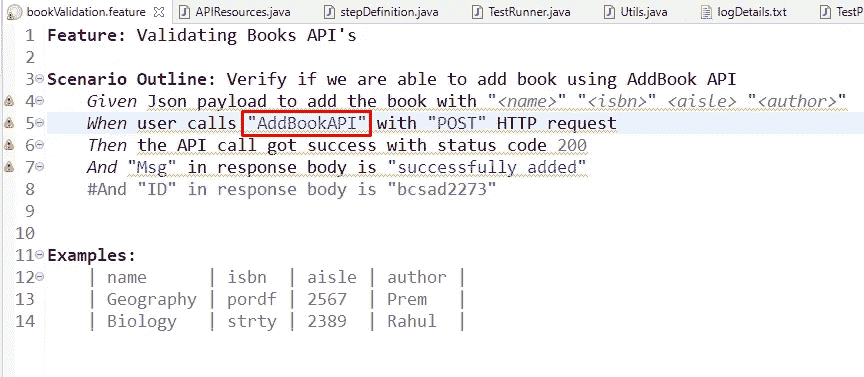

Feature File

现在，让我们再运行一次测试，以确保一切正常。出于我上面提到的原因，请确保您更改了 ISBN 和过道信息。

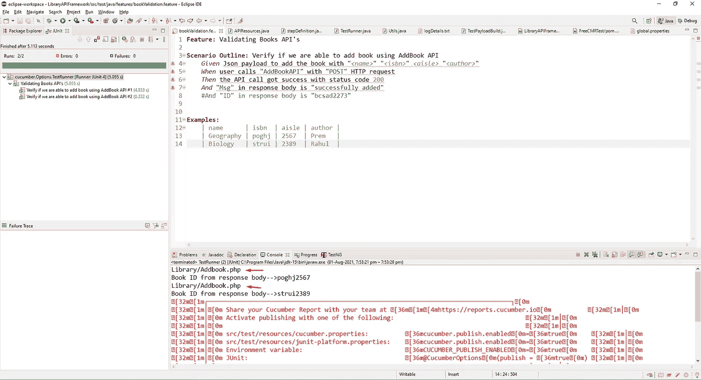

Console Window

此外，让我们检查日志文件，看是否调用了添加请求。

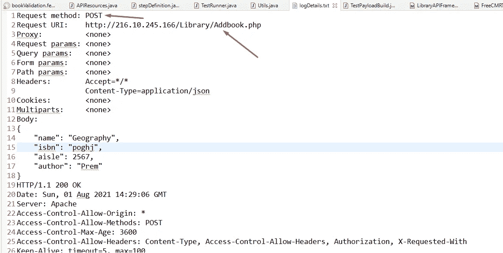

Log Details File

好了，这就是关于枚举类以及如何通过它优化代码的全部内容。

谢谢你坚持到现在。

[*这里的*](https://github.com/Premsing/LibraryAPIFramework) *是到 GitHub 资源库下载代码的链接。*

如果你不确定我们在这里做什么，那么去看看我对 [Cucumber](/@prathore28647/building-cucumber-bdd-api-testing-framework-from-scratch-part-1-add657f9c290) 、 [Maven](/@prathore28647/what-is-maven-f3422233939) 的看法，然后从头开始[构建 API 测试框架](/@prathore28647/building-cucumber-bdd-api-testing-framework-from-scratch-part-1-add657f9c290)。

再见🍻