# 纽约市出租车建筑数据分析

> 原文：<https://medium.com/geekculture/building-data-analysis-for-taxis-in-nyc-e91aca18a60d?source=collection_archive---------32----------------------->

解读数据集以了解我们的产品——飞行汽车出租车服务

How might we build the first flying car taxi service for NYC?

## 案例研究:Flyber——飞行出租车服务

> 作为数据产品经理，你需要在美国最拥堵的城市之一纽约市推出第一款飞行汽车出租车服务 Flyber。课程中给出了一些数据集，以便从明确的反馈中提取真知灼见。

# 📊分析数据

由于 Flyber 是一项新技术，我们来看看现有的出租车数据，进行可比较的初步分析。我们将确定我们的客户和他们的痛点。

# 🚕竞争对手分析—出租车和数字拼车

## 动机:**出租车是用来做什么的？**

*   用户想从 A 点**到 B 点**旅行，当他们没有车的时候**节省交通时间**。
*   用户不需要为驾驶自己的汽车而操心**的麻烦事**，例如寻找停车位、寻找位置、长途驾驶等等。

## 出租车现有的痛点有哪些？

*   **未知价格**因为司机可能会在高峰时间或特殊地点收取额外费用。
*   **不方便的支付方式**以及支付信用卡附加费的麻烦
*   **高峰时段很难叫到出租车**,因为该地区的出租车数量有限
*   **缓慢的客户服务**和司机细节，如果用户不得不抱怨糟糕的服务或丢失物品。

数字拼车服务怎么样？

*   **更长的等待时间**当司机在接送乘客时改道去更多的地点，导致花费更多的时间。
*   安全问题 **和缺乏隐私**因为任何人都可以坐在同一辆车里共享同一次乘坐。如果发生事故，用户可能得不到保险。

# 🚕数据探索

在我们看数据集之前，我们应该提出问题，以避免进入兔子洞。我们将从我们的[出租车数据集](https://video.udacity-data.com/topher/2020/May/5ec44092_taxi-rides/taxi-rides.zip)中为我们的 Flyber 服务建立一个基线。

**我们感兴趣的问题:**

1.  我们应该在哪里设置我们的 Flyber？高峰接送地点在哪里？
2.  **时间:**Flyber 应该 24/7 运行还是受限？我们应该瞄准长途旅行还是短途旅行？
3.  价格:我们应该给我们的服务定价多少？我们是按行程收费还是按用户收费？
4.  **用户:**哪个用户群会是我们的第一批潜在目标用户(如性别、年龄、收入水平)？

## 🔑数据集中的关键要点

**通用**

*   数据集中有 **1，048，468 条记录**，每条记录代表一位顾客的一次旅行。该记录包含**总距离、上下车地点、持续时间和供应商标识**。

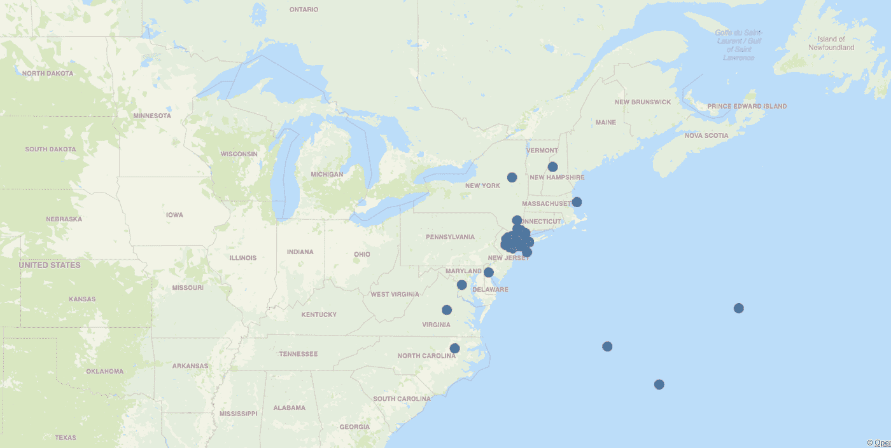

*   数据日期范围从**2016 年 1 月 1 日到 2016 年 6 月 30 日**。
*   提供的地理数据不仅限于纽约及其所在地区。我们可以在西海岸看一次单人旅行。`This can be an outlier in the dataset and represent an opportunity to expand further business to the West Coast. Most of the records are in **New York and New Jersey.**`

**数据分布(清理前)** 我们需要知道常见的用户使用情况是什么，以便为正常情况设定一个基准。当每个变量从 95%大幅跃升至 100%时，这表明存在潜在的异常值。

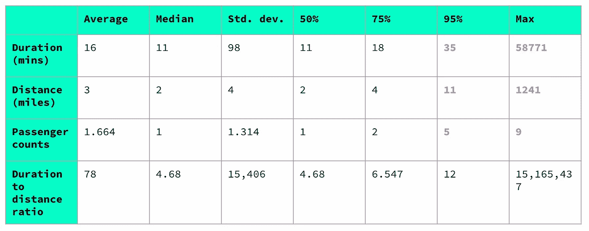

*   **⏱旅行持续时间:人们在乘车上花费了大约 11 分钟，但标准偏差为 98 分钟。95%的人在 T21 最多花了 35 分钟，但最高的旅行时间是 58771 分钟。
    🧹 `We should be clean up the data to accept trips from 1 min to 60 mins. A trip less than 1 min is not really considered as a taxi ride.`**
*   📐**行程距离**:大多数人行程 **2 英里**，标准差 4 英里。68%的用户有 1 到 6 英里的距离，95%的用户最多行驶 11 英里。最大值。1241 英里被视为异常数据。
    🧹 `We should be cleaned up data to accept distance from 0.6 miles(1km) to 15 miles.`
*   👥**乘客数量**:我们有 **2 名乘客**，标准偏差为每趟 4 名乘客。这告诉我们，68%的行程大约有**1-3 名乘客**。95%的行程最多有 5 名乘客，但我们有多达 9 名乘客是异常值。
    🧹 `We should be cleaned up data to accept passenger count from 1 to 5 passengers.`

**数据分发(第一轮数据清理)**

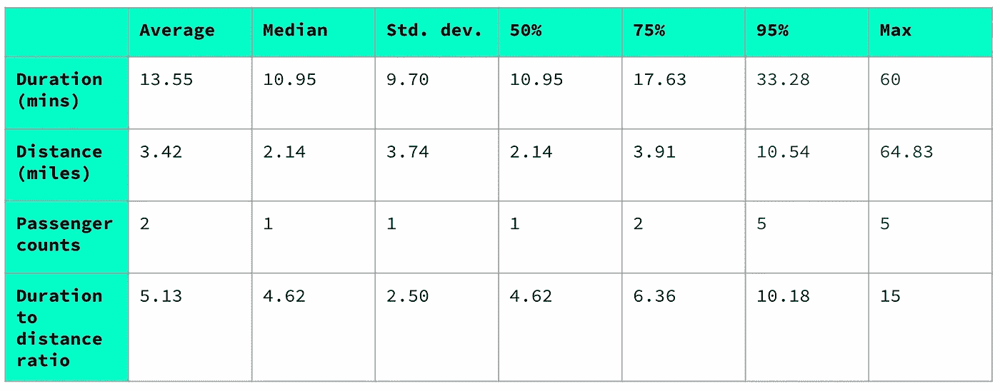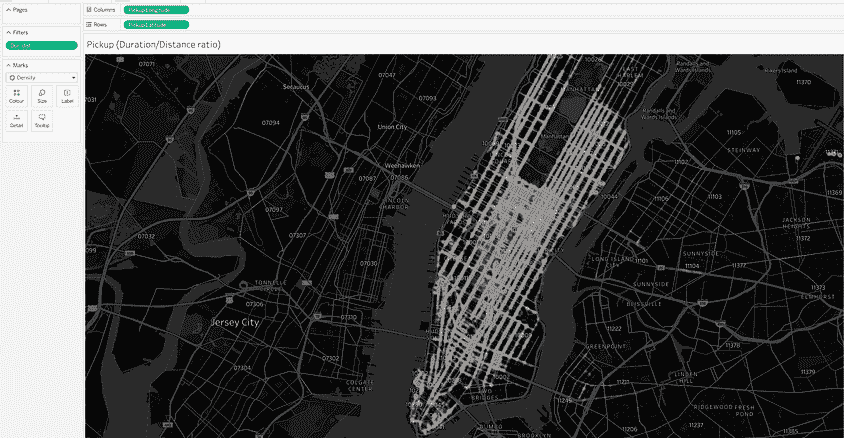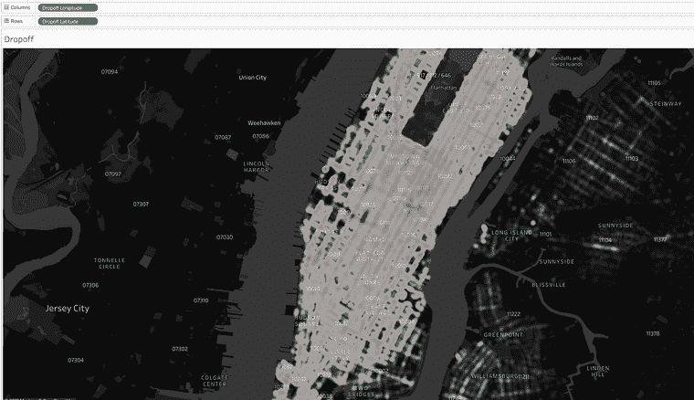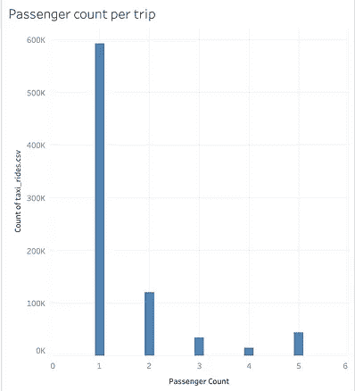

Most of the pickup and drop-off services are concentrated in Manhattan with small size passenger groups.

总而言之:

*   **⏱出行时长:**用户每次出行花费约 **1 分钟— 20.65 分钟**。
*   📐**出行距离**:我们的大多数用户往返市区的距离为 **1 英里— 5.28 英里**。
*   👥**乘客数量** : **每趟 1-2 名乘客**。大部分的出租车旅行只载了一小群乘客。我们认为 Flyber 更有可能瞄准**小型乘客群体**。

**💵价格怎么样？** 我决定从 [NYC](https://www1.nyc.gov/site/tlc/passengers/taxi-fare.page) taxi fare 网站设置一个简单的价格公式来给我们一个粗略的估计，包括初始费用和每 1/5 英里的费用。

`Price = $2.50 + ($0.50 * [Duration_min]) + (([Distance]/0.2) * 0.50)`

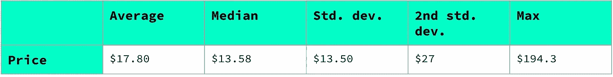

大多数用户支付了大约 **$14** ，标准差为 **$13.50。**这意味着 68%的用户支付起价从 2.5 美元到 28 美元不等。实际上，我们可能需要根据位置和行程时间来评估每次行程，因为价格可能会受到高峰时间需求激增、特殊取车位置附加费等的进一步影响。

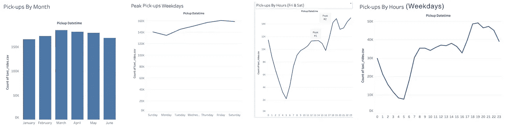

**⌚️When 是受欢迎的接送时段吗？** `March`**提货高峰月:1 月至 6 月无明显趋势
****提货高峰日:**我们看到`weekends (Fri & Sat)`稳步上升的趋势。 **高峰接送次数:** `7-8AM, 1–2PM, 6–7PM on weekdays` 反之`12–2PM, 6–11PM on weekends`。这可能是由于午餐时间和上下班时间。****

## ****🗣 🗒用户研究调查****

> ****你和用户研究团队对纽约市现有的出租车和/或拼车用户进行了定量调查，以确定潜在使用飞行出租车服务的情绪。****

****我们将调查和交叉检查我们的出租车数据集关键外卖。****

******💯使用 Flyber 的积极情绪******

****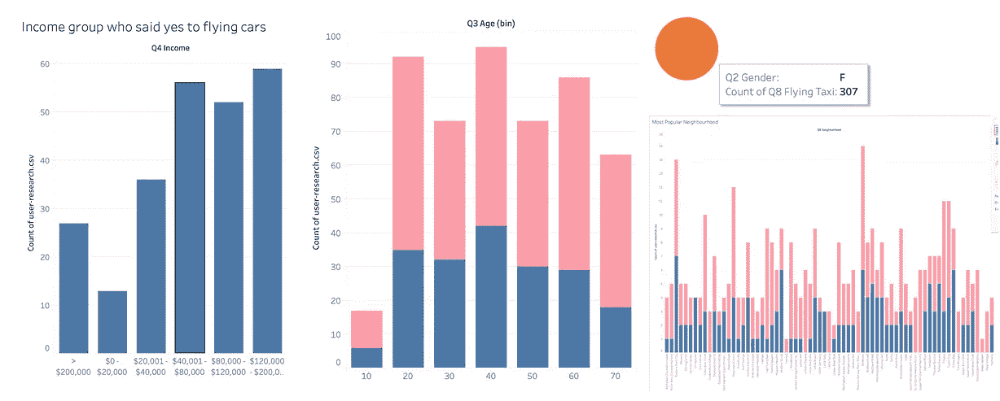********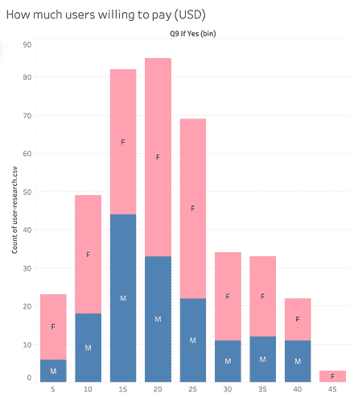********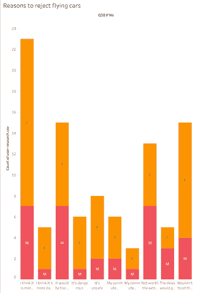****

1.  ****性别:女性似乎更倾向于尝试与男性进行比较。****
2.  ******年龄段:**20 多岁、40 多岁、60 多岁的用户更倾向于尝试 Flyber。****
3.  ******收入群体:**我们看到，收入在 4 万美元至 8 万美元之间的中高收入人群更愿意在 Flyber 上消费。****
4.  ******热门街区:**大多集中在曼哈顿(中城、炮台公园、地狱厨房、金融区)。我们的出租车数据集也是如此。****
5.  ******每英里的通常支出:**用户愿意为 Flyber 支付大约 14 至 32 美元(美元)，这是用户一直支付的常见出租车价格范围( **$2.50 至$28** )。**女性**愿意支付更高的价格点。****

******❌不使用 Flyber 的负面情绪******

*   ****拒绝理由:女人担心 safety⛑，而男人担心钱💰(定价)****

# ****🙏感谢您的阅读！****

****欢迎在下面留下你的评论，或者在 [@amycheong19](http://twitter.com/amycheong19) 给我发 DM。****