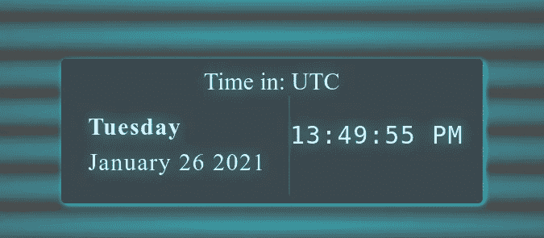
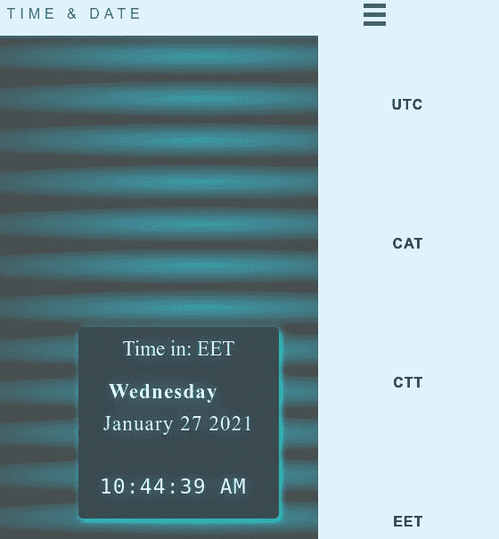

# 用 JavaScript 构建日期和时区

> 原文：<https://medium.com/geekculture/building-date-and-time-zone-with-javascript-6b862f279937?source=collection_archive---------4----------------------->



对于 JS 初学者来说，时钟项目是一个标准的项目理念。

在本文中，我将假设您具有 HTML、CSS 和 JavaScript 的基础知识——您知道如何将样式表链接到 HTML 或在`<style>`标记中应用样式——并且您知道如何将 JavaScript 文件导入到页面中。

# 入门指南

首先，让我们为 HTML 创建一个导航栏布局:

对于样式属性，请查看下面我的 GitHub 中的 styles.css 文件，因为必须保持博客简洁，所以将主要涵盖。html 和。js 零件。

CSS 相当简单，很少需要指出链接和汉堡菜单以及日期和时间容器的样式。

**如果有任何问题，请随时联系我:)**

[](https://github.com/Mozes721/DateTimeZone/blob/main/styles.css) [## Mozes721/DateTimeZone

### 显示日期时间选择时区的帮助下，响应导航条-mozes 721/日期时区

github.com](https://github.com/Mozes721/DateTimeZone/blob/main/styles.css) 

汉堡菜单会在达到一定的屏幕宽度时出现。css 它将被定义为**@媒体屏幕和(max-width : 768px)** 以及其他属性，如日期时间通道框。

这应该包括这篇文章中的 CSS。

**参考消息**`**translate()**`[CSS](https://developer.mozilla.org/en-US/docs/Web/CSS)[函数](https://developer.mozilla.org/en-US/docs/Web/CSS/CSS_Functions)在水平和/或垂直方向重新定位元素。它的结果是一个`[<transform-function>](https://developer.mozilla.org/en-US/docs/Web/CSS/transform-function)`数据类型。

在 JavaScript 中，我们将向主导航添加一个类 *show* ，它将负责链接的滑动，以及旋转线条。

# Javascript 汉堡菜单:

```
var ul = document.getElementById("nav_links");
var navElements = document.querySelectorAll('a'); const navSlide = () => {         const burger = document.querySelector('.burger');    
     const nav = document.querySelector('.nav-links'); burger.addEventListener('click', () => {        
           nav.classList.toggle('nav-active');         
           nav.classList.toggle('nav-ease-in');     
});} navSlide();
```

这里的 JavaScript 代码简洁明了——首先我们获得包含导航条中所有元素的 nav-links 类，然后使用 **querySelectorAll 获得所有“a”标签。**

在定义的 navSlide arrow 函数中，我们得到了 burger 和 navlinks，并使 burger 具有一个切换导航条的 add 事件监听器。



# 日期和时钟设置

现在让我们开始这个项目的主要部分设置时间，并能够改变时区。系好你的安全带，因为现在 JS 全力以赴！

让我们从停止的地方继续开始。html 并以 JS 结尾。

HTML 非常简单，所有内容都将在 section 标签中设置，时间和日期将存储在相应的 id 标签中。

# **获取当前日期和导航元素点击事件**

这个 JS 部分将分为两个部分，首先接收日期(因为它不会根据时区而改变),然后添加 click 事件以随着时间值的改变而改变 innerHTML 文本。

# 日期和点击事件监听器

下一步是获取当前日期，这是使用 JavaScript 函数 date()在当前年、月、日中获得的。在 Date()函数中的数组值中设置了一周中的月份和日期，因此我们必须创建自己的数组，其中包含一周中的所有月份和日期。

```
var today = new Date();
var day = weekday[today.getDay()];
var today_date = month[today.getMonth()] + ' ' + today.getDate() +  ' ' + today.getFullYear();
```

因此，我们设置了一个新的 Date()对象，并通过遍历相应的数组使用它来检索日和月的值。

对于关于所有列表 a 标签的点击事件，我们使用 forEach()方法，它将为导航列表项中的每个元素调用一次函数。每个项目都有其特定的事件侦听器，也分配了索引，该索引将有一个 switch 语句，并有一个被调用的新函数来启动值更改以及相应时区的 innerHTML 文本更改。

***注***

*开关声明*

*   开关表达式计算一次。
*   表达式的值与每种情况下的值进行比较。
*   如果匹配，则执行相关的代码块。
*   如果不匹配，则执行默认代码块。

# 准备时间

对于时间设置，我们使用 getHours()根据时区创建 Date()对象和 setHours。不会调整 getMinutes()和 getSeconds()，只会调整 hours 方法。

创建两个函数，一个从开始运行，另一个根据在导航条中选择的时间而改变。

utc_time 将有一个 setInterval 方法，因此该函数将每 1 秒调用一次，变量 time interval = setInterval(utc _ time，1000)；

setInterval 表达式是以毫秒为单位调用的，这就是为什么在函数在参数中传递后，传递 1000。

传递 if 语句，以便如果值小于 10，则在分、秒开始时传递 0，因为该方法提供单个索引。关于时间，如果 getHours()方法大于或小于 11，则附加基于 PM 和 AM 的时间，以显示中午之前和中午之后(PM，AM)。最后获取“时间”id，并使用 innerHTML 返回当前时间的内容。

为了使它实时运行，我们创建了两个函数 StopLocalClock()和 StartLocalClock()，这样我们就可以在时间之间切换，因为如果我们不通过 clearInterval 停止 setInterval，它将会一直运行，同时再次设置 Interval，以切换回它。

# 结论

这就对了。希望你学到了很多，但不是这些，这是一个陷阱！


除了时间改变函数 gettime(value_change)之外，一切都很好，当我改变它时，我不能实时运行，因为两个函数的 setIntervals 发生冲突，并同时使用两个值重新呈现页面。所以这个任务是不言自明的，我很乐意接受任何关于如何解决它的反馈。

> C lue `then`或`await` JavaScript 的`setTimeout`似乎是解决手头问题的最佳方法，包括`Promise`对象。

作为一个 JS 新手，我肯定迟早会回到这个项目来完成这项工作。作为一个个体，有许多知识应该被吸收和理解，以进一步发展自己。学习是一个持续的过程，我们都应该张开双臂拥抱它。

我希望你喜欢我的帖子，我将离开项目回购贝娄，并随时打我的问题或解决这个项目的最后一部分。

[](https://github.com/Mozes721/DateTimeZone) [## Mozes721/DateTimeZone

### 此时您不能执行该操作。您已使用另一个标签页或窗口登录。您已在另一个选项卡中注销，或者…

github.com](https://github.com/Mozes721/DateTimeZone)