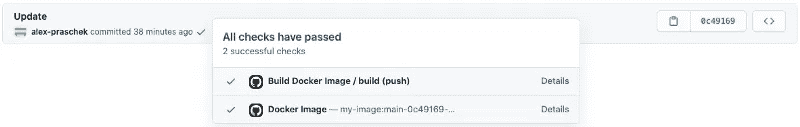
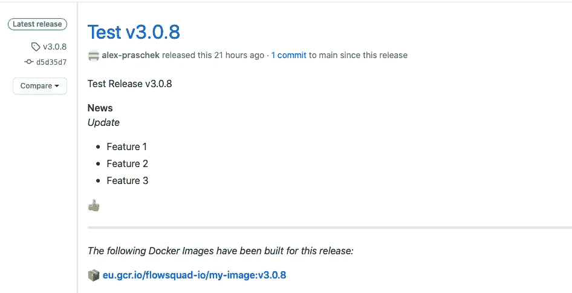

# 使用 GitHub Actions 和 Google Cloud 构建 Docker 图像

> 原文：<https://medium.com/geekculture/building-docker-images-with-github-actions-and-google-cloud-b8894e0edff0?source=collection_archive---------19----------------------->

## 使用 Google Cloud Build 构建 Docker 映像，并使用 GitHub Actions 将它们作为 CI 管道的一部分推送到 Google Cloud Registry。

*也有德语版*[*miragon . io*](https://www.miragon.io/blog/docker-images-mit-github-actions-und-google-cloud-bauen/)*。*

在 GitHub Actions 博客系列的最后一部分，我们仔细观察了 Gradle 的构建。但是部署到云通常涉及使用预构建的 Docker 映像，而不是 JAR 文件。我们如何将这些作为 CI 渠道的一部分来构建？

为此，我们开发了 GitHub 动作`docker-cloud-build`，并在我们的 GitHub 库中对其进行了[开源。使用此操作，只需一个步骤就可以构建一个完成的 Docker 映像，作为 Docker 文件和输入文件列表的结果，然后可以在 Google Cloud Registry 中使用。](https://github.com/flowsquad/docker-cloud-build)

此外，构建输出可以显示在 GitHub UI 中，一目了然地看到创建了哪些标签，以及构建是否成功。

# 入门指南

要使用该操作，我们首先需要向 action.yaml 文件添加一个新步骤。它看起来会像这样，例如:

```
- name: Build Docker Image
  uses: FlowSquad/docker-cloud-build@v1.0.1
  with:
    gcp-project-id: my-project-id
    gcp-service-account-key: ${{ secrets.GCP_SA_KEY }}
    image-name: my-image-name
    image-sources: build/libs/*.jar,Dockerfile,some-other-file
    github-token: ${{ secrets.GITHUB_TOKEN }}
```

上面的配置是最低可能的配置。可用参数可用于广泛定制操作的行为。参数`gcp-project-id`包含了 Google Cloud 中将要使用的项目的 ID。谷歌云注册的默认地区是`eu.gcr.io`。这可以通过`gcp-gcr-region`参数进行定制。

您可以在`image-name`下指定图像的名称。然后动态创建标签。构建所需的文件被指定为`image-sources`。可以指定 GitHub 操作工作区中的所有文件和文件夹。也支持通配符，如`*`或`?`。然后，需要将这些文件复制到 docker 文件中的成品映像中。

# 证明

在`gcp-service-account-token`下，必须指定一个 base64 编码的服务帐户 JSON 文件。这将用于向 GCP 认证。服务帐户需要下列权限:

```
cloudbuild.builds.create   # Required to start cloud builds
cloudbuild.builds.get      # Required to check build status
storage.objects.create     # Required to upload build input data
storage.objects.get        # ^ same
storage.objects.list       # ^ same
storage.objects.delete     # Required to clean up after build
```

可以在 Google Cloud IAM 的服务帐户下创建所需的 JSON 文件。为此，选择所需的服务帐户，切换到 Keys 选项卡，并创建一个 JSON 类型的新密钥。

# GitHub 集成

只有当`github-disabled`参数未设置为`true`时，才需要`github-token`。通常情况下，GitHub Actions 提供的默认令牌就足够了。有必要设置提交状态和/或发行说明。稍后将详细介绍。

在运行操作之前，我们首先需要在 Google 云存储中创建一个 bucket 来缓存构建的输入文件。默认情况下，名为`${projectId}_cloudbuild`的存储桶用于此目的。该名称可以用`gcp-cloud-storage-bucket`参数覆盖。

如果您现在运行该操作，默认情况下，相应的图像将被构建并标记为`$branch-$commitSha-$yyyy.$mm.$dd-$hh.$mm.$ss`。第一部分是(规范化的)分支名称，第二部分是所使用的提交的 7 个字符的短散列，第三部分是构建的日期和时间。

如果动作是由 GitHub 中正在创建的新标签触发的，那么标签名称也被设置为图像标签。[可用参数](https://github.com/FlowSquad/docker-cloud-build#tagging-the-image)可用于定制所使用的标签。例如，`default`标签总是可以被全局设置或者为相应的分支设置，或者默认标签的格式可以被改变。自定义标签也是可能的。

如果需要，构建的图像标签可以在 GitHub 中显示为提交状态。这使得使用哪个名称可以检索图像一目了然。还可以定制[消息的格式](https://github.com/FlowSquad/docker-cloud-build#github-commit-status)。



Displaying docker image tags as commit status

如果这个动作是由一个新创建的版本触发的，那么构建的标签也可以被添加到相应的版本注释中。这可以使图像的用户更容易找到相关链接。可以[定制](https://github.com/FlowSquad/docker-cloud-build#github-release-information)发行说明中是只包含默认标签还是包含所有标签。



Automatically added docker image tags in the GitHub release notes page

所有可用参数和更多信息可在[这里](https://github.com/FlowSquad/docker-cloud-build)找到。我们在构建管道中全面使用这个操作来为前端、后端和其他应用程序构建 Docker 映像，然后在我们的 Kubernetes 集群中使用这些映像。为了部署它们，我们使用 GitOps 方法。在未来的博客文章中会有更多的介绍！