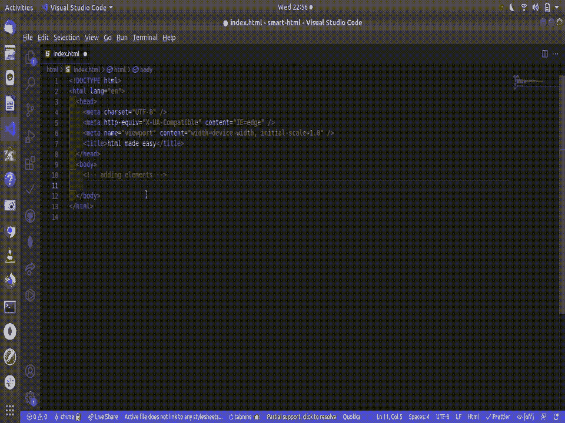
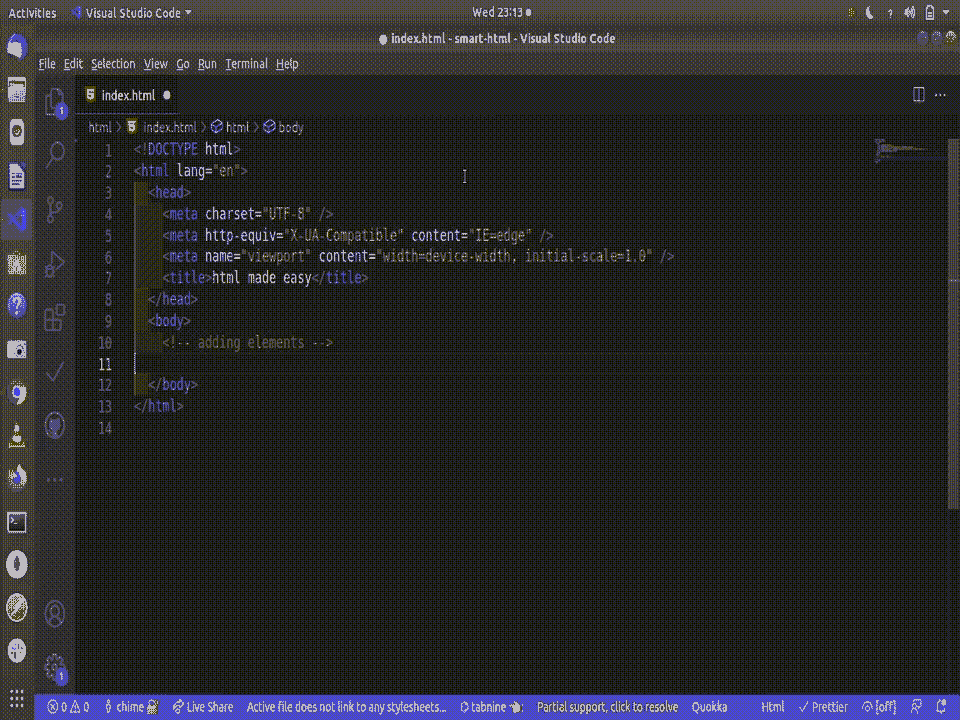
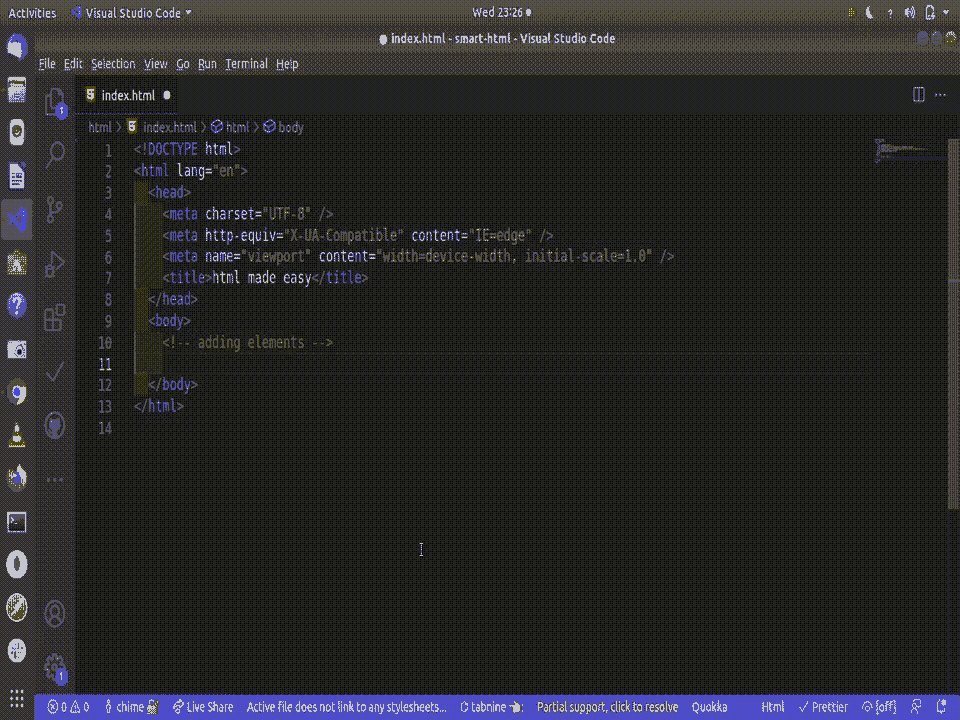
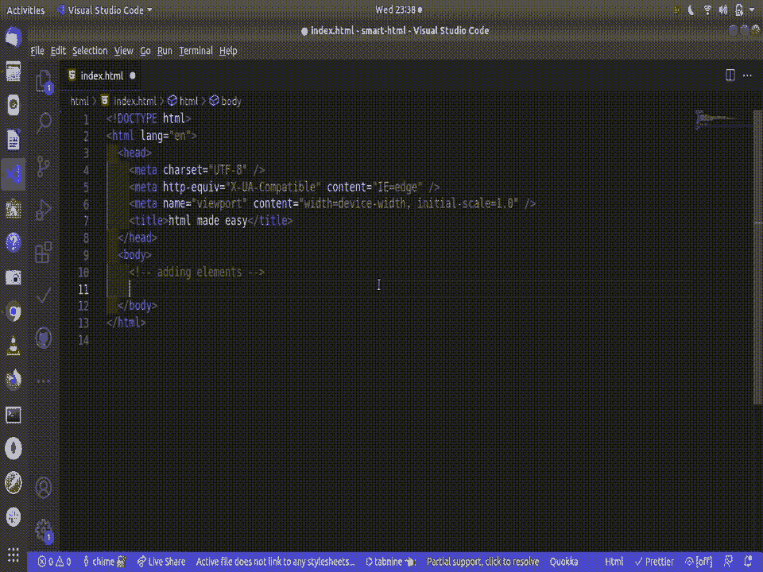
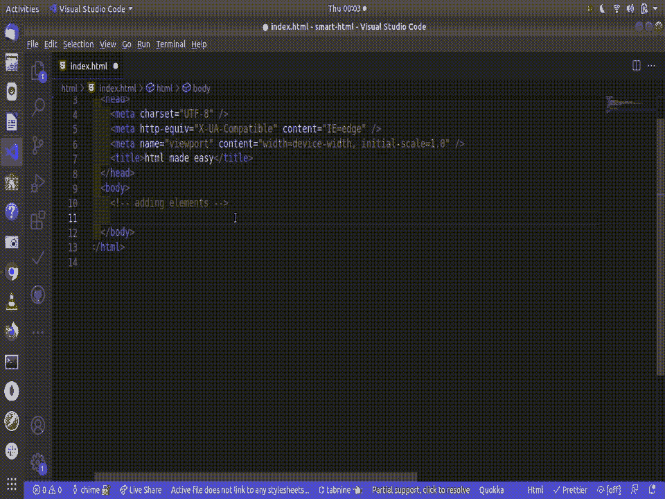

# 像专家一样构建 HTML 结构

> 原文：<https://medium.com/geekculture/building-html-structure-like-a-pro-48285d868134?source=collection_archive---------14----------------------->


Photo by [Jackson So](https://unsplash.com/@jacksonsophat?utm_source=medium&utm_medium=referral) on [Unsplash](https://unsplash.com?utm_source=medium&utm_medium=referral)

在全球范围内，网页的构建将会变得越来越有趣，要求也越来越高。在创建网页的过程中，像超文本标记语言(HTML)这样的技术是一种不容忽视的重要语言。

在本文中，我将向您展示如何使用 HTML5 以更智能的方式编写您的标记。

我将使用 visual studio 代码(vscode)作为我的代码编辑器。您只需要了解 HTML5 的基础知识，就可以在本文中继续学习。

在我的 vscode 中，我将创建一个名为 html_made_easy 的文件夹，在里面，我将创建一个名为 index.html 的文件。

在创建的索引文件中，让我们点击下面的组合键来为我们生成 HTML 模板:

```
shift + ! or type html5
```

现在我有了一个可以使用的模板，在 body 标签中，我将添加将在浏览器上显示的所有内容。

假设我想添加一个包含标题标签和段落标签的 div 元素，我可能会将元素添加到 body 标签中，如下所示:



这样做很好，但是很耗时，而且对于元素的简单结构化来说不够灵活。

展望未来，我将向你展示一个更聪明的方法来获得上述结果和更多。让我们从创建与上面相同的开始，如下所示:



**向元素添加文本:**



**向元素添加 CSS 和 id:**



要添加多个 CSS，只需要继续添加(。)像这样:

```
div.classname.anotherclassname.anotherclassname
```

**添加多元素:**


**生成指定数量的 lorem 文本**



有了我向你展示的这些构建 HTML 的灵活方法，我相信它会减少你构建 HTML 元素所花费的时间。

如果这篇文章对你有帮助，别忘了点击拍手图标，分享这篇文章并关注我的 [***中的***](https://princewillchime43.medium.com/) 和[***Linkedin***](https://www.linkedin.com/in/chime-princewill-3a2b1b192/)以查看更多我的文章。

请放弃任何评论或建议。如果你有一个基于 JavaScript/React.js 生态系统的主题，请随时联系我，我很乐意就此进行写作。谢了。