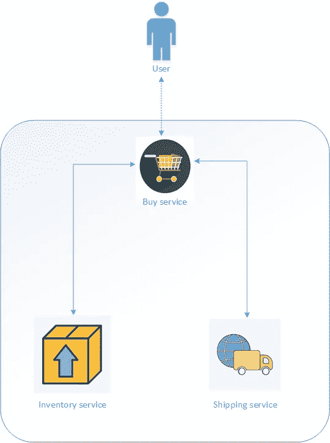
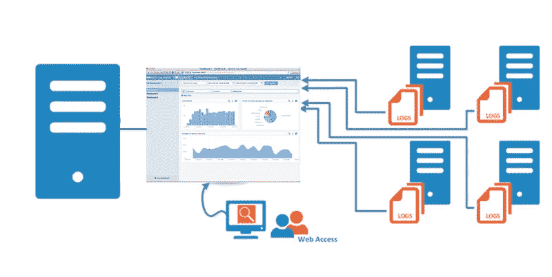
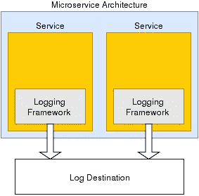
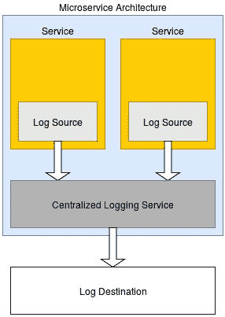

# 用 ELK Stack 和 Serilog 构建微服务架构下的测井系统。网络核心[第一部分]

> 原文：<https://medium.com/geekculture/building-logging-system-in-microservice-architecture-with-elk-stack-and-serilog-net-core-part-1-8fe2dfcf9e6f?source=collection_archive---------1----------------------->

为了解决一个 bug，你曾经花了 6 个小时进行调试，而只花了 6 分钟进行编码吗？

image source: internet

*或者，在一个美好的日子里，你去办公室，打开你的笔记本电脑，首先映入你眼帘的是客户发来的十几封投诉邮件，内容与昨晚的一个故障功能有关。您再次测试该功能，它运行良好！那么，昨晚你睡觉的时候系统到底发生了什么？*

image source: internet

当您的系统没有实现日志功能时，您可能需要处理的情况有两种。

## 是什么让日志成为每个应用程序的重要组成部分？

image source: internet

因为没有它，我们的应用程序将失去控制。我们可能知道有什么地方出了问题或坏了，但却无法确切地指出是什么(见图 2)，或者至少无法在不花费大量时间寻找问题的情况下做到这一点(见图 1)。这些浪费的时间总是可以用在更好、更有成效、更有战略意义的地方。

## 微服务架构(MSA)中的日志记录

image source: internet

近年来，MSA 的兴起使得测井变得前所未有的重要。我们不能否认 MSA 为我们提供了如此多的好处，如独立部署、易于扩展和缩减、采用不同技术堆栈的能力等等！但是使用 MSA 一点也不容易——我不想说它相当困难……不仅是在他们如何交流方面，而且在如何管理他们方面。当一个或多个服务失败时，它们甚至变得更加复杂。虽然，我们可以通过应用健康检查来知道哪个服务失败了(*你可以在这里找到我关于在 MSA 中实现健康检查系统的文章:*[*【https://link.medium.com/2p6jP6vaO3*](https://link.medium.com/2p6jP6vaO3))，但是它为什么会失败呢？或者是在什么情况下失败的？

我敢打赌，如果你没有好的有意义的日志记录，你就找不到答案。

## 在 MSA 中构建一个有意义的日志系统需要什么？

*注意:一个好的/有意义的日志系统是每个人都能使用和理解的系统。不要以为只有开发者需要日志。*

image source: internet

以下是在 MSA 中处理日志记录时对我有所帮助的项目。

1.  **使用唯一的 Id 来关联请求**

在 MSA 中，服务通过 HTTP 端点相互交互。最终用户只知道 API 契约(请求/响应)，不知道服务具体是如何工作的。

例如，您的应用程序具有“购买物品”功能，需要涉及以下 3 个服务:

Buy service flow

“购买服务”会调用“库存服务”和“发货服务”。一旦请求链完成，“购买服务”可能能够响应发起请求的最终用户。假设您已经有了一个记录系统，可以捕获每个服务的错误日志。如果发现“库存服务”有错误，如果能确切知道错误是“购买服务”还是“发货服务”造成的就更好了。如果这个错误对你来说足够有用。但是如果不是这样，重现该错误的正确方法是了解所有涉及的请求和服务。一旦实现了关联 ID，您只需要在日志系统中查找该 Id。您将从服务中获得所有日志，这些服务是系统主请求的一部分。

**2。将测井数据集中在一个地方**

image source: [https://wiki.zimbra.com/](https://wiki.zimbra.com/)

*请记住，您可以在不同的服务器上部署您的服务，但是不要在日志记录上做同样的事情。*

随着时间的推移，您的应用程序通常会添加更多的功能。这样下去，会有很多新的服务产生(我的项目从 12 个服务开始，现在我们有 20 个)。这些服务可以托管在不同的服务器上。我们想象一下，如果把日志存储在不同的服务器上会怎么样？—您必须访问每台单独的服务器来读取日志，然后尝试关联问题。相反，通过在一个地方集中记录数据，您可以在一个控制面板中获得所需的一切。如果这样可以节省你的时间。

**3。定义记录格式**

Photo by [Carlos Muza](https://unsplash.com/@kmuza?utm_source=medium&utm_medium=referral) on [Unsplash](https://unsplash.com?utm_source=medium&utm_medium=referral)

应用 MSA 允许您为每个服务使用不同的技术堆栈。例如，您可以使用。Net Core 用于购买服务，Java 用于运输服务，Python 用于库存服务。但是，它也会影响每个服务的日志格式。这甚至更复杂，因为有些日志比其他日志需要更多的字段。

根据我的经验，我建议将 JSON 作为记录数据的标准格式。JSON 允许您的数据有多个级别，以便在必要时，您可以在一个日志事件中获得更多的语义信息。

**4。记录有用/有意义的数据**

Photo by [Adeolu Eletu](https://unsplash.com/@adeolueletu?utm_source=medium&utm_medium=referral) on [Unsplash](https://unsplash.com?utm_source=medium&utm_medium=referral)

对我来说，当我看到日志时，我想知道一切！什么？什么时候？在哪里？…甚至是谁？—不要认为我需要确切地知道是哪个人导致了问题并责怪他们:)因为，联系正确的人也有助于你更快地解决问题。你可以记录你得到的所有数据。然而，让我给你一些我在我的项目中使用的特定字段。这可能有助于您找出真正需要记录的内容。

*   **什么时候？—时间(完整日期格式):**不要求使用 UTC 格式。但是对于需要查看日志的每个人，时区必须是相同的。
*   **什么？—堆栈错误**:所有异常对象都应该传递给日志系统。
*   **哪里？** —除了我们使用 MSA 时的服务名称。我们还需要出现错误的函数名、类名或文件名。—什么都不要猜，可能会浪费你的时间。
*   **谁？—** 客户端的 IP 地址和用户名(如果有)。确保不要用这些信息来指责你的队友:)

请记住，日志系统不仅仅是为开发人员准备的。它也被其他人使用(系统管理员、测试人员……)，所以，你应该考虑记录每个人都可以使用和理解的数据。

**5。考虑存储您的最终用户的个人身份信息(PII)**

Photo by [Markus Spiske](https://unsplash.com/@markusspiske?utm_source=medium&utm_medium=referral) on [Unsplash](https://unsplash.com?utm_source=medium&utm_medium=referral)

有时，您会记录来自最终用户的包含 PII 的请求。小心，这可能会违反 GDPR。

## MSA 中的测井方法

MSA 中有两种登录技术。每个服务将自己实现日志机制，并对所有服务使用一个日志服务。两者各有优劣之分。— *我在我的项目中使用了这两种方法。*

1.  **实现每个服务的登录**

image source: dzone.com

使用这种方法，我们可以很容易地为每个服务定义日志策略/库。例如，使用由。NET 我们可以使用 Log4Net，而 Java 写的服务我们可以使用 Log4J…

这种方法的问题是，它要求每个服务实现自己的日志记录方法。这不仅是多余的，而且还增加了跨多个服务更改日志行为的复杂性和难度。

**2。实现中央日志服务**

image source: dzone.com

如果您不想在每个服务中分别实现登录。您可以考虑为日志记录实现一个中央服务。该服务将帮助您处理、格式化和存储日志数据。

这种方法可能有助于降低应用程序的复杂性。但是，如果服务关闭，您可能会丢失日志数据。

在这一部分中，我们快速浏览了日志记录的重要性，尤其是在 MSA 中，以及如何实现一个有意义的日志记录系统。在下一部分— [第 2 部分，](/@letienthanh0212/building-logging-system-in-microservice-architecture-with-elk-stack-and-serilog-net-core-part-2-2643dbbf3c2c?source=friends_link&sk=d18499290ee294f6556d8c491fb4a32a)我将一步一步地向您展示如何使用。NET Core，Serilog 和 ELK 栈。

# 参考

 [## 用 ELK stack 和 Serilog 构建微服务架构下的测井系统。网络核心[第二部分]

### 在第 1 部分中，我们介绍了日志记录的重要性，尤其是在 MSA 中，以及如何实现有意义的日志记录…

medium.com](/@letienthanh0212/building-logging-system-in-microservice-architecture-with-elk-stack-and-serilog-net-core-part-2-2643dbbf3c2c)  [## 如何在微服务架构中用？网芯？

### 请注意，您应该对微服务架构有基本的了解，然后再详细介绍这一点…

medium.com](/swlh/how-to-implement-healthcheck-api-in-microservices-architecture-with-net-core-a5882369b016)  [## 测井微服务工具和技术- DZone 集成

### 微服务架构正在席卷技术世界。越来越多的企业正转向…

dzone.com](https://dzone.com/articles/tools-and-techniques-for-logging-microservices-1)  [## 面向微服务的分布式日志架构——DZone 云

### 在本文中，我们将研究在记录微服务和架构时要遵循的一些最佳实践…

dzone.com](https://dzone.com/articles/distributed-logging-architecture-for-microservices)  [## 通用数据保护条例(GDPR) -官方法律文本

### 欢迎访问 gdpr-info.eu。在这里您可以找到法规(EU) 2016/679(一般数据保护…

gdpr-info.eu](https://gdpr-info.eu/)