# 用 ELK Stack 和 Serilog 构建微服务架构下的测井系统。网络核心[第二部分]

> 原文：<https://medium.com/geekculture/building-logging-system-in-microservice-architecture-with-elk-stack-and-serilog-net-core-part-2-2643dbbf3c2c?source=collection_archive---------0----------------------->

在第 1 部分中，我们介绍了日志记录的重要性，尤其是在 MSA 中，以及如何实现一个有意义的日志记录系统。

 [## 用 ELK stack 和 Serilog 构建微服务架构下的测井系统。网络核心[第一部分]

### 日志系统不仅仅是为开发者准备的。它也被其他人使用(系统管理员、测试人员……)

medium.com](/@letienthanh0212/building-logging-system-in-microservice-architecture-with-elk-stack-and-serilog-net-core-part-1-8fe2dfcf9e6f) 

在这一部分中，我将向您展示如何使用 Serilog 在微服务架构中构建日志记录系统。NET Core 和 ELK Stack。

我们开始吧！

image source: internet

但是等等！Serilog 和 ELK Stack，它们是什么？

—如果您已经知道它们是什么，可以忽略下面的部分。

# Serilog

Serilog 是一个日志框架。NET 于 2013 年推出。Serilog 是最新的日志框架之一，因此它采用了. NET. Structured logging 的一些更新更高级的特性。除此之外，丰富的概念也使得 Serilog 与许多其他日志框架(例如:log4net)相比是独一无二的。

使用 Serilog，通过简单的配置就可以很容易地将我们的日志发送到不同的地方。Serilog 使用所谓的接收器将我们的日志发送到文本文件、数据库、 [Azure table、](https://azure.microsoft.com/en-us/services/storage/tables/) [亚马逊 S3](https://aws.amazon.com/s3/) 或许多其他地方。你可以在这里看到提供的水槽列表:

 [## serilog/serilog

### Serilog 提供了用于以各种格式将日志事件写入存储的接收器。下面列出的许多水槽是…

github.com](https://github.com/serilog/serilog/wiki/Provided-Sinks) 

# 麋鹿栈

“ELK”是三个开源项目的首字母缩写:Elasticsearch、Logstash 和 Kibana。

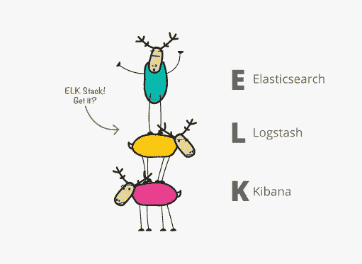 [## ELK Stack: Elasticsearch，Logstash，Kibana | Elastic

### 麋鹿栈是什么？ELK Stack 是三个广泛使用的开源项目组合的首字母缩写…

www.elastic.co](https://www.elastic.co/what-is/elk-stack) 

**弹性搜索**

Elasticsearch 是一个开源、分布式、RESTful 搜索和分析引擎。不要认为 Elasticsearch 只适合大数据，因为它允许您从小处着手，但会与您的业务一起增长。Elasticsearch 旨在横向扩展。

Elasticsearch 是一个高度可用的分布式搜索引擎。每个索引被分解成碎片，每个碎片可以有一个或多个副本。默认情况下，创建的索引有 5 个分片，每个分片有 1 个副本(5/1)。有许多拓扑可供使用:

*   1/10: 1 个碎片和 10 个副本—这有助于提高搜索性能。
*   20/1: 20 个碎片，每个碎片 1 个副本——这有助于提高索引性能。

Elasticsearch 是 API 驱动的。大多数操作都可以通过一个简单的 RESTful API 使用 JSON over HTTP 来执行。

你可以访问 Elasticsearch Github 查看完整的功能和源代码

 [## 弹性/弹性搜索

### Elasticsearch 是一个为云构建的分布式 RESTful 搜索引擎。特点包括:分布式和高度…

github.com](https://github.com/elastic/elasticsearch) 

# **日志存储**

Logstash 负责聚合来自不同来源的数据，对其进行处理，并将其发送到管道中，通常直接在 Elasticsearch 中进行索引。

Logstash 可以使用输入插件从几乎任何数据源提取数据，使用过滤器插件应用各种各样的数据转换和增强，并使用输出插件将数据发送到大量目的地。

您可以在这里找到 Logstash 的所有插件:

 [## 日志隐藏插件

### 可以扩展 Logstash 功能的插件。Logstash Plugins 有 262 个可用的库。遵循他们的准则…

github.com](https://github.com/logstash-plugins) 

# **基巴纳**

Kibana 是一个强大的可视化工具，它与 Elasticsearch 集成在一起，使用存储在 Elasticsearch 集群中的数据来创建有意义的图形和图表。Kibana 的核心特性是数据查询和分析。

此外，Elasticsearch 是 API 驱动的——您可以使用 Kibana 的内置工具“控制台”来使用 elastic search

 [## 弹力/基巴纳

### 基巴纳是你进入弹性堆栈的窗口。具体来说，它是一个基于浏览器的分析和搜索仪表板，适用于…

github.com](https://github.com/elastic/kibana) 

# **在 MSA 中应用 Serilog 和 ELK**

在这个演示中，我们将使用 Serilog 库在系统中写日志。所有 API 请求都将以预定义的日志级别记录在配置文件中。ELK 用于管理集中的测井数据。

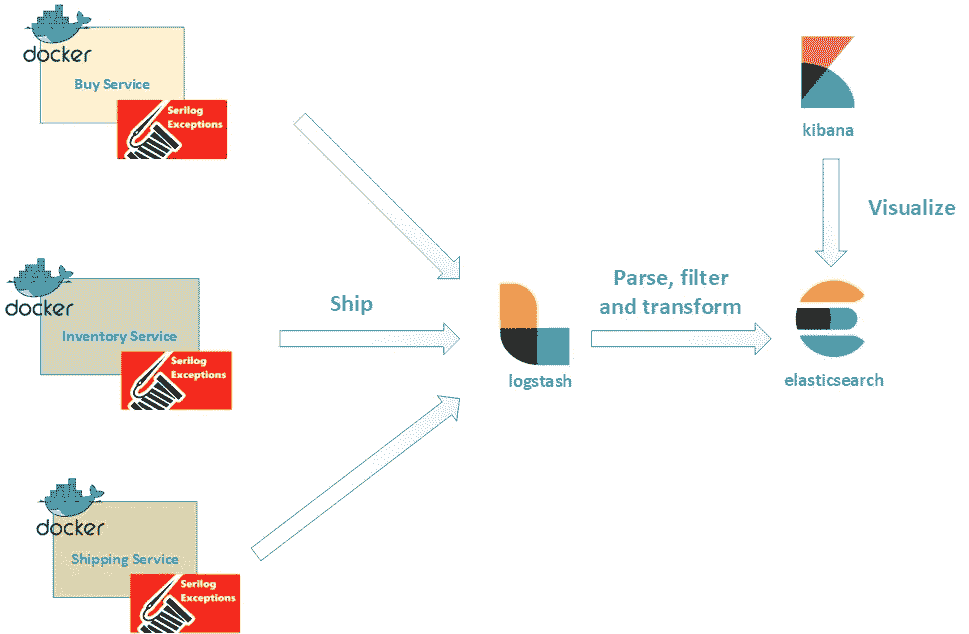

**第一步:创建购买服务、库存服务和运输服务**

让我们回到第 1 部分的案例，我已经创建了一个包含 3 个服务(购买、库存和运输)的解决方案。

最终用户将调用“购买”服务，然后“购买”服务将调用“库存”和“运输”服务，然后将结果返回给最终用户。

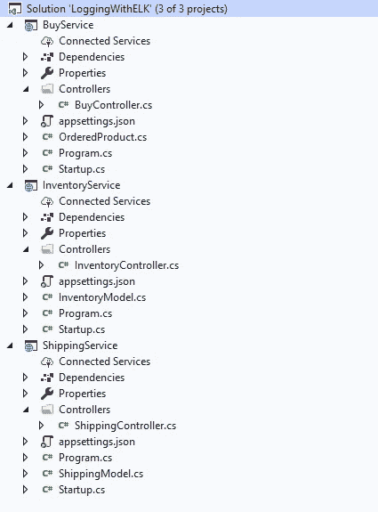

**购买控制器**

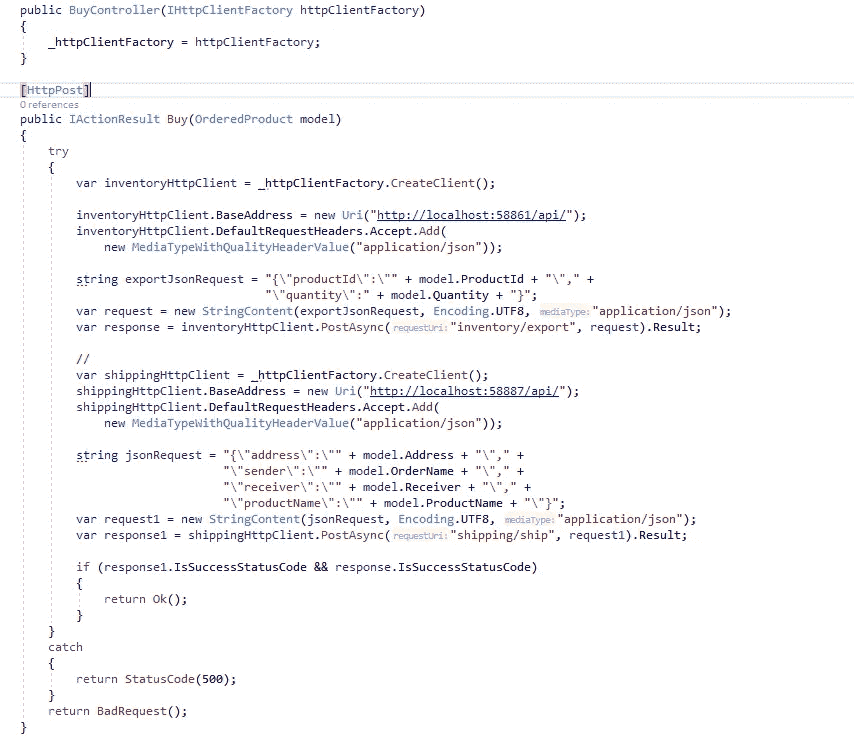

**出货控制器**

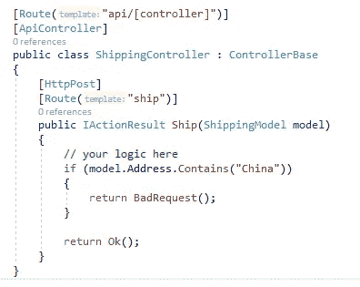

**库存控制器**

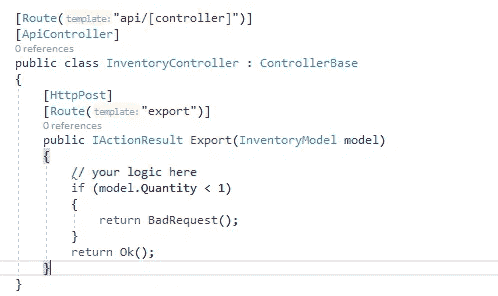

*注意:我将跳过创建服务这一步。您可以在这里访问并获得源代码:*

 [## thanh le 0212/LoggingWithELKAndSerilog

### 在 GitHub 上创建一个帐户，为 thanhle 0212/LoggingWithELKAndSerilog 的开发做出贡献。

github.com](https://github.com/thanhle0212/LoggingWithELKAndSerilog) 

**第二步:实现所有服务的 seri log**

**使用 NuGet** 为所有服务安装 Serilog 包

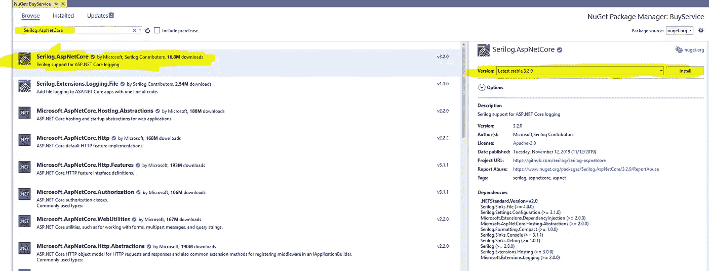

**Serilog.AspNetCore**

Serilog。AspNetCore —主要驱动因素

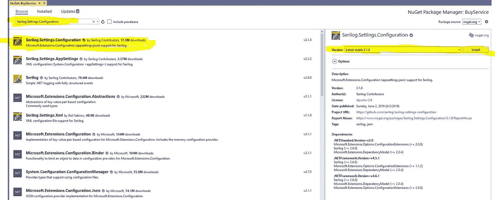

**Serilog.Settings.Configuration**

Serilog。Settings . Configuration 读取应用程序设置配置的提供程序。(我们稍后会用到)

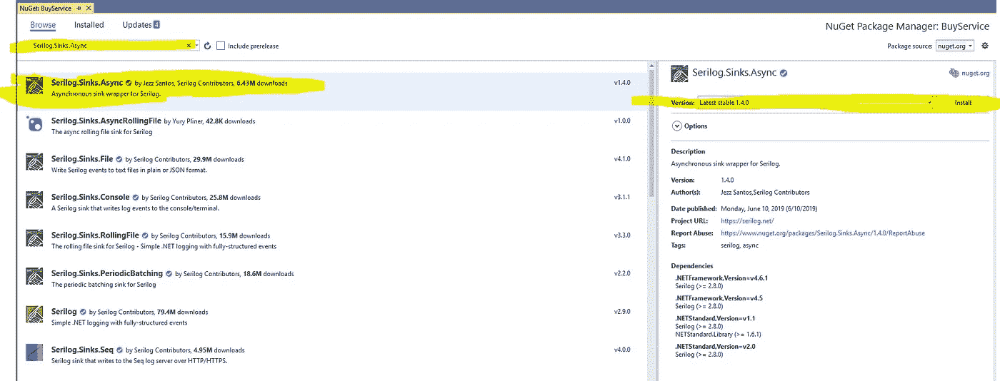

**Serilog.Sinks.Async**

Serilog。Sinks.Async —其他接收器的异步包装器，尤其是文件接收器，它通过将工作委托给后台线程来减少日志调用的开销。

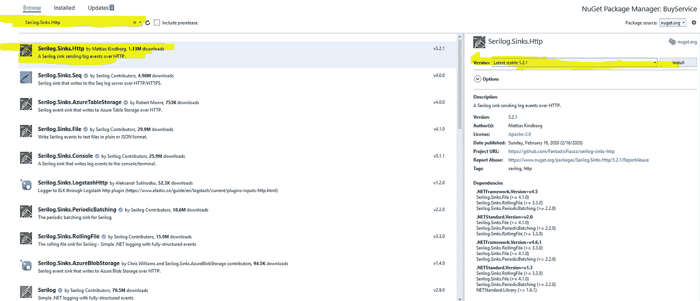

**Serilog.Sinks.Http**

Serilog。Http —提供者帮助您通过 Http 发送日志。然而，我们将在稍后实现 ELK 时使用这个接收器。这个想法是，我们将通过 HTTP 发送日志到 Elasticsearch。

为了测试 Serilog，我们将尝试实现将日志写入文件。

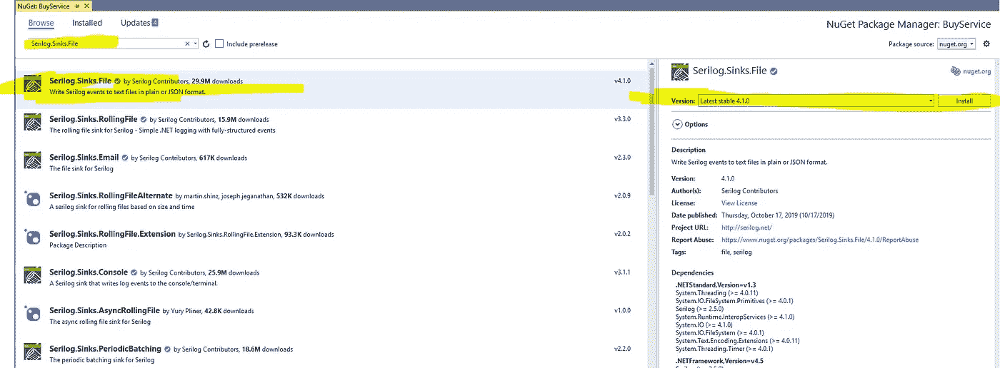

**Serilog.Sinks.File**

Serilog。Sinks.File —提供程序帮助您将日志写入文件。

**在你的项目中注册 seri log**

如下更新 Program.cs 以在项目中注册 Serilog。

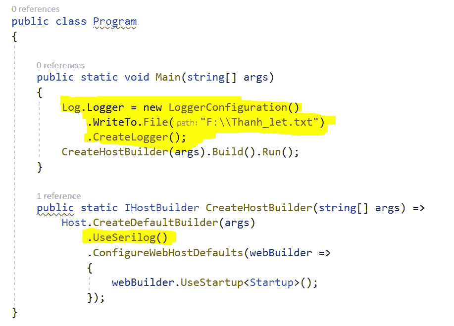

因为我们将使用文件接收器提供程序，所以我们需要定义路径(文件位置)来存储日志数据。比如“F:\\Thanh_let.txt”。

**实现 Serilog 写日志**

*注:您可以对其他服务进行同样的操作*

使用依赖注入(DI)注册和使用记录器库

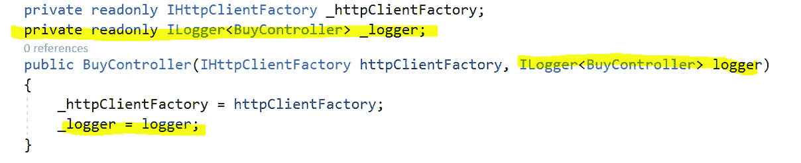

代码逻辑中的调用日志方法

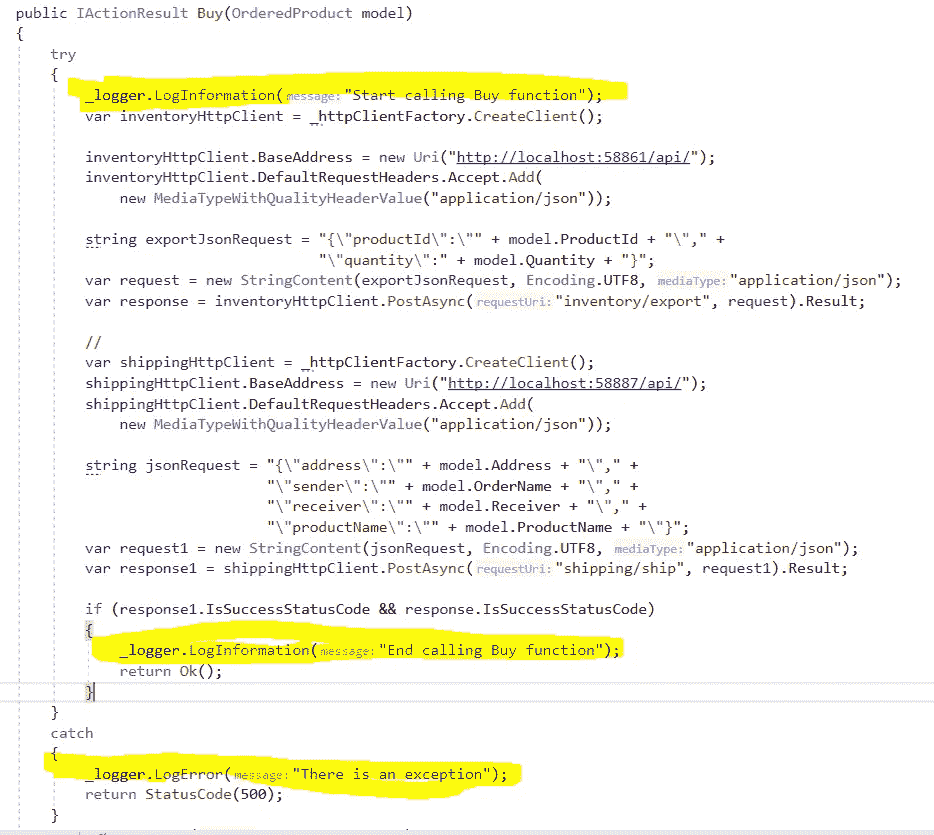

让我们给邮递员打个电话，检查一下结果:

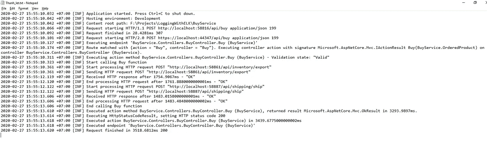

**第三步:安装 ELK 堆栈**

*注:在本文中，我将向您展示如何在 Windows 操作系统上从头开始安装和配置 ELK stack。您也可以选择另一种方式来安装和配置 ELK，比如使用 Docker。*

**安装打开的 JDK**

你可以在这里看到开放 JDK 的所有版本:

 [## 存档的 OpenJDK GA 版本

### 这个页面是以前发布的 JDK 版本的档案，根据 GNU 通用公共许可证，版本…

jdk.java.net](https://jdk.java.net/archive/) 

选择并下载版本 **11.0.2(内部版本 11.0.2+9) Windows 64bit**

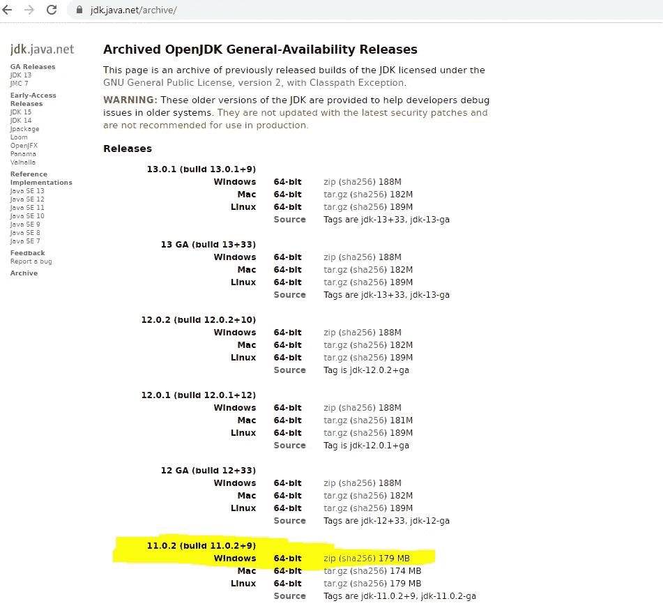

将 zip 文件(open JDK-11 . 0 . 2 _ windows-x64 _ bin . zip)解压缩到您的位置。例如:“C:\ Program Files \ Java \ JDK-11 . 0 . 2”

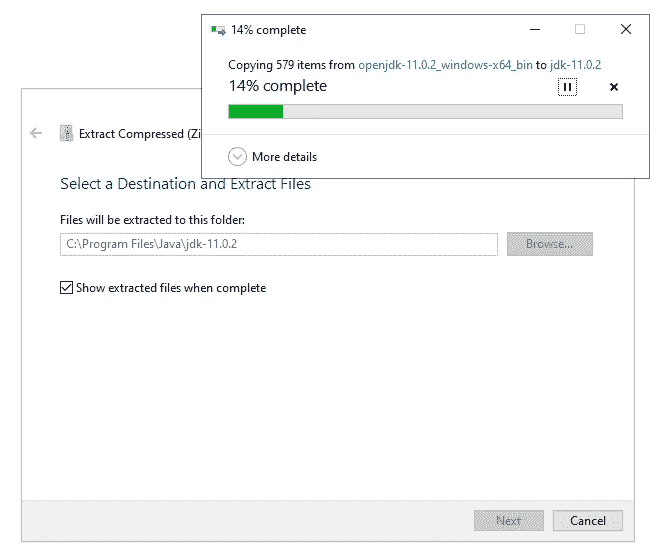

创建新的系统变量名称" **JAVA_HOME** "并设置值为这个路径" C:\ Program Files \ JAVA \ JDK-11 . 0 . 2 "

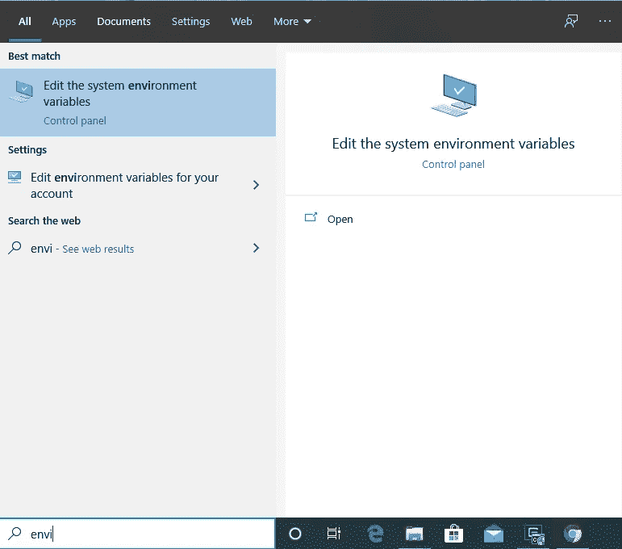

单击“高级”选项卡中的“环境变量…”

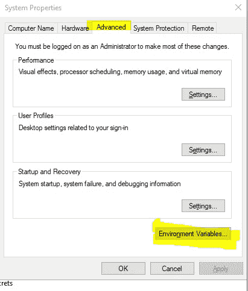

点击“新建”

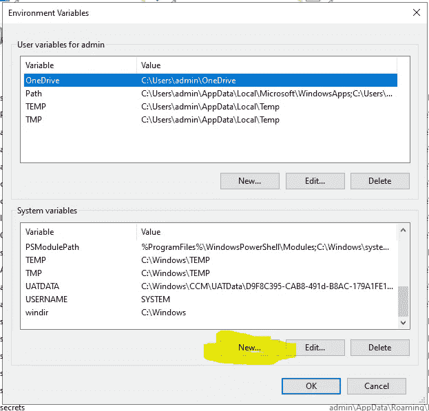

设置“变量名”为“JAVA_HOME”，“变量值”为您的 **jdk-11.0.2** 文件夹的路径

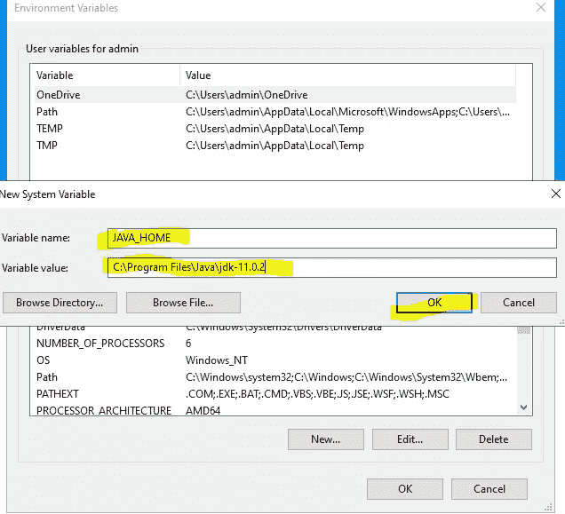

编辑“**管理员用户变量”**中的“**路径**值

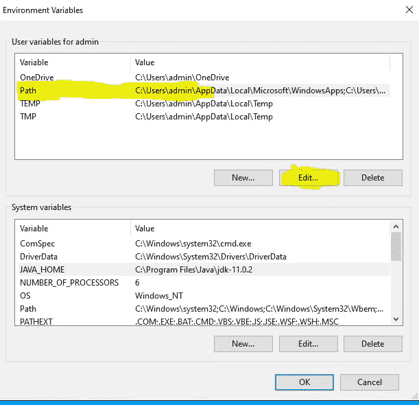

单击“新建”创建新路径

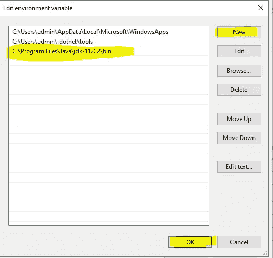

重新启动计算机以应用新的更改。

重启成功后，打开 CMD 并输入“java -version”来验证安装开放 JDK。

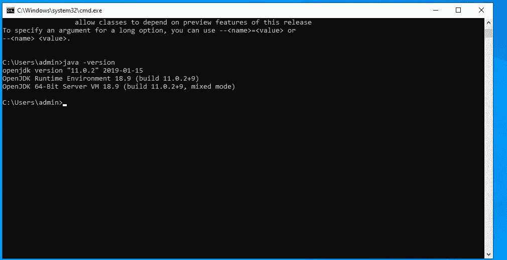

**下载并安装 ELK stack**

1.  [**弹力搜索**](https://www.elastic.co/downloads/elasticsearch)

你可以在这里下载 Elasticsearch

 [## 免费下载橡皮筋搜索|立即开始|橡皮筋|橡皮筋

### 免费下载 Elasticsearch 或完整的 Elastic Stack(以前的 ELK stack ),并开始搜索和分析…

www.elastic.co](https://www.elastic.co/downloads/elasticsearch) 

有很多选项供你选择(Linux，Docker…)

ELK 的最新版本是 **7.6.0，**如果你想下载更老的版本，可以访问这里:

 [## Elastic Stack 软件的旧版本| Elastic

### 寻找过去发布的 Elasticsearch、Logstash、Kibana、es-hadoop、Shield、漫威或我们的语言客户…

www.elastic.co](https://www.elastic.co/downloads/past-releases#elasticsearch) 

*注:在本文中，我将使用版本****7 . 2 . 0****，这也是我在当前项目中使用的版本。*

 [## 弹性搜索 7.2.0 |弹性

### 点击此处查看详细的发行说明。不是你要找的版本？查看过去的版本。纯粹的 Apache 2.0…

www.elastic.co](https://www.elastic.co/downloads/past-releases/elasticsearch-7-2-0) 

2.基巴纳

链接下载基巴纳— **7.2.0。**

确保您选择的是 Windows 版本

 [## 基巴纳 7.2.0 |弹性

### 弹性云上的应用程序搜索现已可用，介绍 Kibana Lens Elastic Stack 7.6.0 发布的弹性企业…

www.elastic.co](https://www.elastic.co/downloads/past-releases/kibana-7-2-0) 

3. **LogStash**

链接下载日志存储— **7.2.0**

确保您选择 Zip 版本

 [## Logstash 7.2.0 |弹性

### Logstash

www.elastic.co](https://www.elastic.co/downloads/past-releases/logstash-7-2-0) 

一旦你完成下载，你将有如下 3 个文件夹:

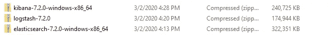

创建一个文件夹来存储 ELK 堆栈。即“C:\ELK”

将上面下载的文件解压到“C:\ELK”

重命名文件夹名称，以缩短名称:“kibana”，“logstash”和“elasticsearch”。因为我们稍后在安装/配置 ELK 时需要使用这些名称。

提取下载的文件大约需要 15 分钟。

一旦提取完成，让我们安装/配置 ELK。

**配置并运行 Elasticsearch**

打开“C:\ ELK \ elastic search \ config \ elastic search . yml”

此文件包含您的 elasticsearch 服务器的设置。

*注意:Elasticsearch 为大多数设置提供了合理的默认值。在您着手调整和优化配置之前，请确保您了解您要完成的任务及其后果。在本文中，我不打算在配置文件中逐一解释参数，而是使用我在项目中使用的设置。*

*   **network.host** :将绑定地址设置为一个特定的 IP 地址(确保将该值更改为您的 IP 地址)
*   **http.port** :设置 http 的自定义端口
*   **node.data:** 如果没有设置值，在 elasticsearch 中插入数据后，会自动创建节点数据。但是，如果没有任何节点数据，您就无法配置用户名/密码，这就是为什么我们需要将其值设置为 true。

 [## elastic search-设置-密码问题问题#38261 elastic/elasticsearch

### 此时您不能执行该操作。您已使用另一个标签页或窗口登录。您已在另一个选项卡中注销，或者…

github.com](https://github.com/elastic/elasticsearch/issues/38261) 

*   **discovery.seed_hosts** :当该节点启动时，传递一个初始的主机列表来执行发现

默认情况下，在 Elasticsearch 的配置文件中找不到这些属性( **xpack.security.enabled 和 xpack . security . transport . SSL . enabled**)。默认情况下，访问 Elasticsearch 不需要用户名/密码。但是如果您希望您的日志系统更加安全，您应该将这些值设置为“true”。

用管理员模式打开 PowerShell，打开 Elasticsearch 文件夹

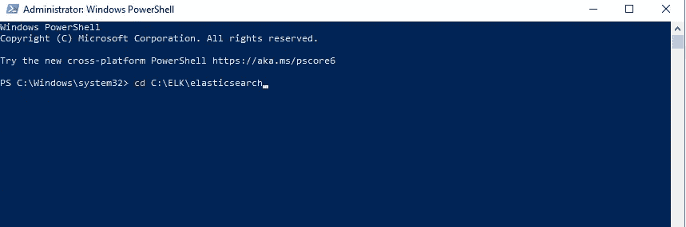

并运行以下命令:“**”。\bin\elasticsearch.bat** "在您的机器上运行 elasticsearch(如果您想让 Elasticsearch 一直运行，请不要关闭终端)

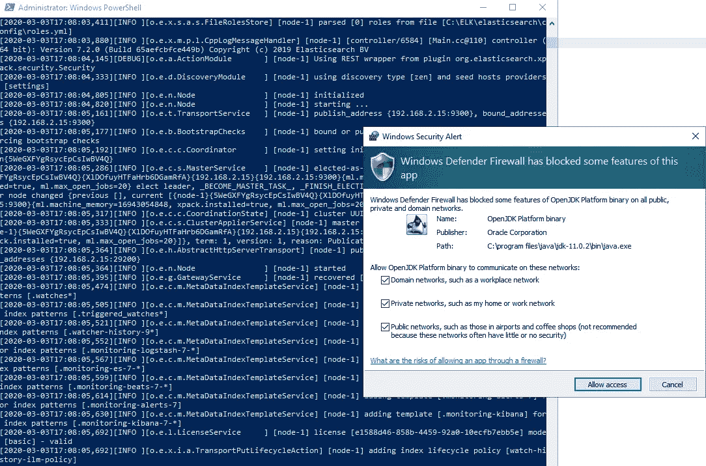

让我们给我们的 Elasticsearch 服务器打一个示例电话。

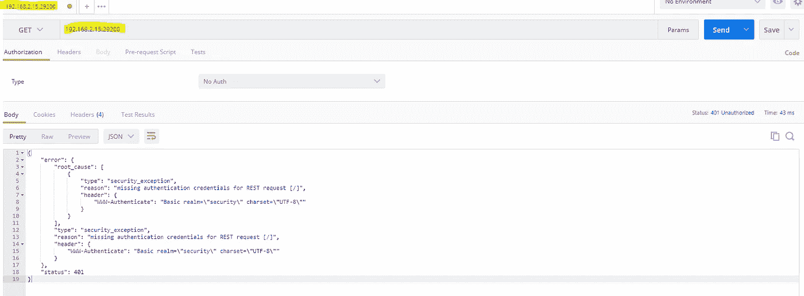

好了，起作用了！现在我们需要设置用户名/密码来使用 Elasticserver。

用 Administrator 打开另一个 Windows Powershell，打开 Elasticsearch 文件夹。然后运行以下命令来设置您的密码:

**”。/bin/elastic search-setup-passwords . bat interactive "**

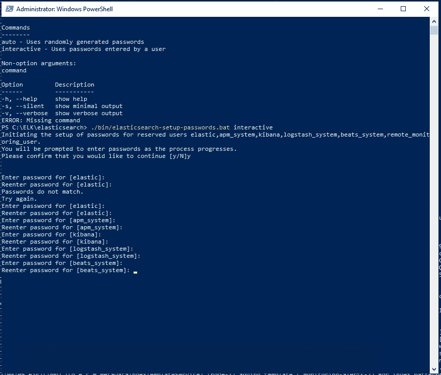

您需要为 ELK stack 的所有服务设置密码，默认用户名为“**弹性**

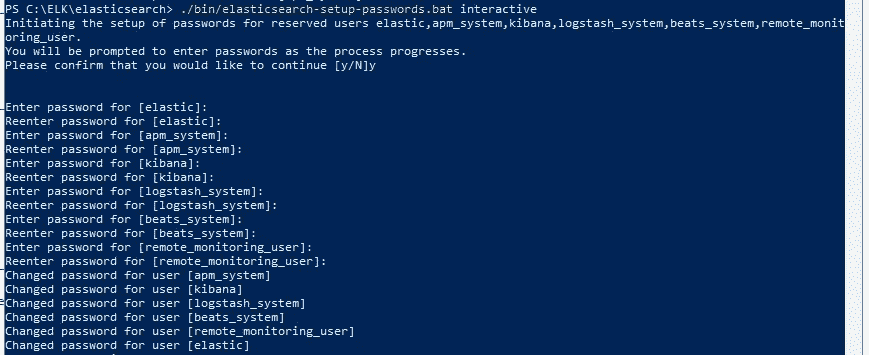

让我们使用您刚刚设置的凭证再次调用 Elasticsearch

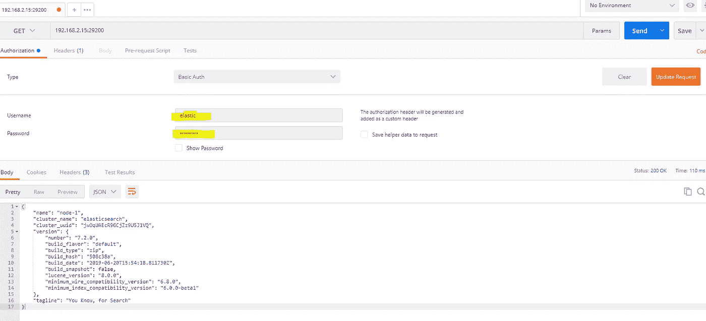

接下来，让我们配置并运行**基巴纳**

用文本编辑器打开“**C:\ ELK \ ki Bana \ config \ ki Bana . yml**”。您可以看到所有设置的描述。基于您可以自己创建/修改属性的要求。同样，你应该确保你知道你在做什么！

以下是我的设置:

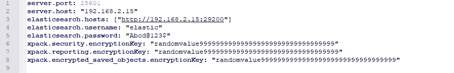

使用您在上一步中刚刚设置的值输入弹性用户名和密码。

***。加密密钥长度必须至少为 32 个字符**

打开另一个 PowerShell 窗口，选择“C:\ELK\kibana”文件夹，然后运行以下命令“**。\bin\kibana.bat** "来运行 kibana。启动 Kibana 需要 1-2 分钟

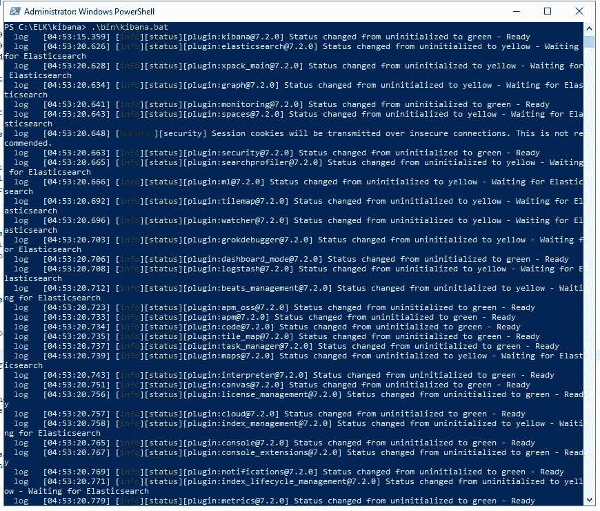

我们打开浏览器，输入“[http://192 . 168 . 2 . 15:25601/](http://192.168.2.15:25601/)”，然后输入用户名/密码(elastic/Abcd@123$)

*注意:一旦我们有了一些日志数据，我们稍后将返回到基巴纳:】*

接下来，我们将设置 Logstash—ELK 堆栈中的最后一个

打开“C:\ ELK \ logstash \ config \ log stash . yml”来配置 log stash

与 Elasticsearch 和 Kibana 一样，您也可以找到每个设置的完整描述。

对于 metrics REST 端点，该选项也接受一个范围(29600–29700 ),并且 logstash 将选择第一个可用端口。这些端口用于 Logstash 运行和处理数据。

**为日志存储创建过滤器**

在“C:\ELK\logstash”中创建名为“ **testlog.conf** ”的新配置文件，内容如下

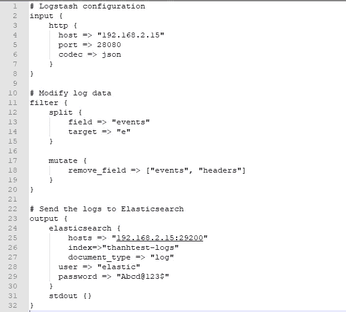

*注意:你可以有更多的过滤规则。有了上面的设置，我想复制字段“事件”到“e ”,然后删除字段:事件，标题。*

您可以在此找到有关设置日志存储过滤器的更多详细信息:

 [## 小 Logstash 课程:使用 Logstash 帮助创建弹性搜索映射模板

### 什么是映射？简单地说，映射定义了 Elasticsearch 如何解释字段。Elasticsearch 功能强大…

www.elastic.co](https://www.elastic.co/blog/logstash_lesson_elasticsearch_mapping) 

使用我们刚刚创建的配置运行 log stash(**testlog . conf**)

打开 PowerShell 窗口并打开以下文件夹(" **C:\ELK\logstash** ")

然后运行以下命令:"**。\ bin \ log stash . bat-f testlog . conf**"

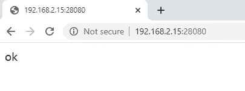

在这一步，我们完成了 ELK stack 的安装和配置。现在，我们将带着我们在前面的步骤中创建的代码库返回，将日志数据发送到 ELK stack。

**所有服务**应更新为使用 HTTP 接收器将日志数据发送到 Logstash，如下所示:

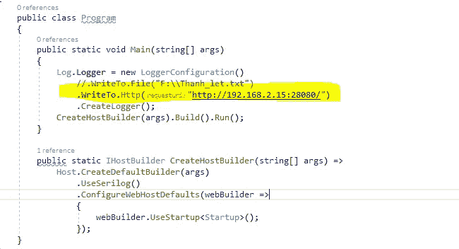

让我们制作一个调用“购买”服务的示例，并在 Logstash 和 Elasticsearch 上查看结果

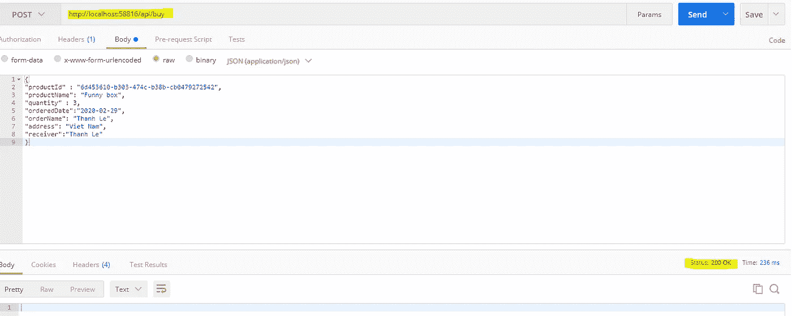

查看弹性搜索的结果

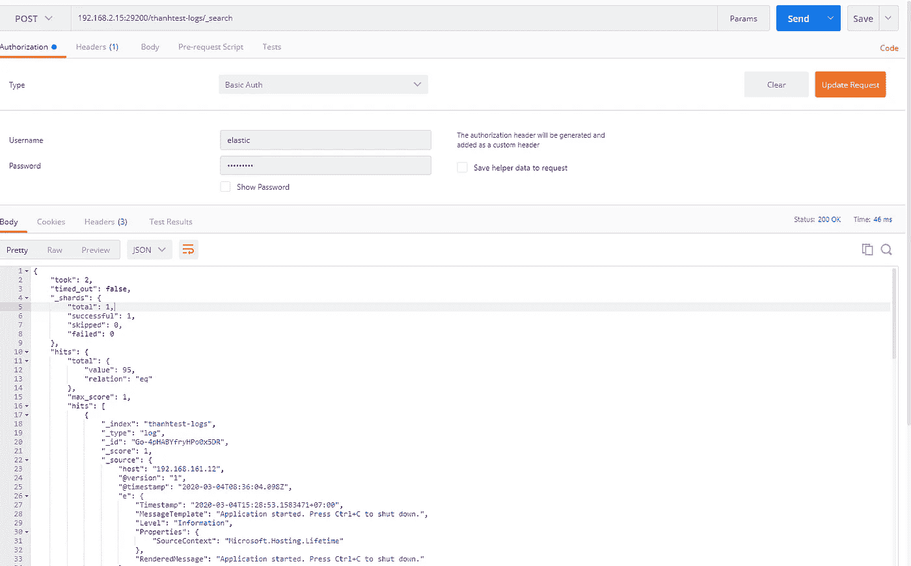

在 Logstash 中检查结果

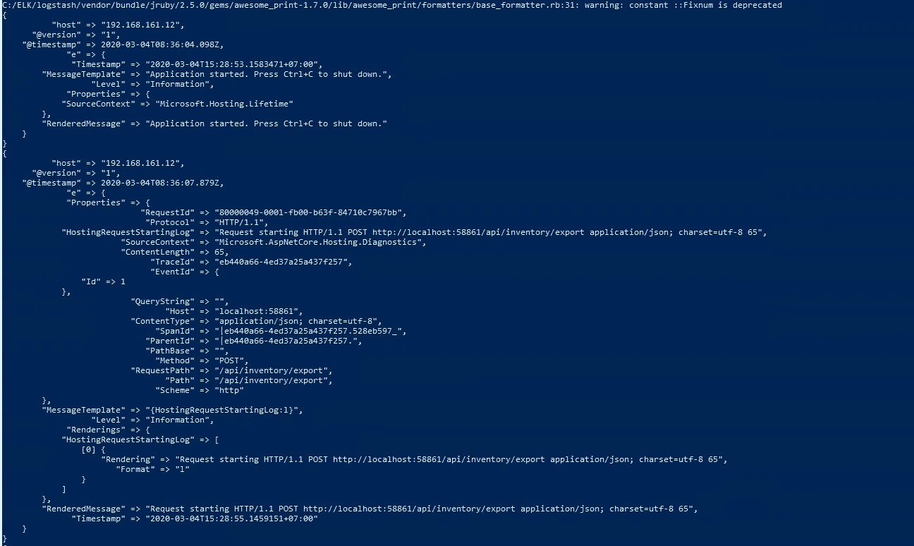

你也可以在 Kibana 上搜索 Elasticsearch 数据

在 Kibana 上设置索引模式

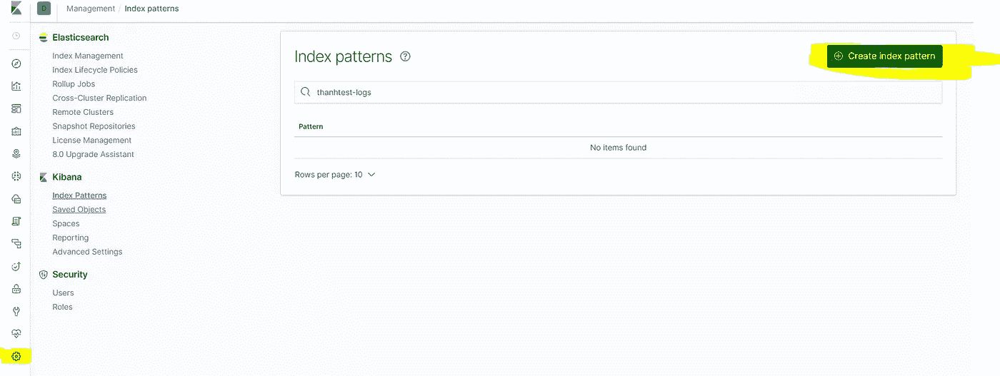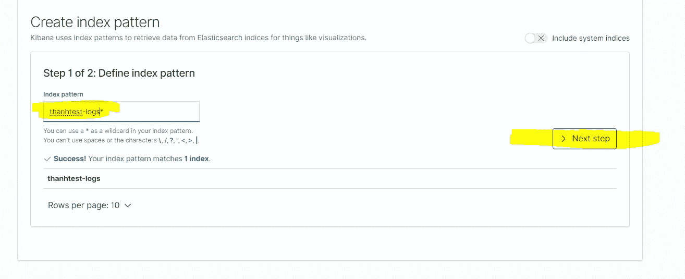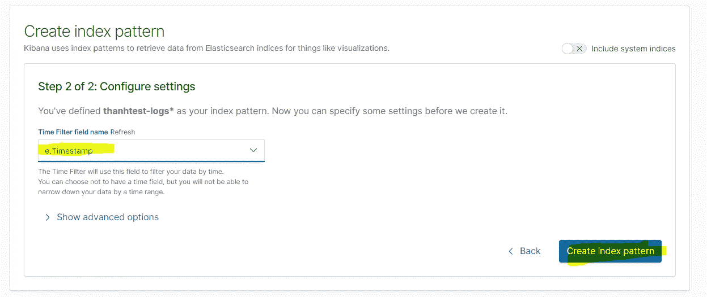

结束

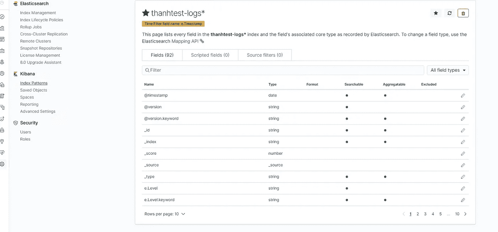

转到“Discover”选项卡，您应该会看到基于您的索引的日志数据

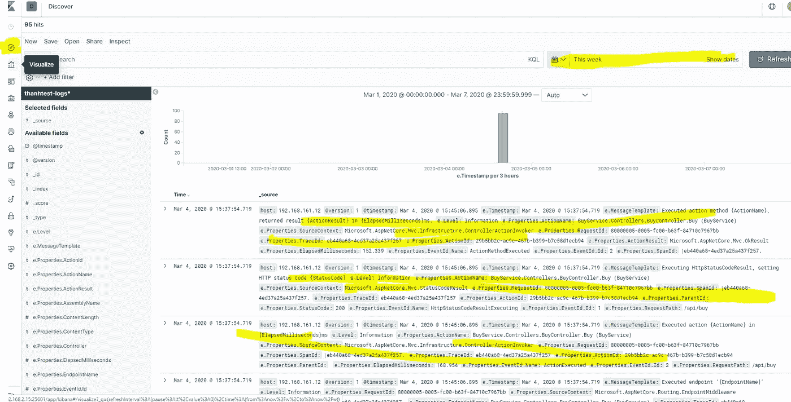

根据存储在 Elasticsearch 中的日志数据创建新的 Discover 并添加所需的列

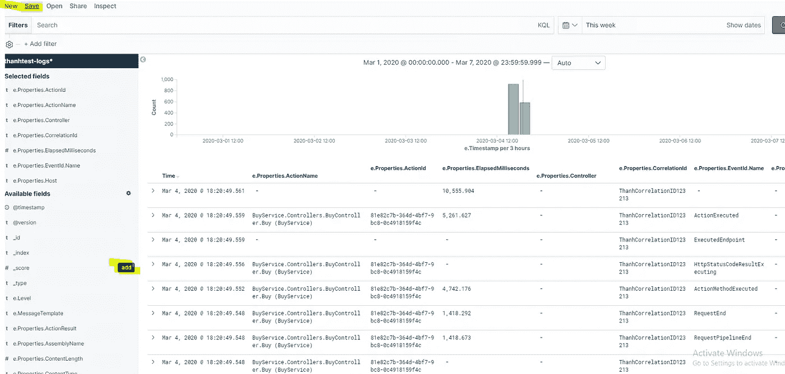

*注意:当我们为 Kibana 配置 dashboard 时，我们将使用这个发现。*

您还可以查看日志详细信息

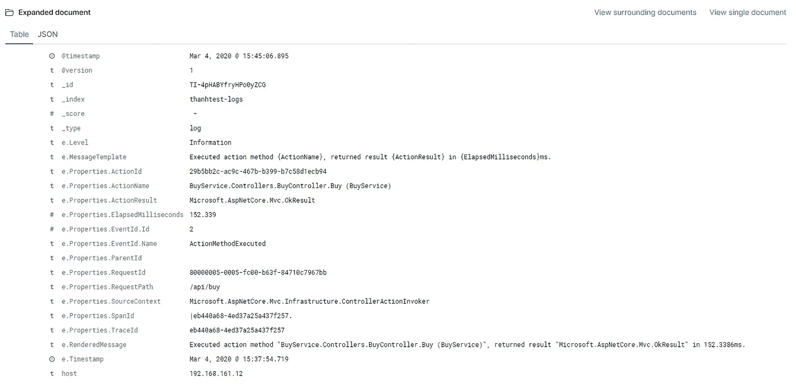

等等…日志详细信息不包括“CorrelationID”。如果您不记得什么是 CorrelationID 以及我们为什么需要它，您应该回到第 1 部分

 [## 用 ELK stack 和 Serilog 构建微服务架构下的测井系统。网络核心[第一部分]

### 日志系统不仅仅是为开发者准备的。它也被其他人使用(系统管理员、测试人员……)

medium.com](/@letienthanh0212/building-logging-system-in-microservice-architecture-with-elk-stack-and-serilog-net-core-part-1-8fe2dfcf9e6f) 

让我们为所有服务实现 CorrelationID。我们需要丰富日志数据。(您可以添加其他属性，如 ClientIP……)

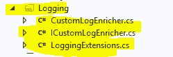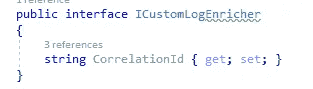

这个想法是，我们将使用 HTTP 头为每个 HTTP 请求添加 CorrelationID。

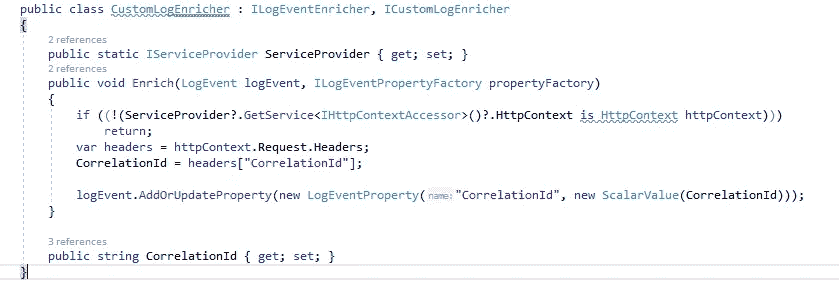

更新 Startup.cs 文件以添加新服务

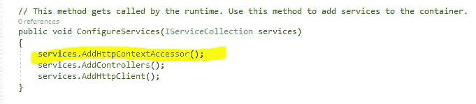

和更新配置功能

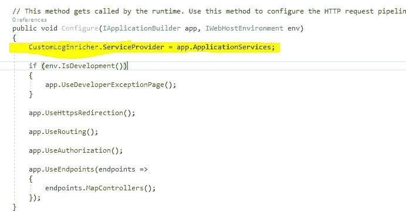

创建日志记录扩展

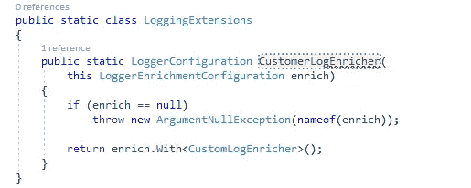

现在，更新购买服务以获得“CorrelationID”头，然后添加到发货和导出请求中

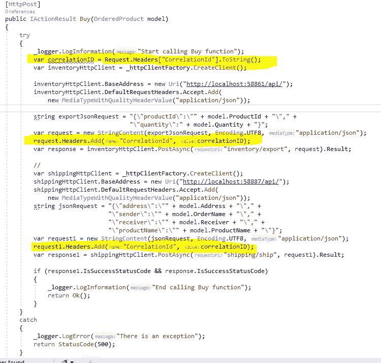

更新 Program.cs 以使用 CustomLogEnricher

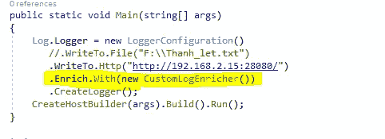

一旦更新了日志数据结构，就应该更新 Kibana 中的索引模式

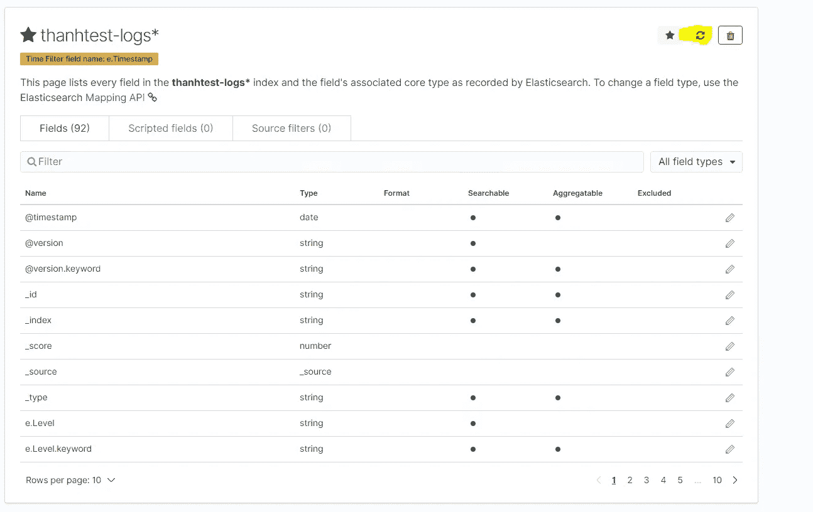

让我们再次打电话购买服务，确保在请求头中添加 CorrelationID。

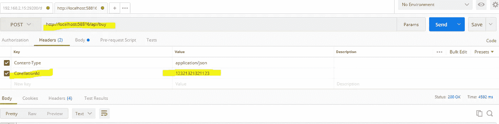

检查基巴纳的日志数据

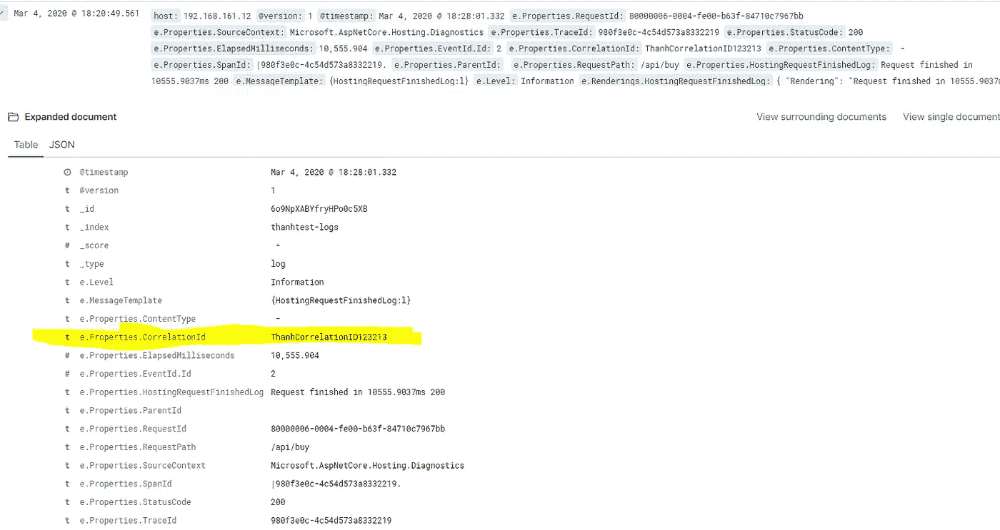

好的，目前为止一切顺利！

让我们使用之前创建的 Discover 来配置 Kibana 仪表板

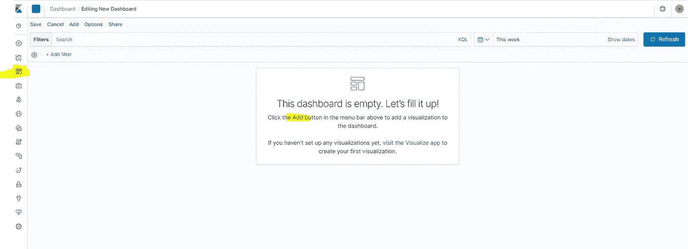

这是结果

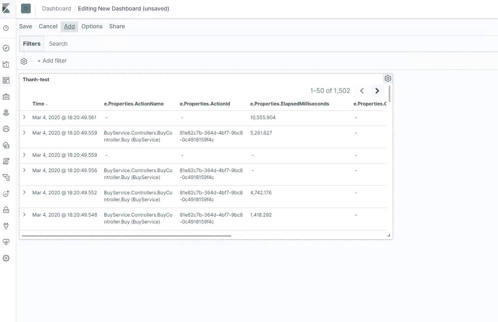

保存您的仪表板

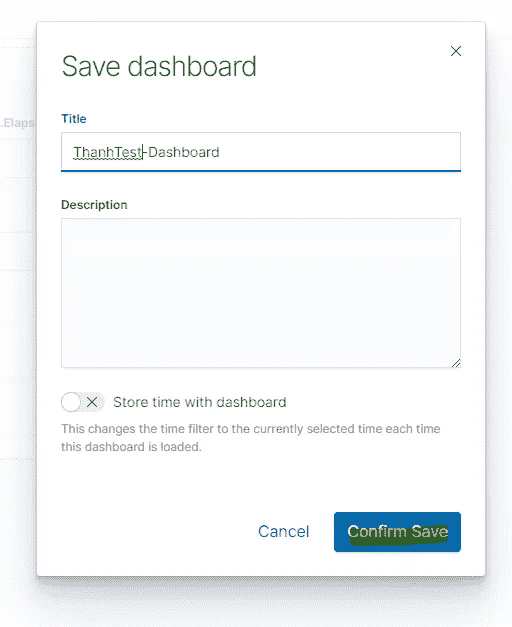

您可以尝试按照 elastic.co 的这篇文章来创建新的图表可视化

 [## 创建仪表板|基巴纳指南[7.6] |弹性

### 要创建仪表板，您必须将数据编入 Elasticsearch，这是一种检索数据的索引模式…

www.elastic.co](https://www.elastic.co/guide/en/kibana/current/dashboard-create-new-dashboard.html) 

终于，结束了！

# 结论

虽然这是一篇很长的文章，但是它是值得的，不是吗？通过这篇文章，我想给你一些想法，在微服务架构中使用 ELK stack 和 Serilog 创建一个有意义且健壮的日志记录系统。网芯。

如果您有任何反馈/问题，请随时给我留言，我会尽力回复。

感谢您的光临！

# 源代码

 [## thanh le 0212/LoggingWithELKAndSerilog

### 在 GitHub 上创建一个帐户，为 thanh le 0212/LoggingWithELKAndSerilog 开发做出贡献。

github.com](https://github.com/thanhle0212/LoggingWithELKAndSerilog)