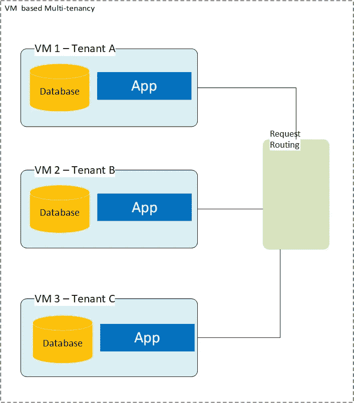
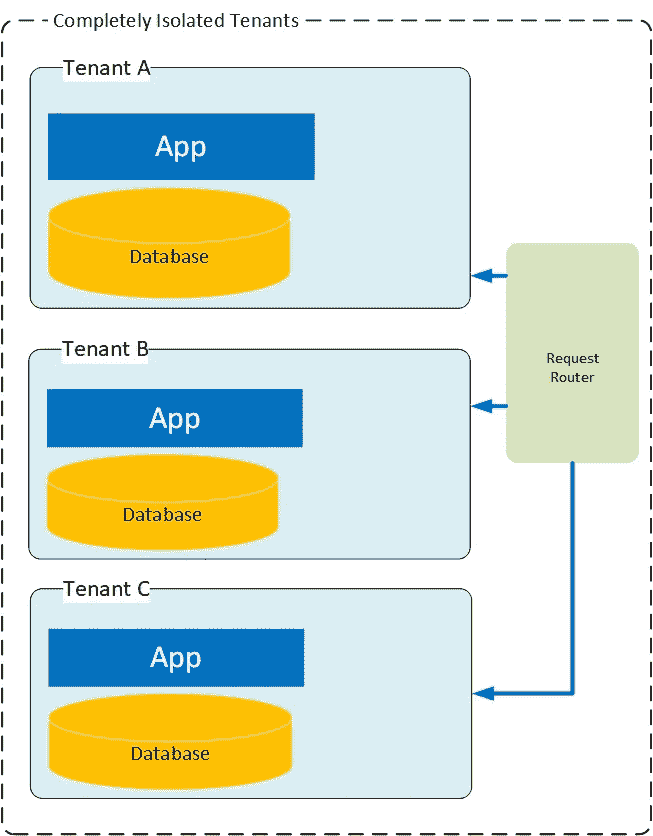
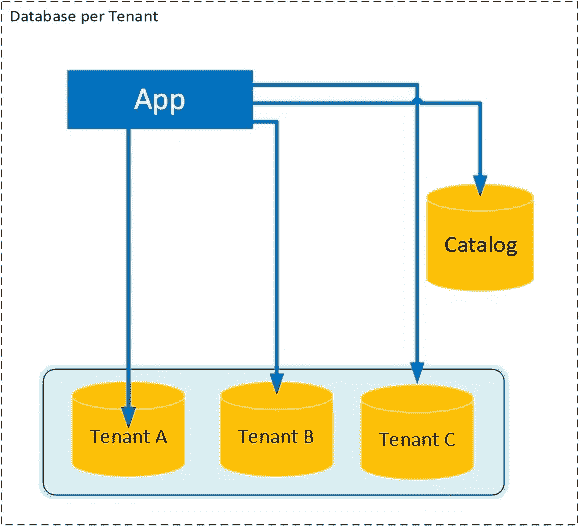
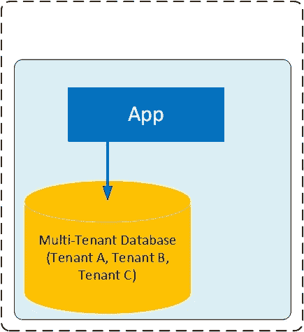

# 为未知规模构建多租户 SaaS 应用

> 原文：<https://medium.com/geekculture/building-multi-tenant-saas-app-for-an-unknown-scale-4d41e92a6633?source=collection_archive---------5----------------------->

## 选择正确的设计来处理嘈杂的邻居效应

Photo by [ThisisEngineering RAEng](https://unsplash.com/@thisisengineering?utm_source=unsplash&utm_medium=referral&utm_content=creditCopyText) on [Unsplash](https://unsplash.com/@thisisengineering?utm_source=unsplash&utm_medium=referral&utm_content=creditCopyText)

如果你正在开发一个多租户的 SaaS 应用程序，你迟早会遇到“噪音邻居效应”。

在本文中，我们将研究可用于构建多租户 SaaS 应用的各种设计策略，以及这些设计选择如何在创建或消除噪音邻居效应中发挥关键作用。

首先，让我们了解一下多租户是怎么回事。

## 1.多租户

在SaaS(软件即服务)模型中，多租户指的是单个软件系统满足多个客户或组织(由于他们使用基于订阅的许可，所以称为租户)需求的能力。

这与单租户架构相反，在单租户架构中，租户拥有一个应用程序，并使用独立的数据库、存储和 web 服务器。

## **2。吵闹的邻居效应**

在多租户应用中，租户通常共享相同的计算资源，您最终会遇到这样的情况:一个租户开始消耗更多的资源，牺牲了其他租户的性能。这种现象被称为“噪音邻居效应”

因此，如果您正在为未知的规模和不可预测的负载构建一个 SaaS 应用程序，那么您必须将可伸缩性和可靠性视为产品特性。还应该仔细评估业务需求，以确保解决方案不会过度设计。

租赁模式是为任何级别的增长做好准备的关键因素之一。

## 3.租赁模式

多租户应用程序有多种设计方式。然而，有几个因素应该首先考虑。

从基本问题开始总是一个好习惯。我们可以将它们分为以下几类:

**可扩展性:**

*   系统应该支持多少租户？
*   我应该为每个租户分配多少存储空间？
*   您能估计任何给定租户的工作负载吗？

**租户隔离:**租户应该被隔离到什么程度？有没有哪些高价值租户(高级用户)如果隔离不当可能会影响到其他人？

**开发复杂性:**如果数据库模式、查询或功能发生变化，推出更新有多容易？

**运营复杂性:**恢复租户数据(不影响他人)有多容易？

应该注意，租用主要处理数据层。应用层通常被视为一个整体实体(除非您选择微服务设计，在这种情况下，它可以进一步划分为更小的组件，在这种情况下，设计选择可能会发生变化，因为您可以将一些组件与其他组件区别对待)。

让我们来看看各种租赁模式:

1.  **使用虚拟化的多租户**

这与单租户环境非常相似，在单租户环境中，应用程序的每个实例都是独立的实例，只有一个租户和一个数据库。如果您希望使用这种模式为多个客户提供服务，那么您必须为每个租户重复这一过程—为每个租户在新的虚拟机上部署应用程序和数据库。这种模型提供了很好的隔离，但是由于维护、资源和成本的原因，在 SaaS 世界中很少使用。当客户群超过两位数时，它的扩展性很差。

**2。使用集装箱化的多租户**

容器变得越来越受欢迎。各种组织正在采用它们来实现多租户。

容器可以在来宾虚拟机中运行。因此，部署传统应用程序比部署虚拟化环境要容易得多。

使用基于容器的多租户的最大好处是自动化因素——人们可以简单地编写一个脚本来为新租户启动一个新容器，或者[使用 Kubernetes](https://www.cncf.io/wp-content/uploads/2020/08/CNCF-Webinar_-better-walls-make-better-tenants.pdf) DockerSwarm、亚马逊 EKS 等容器编排工具。

有一篇有趣的[博客文章](https://netflixtechblog.com/the-evolution-of-container-usage-at-netflix-3abfc096781b)讲述了网飞是如何使用容器并开发其多租户隔离技术的。

Image by Author

在容器化的环境中，租户数据是隔离的，应用服务器通常在租户之间保持公共。然而，也可以完全隔离租户。在这种情况下，数据库和应用服务器都将在租户的容器中运行。

Image by Author

**3。每个租户的数据库**:在这个模型中，只有应用层是共享的，可以纵向或横向扩展。但是，租户隔离发生在数据库级别，每个租户都有自己的数据库。

Image by the author.

这种模式可能对少数租户很有效，但随着租户规模的增长，它最终将成为维护的噩梦—想象一下管理 1000 个数据库(即使您的基础架构以某种方式支持它)。许多云供应商对您可以创建的数据库实例数量设置了配额限制。例如，在 Amazon RDS 中，[每个帐户最多可以有 40 个 DB 实例](https://docs.aws.amazon.com/AmazonRDS/latest/UserGuide/CHAP_Limits.html)。因此，这种模式不适合规模未知的 SaaS 应用程序。

**4。** **单个多租户数据库**

这种模式被广泛使用，因为它使用一个多租户数据库来托管所有租户的数据。随着更多租户的加入，it 可以利用更多资源进行扩展。

Image by the author.

这种模式的缺点是，您必须想出额外的策略来处理“嘈杂的邻居情况”(其中一个租户开始消耗更多的资源，这反过来会降低同一数据库中其他租户的性能体验)。

这需要额外的应用程序和数据库级监控，实现服务管理器等。

Microsoft SQL Server 和 Azure SQL 数据库支持“资源调控器”，可用于管理 SQL Server 工作负载([您可以通过传入请求](https://docs.microsoft.com/en-us/sql/relational-databases/resource-governor/resource-governor?view=sql-server-ver15)指定资源消耗限制)。

使用资源调控器可以非常方便地对抗“噪音邻居效应”您还可以开发自己的服务调控器，它监视您的整个系统或服务，以快速识别有噪声的邻居(基于各种度量)并分别处理它们的请求。

**5。分片多租户数据库**

单个虚拟机上托管的数据库会有局限性—是的，您可以通过添加更多存储空间和计算资源来垂直扩展它。然而，这也有一个限度，可能只是一个临时的解决办法。

分片模式允许将数据分成一组水平分区(称为分片)。

Image by Author

在这个模型中，多个租户可以共享同一个 shard。然而，任何特定租户的数据都不会分布在多个分片上。

如上图所示，需要一个目录来维护租户和数据库之间的映射。

可以使用各种技术来维护该目录，即使用租户 ID 作为分片键、分组顺序 ID 和哈希函数，这些技术可以用于在所有分片之间均匀地分布数据(在这种情况下，映射将不是必需的—请求路由器可以计算哈希来动态识别分片/租户映射)。然而，这确实引入了额外的开销。

在上述所有模式中，分片数据库似乎是实现高度可伸缩的多租户应用程序的强大方法。

根据您的业务需求，分片系统可以基于多种因素:

1.  **工作量**——这种方法允许你以一种优雅的方式处理“吵闹的邻居效应”。您可以简单地隔离要求很高的租户，以便提高其他租户的性能。
2.  **Region:** 你也可以根据租户的位置来分片数据。这允许您在特定地理区域的非高峰时段将该区域离线进行维护。
3.  **高价值租户:**在这个模型中，高价值租户被分配给他们各自的高性能分片。

这也是实现起来最复杂的模式，因此在数据存储需要扩展到超出单个存储节点上可用资源的情况下使用。

## 结论

在本文中，我们讨论了实现多租户的各种方法以及每种方法的优缺点。在做出正确的设计选择之前，应该考虑各种因素。