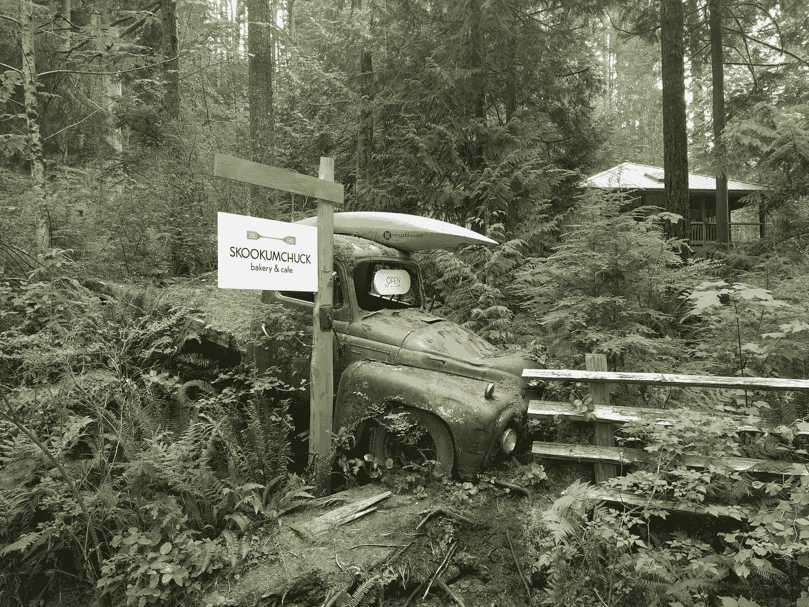

# 用 Rust 构建我的第一个命令行界面(CLI)

> 原文：<https://medium.com/geekculture/building-my-first-command-line-interface-cli-with-rust-b6beb9c284e0?source=collection_archive---------2----------------------->

Rusting rustic truck down by the Skookumchuck

**更新:我从这篇文章中学到了一些东西，并开始了一个更正式的教程，为** [**用 Rust**](https://levelup.gitconnected.com/how-to-build-a-note-taking-command-line-application-with-rust-part-1-34b9cd5be6b9) **构建 CLI notes 应用程序。**

在一遍又一遍的告诉自己今天是我开始学 rust 的日子之后。我终于成功地为 [engram](https://engramhq.xyz) 搭建了一个(非常小的) [cli](https://github.com/adamjberg/engram/tree/main/clients/cli/eg) 。