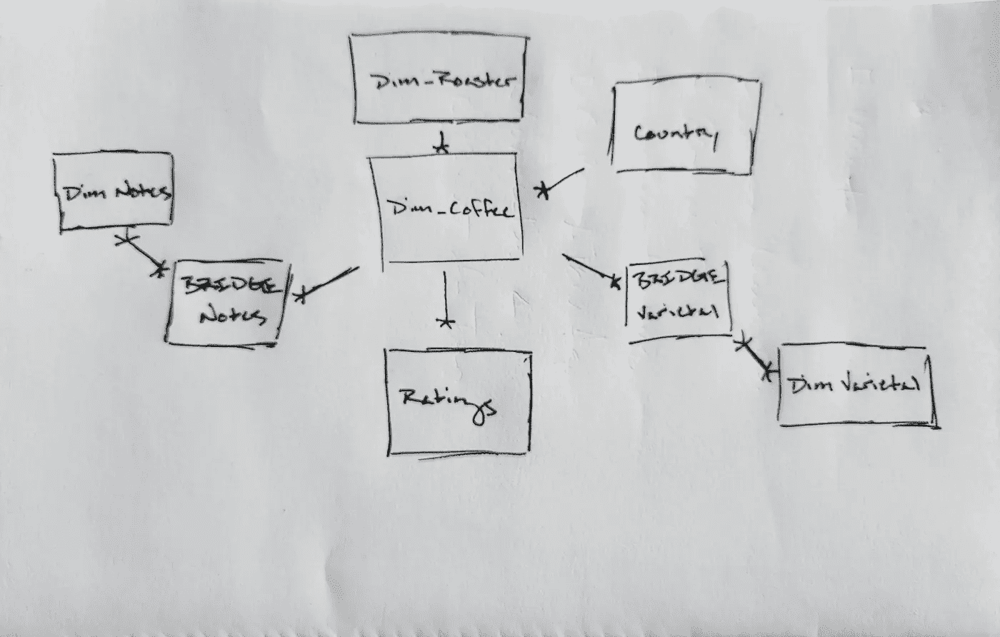

# 使用 Python、Django 和 Azure 构建我的第一个 web 应用程序:数据模型

> 原文：<https://medium.com/geekculture/building-my-first-web-application-using-python-django-and-azure-data-model-f48112830c60?source=collection_archive---------29----------------------->

100%的网站中有 98%靠数据运行(不好的“主播”参考)。因此，支持它们的数据模型非常重要。每个组件—表、关系、数据库架构和服务器—都会影响查询的性能(例如 API 调用)并最终影响用户体验。